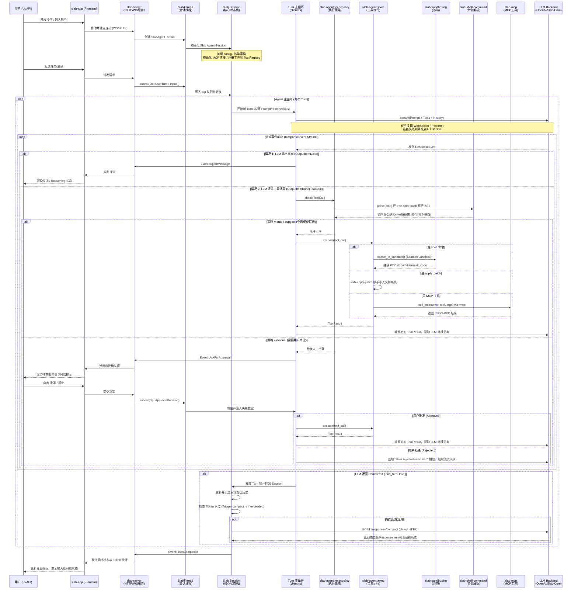

# Slab AI Agent 技术设计文档 (Technical Design Document)
完整运作流程:



## 概述与核心实体定义

在深入生命周期之前，明确以下核心实战概念及相互关系：

* **Op (Operation)**：系统的**输入驱动源**。一切外部状态变更、用户意图、或中断信号，皆以 `Op` 形式提交给调度器。
* **Turn**：一次完整的**大模型交互回合**。从用户提交 `Op` 开始，可能包含多次 `LLM <-> Tool` 的内部循环，直到满足 `end_turn` 条件结束。
* **Session (ModelClientSession)**：每 `Turn` 独立创建的**运行时上下文**。它负责持有当前 Turn 的网络连接、流式状态和 Token 计数，生命周期与 Turn 强绑定，防止上下文交叉污染。
* **Event**：系统的**输出事件流**。Server 向 App 实时推送的异步消息，驱动前端 UI 进行响应式渲染。

---

## Phase 1 — 启动与初始化 (Bootstrapping)

系统启动遵循自底向上的依赖拉起与环境隔离策略：

```
[slab-app] (Desktop GUI)
   │ spawn process
   ▼
[slab-server] (Core Daemon)
   ├── 1. Load Configuration (setting.json)
   ├── 2. Initialize Infrastructure
   │      ├── Connect MCP Servers (via rmcp)
   │      └── Register Tools to ToolRegistry
   ├── 3. Enforce Security (slab-sandboxing policies)
   └── 4. Boot Extensibility (Hooks & Agent Plugins)

```

* **配置加载**：读取 `setting.json`，确立全局路由、模型映射、默认安全策略（`approval_policy`）及沙箱边界。
* **MCP 服务连接**：初始化远程/本地 MCP 客户端，通过 `rmcp` 协议完成握手，动态获取外部扩展工具元数据。
* **工具注册表 (ToolRegistry)**：合并内部原生工具（如 `slab-shell-command`, `apply_patch`）与 MCP 动态工具，构建统一的工具检索树。
* **沙箱策略确立**：根据当前 OS（macOS/Linux/Windows）初始化 `slab-sandboxing` 底层引擎，预加载安全白名单。

---

## Phase 2 — Op 提交与 Turn 调度 (Op Submission & Scheduling)

所有的用户行为和系统扰动均被抽象为 `Op` 管道。调度器采用 FIFO（先进先出）队列管理 `Op`，并控制 `Turn` 的开启与挂起。

| Op 类型 | 枚举结构 (Conceptual) | 触发行为与调度状态机 |
| --- | --- | --- |
| **UserTurn** | `UserTurn { input: String }` | 用户发送新消息。若当前无活跃 Turn，立即触发新 Turn；否则进入等待队列。 |
| **ApprovalDecision** | `ApprovalDecision { approved: bool, tx_id: UUID }` | 用户批准或拒绝了某个工具调用。唤醒处于 `BlockedWaiting` 状态的 Turn。 |
| **Interrupt** | `Interrupt` | 强行终止当前正在流式输出或执行工具的 Turn，立即释放 `ModelClientSession`。 |
| **ConfigUpdate** | `ConfigUpdate { patch: JsonDiscrete }` | 运行时修改配置（如切换模型）。不破坏当前 Turn，但在下一个 Turn 循环中生效。 |
| **SteerInput** | `SteerInput { instruction: String }` | 在 Turn 中途（如同胞工具连续调用间隙）注入用户引导，动态修正 Agent 思考方向。 |

---

## Phase 3 — Turn 主循环 (The Turn Main Loop)

`Turn` 主循环是整个系统的核心调度中枢，负责管理单次对话生命周期的 Prompt 组装、连接复用以及流式事件分发。

```
                    ┌────────────────────────┐
                    │      1. Build Prompt   │ (System, History, Tools, Context)
                    └───────────┬────────────┘
                                │
                                ▼
                    ┌────────────────────────┐
                    │ 2. ModelClientSession  │ ───► WebSocket (Prewarm)
                    └───────────┬────────────┘ ───► HTTP SSE (Fallback)
                                │
                                ▼
                    ┌────────────────────────┐
    ┌────────────── │  3. LLM Stream Call    │ ◄──────────────┐
    │               └───────────┬────────────┘                │
    │                           │                             │
    ▼ (ResponseEvent)           ▼ (ResponseEvent)             │ (ToolResult)
[OutputItemDelta]       [OutputItemDone(ToolCall)]            │
    │                           │                             │
    ▼ (UI Stream)               ▼ (Execute Pipeline)          │
Render to User          Phase 4: Tool Execution ──────────────┘
                                │
                                ▼ (Completed { end_turn: true })
                         [Turn Completed] ───► Phase 5 (Compact)

```

### 1. 构建 Prompt (Context Assembly)

每次迭代都会动态实时聚合四个维度的上下文：

* **System Instructions**：自 `.md` 文件加载。根据当前选择的 Agent 角色/性格（Personality）及目标模型特性进行动态调整。
* **对话历史**：标准化的 `ResponseItem` 列表，严格维护时间线与角色（User/Agent/Tool）对齐。
* **可用 Tools 列表**：从 `ToolRegistry` 导出的 JSON Schema 集合（内含原生与 MCP 工具）。
* **当前环境变量快照**：包含工作区文件树快照、`git status`/`git diff` 信息，以及当前的终端 Shell 状态。

### 2. 建立 ModelClientSession (连接管理)

* **预热机制 (Prewarm)**：优先复用已建立的持久化 WebSocket 连接，以实现低延迟的增量交互。
* **弹性降级**：若 WebSocket 遭遇网络波动或握手失败，无缝降级至 HTTP 标准的 SSE（Server-Sent Events）流式管道。

### 3. 调用 LLM 流式 API

调用底层 `stream(prompt, model_info, reasoning_effort, ...)`。

* **WebSocket 优化路径**：支持 **增量 WebSocket（Incremental Delta）** 技术。在同一个 Turn 内，只向大模型发送新增的 `input delta`（如工具执行结果），而非每次重复投递完整上下文，大幅节省上下行带宽与 Token 成本。

### 4. 流式事件响应 (`ResponseEvent` 分流)

* `OutputItemDelta`：Agent 思考的文本或 Reasoning 文本碎片，立即向外派发以进行流式 UI 渲染。
* `OutputItemDone(ToolCall)`：大模型输出完整的工具调用意图，主循环暂停文本输出，进入 **Phase 4 工具执行管道**。
* `Completed { end_turn }`：收到结束信号。若 `end_turn == true`，解绑 Session 并走向 Phase 5；若为 `false`，代表需要继续携带工具结果深入下一次隐式模型迭代。

---

## Phase 4 — 工具调用执行 (Tool Execution Pipeline)

当 LLM 决策输出 `ToolCall` 时，系统进入高度安全的流水线进行解析、风控审核与隔离执行。

```
            LLM Generated: ToolCall { name, arguments }
                          │
                          ▼
             [slab-agent::execpolicy::check]
                          │
                          ▼
            [slab-shell-command::parse]
       (Using tree-sitter-bash for AST Analysis)
             ├── Inspect Command Type (Compile/Net/Test)
             └── Extract Sensitive URLs/Paths
                          │
                          ▼
             [Approval Policy Decision]
             ├── "auto"    ──► Execute Immediately
             ├── "suggest" ──► Toast UI User, Auto Run
             └── "manual"  ──► Emit AskForApproval, Wait for Op
                          │
                          ▼ (After Approved)
               [slab-agent::execute]
     ┌────────────────────┼────────────────────┐
     ▼                    ▼                    ▼
[Shell Tool]        [Apply Patch]        [MCP Tool]
Sandbox Spawn       Unified Diff         Remote Request
(Seatbelt/Landlock/  Direct VFS Write     via rmcp protocol
 WindowsSandbox)
     │                    │                    │
     └────────────────────┼────────────────────┘
                          │
                          ▼
    Format ToolResult ──► Append to History ──► Re-enter Turn Loop

```

### 1. 静态 AST 解析与意图审查

对传入的 `shell` 命令，拒绝直接投递给系统终端。底层通过 `tree-sitter-bash` 将命令解析为**抽象语法树 (AST)**：

* **类型识别**：精准识别该命令是属于编译（`cargo test`）、文件检索（`find`）还是高危的网络请求（`curl`）。
* **特征提取**：自动拦截并提取命令中包含的敏感 URL、系统绝对路径与高危参数，为风控提供结构化数据支持。

### 2. 审批策略判定 (`approval_policy`)

根据配置与静态分析结果，执行分级防御：

* `auto`：完全自动化执行（适用于只读、局域网安全工具）。
* `suggest`：向前端发送通知弹窗，但不会阻塞执行流，给予用户知情权。
* `manual`：挂起当前执行线程，向外部派发 `AskForApproval` 事件，必须等待 `ApprovalDecision` 类型的 `Op` 输入后方可继续。

### 3. 多介质隔离执行层

一旦获批，根据工具类别进入对应的安全运行时：

* **Shell 运行沙箱 (`slab-sandboxing`)**：遵循**最小权限原则**，根据宿主操作系统动态调用底层安全特性：
* *macOS*: 使用 `Seatbelt` (`sandbox-exec`) 限制进程的文件系统与网络读写。
* *Linux*: 基于 `landlock` 限制路径可见性，配合 `seccomp` 截断高危系统调用。
* *Windows*: 调度 `WindowsSandbox` 隔离区。
* *输出捕获*：所有输出通过虚拟终端（PTY）实时捕获，保留 `stdout/stderr` 的原生结构。


* **原子文件补丁 (`apply_patch`)**：通过 `slab-apply-patch` 组件直接解析标准 `unified diff`。在内存中完成冲突检验后，以原子事务形式直接写入文件系统，规避经由 Shell 带来的间接命令注入风险。
* **MCP 协议桥接**：通过 `rmcp` 协议对远程或独立进程的 MCP Server 发起标准的 JSON-RPC 调用。

### 4. 结果回填

工具产生 `ToolResult` 后，将其作为新的上下文追加至对话历史，状态机指针重新指向 **Phase 3**，驱动 LLM 进行下一步决策。

---

## Phase 5 — 上下文管理与记忆压缩 (Context & Memory Management)

在一个 `Turn` 彻底结束（`end_turn == true`）时，系统启动上下文窗口健康检查，防止因长对话导致 Token 暴涨或溢出。

```
                   Turn Ended Successfully
                              │
                              ▼
                Check Accumulated Token Count
                              │
         ┌────────────────────┴────────────────────┐
         ▼ (Within Threshold)                      ▼ (Exceeds Window)
  Keep History Intact                     Trigger compact.rs
         │                                         │
         │                                         ▼
         │                              Post to /responses/compact
         │                              (Unary HTTP Request to LLM)
         │                                         │
         │                                         ▼
         │                              LLM Summarizes Old History
         │                              into Abstracted ResponseItems
         │                                         │
         └────────────────────┬────────────────────┘
                              │
                              ▼
                     Ready for Next Turn

```

* **窗口水位检查**：Session 统计当前累积的 `ResponseItem` 列表的总 Token 消耗。若未达硬性阈值，则不作处理。
* **异步滚动压缩 (`compact.rs` / `compact_remote.rs`)**：
* 若超出安全窗口，系统会向服务端发起一个一元（Unary）HTTP 请求，调用 `/responses/compact` 端点。
* 交由专门的摘要模型（或低成本高上下文模型）将远端最早的若干轮历史记忆提炼为具有高信息密度的**摘要版 `ResponseItem` 列表**。
* 使用摘要列表就地替换（Replace）原有的长篇历史。系统在不丢失关键长线记忆的前提下，实现上下文窗口的动态瘦身。


---

## Phase 6 — 事件输出与 UI 渲染 (Event Stream & UI Rendering)

`slab-server` 处理管道产生的所有中间状态与最终结果，均被统一序列化为结构化的 **JSON Event 流**，通过 WebSocket 实时推送到客户端 `slab-app`。

前端渲染引擎根据事件类型进行**响应式、无边界的 UI 消费**：

* **`AgentMessage`**
* *UI 行为*：增量渲染文本。支持 Markdown 实时解析与代码块高亮，渲染至主消息历史流。


* **`AskForApproval`**
* *UI 行为*：阻断式交互。在屏幕中央或侧边栏弹出精美设计的审批确认框，清晰展示被拦截工具的命令（带 AST 风险高亮标记），等待用户点击“批准/拒绝”。


* **`ExecCommandOutput`**
* *UI 行为*：终端模拟器渲染。将其重定向至内嵌的 Xterm.js 或自定义终端组件，**原汁原味地保留并渲染 ANSI 颜色代码、控制符与换行**。


* **`TurnCompleted`**
* *UI 行为*：元数据看板更新。动效关闭输入框的 Loading 状态，同时在界面角落刷新本次 Turn 消耗的精准 Token 统计与响应时延。


* **`BackgroundEvent`**
* *UI 行为*：全局状态栏、面包屑更新。用于指示 MCP 服务心跳、沙箱启动状态、文件树后台扫描进度等弱交互信息。


---

## 核心设计模式总结 (Design System Commitments)

1. **事件驱动架构 (Event-Driven Architecture)**：
系统消除了任何形式的共享可变状态。整体设计完全由「输入端的 `Op` 驱动状态机转变」再由「输出端的 `Event` 驱动前端 UI 呈现」组成。
2. **每 Turn 独立 Session (Ephemeral Sessions)**：
`ModelClientSession` 具有严格的单回合生命周期。这种设计彻底斩断了多回合间可能存在的 Sticky-Routing 错误，完美杜绝了上一个 Turn 的临时状态或 Token 泄漏到下一个独立回合的隐患。
3. **高级沙箱隔离优先 (Sandbox-First Security)**：
坚守**最小权限原则**。所有的 Shell 外部指令在执行前必须经历 `tree-sitter` 的静态“语义体检”，并在 OS 级别的强隔离沙箱（Seatbelt / Landlock）中运行，实现高安全级别的 AI 自动化。
4. **增量网络优化 (Incremental Delta Streaming)**：
不进行低效的上下文全量重复投递。在单次 Turn 的工具调用往复循环中，利用扩展 WebSocket 仅同步增量的 `ToolResult` 补丁，将网络带宽与边缘开销压制到极致。