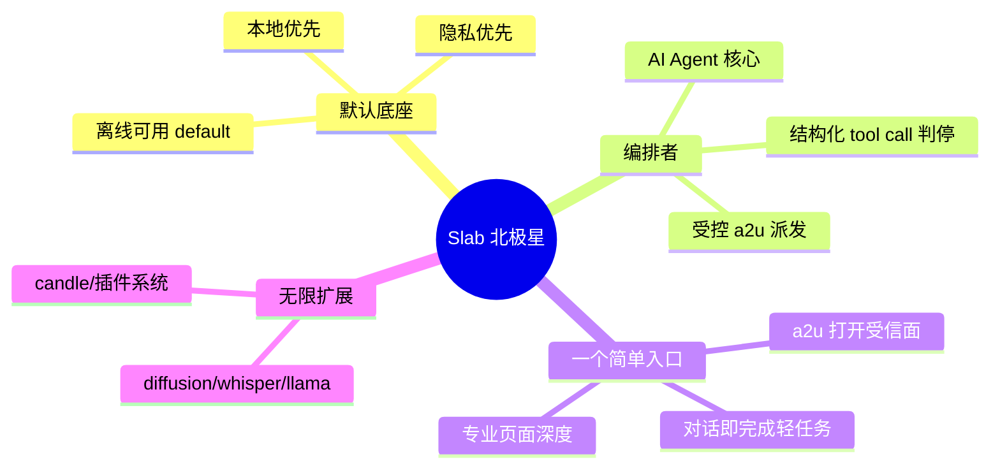
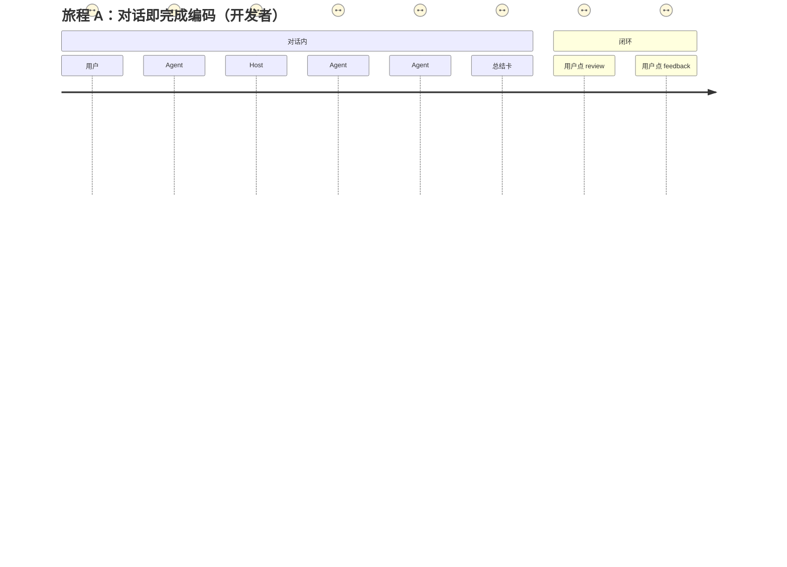
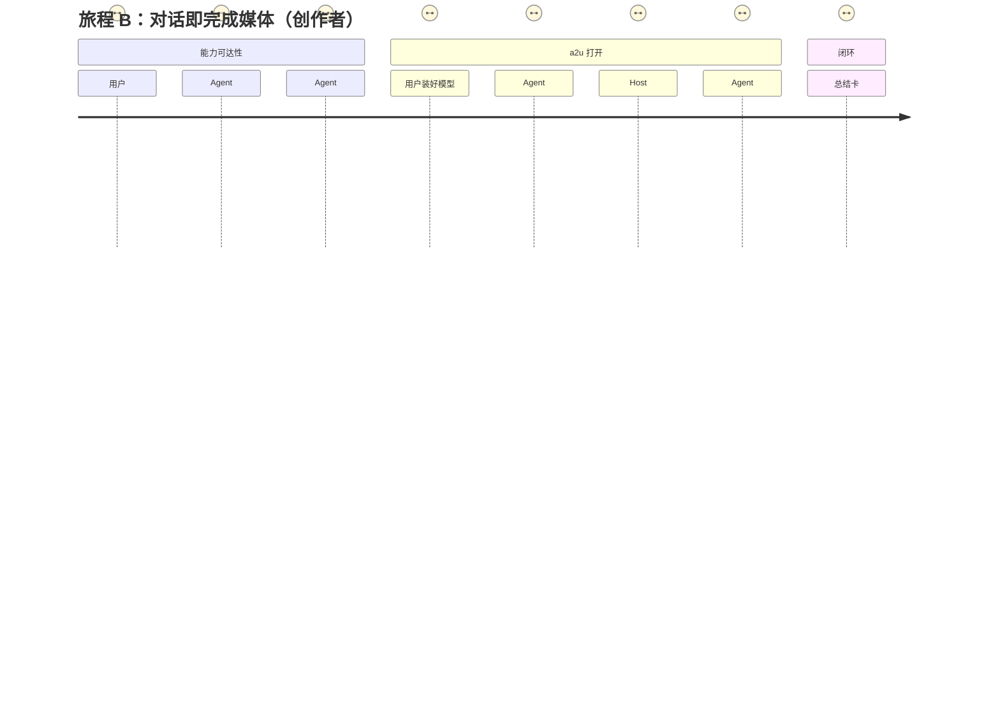
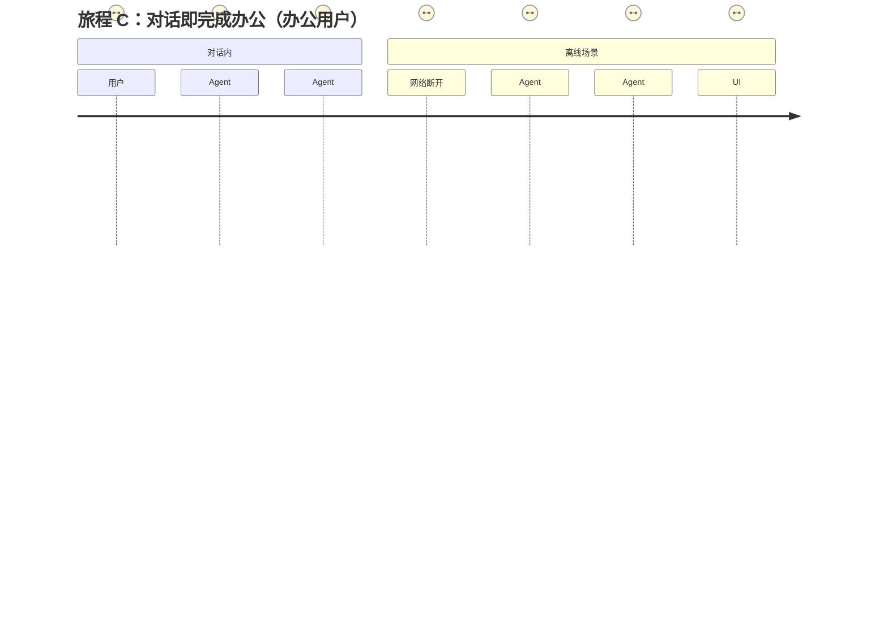
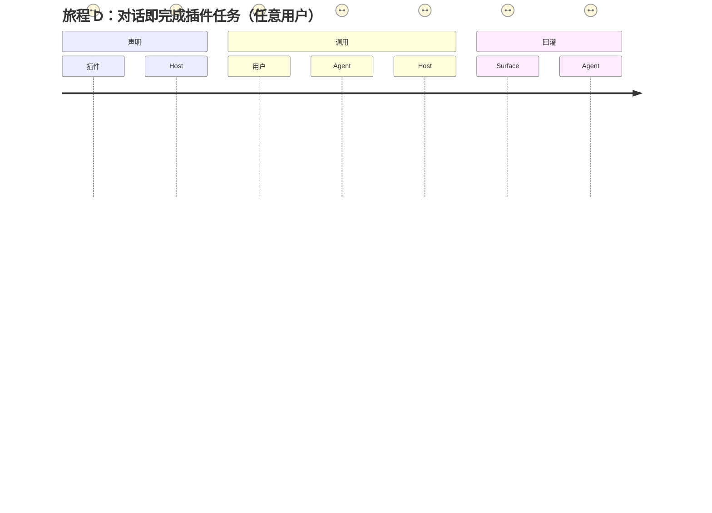
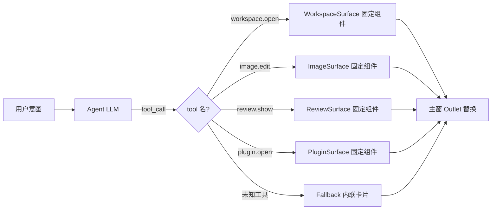
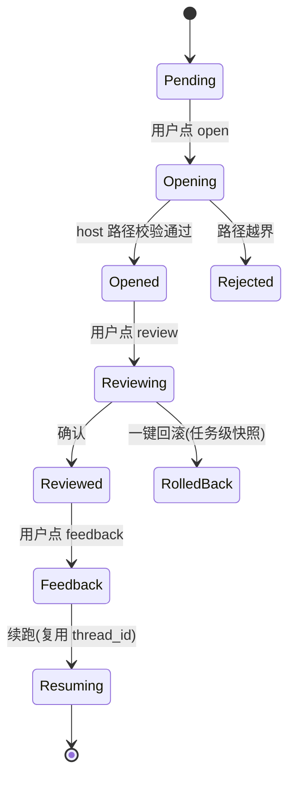
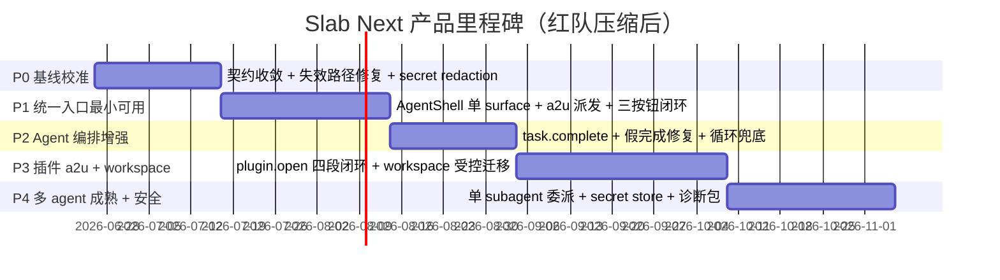

# Slab Next 产品设计文档

> 版本：v1.0 · 日期：2026-06-26
> 文档性质：Slab Next 产品设计（Product Design），由规划会议结论 (2026-06-26) 与红队修正共同驱动
> 北极星守护者：产品负责人
> 依据：以现有源码为准（关键事实已交叉验证），遵守 [AGENTS.md](AGENTS.md) 边界红线

---

## 0. 文档定位与红队修正落地声明

本文档是 Slab Next 的产品设计层定义，回答"做什么、为谁做、做到什么算成功"。技术决策细节见对应 ADR 与四份技术设计文档（见 §11 交叉链接）。

本版本已**完整吸收红队 must_add**（新增 6 条决策：离线降级、敏感路径审批黑名单、per-thread token 硬预算、artifact_refs 路径校验、host 静态推断 effects、interrupt grace period + 任务级快照回滚），并**执行红队 must_cut**（DAG/replan 降级为 result_ref 回填、AgentTimeline 降级为简单进度条、Phase 4 砍并行 subagent、P5 砍独立 capabilities.available 工具、Phase 1 只做单 surface 切换、场景化 onboarding 推迟）。**红队边界违规警告已逐条钉死 host 实现路径与端口适配器分层**（详见 §8.1）。

---

## 1. 北极星（重述与产品语义锚定）

Slab 的北极星是：**以本地优先、隐私优先、离线可用为默认底座，把"AI 全能力"收口到一个简单入口**——以 AI Agent 为核心编排者，以受控的 a2u（agent-to-UI）为辅助。

### 1.1 三句话产品契约（用户视角）

1. 用户在对话里**发起意图并被理解**——单点入口，零跳转起手。
2. **轻量任务在对话内闭环**：问答、计划审阅、结果摘要、单文件小改。
3. 当任务超出对话承载形态（生成媒体 / 长代码 / 多文件 diff / 需迭代编辑）时，由 Agent 通过**结构化 tool call 决定"打开专门面"**（Canvas 范式的确定性触发），用户可显式覆盖；超出受信面能力的深度任务（多文件重构 / 视频时间线精修 / 复杂数据建模）仍走**专业页面深度**。

"原页面退化为子窗口 / 新 tab"的真正产品语义是 **surface 化派发（派发关系）**，而非多窗口堆砌（塞入关系）。结构化终止（`task.complete` default-deny + 确定性 verify + tool_calls 兜底双轨）是闭环的纪律保障，**绝不退回文本/正则判停**。

### 1.2 用户最初担心的反模式：已代码验证不存在

> 用户在痛点 4 中明确担心"全局状态终止必须通过结构化 tool call（禁止文本匹配判停，避免误终止）"。

代码事实（已验证）：[turn.rs:198](crates/slab-agent/src/turn.rs#L198) 当 `response.tool_calls.is_empty()` 即 `TurnOutcome::Final`——已是结构化判停，**文本判停在代码里不存在**。本设计保持并强化这一纪律，绝不反向。

---

## 2. 目标用户与核心场景

| 用户画像 | 核心诉求 | 高频场景 | 对统一入口的期待 |
|---|---|---|---|
| **开发者** | 项目级编码 + 重构 + 调试 | 打开项目、解释代码、跨文件改、跑测试、提 commit | "打开 slab.rs"、"把这两个函数抽出来"、"这次改动跑了什么" |
| **创作者** | 媒体生成 + 后处理 + 迭代 | 文生图、视频生成、音频转写、照片修复、批处理 | "生成一张封面图"、"把这段录音转文字"、"再调亮一点" |
| **办公用户** | 文案 + 表格 + 文档处理 | 写邮件、整理表格、格式转换、提取要点 | "帮我把这段改正式"、"从这份 PDF 提取会议时间" |

三类用户对统一入口期待差异显著，但当前对所有人是同一个空壳（**场景差异化缺失**——见 §6 非目标 P4 推迟，但 Phase 0 起预留 onboarding 扩展点）。

### 2.1 三条端到端用户旅程（北极星验收样板）

**旅程 A 期望**：开发者说"打开 slab.rs 并解释 [turn.rs:198](crates/slab-agent/src/turn.rs#L198) 的判停逻辑" → Agent 调 `workspace.open` → workspace surface 主窗替换打开（Phase 1 只做单 surface 切换，不分屏）→ Agent 调 `read_file` 读取解释 → 调 `task.complete`（default-deny）校验通过 → 末条气泡渲染总结卡（open / review / feedback 三按钮）。

**旅程 B 期望**：创作者说"生成一张封面图" → Agent **能力可达性自检**（system prompt 注入本地已装模型/插件清单，非新增工具，红队砍 P5 后的方案）→ 若本地无 diffusion 模型，Agent 主动告知"需先装 X 模型"+ a2u 引导而非默默断在工具报错 → 装好后调 `image.edit` → image surface 打开承载渲染 → 回灌结果 + artifact_refs → 总结卡。

**旅程 C 期望**：办公用户说"把这段会议记录整理成正式邮件" → 纯文本生成在对话内闭环 → 若此时**网络断开**（provider 不可达），Agent 进入**离线降级模式**（红队 must_add ADR-015：自动收窄工具集禁 web_search / 外部 MCP / 云端模型，切本地 llama/candle 完成，UI 标注"离线模式"）→ task.complete → 总结卡（feedback 续跑微调语气）。

**旅程 D 期望**：用户说"用 OCR 插件提取这张图的文字" → 插件 manifest 已声明 `a2u_surface` + schema + effects → Agent 调 `plugin.open(plugin_id, surface, payload)`（host 层高阶工具，**不进 slab-agent-tools** 守纯编排红线）→ 审批门（effects 由 host 按 runtime 类型静态推断，红队 must_add ADR-019，插件自报只作 hint）→ plugin WebView 打开（caller id 从 label 推导，AGENTS.md:42 红线）→ surface output 经 host 转 ToolOutput 回灌 → Agent 继续对话。

---

## 3. 统一入口的产品定义：三态语义

> ADR-001 锚定。统一入口不是"把页面塞进对话"，是"派发关系"。

| 状态 | 语义 | 触发判据（确定性，非 LLM 主观） | 承载形态 | 用户可覆盖 |
|---|---|---|---|---|
| **① 对话内完成** | 轻量问答、计划审阅、单文件小改、纯文本生成 | 输出是纯文本 / 单文件小 diff | 对话气泡 | 用户可手动要求 a2u 打开 |
| **② a2u 打开新面** | 生成媒体、长代码、多文件 diff、需迭代编辑 | 输出形态 = 媒体 / 长代码(>阈值) / 多文件 diff / 需迭代编辑 | host 侧固定派发表 → 受信 React 组件 | 用户可拒绝打开 |
| **③ 专业页面深度** | 多文件重构、视频时间线精修、复杂数据建模 | 任务复杂度超受信面承载（需多步手动 / 专业控件） | 专业 surface（仍可 a2u 打开但承载深度交互） | 用户进专业页面 |

### 3.1 派发表契约（host 侧固定，模型不渲染）

关键纪律：**模型只决定调哪个工具 + 参数，渲染哪个 React 组件由 host 完全固定**（Vercel Generative UI / Claude Artifacts 范式）。这是统一入口成立的产品语义锚，也是避免演化为 Computer Use 变体的红线。

### 3.2 现状差距（As-Is，代码佐证）

| 差距 | 代码事实 | 后果 |
|---|---|---|
| 无派发表，tool_call 全折叠 | [use-assistant-agent.ts:526-540](packages/slab-desktop/src/pages/assistant/hooks/use-assistant-agent.ts#L526) `tool_call_output` / `tool_call_started` 全部折叠进 ThoughtChain 节点 | a2u 派发无承载，统一入口成立不了 |
| 路由平铺，Assistant 与各页并列 | [routes/index.tsx](packages/slab-desktop/src/routes/index.tsx) `/ = Assistant` 与 `/image` `/workspace` 等并列 | 用户仍需手动点侧边栏，统一入口缺失 |
| 失效跨页路径 | [use-workspace-page.ts:683](packages/slab-desktop/src/pages/workspace/hooks/use-workspace-page.ts#L683) `navigate("/assistant")` 但 routes 里只有 `'agent'→Navigate '/'`，无 `/assistant` 路由 | "用助手解释代码"跳转失效 |
| turn_completed 只写文本 | [use-assistant-agent.ts:540](packages/slab-desktop/src/pages/assistant/hooks/use-assistant-agent.ts#L540) | 任务总结无 open/review/feedback 动作闭环 |

---

## 4. 能力支柱（6 支柱，已吸收红队修正）

| 支柱 | 描述 | 主映射痛点 | 红队修正影响 |
|---|---|---|---|
| **P1 统一入口 AgentShell + a2u 受控派发** | Assistant 升级为 AgentShell 常驻主区；host 侧固定派发表；Phase 1 只做**单 surface 切换**（一次一个面替换 Outlet），分屏/浮窗推迟；任务总结三动作按钮闭环；artifact_refs workspace 路径前缀校验作 Phase 1 硬门 | 痛点1/2、跨页双向断点、失效路径 | must_cut：砍分屏/浮窗/内联三态叠加；must_add：artifact 路径校验 |
| **P2 插件 a2u 四段闭环 + 能力注入** | PluginCapabilityKind 增 a2u_surface；plugin.open 落 **host 层**（bin/slab-app/src-tauri）通过 port trait 注入，**不进 slab-agent-tools 也不让 app-core 直调 slab-plugin**；effects 由 host 按 runtime 类型静态推断，插件自报只作 hint；pluginMountView 扩 initialPayload（caller id 从 label 推导） | 痛点2、capability→tool 未闭合、工具爆炸 | must_add：host 静态推断 effects 堵插件自报漏洞；边界违规警告钉死 host 实现路径 |
| **P3 Agent 多轮编排（Plan Mode 轻量化 + default-deny + 循环兜底）** | task.complete default-deny + 确定性 verify；**砍 DAG/replan(plan_patch)/独立 namespace 持久化**，只做 result_ref 回填到现有 normalize_plan；循环检测（红队修正：阈值提到 3-4 + 只对全等签名 + 第一档直接回灌不 interrupt）；假完成修复（红队修正：复用现有 status+reason 字段，**零 migration 不新增 enum 变体**）；离线降级 + token 硬预算 + 任务级快照回滚 | 痛点4、假完成隐患、任务黑盒、中断续跑 | must_cut：DAG/replan 推迟；must_add：离线降级/token 预算/快照回滚；可行性修正：ThreadStatus 不动 |
| **P4 审批分级 + 本地优先信任模型** | ToolRiskAnalyzer 强化（现状仅识别 shell）为 allow/sandbox/ask 三态；**敏感路径审批黑名单**（read_file/grep/list_dir 命中 ~/.ssh/.env/*credentials*/*token*/*.pem 强制 ask）覆盖 read 类默认 allow；分级策略 app-core 静态配置，插件不可自报 | 审批一刀切、隐私心智缺失 | must_add：敏感路径黑名单守隐私红线 |
| **P5 workspace 项目化 + 能力可达性** | workspace 切换 = sidecar 优雅重启 + task 受控迁移（interrupt grace period 等确认才写快照）；**session 与 project/workspace 一对一绑定钉死**（红队边界违规修正，不放开放问题）；settings 合并语义钉死；**砍独立 capabilities.available 工具**，改 system prompt 注入能力清单 | 痛点3、能力可达性、场景差异化 | must_cut：capabilities.available 砍掉减膨胀；边界修正：session project 绑定钉死 |
| **P6 兜底与可观测（终止纪律 + 诊断包 + secret + 预算）** | 诊断包字段白名单 + log rotation + secret redaction；**统一 secret store 的实现落 bin/slab-app/src-tauri 或 bin/slab-runtime（composition root），crates/ 只放 SecretPort trait**（红队边界修正）；并发预算可配置 + FIFO 排队（Phase 4） | secret 落盘、log 无 rotation、并发裸常量 | 边界修正：keyring 实现不进 crates/ |

---

## 5. 任务总结处"打开项目 / 审阅 / feedback"交互规范

> ADR-010（已降级，砍 AgentTimeline DAG 节点图，保留三按钮 + 简单进度条）。

### 5.1 三动作按钮语义

| 按钮 | 触发 a2u tool | 行为 | 状态机 |
|---|---|---|---|
| **open（打开项目）** | `workspace.open` / `image.open` | shell.openSurface('workspace', {revealPath}) → workspace surface 主窗替换打开，定位到产物文件 | pending → opening → opened |
| **review（人工查看审阅）** | `review.show` | shell.openSurface('review', {diff}) → review surface 打开显示 diff；**支持一键回滚本次所有改动**（红队 must_add ADR-020：任务开始 git stash 快照，回滚按钮） | pending → reviewing → reviewed/rolled-back |
| **feedback（不得已时的调整）** | （无新 tool，composer 注入） | composer 注入草稿续跑，**不重启线程**，复用 thread_id 上下文 | idle → drafting → resuming(复用 thread) |

### 5.2 进度可视化（红队砍 DAG 节点图后的最小可用）

- **AgentTimeline 降级为简单进度条**：`X / N plan items`（N = normalize_plan items 数），不画 DAG 节点图、不做 subagent 子时间线、不做 checkpoint。
- 终止理由（Completed / MaxTurns / RepetitionDetected / BudgetExhausted / Interrupted / Errored / Offline）在末条气泡上方以 tag 形式展示。

### 5.3 artifact_refs 安全门（Phase 1 硬门）

红队 must_add ADR-018：`agent-action-card` 的 open/review 按钮在 host 层校验路径**必须在工作区根下**，跨目录 / 绝对路径 / `..` 越界一律拒绝。防 agent 产出指向 workspace 之外的危险引用（如 `/etc/passwd`）被直接打开。

---

## 6. 成功指标

### 6.1 北极星指标

> 单任务对话完成率（对话内闭环 / 无需手动切页 / 无需手动重试）

定量 + 定性双轨。

### 6.2 支柱指标

| 支柱 | 量化指标 | 定性信号 |
|---|---|---|
| P1 统一入口 | a2u 打开成功率、单任务手动切页次数（降）、失效跨页路径数（=0） | 用户不再问"在哪打开" |
| P2 插件 a2u | plugin.open 四段闭环成功率、插件能力被 Agent 调用次数（升） | 插件开发者愿意声明 a2u_surface |
| P3 编排 | 假完成率（MaxTurns 被标 Completed 数=0）、循环检测误报率、计划审阅通过率、确定性 verify 通过率、task.complete 校验回灌次数 | 用户长任务不失耐心（中断后续跑率） |
| P4 审批 | 审批弹窗打断次数（降，因分级）、敏感路径拦截次数（升） | 用户信任"这句话不会乱发云端" |
| P5 workspace | workspace 切换留幽灵线程数（=0）、能力不可达主动告知率（升） | 用户知道本地能做什么 |
| P6 兜底 | slab-server.log 大小（封顶 50MB×5）、诊断包泄漏 secret 数（=0）、GLM 限流 429 次数（降） | SRE 不被假完成叫醒 |

---

## 7. 非目标（本阶段不做，红队 must_cut 已吸收）

- [x] **不做完整 Computer Use**（截图-坐标路线）—— a2u 副作用域限于"打开受信 host 面 / 读写 sandbox 文件 / 调 /v1 API"。
- [x] **不照搬 Cursor YOLO mode 全自动**—— 审批可分级但不消失。
- [x] **不引入文本/正则判停**—— [turn.rs:198](crates/slab-agent/src/turn.rs#L198) 已结构化判停，保持。
- [x] **不为每个原页面暴露低阶原语工具**（open_tab / scroll / click_xy）—— ACI 高阶、命名空间化。
- [x] **不新增平行 API 树 / 第二套 LSP bridge**—— 只扩 /v1/*；诊断包 host-only；多窗口全落 host 层。
- [x] **不把 DAG/规划/校验塞进 slab-agent 编排核心**—— 确定性逻辑一律落 slab-agent-tools；循环 guard 是唯一可例外内联（需架构签字）。
- [x] **不引入 Module Federation 作为默认插件模型**—— Tauri child WebView / iframe sandbox。
- [x] **不在 P0 引入多窗口基建风险**—— 主窗内 surface 状态机优先。
- [x] **不默认就上多 agent**—— **红队 must_cut：Phase 4 砍并行 delegate_subagent(tasks: Vec) + 按复杂度缩放**（与"不默认多 agent" + GLM ~10-14 并发 429 冲突），保留单 subagent 同步委派 + 预算看板。
- [x] **SQLx migration 只追加**—— ThreadStatus **红队修正：复用现有 status + reason 字符串字段，零 migration**。
- [x] **不新增 /onboarding 平行路由**—— 场景化并入现有 setup 向导。

### 7.1 红队 must_cut 已执行项（对产品设计的影响）

| 红队砍项 | 产品影响 | 落到哪一阶段 |
|---|---|---|
| 砍 ADR-003 DAG + replan(plan_patch) + 独立 namespace 持久化 | 产品不承诺"跨小时 DAG 规划可视化"，只承诺"计划进度条 + result_ref 回填" | Phase 2 降级，时间盒 4-5 周 → 3 周 |
| 砍 ADR-010 AgentTimeline DAG 节点图 + subagent 子时间线 + checkpoint | 产品承诺"简单进度条（X/N plan items）"取代"DAG 可视化" | Phase 2 降级 |
| 砍 Phase 4 并行 delegate_subagent + 复杂度缩放 | 产品不承诺"并行多 agent 研究"，单 subagent 同步委派 | Phase 4 时间盒 5-6 周 → 4 周 |
| 砍 P5 capabilities.available 独立工具 | 产品承诺"Agent 知道本地装了什么"但通过 system prompt 注入而非新工具 | Phase 3 |
| 砍 Phase 1 分屏/浮窗/内联卡片三态叠加 | Phase 1 只承诺"单 surface 切换（一次一个面替换 Outlet）"，分屏/浮窗推迟避免 a11y 阻塞 | Phase 1 |
| 砍 Phase 4 场景化 onboarding 三类预配白名单 + 推荐模型组合 | 产品不承诺"开发者/创作者/办公差异化默认"，统一入口稳定后再做 | 推迟到统一入口稳定后 |

---

## 8. 分阶段产品里程碑（对齐主席路线，时间盒已按红队压缩）

### 8.1 Phase 0：基线校准 + 契约收敛（2-3 周）

**goal**：不动业务逻辑，先把契约与失效路径收敛、把红线纪律工程化。

**Exit Criteria（checklist）**：
- [ ] ADR-011 失效跨页路径 `navigate("/assistant")` 修复，所有跨页契约统一到 AgentSurfaceStore，消灭 location.state 散用
- [ ] ToolContext 扩容以 Option + builder 形式（ADR-007，**红队修正：不上 trait object 注入一套句柄，只加单个 Option<WorkspaceRef> 按需注入**），不破坏 tests.rs/subagent.rs 测试矩阵
- [ ] CI 门禁：gen:api / gen:schemas / gen:plugin-packs 进 CI 强制
- [ ] workspace settings 合并语义钉死成契约文档（agent.tools.allowed 是并集还是覆盖）
- [ ] 诊断包字段白名单 SRE + 安全签字冻结（即使未实现先冻结）
- [ ] slab-server.log rotation（50MB×5）+ secret redaction filter 上线
- [ ] **红队 must_add：敏感路径审批黑名单 + token 预算的字段定义先行**（schema 先冻结，实现可推迟，与诊断包白名单同级别签字）

### 8.2 Phase 1：统一入口 AgentShell + a2u 派发最小可用（3-4 周）

**goal**：Assistant 升级为 AgentShell（**主窗内单 surface 状态机**），a2u 派发表落地，任务总结三动作按钮闭环。

**Exit Criteria（checklist）**：
- [ ] ADR-002 AgentShell 常驻主区，原页面降级为 surface，**红队 must_cut：Phase 1 只做单 surface 切换（一次一个面替换 Outlet），分屏/浮窗/内联卡片推迟**，路由层零破坏，sidebar rail 52px 视觉契约不推翻
- [ ] ADR-001 + ADR-010 a2u-dispatcher.ts 派发表 + agent-action-card.tsx 三按钮（open/review/feedback），简单进度条（X/N plan items，**红队砍 DAG 节点图**），/v1/agents/responses turn_completed 扩 artifact_refs + reason（gen:api）
- [ ] **红队 must_add ADR-018：artifact_refs workspace 路径前缀校验作 Phase 1 硬门**——非 workspace 内路径拒绝 open
- [ ] 内置 a2u 工具（workspace.open / image.edit / review.show / hub.browse）作为 host/app-core 注册 ToolHandler 注入，命名空间化
- [ ] ADR-008 ToolRiskAnalyzer 强化 allow/sandbox/ask 三态，a2u 打开/渲染/只读默认 allow
- [ ] 北极星指标埋点
- [ ] **E2E 验收**：用户说"打开 slab.rs" → Agent 调 workspace.open → workspace surface 主窗替换打开，无需手动点侧边栏

### 8.3 Phase 2：Agent 编排增强（Plan Mode 轻量化 + default-deny + 循环兜底 + 假完成修复）（3 周，红队压缩）

**goal**：Agent 从纯 ReAct 升级为 plan-and-execute 轻量版 + 结构化终止纪律。

**Exit Criteria（checklist）**：
- [ ] ADR-003 降级版：plan.rs **result_ref 回填到现有 normalize_plan**，**砍 DAG/replan(plan_patch)/独立 namespace 持久化**（红队 must_cut）
- [ ] ADR-004 task.complete(default-deny) + 确定性 verify，内部校验未满足返回错误回灌
- [ ] ADR-005 假完成修复，**红队可行性修正：复用现有 ThreadStatus status + reason 字符串字段，不新增 enum 变体，零 migration**；MaxTurns 走 interrupt 语义可续跑
- [ ] ADR-006 循环检测（红队修正：阈值 3-4 + 只对全等签名去重 + 阶梯第一档直接回灌 LLM 换策略而非 interrupt，因为 interrupt 已被 break 路径绕过需先修 ADR-005），只读豁免，命中回灌→escalate 不硬杀
- [ ] 前端"从 checkpoint 续跑"入口（中断后续跑断点修复）
- [ ] **红队 must_add ADR-015：离线降级模式**——agent 启动探测 provider 可达性，离线自动收窄工具集 + UI 标注
- [ ] **红队 must_add ADR-017：per-thread token 硬预算**——超预算触发 BudgetExhausted 终止（复用 reason 字段）
- [ ] **红队 must_add ADR-020：任务级文件改动快照 + 一键回滚**——任务开始 git stash，总结 review 按钮支持回滚
- [ ] **E2E 验收**：长任务跑到 max_turns → 显示"已达轮次上限，可续跑" + 终止理由，点续跑从中断处继续不重发

### 8.4 Phase 3：插件 a2u 四段闭环 + workspace 智能化（4-5 周）

**goal**：插件以工具集注入对话（a2u 四段闭合），workspace 项目化与 Agent 打通，能力可达性（system prompt 注入而非新工具）。

**Exit Criteria（checklist）**：
- [ ] ADR-009 PluginCapabilityKind 增 a2u_surface（gen:plugin-packs + gen:schemas，向后兼容 serde default）
- [ ] **红队边界违规修正：plugin.open ToolHandler 实现钉死在 bin/slab-app/src-tauri host 层**，通过 host→app-core 的 port trait 注入，**app-core 不直接调 slab-plugin**（防插件运行时依赖反向引入 app-core 破坏 HTTP-free 分层）；pluginCall capability 注册成 agent 可见工具
- [ ] **红队 must_add ADR-019：effects 由 host 静态推断**（js→Tauri sandbox、python→PyO3 isolate、wasm→extism，按 runtime 类型决定信任等级），插件自报 effects 只作 hint
- [ ] plugin.open 四段闭环可测：声明（manifest kind=a2u_surface + schema + effects）→ 调用（host 注册高阶工具走审批门）→ 渲染（payload 从 host 注入，caller id 从 WebView label 推导）→ 回灌（surface output 经 host 转 ToolOutput）
- [ ] ADR-012 workspace 切换 = sidecar 优雅重启 + task 受控迁移，**红队 must_add ADR-016：interrupt grace period + session 快照原子性**（等 watch channel 确认 Interrupted 才写快照，超时中止切换不强 kill）
- [ ] **红队边界违规修正：session 与 project/workspace 一对一绑定钉死**（不放开放问题，防跨 workspace 状态泄漏）
- [ ] **红队 must_cut：capabilities.available 独立工具砍掉**，改 system prompt 注入 plugins/mcp.list 能力清单
- [ ] subagent 补四要素（objective/output_format/来源/边界）+ artifact 落盘 .slab/ 只回引用
- [ ] 确定性 verify 工具（verify.workspace_build / verify.lint / verify.diff）作 plan 节点 result_ref

### 8.5 Phase 4：多 agent 编排成熟 + 分发安全（4 周，红队压缩）

**goal**：单 subagent 同步委派（**砍并行 spawn**）+ 场景化推迟 + Tauri 离窗化 + 统一 secret store + 安装器健康检查。

**Exit Criteria（checklist）**：
- [ ] **红队 must_cut：保留单 subagent 同步委派 + 预算看板，砍并行 delegate_subagent(tasks: Vec) + 按复杂度缩放**
- [ ] ADR-013 并发预算可配置 + 软上限 FIFO 排队 + 内存熔断 + 冷却窗口
- [ ] ADR-014 export_diagnostics host-only 命令实现（按 Phase 0 冻结白名单）
- [ ] **红队边界违规修正：统一 secret store 实现钉死在 bin/slab-app/src-tauri 或 bin/slab-runtime（composition root），crates/ 只放 SecretPort trait**（keyring 不进 crates/ 纯库层，防被 slab-agent-tools/slab-plugin 反向引入）
- [ ] Tauri WebviewWindow 离窗化按需推进，**红队边界违规修正：每个 surface 一个独立 label，禁止通配 surface-window-***（守 AGENTS.md:42 caller-id-from-label 红线）
- [ ] **红队 must_cut：场景化 onboarding 三类预配推迟到统一入口稳定后**，本阶段不做
- [ ] 安装器首次运行健康检查
- [ ] CI 场景化集成测试门覆盖多窗口/并发/恢复

---

## 9. 任务卡（可执行分解）

> 每张卡：证据 / 方案 / 验收 / 依赖 / effort / priority。

### TC-P0-01 修复失效跨页路径 + 统一 AgentSurfaceStore

- **证据**：[use-workspace-page.ts:683](packages/slab-desktop/src/pages/workspace/hooks/use-workspace-page.ts#L683) `navigate("/assistant")` 无对应路由；[routes/index.tsx](packages/slab-desktop/src/routes/index.tsx) 只有 `'agent'→Navigate '/'`。
- **方案**：新建 `packages/slab-desktop/src/store/useAgentSurfaceStore.ts`（{draftPrompt, pendingSurface, surfacePayload}），废弃 useAssistantDraftStore 的 navigate+draft 双步；location.state 散用（:615 workspaceRevealPath）一并收敛。
- **验收**：workspace 页"用助手解释代码"跳转成功；全局搜索无失效 `navigate("/assistant")`。
- **依赖**：无。**Effort**：S。**Priority**：P0 阻塞。

### TC-P1-01 AgentShell 主窗内单 surface 状态机

- **证据**：[routes/index.tsx](packages/slab-desktop/src/routes/index.tsx) 平铺路由；[use-assistant-agent.ts:526-540](packages/slab-desktop/src/pages/assistant/hooks/use-assistant-agent.ts#L526) tool_call 折叠。
- **方案**：把 Layout `<Outlet/>` 升级为 surface 状态机（**Phase 1 只做单 surface 切换，一次一个面替换 Outlet，红队 must_cut 砍分屏/浮窗**）；a2u-dispatcher.ts host 侧固定派发表（tool 名→受信组件）。
- **验收**：E2E"打开 slab.rs" → workspace.open → workspace surface 替换 Outlet 打开；sidebar rail 52px 不变；路由层零破坏。
- **依赖**：TC-P0-01。**Effort**：M。**Priority**：P1。

### TC-P1-02 任务总结三按钮 + artifact_refs 路径校验

- **证据**：[use-assistant-agent.ts:540](packages/slab-desktop/src/pages/assistant/hooks/use-assistant-agent.ts#L540) turn_completed 只写文本。
- **方案**：turn_completed 携带 artifact_refs 时渲染 agent-action-card.tsx 三按钮（open/review/feedback）；/v1/agents/responses 扩 artifact_refs + reason（gen:api）；**红队 must_add ADR-018：host 层校验路径必须在工作区根下，越界拒绝**。
- **验收**：三按钮可点；open 跳 workspace 并定位产物；feedback 续跑不重启线程；artifact 指向 /etc/passwd 被拒。
- **依赖**：TC-P1-01。**Effort**：M。**Priority**：P1。

### TC-P2-01 task.complete default-deny + 确定性 verify

- **证据**：[turn.rs:199](crates/slab-agent/src/turn.rs#L199) reject_missing_required_tool_call 仅 tool_choice required 时生效；[plan.rs:91-106](crates/slab-agent-tools/src/plan.rs#L91) 只回显。
- **方案**：新增 `crates/slab-agent-tools/src/task_complete.rs` 确定性工具，完成判定 = (task.complete) AND (plan 全节点 completed) AND (确定性 verify 通过)；未满足返回错误回灌；与 [turn.rs:198](crates/slab-agent/src/turn.rs#L198) tool_calls.is_empty() 兜底双轨；由 app-core/runtime.rs 注册。
- **验收**：模型过早调用 task.complete 被校验回灌；plan 全节点 completed + verify 通过才 Final。
- **依赖**：TC-P2-02。**Effort**：M。**Priority**：P2。

### TC-P2-02 假完成修复（零 migration 复用 status+reason）

- **证据**：[thread.rs:424-451](crates/slab-agent/src/thread.rs#L424) 'turns 循环正常退出落到 ResponseCompleted + Completed；[thread.rs:248](crates/slab-agent/src/thread.rs#L248) for 循环。
- **方案**：**红队可行性修正：不新增 ThreadStatus enum 变体**（避免所有 match 分支补漏 panic），复用现有 `update_thread_status(thread_id, status, Option<&str> reason)`，turn 耗尽时 status=Stopped/Interrupted + reason="max_turns_reached"，**零 SQLx migration**；MaxTurns 走 [control.rs:381](crates/slab-agent/src/control.rs#L381) interrupt 语义保留线程可续跑。
- **验收**：长任务跑到 max_turns 不被标 Completed，显示"已达轮次上限，可续跑" + 终止理由；点续跑从中断处继续。
- **依赖**：无。**Effort**：M。**Priority**：P2。

### TC-P2-03 循环检测（阈值 3-4 + 全等签名 + 回灌优先）

- **证据**：[thread.rs:248](crates/slab-agent/src/thread.rs#L248) 无重复检测；[control.rs:381](crates/slab-agent/src/control.rs#L381) interrupt 已解耦。
- **方案**：近 N=4 轮 (tool_name, 全等 args) 去重，阈值命中阶梯：**第一档直接回灌 LLM 换策略**（红队修正：不先 interrupt，因 interrupt 已被 break 绕过需先修 TC-P2-02）→ 第二档 escalate 到人；只读工具豁免。建议内联 thread.rs（需架构签字）。
- **验收**：连续 4 轮同签名判 stuck；合法渐进探索（read 不同文件）不误报；命中先回灌不硬杀。
- **依赖**：TC-P2-02。**Effort**：M。**Priority**：P2。

### TC-P3-01 plugin.open 四段闭环（host 层实现）

- **证据**：[plugin.rs:392-395](crates/slab-types/src/plugin.rs#L392) PluginCapabilityKind 仅 Tool/Workflow；[plugin.rs:407-409](crates/slab-types/src/plugin.rs#L407) transport 仅 PluginCall；registry.rs 校验权限但 pluginCall capability 未注册成 agent 可见工具。
- **方案**：PluginCapabilityKind 增 a2u_surface（gen:plugin-packs + gen:schemas）；**plugin.open ToolHandler 实现钉死 bin/slab-app/src-tauri host 层**，通过 port trait 注入 app-core，**app-core 不直接调 slab-plugin**（红队边界修正）；effects 由 host 按 runtime 类型静态推断（ADR-019），插件自报只作 hint。
- **验收**：plugin.open 四段闭环（声明→调用→渲染→回灌）可测；caller id 从 WebView label 推导；app-core 无 slab-plugin 直接依赖。
- **依赖**：TC-P1-01。**Effort**：L。**Priority**：P3。

### TC-P4-01 统一 secret store（SecretPort + composition root 实现）

- **证据**：[app_config.rs:81](crates/slab-config/src/app_config.rs#L81) admin_api_token 明文落盘。
- **方案**：**红队边界修正：crates/ 只放 SecretPort trait（纯 port），实现（keyring）钉死 bin/slab-app/src-tauri 或 bin/slab-runtime（composition root）**；pmid_service.rs:105 secret() 占位符是接入点，配置文件只存 keychain 引用句柄；**不新建 crates/slab-secrets**。
- **验收**：admin token / provider key 不再明文落盘；任意 crate 无法直接依赖 keyring；.slab/settings.json 作 overlay 不带走 secret。
- **依赖**：无。**Effort**：M。**Priority**：P4。

---

## 10. 红队边界违规警告的钉死实现路径（汇总）

| 红队警告 | 钉死方案 | 落地位置 |
|---|---|---|
| ADR-009 plugin.open 滑向 slab-agent-tools | plugin.open ToolHandler 实现在 **bin/slab-app/src-tauri host 层**，通过 host→app-core port trait 注入，app-core 不直接调 slab-plugin | TC-P3-01 |
| ADR-014 secret store 归属 | crates/ 只放 SecretPort trait，keyring 实现在 **bin/slab-app/src-tauri 或 bin/slab-runtime（composition root）**，不新建 crates/slab-secrets | TC-P4-01 |
| ADR-012 session 跨 workspace 恢复 | session 与 project/workspace **一对一绑定钉死**（Phase 3 exit criteria，不放开放问题） | TC-P3-02 |
| capability surface-window-* 通配 label | 每个独立 label，**禁止通配前缀**，守 AGENTS.md:42 caller-id-from-label | Phase 4 离窗化 |

---

## 11. 与本计划相关的其它文档（交叉链接）

- [00-meeting-conclusions.md](./00-meeting-conclusions.md) —— 规划会议结论（本设计文档的上游输入，含 14 条 ADR + 红队修正全文）
- [02-frontend-td.md](./02-frontend-td.md) —— 桌面前端 TD（AgentShell surface 状态机 / a2u-dispatcher / agent-action-card 实现细节）
- [03-agent-td.md](./03-agent-td.md) —— Agent 系统 TD（task.complete / 循环检测 / 假完成修复 / ToolContext 扩容细节，对齐既有 [slab-agent-td-2026-05-26.md](../slab-agent-td-2026-05-26.md)）
- [04-plugin-td.md](./04-plugin-td.md) —— 插件系统 TD（a2u_surface 四段闭环 / plugin.open host 实现 / effects 静态推断，对齐既有 09_plugin_system.md）
- [05-sre-td.md](./05-sre-td.md) —— SRE TD（诊断包白名单 / secret store / 并发预算 / sidecar 受控迁移，对齐既有 [slab-runtime-reliability-2026-06-17.md](../slab-runtime-reliability-2026-06-17.md)）
- 外部参考：[slab-goal-plain-2026-06-12.md](../slab-goal-plain-2026-06-12.md)（12 能力域 + 阶段 0-6）、[slab-source-of-truth-2026-06-13.md](../slab-source-of-truth-2026-06-13.md)、[workspace-mode-design.md](../../workspace-mode-design.md)

---

> **签署声明**：本设计文档以现有源码为准（关键事实已交叉验证），遵守 AGENTS.md 边界红线，不臆造 API/文件。所有 To-Be 新增文件已显式标注边界归属与论证。红队 must_add 已全部吸收（ADR-015 离线降级 / ADR-016 interrupt grace period / ADR-017 token 预算 / ADR-018 artifact 路径校验 / ADR-019 host 推断 effects / ADR-020 任务级快照回滚 / Phase 0 敏感路径+预算字段先行），must_cut 已全部执行（DAG/replan 降级、AgentTimeline 降级、并行 subagent 砍、capabilities.available 砍、Phase 1 单 surface、场景化 onboarding 推迟）。
