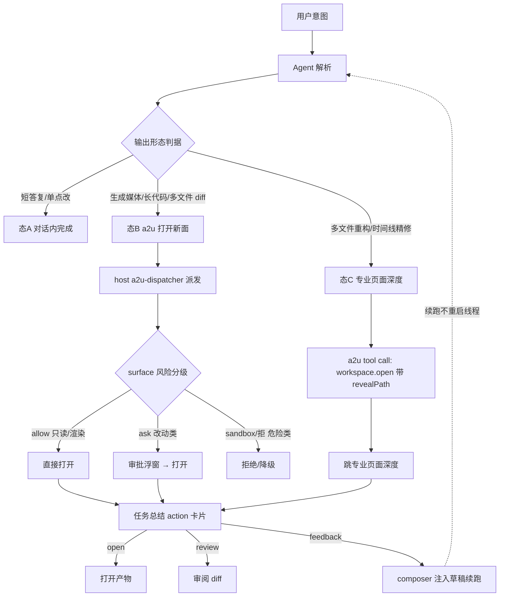
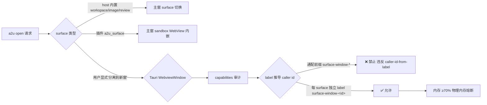
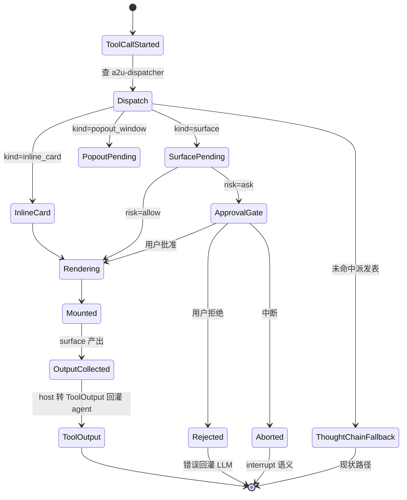
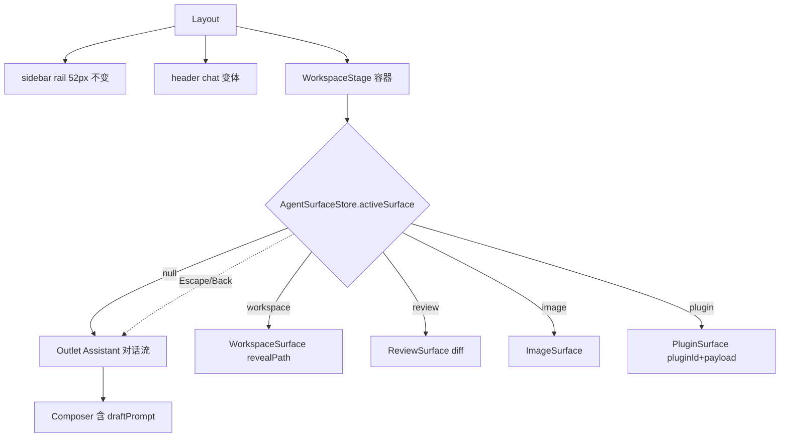
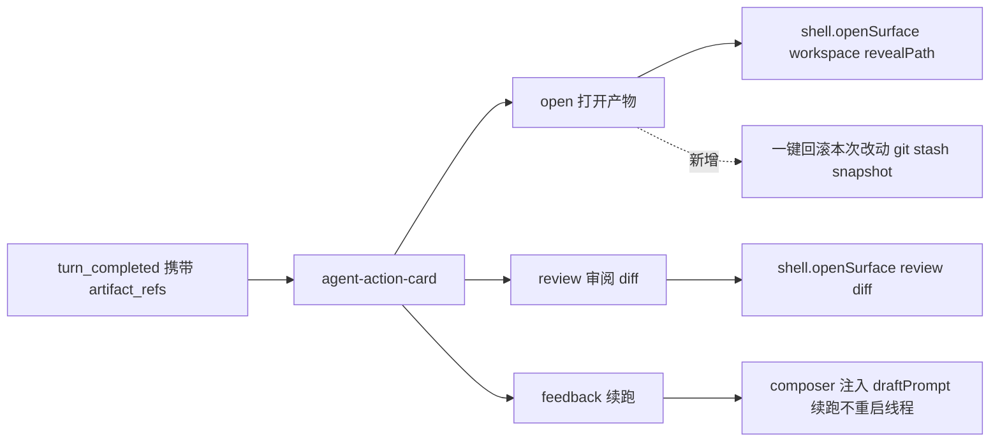
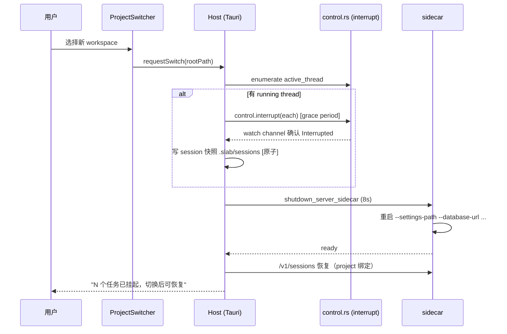
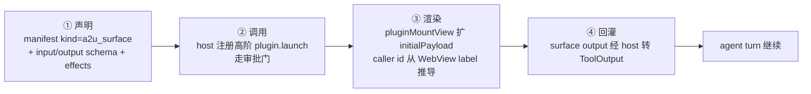
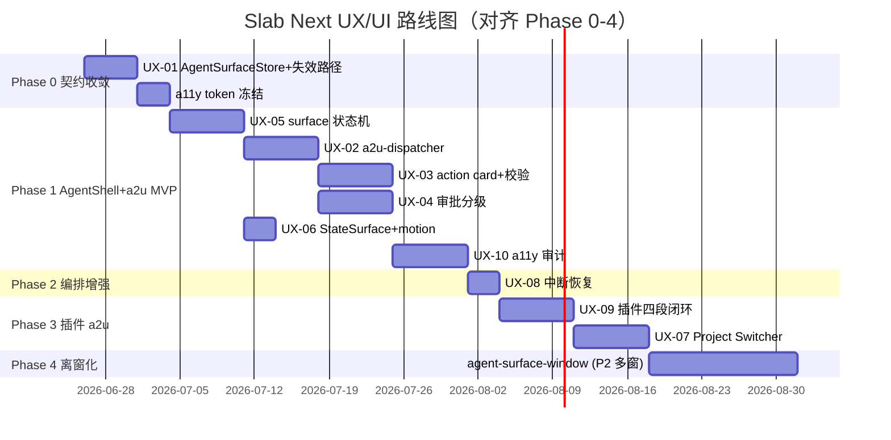

# Slab Next 前端 UX/UI 建议文档（AgentShell + a2u 受控派发）

> 日期：2026-06-26
> 文档性质：Slab Next 规划 · 前端 UX/UI 技术设计（TD），由 00-meeting-conclusions 推导
> 作者：前端/UX 架构师（主席：产品负责人）
> 北极星：以本地优先、隐私优先、离线可用为默认底座，把"AI 全能力"收口到一个简单入口——以 AI Agent 为核心编排者，以受控的 a2u（agent-to-UI）为辅助。
> 依据：以现有源码为准（关键事实已交叉验证），遵守 AGENTS.md 边界红线，吸收红队 must_add / 移除 must_cut。
> 关联 ADR：ADR-001（三态语义+派发表）、ADR-002（主窗内 surface 状态机）、ADR-009（插件 a2u 四段闭环）、ADR-010（任务总结三动作）、ADR-011（AgentSurfaceStore）、ADR-012（workspace 受控切换）

---

## 0. 文档地图与读者指南

| 读者 | 先读章节 |
|---|---|
| 产品负责人 / 设计 | §1 北极星映射、§2 信息架构、§3 多窗口策略、§7 任务总结、§12 设计系统 |
| 前端工程 | §4 a2u 渲染管线、§5 状态机、§6 任务总结卡片、§8 切换器、§9 时间线/审批、§10 插件面、§13 任务卡 |
| 后端工程 / SRE | §4.2 派发表与 ToolHandler 边界、§6.3 artifact_refs 校验、§9.4 续跑契约、§11 多窗口契约 |
| 插件生态 | §10 a2u 四段闭环、§10.4 调试反馈 |
| a11y / 质量保障 | §12.4 reduced-motion、§14 checklist |

**核心一句话**：把 Assistant 升级为 AgentShell——主对话流常驻主区，原页面降级为"可被 a2u tool call 派发打开"的受信 surface。模型只决定调哪个工具+参数，渲染哪个 React 组件由 host 完全固定（Vercel Generative UI / Claude Artifacts 范式）。**绝不做完整 Computer Use（截图-坐标），不做文本判停**。

---

## 1. 北极星在 UX 层的落地（三态语义）

### 1.1 三态产品契约（ADR-001）

> 北极星要求用户在对话里即可完成"几乎所有任务"。但"统一入口"不是把页面塞进对话，而是把派发关系显式化。三态各有**确定性触发判据**（基于输出形态，非 LLM 主观），用户可显式覆盖（Canvas 范式）。

| 状态 | 触发判据（确定性，基于输出形态） | UX 形态 | 示例 |
|---|---|---|---|
| **态 A：对话内完成** | 短文本答复 / 单文件单点改 / 一次轻量问答 | 仅在对话气泡内渲染（markdown / code block） | "解释这段代码"、"读 slab.rs 前 50 行" |
| **态 B：a2u 打开新面** | 生成媒体 / 长代码（>200 行）/ 多文件 diff / 需迭代编辑 / 插件能力 | 主窗内 surface 切换或分屏打开 | "打开 slab.rs"、"生成一张猫的图"、"打开图片编辑器修这张照片" |
| **态 C：专业页面深度** | 多文件重构 / 视频时间线精修 / 复杂数据建模 | 跳转/常驻专业页面，Agent 通过 a2u 派发"打开到专业面" | "重构整个 auth 模块"、"精修这段视频的时间线" |

**与"塞入关系"的关键区别**：派发是 tool call → host 固定渲染器，不是把任意页面 iframe 进气泡。三态边界由**输出形态判据**锚定，避免 LLM 主观反复开关面。

### 1.2 受控 a2u 的副作用域（红线）

a2u 工具副作用域严格限于以下三类，**绝不操控任意像素**：

```
副作用域 = {
  打开受信 host UI 面（surface）,
  读写本地 sandbox 文件（workspace 根内）,
  调 /v1 API
}
```

- 仅当面对无 API 的外部 GUI 才考虑受限 browser tool，且 **默认 ask**。
- 不暴露低阶原语 `open_tab / select_panel / scroll / click_xy`（ACI 工具应高阶、命名空间化、合并链式多步）。

### 1.3 北极星指标（埋点要求，ADR-010）

| 指标 | 定义 | 目标 |
|---|---|---|
| 单任务对话完成率 | 对话内闭环 / 无需手动切页 / 无需手动重试 | ↑ |
| 计划审阅通过率 | plan review 一次通过比例 | ↑ |
| a2u 打开成功率 | tool call → surface 成功打开比例 | ≥ 99% |
| 平均轮次 / 中断率 | max_turns 内完成 / 被中断比例 | ↓ |
| 任务总结 action 点击率 | open/review/feedback 三按钮点击分布 | 观测 |
| 续跑成功率 | 从 checkpoint 续跑且最终完成比例 | ↑ |

---

## 2. 统一入口 Shell：信息架构与导航模型

### 2.1 As-Is（现状，已代码验证）

- **路由表平铺**：[routes/index.tsx#L49-L100](packages/slab-desktop/src/routes/index.tsx#L49) — `/ = Assistant`（已是首页），另有 `/image /audio /video /hub /workspace /plugins /task /settings /about` + 动态插件路由 → [PluginWebviewPage](packages/slab-desktop/src/pages/plugins/components/plugin-webview-page.tsx)。
- **布局二态散落**：[layouts/index.tsx#L14](packages/slab-desktop/src/layouts/index.tsx#L14) `isChatShell = pathname === "/"`，靠 `isChatShell ? 'chat' : 'default'` 三处散落（[sidebar variant](packages/slab-desktop/src/layouts/index.tsx#L20)、[header variant](packages/slab-desktop/src/layouts/index.tsx#L22)、[main padding](packages/slab-desktop/src/layouts/index.tsx#L29-L32)）。
- **sidebar rail 52px 视觉契约**：[sidebar.tsx#L116](packages/slab-desktop/src/layouts/sidebar.tsx#L116) `w-[var(--shell-rail-width)]`，激活态 `size-[52px]`（[L96](packages/slab-desktop/src/layouts/sidebar.tsx#L96)）。
- **无多窗口基建**：全仓只有 [window-controls.tsx](packages/slab-desktop/src/layouts/window-controls.tsx) 的 `getCurrentWindow()` minimize/maximize/close，无 `WebviewWindow / createWindow`。
- **插件 WebView 是内嵌占满 Outlet**：[plugin-webview-page.tsx#L113](packages/slab-desktop/src/pages/plugins/components/plugin-webview-page.tsx#L113) `sandbox="allow-scripts allow-forms"` 静态路由，无法被 agent 带参动态打开。
- **tool_call 全折叠进 ThoughtChain**：[use-assistant-agent.ts#L529-L538](packages/slab-desktop/src/pages/assistant/hooks/use-assistant-agent.ts#L529) `tool_call_started` 只 `replaceThought` 一条扁平节点，**无派发表**。
- **失效跨页路径**：[use-workspace-page.ts#L683](packages/slab-desktop/src/pages/workspace/hooks/use-workspace-page.ts#L683) `navigate("/assistant")` —— 但路由表是 `'agent' → Navigate '/'`（[routes/index.tsx#L73](packages/slab-desktop/src/routes/index.tsx#L73)），`/assistant` 非注册路由，已验证失效。
- **散用 location.state**：[use-workspace-page.ts#L615](packages/slab-desktop/src/pages/workspace/hooks/use-workspace-page.ts#L615) `location.state.workspaceRevealPath` 散契约。
- **AssistantDraftStore 双步跳转**：[useAssistantDraftStore.ts](packages/slab-desktop/src/store/useAssistantDraftStore.ts) setDraft + navigate 两步模式。

### 2.2 To-Be：AgentShell 信息架构

```
┌────────────────────────────────────────────────────────────────────┐
│ WindowControls      [Project Switcher]      [Status/online|offline] │ ← header（chat 变体）
├────┬───────────────────────────────────────────────────────────────┤
│ 52 │  AgentShell 主区（常驻对话流）                                    │
│ px │  ┌──────────────────────────────────────────────────────────┐  │
│rail│  │  [消息流] ... [tool_call 卡片] [turn_completed + action]   │  │
│    │  └──────────────────────────────────────────────────────────┘  │
│    │  ┌──────────────────────────────────────────────────────────┐  │
│    │  │  Composer（草稿区，支持 pendingSurface 续跑）              │  │
│    │  └──────────────────────────────────────────────────────────┘  │
│    │                                                                  │
│    │  ┌──── a2u Surface 区（P1：单 surface 切换）─────────────────┐  │
│    │  │  workspace / image / video / audio / review / plugin       │  │
│    │  │  （一次只开一个，替换主区内容；P2：分屏/浮窗）             │  │
│    │  └───────────────────────────────────────────────────────────┘  │
├────┴───────────────────────────────────────────────────────────────┤
│ FooterStatusBar（chat 变体）                                          │
└────────────────────────────────────────────────────────────────────┘
```

**信息架构原则**：
1. **AgentShell 常驻主区**，对话流不消失——surface 是叠加/替换，不是离开。
2. **sidebar rail 不变**：保留 [sidebar.tsx#L116](packages/slab-desktop/src/layouts/sidebar.tsx#L116) 52px 契约与 [primaryItems](packages/slab-desktop/src/layouts/sidebar.tsx#L29) 八项，**不推翻视觉契约**。
3. **project context 上提 header**：workspace 根路径、provider/online 状态、并发预算作 header 一等状态（见 §8）。
4. **路由层零破坏**：现有 `/image /audio /video /hub /workspace /plugins /task` 路由全部保留，surface 状态机在 `/` 内叠加，专业页面深度操作仍可手动从 sidebar 进入。

### 2.3 导航模型（决策树）



---

## 3. 多窗口 / 分屏 / tab 策略决策

### 3.1 决策矩阵（推荐 + 取舍 + 何时用哪个）

| 策略 | 描述 | 优势 | 代价 / 红线 | 何时用 | Phase |
|---|---|---|---|---|---|
| **① 主窗内 surface 状态机（单 surface 切换）** ★P0 推荐 | Layout `<Outlet/>` 升级为 surface 状态机，一次只开一个面（替换内容，不并存） | 复用 [WorkspaceStage](packages/slab-desktop/src/layouts/index.tsx#L23) 容器；不破 sidebar 52px；React Router 单挂载模型原生支持；a11y 焦点简单 | 一次只能看一个面，不能对照 | 90% 的 a2u 打开场景（workspace.open / review.show / image.edit） | P0/P1 |
| ② 主窗内分屏（左对话右 surface） | 对话常驻左、surface 叠加右 | 闭环感强，能边对话边看产物 | React Router `<Outlet/>` 单挂载不支持原生分屏，要改 portal + 自管理 focus trap，**a11y 雷区** | 长任务观察、边改边问 | **P2 推迟**（红队 must_cut：Phase 1 不做分屏/浮窗三态叠加，避免 a11y 阻塞） |
| ③ 主窗内浮窗（modal/popover） | surface 以浮层叠在对话上 | 快速预览、临时操作 | 多浮窗并存焦点/aria 复杂度爆炸 | preview 类轻操作 | P2 |
| ④ Tauri WebviewWindow 离窗化 | `mountMode: 'popout'` 开独立窗口 | 真正多窗口、可拖到第二屏 | 每窗独立 WebView ~150-300MB、CSP/capabilities 红线、状态共享断裂（Zustand/TanStack Query）、低配机 OOM（16GB 超 12 个必 OOM）；触碰 [caller-id-from-label](AGENTS.md) 红线 | 用户主动"分离到新窗"（默认不在 P0 承担） | P2 按需 |

### 3.2 推荐：P0 主窗内单 surface 切换

**理由（吸收红队可行性风险）**：
- 多 surface 并存（分屏+浮窗+卡片）的焦点/键盘/aria 管理复杂度，会议结论自己承认"需焦点陷阱+Escape 收敛否则 a11y 退化"。
- React Router `<Outlet/>` 是单挂载模型，[layouts/index.tsx#L35](packages/slab-desktop/src/layouts/index.tsx#L35) 一个挂载点，改 portal 是重构。
- 红队 must_cut 明确：**Phase 1 只做单 surface 切换（一次一个面，替换 Outlet 内容），分屏/浮窗推迟**。

**单 surface 切换的状态机**（不并存 → focus 管理简单）：
- 一次只有一个 active surface。
- 打开新 surface → 旧 surface 卸载（保留路由 history）。
- Escape / Back → 收敛回对话主区。
- 焦点：进入 surface 时 focus 第一个可聚焦元素，Escape 回到触发按钮。

### 3.3 何时用 Tauri WebviewWindow（P2，必须先过安全评审）



**红线（吸收红队边界违规警告）**：
- 通配前缀 `surface-window-*` 写进 capability 让一个 surface 拿到所有 label 权限 → **禁止**。必须每个 surface 一个独立 label。
- 主窗外同时存活窗口硬上限 ≤ 8。
- 内存超 70% 物理内存熔断，停止新 spawn。

---

## 4. a2u 渲染管线（tool call → 浮窗/分屏/内联卡片）

### 4.1 派发表（a2u-dispatcher.ts，ADR-001 核心）

> **新建文件**：`packages/slab-desktop/src/pages/assistant/lib/a2u-dispatcher.ts`（纯前端，无需破例）
> **边界论证**：派发表是 host 固定映射（tool 名 → 受信 React 组件），不进任何 Rust crate，不破坏 slab-agent 纯编排红线。模型只决定调哪个工具+参数，渲染哪个组件 host 完全固定。

```typescript
// To-Be: a2u-dispatcher.ts（host 固定派发表，模型不可改）
export type A2uDispatchKind = 'inline_card' | 'surface' | 'popout_window'

export interface A2uDispatchRule {
  toolName: string                    // workspace.open / image.edit / review.show / plugin.launch ...
  kind: A2uDispatchKind
  component: React.ComponentType<{ payload: A2uPayload }>  // host 受信组件
  surfaceId?: string                  // surface 类型（用于 surface 状态机）
  riskLevel: 'allow' | 'ask' | 'sandbox'  // 静态分级（与 ADR-008 对齐）
}

export const A2U_DISPATCH_TABLE: A2uDispatchRule[] = [
  { toolName: 'workspace.open',  kind: 'surface', component: WorkspaceSurface, surfaceId: 'workspace', riskLevel: 'allow' },
  { toolName: 'review.show',     kind: 'surface', component: ReviewSurface,    surfaceId: 'review',    riskLevel: 'allow' },
  { toolName: 'image.edit',      kind: 'surface', component: ImageSurface,     surfaceId: 'image',     riskLevel: 'allow' },
  { toolName: 'plugin.launch',   kind: 'surface', component: PluginSurface,    surfaceId: 'plugin',    riskLevel: 'ask' },
  // 未命中 → 兜底：渲染为内联 ThoughtChain 节点（保持向后兼容）
]
```

**与现状的对照**：现状 [use-assistant-agent.ts#L529-L538](packages/slab-desktop/src/pages/assistant/hooks/use-assistant-agent.ts#L529) 把所有 tool_call 都 `replaceThought` 成扁平节点——派发表把 a2u 类 tool call 从 ThoughtChain 抽离出来，走独立 surface 渲染路径，**非 a2u 类 tool（read_file/grep/shell）仍走 ThoughtChain**。

### 4.2 完整渲染管线（状态机驱动）



**关键契约**：
1. **派发表是 host 固定的**——插件 a2u 工具若调未注册的 tool 名，落 ThoughtChainFallback 兜底（ADR-001 后果：插件只能声明"指向 host 已有 surface 类型"，不能自带渲染器）。
2. **surface output 经 host 转 ToolOutput 回灌**（ADR-009 四段闭环第四段），不直接进对话气泡。
3. **风险分级静态配置**（ADR-008）：a2u 打开/渲染/只读默认 allow，改动类 ask，危险类 sandbox/拒。**插件不可自报风险等级**。

### 4.3 a2u 工具集设计原则（防工具爆炸）

> VS Code 128 工具上限是警示。刻意保持**个位数高阶工具**：

| 原则 | 做法 | 反例（不做） |
|---|---|---|
| 高阶、命名空间化 | `plugin.open(plugin_id, surface, payload)` 内部封装导航+渲染+聚焦 | `open_tab` + `select_panel` + `scroll` 三步链式 |
| 合并链式多步 | workspace.open 内部完成"切路由+reveal 文件+聚焦编辑器" | 暴露三阶段原语 |
| 按需启用 | VS Code tools picker 范式，capability 不全量常驻 | 所有插件 capability 全量注入工具表 |
| 每 tool 配 eval | 反推工具描述质量 | 工具描述拍脑袋 |

**内置 a2u 工具集**（P1 exit criteria）：

| 工具 | 归属 | 副作用域 | 风险 |
|---|---|---|---|
| `workspace.open` | host/app-core 注册 ToolHandler | 打开受信 surface + reveal workspace 内文件 | allow |
| `review.show` | host/app-core | 打开 diff 审阅 surface | allow |
| `image.edit` | host/app-core | 打开图片编辑 surface | allow |
| `plugin.launch` | **bin/slab-app/src-tauri host 层**（不进 slab-agent-tools） | 打开插件 sandbox surface | ask |
| `hub.browse` | host/app-core | 打开插件市场 surface | allow |

**红线（吸收红队边界违规警告）**：
> `plugin.launch`（即 ADR-009 的 `plugin.open`）ToolHandler **必须在 `bin/slab-app/src-tauri` host 层实现**，通过 host→app-core 的 port trait 注入，**不能让 app-core 直接调 slab-plugin**。app-core 是 HTTP-free 业务核心，但插件 sandbox 生命周期属 host 职责（AGENTS.md Tauri child WebViews 默认）。会议结论承诺"落 host 层不进 slab-agent-tools"，本 TD 在 To-Be 表钉死该实现路径。

---

## 5. AgentShell surface 状态机（ADR-002）

### 5.1 状态机定义

> **新建文件**：`packages/slab-desktop/src/pages/assistant/lib/useAgentSurfaceStore.ts`（统一跨页契约，ADR-011）

```typescript
// To-Be: useAgentSurfaceStore.ts（取代散用的 location.state + DraftStore 双步）
type SurfaceKind = 'workspace' | 'image' | 'video' | 'audio' | 'review' | 'plugin' | null

interface AgentSurfaceState {
  activeSurface: SurfaceKind           // P0：单 surface，一次一个
  surfacePayload: unknown              // host 注入（revealPath / diff / pluginId+surface+payload）
  pendingSurface: { kind: SurfaceKind; payload: unknown } | null  // 跨页暂存
  draftPrompt: string | null           // 续跑草稿（替代 useAssistantDraftStore.setDraft）
  openSurface: (kind: SurfaceKind, payload?: unknown) => void
  closeSurface: () => void
  setPendingSurface: (next: AgentSurfaceState['pendingSurface']) => void
  setDraftPrompt: (prompt: string) => void
}
```

**收敛点（ADR-011）**：
- 废弃 [useAssistantDraftStore.ts](packages/slab-desktop/src/store/useAssistantDraftStore.ts) 的 `setDraft + navigate` 双步模式。
- 消灭 [use-workspace-page.ts#L615](packages/slab-desktop/src/pages/workspace/hooks/use-workspace-page.ts#L615) `location.state.workspaceRevealPath` 散契约 → 改 `useAgentSurfaceStore.openSurface('workspace', { revealPath })`。
- 修复 [use-workspace-page.ts#L683](packages/slab-desktop/src/pages/workspace/hooks/use-workspace-page.ts#L683) 失效 `navigate("/assistant")` → 改 `setDraftPrompt(...) + setPendingSurface(...)`，AgentShell 监听自动聚焦 composer。
- 跨页入口只 `setPendingSurface`，AgentShell 监听 `pendingSurface` 变化自动 `openSurface`。

### 5.2 Surface 容器（复用 WorkspaceStage）

> **改动文件**：`packages/slab-desktop/src/layouts/index.tsx`
> **边界论证**：不新建容器组件，复用 [WorkspaceStage](packages/slab-desktop/src/layouts/index.tsx#L23) 作 surface 容器，把 `<Outlet/>` 区分两态：
> - 态 A（对话内）：渲染 `<Outlet/>`（原 Assistant 页）
> - 态 B（surface 打开）：渲染 `<AgentSurface>`（由 activeSurface 决定组件）



**焦点契约（a11y）**：
- 进入 surface → focus 第一个可聚焦元素。
- Escape → `closeSurface()` + focus 回触发按钮（`aria-describedby` 关联）。
- `aria-live="polite"` 宣告 surface 打开/关闭。
- 不并存 → 无需复杂 focus trap。

---

## 6. 任务总结 action 卡片设计（ADR-010）

### 6.1 现状

- [use-assistant-agent.ts#L540-L554](packages/slab-desktop/src/pages/assistant/hooks/use-assistant-agent.ts#L540) `turn_completed` 只调 `completeAssistantTurn(event.text)` 写文本。
- [use-assistant-agent.ts#L547-L550](packages/slab-desktop/src/pages/assistant/hooks/use-assistant-agent.ts#L547) thoughts 扁平列表，无 plan/DAG 视图。
- 任务总结**完全没有动作按钮**。

### 6.2 To-Be：agent-action-card.tsx 三动作

> **新建文件**：`packages/slab-desktop/src/pages/assistant/components/agent-action-card.tsx`（纯前端）
> **API 扩展**：`/v1/agents/responses` 的 `turn_completed` 事件扩 `artifact_refs + reason` 字段（跑 `bun run gen:api` 刷新 `packages/api/src/v1.d.ts`）。



**三按钮语义（每按钮对应受控 a2u tool call 的逆操作，非任意跳转）**：

| 按钮 | 动作 | 契约 | 风险 |
|---|---|---|---|
| **open** | 打开产物 | `openSurface('workspace', { revealPath })` | 路径校验（见 §6.3） |
| **review** | 审阅 diff | `openSurface('review', { diff })` | allow |
| **feedback** | 续跑 | composer 注入 `draftPrompt`，续跑**不重启线程** | allow |

### 6.3 红线（吸收红队 must_add）：artifact_refs workspace 路径校验

> **新增 must_add ADR：artifact_refs workspace 路径前缀校验**
> agent-action-card 的 open/review 按钮**必须在 host 层校验路径必须在 workspace 根下**，跨目录/绝对路径/`..` 跨越拒绝。作为 **Phase 1 exit criteria 硬门**。

```typescript
// To-Be: host 层校验（bin/slab-app/src-tauri 或 host bridge）
function assertWithinWorkspace(targetPath: string, workspaceRoot: string): void {
  const resolved = path.resolve(workspaceRoot, targetPath)
  const root = path.resolve(workspaceRoot)
  if (!resolved.startsWith(root + path.sep) && resolved !== root) {
    throw new Error(`artifact_ref escapes workspace root: ${targetPath}`)
  }
}
```

**反例（必拒）**：`/etc/passwd`、`../../.ssh/id_rsa`、`C:\Windows\System32\config\SAM`。

### 6.4 红线（吸收红队 must_add）：任务级文件改动快照 + 一键回滚

> **新增 must_add ADR：任务级文件改动快照 + 一键回滚**
> 任务开始时 `git stash create`（或自建快照）记录基线，任务总结 review 按钮支持"回滚本次所有改动"。

**UX**：agent-action-card 增加 `rollback` 次级动作（默认折叠，hover 展开），点击后 host 层 `git stash apply <baseline>`，回灌"已回滚 N 个文件"。补 undo 视角缺口。

---

## 7. 任务总结 action 卡片（线框）

### 7.1 线框（ASCII）

```
┌──────────────────────────────────────────────────────────────────┐
│ ✅ 任务完成  ·  原因: plan 全节点完成 + verify 通过                │
│                                                                  │
│ 本次产出（3 个文件改动）：                                          │
│   • src/auth/login.ts        (+42 -8)                            │
│   • src/auth/session.ts      (+15 -3)                            │
│   • tests/auth.test.ts       (+60)                               │
│                                                                  │
│ ┌──────────┐  ┌──────────┐  ┌──────────┐  ┌──────────────────┐  │
│ │  打开产物  │  │ 审阅 diff │  │  反馈续跑 │  │ 回滚本次改动 ▾    │  │
│ └──────────┘  └──────────┘  └──────────┘  └──────────────────┘  │
│                                                                  │
│ 续跑草稿示例："请把 session.ts 的过期时间改成 7 天"                  │
└──────────────────────────────────────────────────────────────────┘
```

### 7.2 简化版（红队 must_cut 后）

> 红队 must_cut：**砍 AgentTimeline DAG 节点图 + subagent 子时间线 + checkpoint**，保留任务总结三动作按钮 + 简单进度条（X/N plan items）。DAG 可视化推迟到 Phase 3 之后。

```
┌──────────────────────────────────────────────┐
│ 进度  ████████████░░░  8/10 plan items       │
│ ✅ 完成 · 原因: verify 通过                  │
│ [打开产物] [审阅 diff] [反馈续跑]            │
└──────────────────────────────────────────────┘
```

---

## 8. workspace 项目切换器与上下文显示

### 8.1 现状

- workspace 路径在 settings/sidebar 不一等显示。
- 切换 workspace = sidecar 重启（[sidecar.rs#L39](bin/slab-app/src-tauri/src/setup/sidecar.rs#L39) `SERVER_SHUTDOWN_TIMEOUT=8s`），无 UI 提示"running task 迁移"。
- 没有"当前 project 上下文"在 shell header 一等显示。

### 8.2 To-Be：Project Switcher + 上下文 header

> **新建文件**：`packages/slab-desktop/src/layouts/project-switcher.tsx`（纯前端）
> **改动**：[layouts/header.tsx](packages/slab-desktop/src/layouts/header.tsx) chat 变体增加 project 一等显示

```
┌──────────────────────────────────────────────────────────────────┐
│ [≡] ProjectSwitcher ▾                                            │
│     ┌──────────────────────────────────────┐                    │
│     │ ★ slab.rs (当前)                      │                    │
│     │   ~/Desktop/0411/slab/slab.rs         │                    │
│     ├──────────────────────────────────────┤                    │
│     │   my-blog                             │                    │
│     │   ~/projects/my-blog                  │                    │
│     ├──────────────────────────────────────┤                    │
│     │   + 打开文件夹...                     │                    │
│     └──────────────────────────────────────┘                    │
│                          [● online · glm-4.6]  [⚙ 预算 3/16]    │
└──────────────────────────────────────────────────────────────────┘
```

**上下文显示要素**：
- 当前 workspace 根路径 + 名称
- provider / online|offline 状态（**离线模式 must_add ADR**：离线自动收窄工具集，UI 标注"离线模式"）
- 并发预算（已用 / 软上限，如 `3/16`），超阈值显示 FIFO 排队数

### 8.3 切换流程（ADR-012，受控迁移）



**红线（吸收红队边界违规警告 + must_add）**：
- **session 与 project/workspace 一对一绑定**：旧 workspace 的 thread/plan/memory **不可泄漏到新 workspace**（违反 workspace 沙箱，docs/development/workspace-mode-design.md 每个 workspace 独立 .slab/slab.db/sessions/models）。**会议结论把它放开放问题是错的，本 TD 钉死为一对一绑定**。
- **interrupt grace period + session 快照原子性**（must_add ADR）：interrupt 后等 watch channel 确认 `Interrupted` 状态才写快照，超时中止切换**不强 kill**。防 workspace 切换数据丢失 race。
- 任一步失败中止切换，**绝不静默 kill**。

---

## 9. Agent 执行时间线 / 审批队列 / 中断恢复 / 工具回放 UI

### 9.1 时间线（AgentTimeline，简化版）

> 红队 must_cut：砍 DAG 节点图 + subagent 子时间线 + checkpoint。**只做扁平 tool 流 + 进度条**。

**现状**：[use-assistant-agent.ts#L113](packages/slab-desktop/src/pages/assistant/hooks/use-assistant-agent.ts#L113) `thoughts` 是扁平 tool 流；[use-assistant-agent.ts#L547](packages/slab-desktop/src/pages/assistant/hooks/use-assistant-agent.ts#L547) setThoughts 线性列表。

**To-Be（最小）**：保留扁平 thoughts，每条 tool_call 卡片显示：
- tool_name + 关键 args 摘要
- status：loading / success / error / abort
- output 折叠（点开看 ToolOutput）
- **顶部进度条**：`X/N plan items`（plan 节点计数，非 DAG 图）

```
进度  ████████░░░░  6/10 plan items
─────────────────────────────────
✓ read_file  src/auth/login.ts        0.3s
✓ grep  "session"                     0.1s
✓ write_file  src/auth/login.ts       0.5s
⟳ apply_patch  src/auth/session.ts    ...
✗ git commit  (blocked: 审批中)
```

### 9.2 审批队列 UI（ADR-008 三态分级）

> **新建文件**：`packages/slab-desktop/src/pages/assistant/components/approval-queue.tsx`

**现状**：[use-assistant-agent.ts#L114-L116](packages/slab-desktop/src/pages/assistant/hooks/use-assistant-agent.ts#L114) `pendingApprovals: Map<string, PendingApproval>`，每 tool 阻塞等 ApprovalPort（[turn_tool_call.rs:418]）。

**To-Be：分级渲染（reduce 打断）**：

| 分级 | 触发 | UI | 默认动作 |
|---|---|---|---|
| allow | a2u 打开/渲染/只读（**但敏感路径除外，见 §9.3**） | 不弹窗，静默执行 + thoughts 显示 ✓ | 直接执行 |
| ask | 改动类（write_file / apply_patch / git） | 审批浮窗（带 args 摘要 + diff preview） | 等用户批准 |
| sandbox | 危险/外部网络类 | 沙箱执行提示 + 隔离 | 隔离执行 |
| 拒 | 明确禁止类 | 拒绝 + 原因 | 拒绝 |

**批量审批 UX**：长任务多改动类 tool，浮窗支持"批准本次任务所有同类 tool"（带 cooldown 10s 防误点），但**绝不照搬 Cursor YOLO 全自动**。

### 9.3 红线（吸收红队 must_add）：敏感路径审批黑名单

> **新增 must_add ADR：敏感路径审批黑名单**
> `read_file / grep / list_dir` 命中 `~/.ssh`、`.env`、`*credentials*`、`*token*`、`*.pem` 时**强制 ask**，覆盖 ADR-008 的 read 类默认 allow。

**UX**：thoughts 卡片显示敏感路径时用警示色 + 锁图标，审批浮窗标注"敏感路径"。守隐私优先红线不被只读默认架空。

### 9.4 中断恢复 UI

**现状**：[use-assistant-agent.ts#L1144](packages/slab-desktop/src/pages/assistant/hooks/use-assistant-agent.ts) `interruptThread` 后**没有"从 checkpoint 续跑"入口**，用户只能重发。

**To-Be**：
- 中断后气泡末尾显示"⏸ 已暂停 · 原因: user interrupt / max_turns / repetition / budget"
- 提供 `▶ 续跑` 按钮（不重发，复用 thread_id 从 checkpoint 继续）
- 终止理由结构化显示（ADR-005：Completed / MaxTurns / RepetitionDetected / BudgetExhausted / Interrupted / Errored）

**红线（吸收红队可行性风险）**：MaxTurnsReached **复用现有 status + reason 字符串字段**（[update_thread_status] 已支持 `Option<&str> reason`），**不新增 enum 变体**，零 migration。新增 enum 变体会让所有 `match ThreadStatus` 补分支，漏一处 panic。

### 9.5 工具回放 UI

> 长任务被中断/失败后，用户想看"刚才 agent 做了什么"。

**To-Be**：thoughts 卡片支持"回放"模式——按时间序展示每个 tool_call 的 args + output + 耗时，支持点击跳到对应产物文件。复用现有 thoughts 数据（[use-assistant-agent.ts#L113](packages/slab-desktop/src/pages/assistant/hooks/use-assistant-agent.ts#L113)），无需新数据结构。

---

## 10. 插件 a2u 面与权限提示

### 10.1 现状（已验证）

- [plugin.rs#L392](crates/slab-types/src/plugin.rs#L392) `PluginCapabilityKind` 仅 `{Tool, Workflow}`，**无 `a2u_surface`**。
- [plugin.rs#L290](crates/slab-types/src/plugin.rs#L290) `effects: Vec<String>` 字段已存在**但未消费**。
- [plugin.rs#L407](crates/slab-types/src/plugin.rs#L407) `PluginCapabilityTransportType` 仅 `PluginCall`。
- [registry.rs#L498](crates/slab-plugin/src/registry.rs#L498) 校验 `exposeAsMcpTool` 需 `mcpTool:expose` 权限，但 **pluginCall capability 没被 host 注册成 agent 可见工具**。
- 插件 WebView 是静态路由占满 Outlet（[plugin-webview-page.tsx](packages/slab-desktop/src/pages/plugins/components/plugin-webview-page.tsx)），**无法被 agent 带参动态打开**。

### 10.2 To-Be：a2u 四段闭环（ADR-009）



| 段 | 归属 | 边界 |
|---|---|---|
| ① 声明 | 插件 manifest + `crates/slab-types/src/plugin.rs`（增 `a2u_surface` 变体，跑 `gen:plugin-packs + gen:schemas`） | 确定性数据结构 |
| ② 调用 | **`bin/slab-app/src-tauri` host 层**注册 `plugin.launch` ToolHandler（**不进 slab-agent-tools**） | host 职责，守纯编排红线 |
| ③ 渲染 | [plugin-webview-page.tsx](packages/slab-desktop/src/pages/plugins/components/plugin-webview-page.tsx) 扩 `initialPayload`（host 注入） | caller id 从 WebView label 推导（AGENTS.md 红线） |
| ④ 回灌 | host 转 ToolOutput 回灌 agent turn | surface output 不直接进气泡 |

### 10.3 红线（吸收红队 must_add）：effects 由 host 静态推断

> **新增 must_add ADR：effects 由 host 静态推断（基于 runtime 类型），插件自报 effects 只作 hint**
> 堵 ADR-009 的插件自报 effects 漏洞：
> - js → Tauri sandbox
> - python → PyO3 isolate
> - wasm → extism
>
> 由 **runtime 类型决定 effects 信任等级**，插件自报的 `effects: Vec<String>`（[plugin.rs#L290](crates/slab-types/src/plugin.rs#L290)）只作展示 hint，不参与权限决策。

### 10.4 权限提示 UI

**首次插件 a2u 调用**：
```
┌──────────────────────────────────────────────┐
│ 🔌 插件 "ImageLab" 请求打开编辑器              │
│                                              │
│ surface: editor                              │
│ runtime: js (Tauri sandbox)                  │
│ inferred effects: [read_file, write_file]    │
│ payload: { imagePath: "cat.png" }            │
│                                              │
│ ⚠ 此插件将能读写 workspace 内文件             │
│                                              │
│ [允许本次] [允许并记住] [拒绝]                 │
└──────────────────────────────────────────────┘
```

### 10.5 调试反馈（Phase 3 exit criteria）

> **改动文件**：`crates/slab-plugin-cli`（命令行调试）
> capability 注册状态 + agent 工具表快照在 `slab-plugin-cli` 提供，方便插件开发者验证四段闭环。

---

## 11. 多窗口契约（P2，Tauri WebviewWindow 离窗化）

### 11.1 何时启动 P2

P0/P1 不引入多窗口基建风险。P2 启动条件：
1. P1 单 surface 切换已稳定，用户主动反馈"想分离到新窗"。
2. capabilities 审计完成，每 surface 独立 label 设计落地。
3. 内存熔断（70% 物理内存）监控就位。

### 11.2 多窗口契约表

> **新建文件**：`bin/slab-app/src-tauri/src/agent-surface-window.ts`（涉 Tauri capabilities，需 CSP/capabilities 审计）

| 项 | 契约 |
|---|---|
| label 推导 | 每个 surface 一个独立 label `surface-window-<surfaceId>`，**禁止通配前缀** |
| caller id | 必须从 WebView label 推导（AGENTS.md 红线，吸收红队边界违规警告） |
| 主窗外同时存活 | 硬上限 ≤ 8 |
| 内存 | ≥ 70% 物理内存熔断，停止新 spawn |
| 状态共享 | 不共享 Zustand/TanStack Query，走 IPC 序列化 |
| CSP | 每 surface 独立 CSP，遵守 Tauri capabilities |
| 单 WebView 内存 | ~150-300MB，16GB 机超 12 个必 OOM |

**红线**：通配前缀 `surface-window-*` 让一个 surface 拿到所有 label 权限 → **禁止**（吸收红队边界违规警告）。

---

## 12. 设计系统对齐（token、StateSurface、reduced-motion）

### 12.1 现状

- shell token 已部分存在：`--shell-rail-width / --shell-rail-bg / --shell-card / --shell-content-gutter / --dur-180 / ease-out-expo`（[sidebar.tsx#L94](packages/slab-desktop/src/layouts/sidebar.tsx#L94)、[layouts/index.tsx#L29](packages/slab-desktop/src/layouts/index.tsx#L29)）。
- **StateSurface 缺失**：[layouts/index.tsx#L14](packages/slab-desktop/src/layouts/index.tsx#L14) 靠 `isChatShell ? 'chat' : 'default'` 二态散落各处，a2u 新增内联卡片/浮窗/分屏会继续裂变。
- **reduced-motion 未全局处理**：全仓 grep `prefers-reduced-motion` 无命中（仅 plugins/empty-panel.tsx 间接）。

### 12.2 To-Be：StateSurface 统一渲染契约

> **新建文件**：`packages/slab-desktop/src/components/state-surface.tsx`（设计系统组件）

```typescript
// To-Be: StateSurface 统一'空/加载/错误/成功/中断'渲染契约
type SurfaceState = 'empty' | 'loading' | 'error' | 'success' | 'interrupted'

interface StateSurfaceProps {
  state: SurfaceState
  title?: string
  description?: string
  action?: React.ReactNode  // 重试 / 续跑 / 回滚
  children?: React.ReactNode
}
```

| 状态 | 视觉 | 用例 |
|---|---|---|
| empty | 插画 + 引导文案 | workspace 未打开文件夹 |
| loading | skeleton / spinner | surface 渲染中 |
| error | 警示色 + 错误 + 重试 | tool_call 失败 |
| success | ✓ + 产物摘要 | 任务完成 |
| interrupted | ⏸ + 续跑按钮 | max_turns / interrupt |

**收敛点**：所有 a2u surface / thoughts 卡片 / 任务总结 / 审批浮窗统一用 StateSurface，停止变体裂变。

### 12.3 Token 扩展

> **改动文件**：`packages/slab-desktop/src/styles/*.css`（全局 token）
> 新增 surface 相关 token：
> - `--surface-z-overlay`（浮窗层级）
> - `--surface-radius`（surface 圆角，复用 `--rounded-2xl`）
> - `--surface-shadow`（surface 阴影）
> - `--state-color-empty/loading/error/success/interrupted`

### 12.4 reduced-motion（a11y 必备）

```css
/* To-Be: 全局 reduced-motion 处理 */
@media (prefers-reduced-motion: reduce) {
  *, *::before, *::after {
    animation-duration: 0.01ms !important;
    animation-iteration-count: 1 !important;
    transition-duration: 0.01ms !important;
    scroll-behavior: auto !important;
  }
}
```

**UX 契约**：
- 所有 surface 打开/关闭动画（`transition-[background-color,color,box-shadow,opacity,transform]` [sidebar.tsx#L94](packages/slab-desktop/src/layouts/sidebar.tsx#L94)）遵守 reduced-motion。
- 进度条改为静态填充（无动画）。
- 浮窗淡入改为瞬时显示。

---

## 13. 可访问性（a11y）与键盘流

### 13.1 键盘流（核心快捷键）

| 快捷键 | 动作 | 上下文 |
|---|---|---|
| `Cmd/Ctrl + K` | 聚焦 composer | 全局 |
| `Cmd/Ctrl + Enter` | 提交 | composer |
| `Esc` | 关闭 surface / 收起浮窗 | surface 内 |
| `Cmd/Ctrl + .` | 中断当前 turn | 对话中 |
| `Cmd/Ctrl + Shift + R` | 从 checkpoint 续跑 | 中断后 |
| `Tab` / `Shift+Tab` | surface 内焦点流转 | surface 内 |
| `?` | 显示快捷键帮助 | 全局 |

### 13.2 a11y checklist（Phase 1 exit criteria 硬门）

- [ ] 所有交互元素键盘可达（Tab 顺序合理）
- [ ] surface 打开/关闭 `aria-live="polite"` 宣告
- [ ] 审批浮窗 focus trap（焦点不逃逸）
- [ ] thoughts 卡片 `role="list"` + 每项 `role="listitem"`
- [ ] agent-action-card 三按钮 `aria-label` 明确
- [ ] 颜色对比度 WCAG AA（4.5:1）
- [ ] 状态变化不仅靠颜色（success 加 ✓ 图标）
- [ ] reduced-motion 全局支持
- [ ] screen reader 测试（NVDA / VoiceOver）
- [ ] 焦点可见（`focus-ring` 类已有，[sidebar.tsx#L93](packages/slab-desktop/src/layouts/sidebar.tsx#L93)）

### 13.3 红线（吸收红队可行性风险）

> 多 surface 并存的焦点/键盘/aria 管理复杂度是 a11y 雷区。**Phase 1 单 surface 切换**避免 a11y 退化阻塞交付。分屏/浮窗推迟到 P2，届时必须先过 a11y 评审。

---

## 14. 组件清单（To-Be 新增/改动）

### 14.1 新增组件（纯前端 packages/slab-desktop/src）

| 组件 | 路径 | Phase | 边界论证 |
|---|---|---|---|
| a2u-dispatcher | `pages/assistant/lib/a2u-dispatcher.ts` | P1 | host 固定派发表，纯前端 |
| agent-action-card | `pages/assistant/components/agent-action-card.tsx` | P1 | 任务总结三按钮，纯前端 |
| AgentShell 容器 | `pages/assistant/components/agent-shell.tsx`（或改 layouts/index.tsx） | P1 | surface 状态机容器 |
| useAgentSurfaceStore | `store/useAgentSurfaceStore.ts` | P0 | 统一跨页契约 |
| approval-queue | `pages/assistant/components/approval-queue.tsx` | P1 | 三态分级审批浮窗 |
| project-switcher | `layouts/project-switcher.tsx` | P1 | workspace 切换器 |
| StateSurface | `components/state-surface.tsx` | P1 | 设计系统统一渲染契约 |
| agent-surface-window（P2） | `bin/slab-app/src-tauri/src/agent-surface-window.ts` | P2 | 涉 Tauri capabilities，需 CSP 审计 |

### 14.2 改动组件

| 组件 | 路径 | 改动 |
|---|---|---|
| Layout | [layouts/index.tsx](packages/slab-desktop/src/layouts/index.tsx) | Outlet 升级 surface 状态机（单 surface 切换） |
| use-assistant-agent | [pages/assistant/hooks/use-assistant-agent.ts](packages/slab-desktop/src/pages/assistant/hooks/use-assistant-agent.ts) | tool_call_started 走派发表；turn_completed 渲染 action card |
| use-workspace-page | [pages/workspace/hooks/use-workspace-page.ts](packages/slab-desktop/src/pages/workspace/hooks/use-workspace-page.ts) | 修复 navigate("/assistant")；收敛 location.state |
| plugin-webview-page | [pages/plugins/components/plugin-webview-page.tsx](packages/slab-desktop/src/pages/plugins/components/plugin-webview-page.tsx) | 扩 initialPayload（host 注入） |
| 全局 CSS | `src/styles/*.css` | surface token + reduced-motion |

### 14.3 废弃

| 组件 | 原因 |
|---|---|
| [useAssistantDraftStore.ts](packages/slab-desktop/src/store/useAssistantDraftStore.ts) | 双步跳转模式被 useAgentSurfaceStore 取代 |

---

## 15. 任务分解（任务卡）

### 任务卡 UX-01：修复失效跨页路径 + 统一 AgentSurfaceStore

| 项 | 内容 |
|---|---|
| 证据 | [use-workspace-page.ts#L683](packages/slab-desktop/src/pages/workspace/hooks/use-workspace-page.ts#L683) `navigate("/assistant")` 失效；[use-workspace-page.ts#L615](packages/slab-desktop/src/pages/workspace/hooks/use-workspace-page.ts#L615) location.state 散用；[useAssistantDraftStore.ts](packages/slab-desktop/src/store/useAssistantDraftStore.ts) 双步 |
| 方案 | 新建 `useAgentSurfaceStore.ts`（{draftPrompt, pendingSurface, surfacePayload}），废弃 DraftStore 双步，所有跨页入口只 setPendingSurface |
| 验收 | ① navigate("/assistant") 失效路径消失 ② workspace "用助手解释代码" → composer 自动聚焦 + 草稿注入 ③ location.state 散用清零 |
| 依赖 | 无 |
| effort | S（2-3 天） |
| priority | **P0 阻塞**（Phase 0 exit criteria） |

### 任务卡 UX-02：a2u-dispatcher + 内置 a2u 工具派发

| 项 | 内容 |
|---|---|
| 证据 | [use-assistant-agent.ts#L529-L538](packages/slab-desktop/src/pages/assistant/hooks/use-assistant-agent.ts#L529) tool_call 全折叠 ThoughtChain，无派发 |
| 方案 | 新建 `a2u-dispatcher.ts` host 固定派发表；workspace.open/review.show/image.edit/plugin.launch/hub.browse 五个内置工具；非 a2u tool 仍走 ThoughtChain |
| 验收 | ① 用户说"打开 slab.rs" → workspace.open → workspace surface 主窗切换打开 ② read_file 仍走 ThoughtChain 不变 |
| 依赖 | UX-01（surface store）、后端 a2u ToolHandler 注册 |
| effort | M（1 周） |
| priority | **P1 核心** |

### 任务卡 UX-03：agent-action-card 三动作 + artifact_refs 校验

| 项 | 内容 |
|---|---|
| 证据 | [use-assistant-agent.ts#L540-L554](packages/slab-desktop/src/pages/assistant/hooks/use-assistant-agent.ts#L540) turn_completed 只写文本 |
| 方案 | 新建 `agent-action-card.tsx`；/v1/agents/responses turn_completed 扩 artifact_refs+reason（gen:api）；**host 层 workspace 根路径前缀校验**（must_add）；git stash 基线 + 回滚（must_add） |
| 验收 | ① 任务完成显示三按钮 ② open 跨目录路径被拒 ③ rollback 能回滚本次改动 |
| 依赖 | 后端 turn_completed 扩字段 |
| effort | M（1 周） |
| priority | **P1 核心**（含 must_add 硬门） |

### 任务卡 UX-04：审批队列三态分级 + 敏感路径黑名单

| 项 | 内容 |
|---|---|
| 证据 | [use-assistant-agent.ts#L114-L116](packages/slab-desktop/src/pages/assistant/hooks/use-assistant-agent.ts#L114) pendingApprovals 一刀切；[risk.rs#L7-L45](crates/slab-agent/src/risk.rs#L7) 仅识别 shell |
| 方案 | 新建 `approval-queue.tsx`；allow/ask/sandbox/拒 四态渲染；敏感路径（~/.ssh/.env/*credentials*/*token*/*.pem）强制 ask（must_add）；批量审批带 cooldown |
| 验收 | ① read_file 默认不弹窗 ② write_file 弹审批 ③ 读 .env 强制弹审批 |
| 依赖 | 后端 ToolRiskAnalyzer 强化（ADR-008） |
| effort | M（1 周） |
| priority | **P1**（含 must_add） |

### 任务卡 UX-05：Layout surface 状态机（单 surface 切换）

| 项 | 内容 |
|---|---|
| 证据 | [layouts/index.tsx#L14](packages/slab-desktop/src/layouts/index.tsx#L14) isChatShell 二态；[layouts/index.tsx#L35](packages/slab-desktop/src/layouts/index.tsx#L35) Outlet 单挂载 |
| 方案 | 改 Layout：activeSurface 决定渲染 Outlet 或 AgentSurface；sidebar rail 52px 不变；路由层零破坏 |
| 验收 | ① 对话流常驻 ② surface 打开替换主区 ③ Escape 回对话 ④ sidebar 视觉契约不推翻 |
| 依赖 | UX-01 |
| effort | M（1 周） |
| priority | **P1 核心**（单 surface，不做分屏/浮窗） |

### 任务卡 UX-06：StateSurface + reduced-motion

| 项 | 内容 |
|---|---|
| 证据 | grep `prefers-reduced-motion` 无命中；isChatShell 二态散落裂变 |
| 方案 | 新建 `state-surface.tsx`（empty/loading/error/success/interrupted）；全局 CSS reduced-motion；surface token 扩展 |
| 验收 | ① 所有 surface 用 StateSurface ② reduced-motion 下动画瞬时 ③ 对比度 AA |
| 依赖 | 无 |
| effort | S（3 天） |
| priority | **P1**（a11y） |

### 任务卡 UX-07：Project Switcher + 切换受控迁移 UI

| 项 | 内容 |
|---|---|
| 证据 | [sidecar.rs#L39](bin/slab-app/src-tauri/src/setup/sidecar.rs#L39) 8s kill；workspace 切换无 UI 提示 |
| 方案 | 新建 `project-switcher.tsx`；切换流程 interrupt→session 快照→重启→恢复 UI；"N 个任务已挂起"提示；session-project 一对一绑定（红线） |
| 验收 | ① 切换显示 running task 迁移 ② 切换失败中止不强 kill ③ 旧 workspace thread 不泄漏到新 |
| 依赖 | 后端 ADR-012（interrupt + session 快照） |
| effort | M（1 周） |
| priority | **P3** |

### 任务卡 UX-08：中断恢复 + 续跑入口

| 项 | 内容 |
|---|---|
| 证据 | interruptThread 后无续跑入口 |
| 方案 | 中断后气泡显示终止理由 + 续跑按钮；复用 thread_id 从 checkpoint 继续；reason 复用 status+reason 字符串（红线，不新增 enum） |
| 验收 | ① 中断显示原因 ② 续跑不重发 ③ MaxTurns 显示"已达上限可续跑" |
| 依赖 | 后端 ADR-005（终止理由结构化） |
| effort | S（3 天） |
| priority | **P2** |

### 任务卡 UX-09：插件 a2u 四段闭环 UI

| 项 | 内容 |
|---|---|
| 证据 | [plugin-webview-page.tsx](packages/slab-desktop/src/pages/plugins/components/plugin-webview-page.tsx) 静态路由；[plugin.rs#L392](crates/slab-types/src/plugin.rs#L392) 无 a2u_surface |
| 方案 | plugin-webview-page 扩 initialPayload；权限提示浮窗；effects 由 host 静态推断（must_add） |
| 验收 | ① plugin.launch 带参打开 ② 权限浮窗显示 inferred effects ③ surface output 回灌 |
| 依赖 | 后端 ADR-009 |
| effort | M（1 周） |
| priority | **P3** |

### 任务卡 UX-10：a11y 全量审计（Phase 1 硬门）

| 项 | 内容 |
|---|---|
| 证据 | 单 surface 切换避免 a11y 雷区，但仍需全量审计 |
| 方案 | §13.2 checklist 全量过；screen reader 测试；focus trap；aria-live |
| 验收 | ① §13.2 全勾 ② NVDA/VoiceOver 可用 ③ 键盘流完整 |
| 依赖 | UX-05、UX-06 |
| effort | M（1 周） |
| priority | **P1 硬门** |

---

## 16. Wave / 里程碑



| Wave | 时间盒 | 任务 | exit criteria |
|---|---|---|---|
| **Wave 0** | 2-3 周 | UX-01 + token 冻结 | 失效路径修复、跨页契约统一、敏感路径黑名单+token 预算字段冻结（must_add） |
| **Wave 1** | 3-4 周 | UX-02/03/04/05/06/10 | AgentShell 常驻、a2u 派发、三按钮、审批分级、StateSurface、a11y 审计、artifact_refs 校验硬门 |
| **Wave 2** | 4-5 周 | UX-08 | 中断恢复续跑入口 |
| **Wave 3** | 4-5 周 | UX-07/09 | Project Switcher、插件四段闭环 |
| **Wave 4** | 5-6 周 | agent-surface-window（P2 多窗） | Tauri 离窗化按需、capabilities 审计、每 surface 独立 label |

---

## 17. must_add / must_cut 落实清单

### 17.1 must_add（必须吸收，已编入任务卡）

| must_add | 落实位置 | 任务卡 |
|---|---|---|
| 离线降级模式（agent 探测 provider，离线收窄工具集，UI 标注） | §8.2 header 上下文 | UX-07 |
| 敏感路径审批黑名单（~/.ssh/.env/*credentials*/*token*/*.pem 强制 ask） | §9.3 | UX-04 |
| per-thread token 硬预算（BudgetExhausted 终止） | §9.4 终止理由 + §8.2 预算看板 | UX-07/08 |
| artifact_refs workspace 路径前缀校验（Phase 1 硬门） | §6.3 | UX-03 |
| effects 由 host 静态推断（runtime 类型决定，自报只作 hint） | §10.3 | UX-09 |
| interrupt grace period + session 快照原子性 | §8.3 | UX-07 |
| 任务级文件改动快照 + 一键回滚 | §6.4 | UX-03 |
| Phase 0：敏感路径黑名单 + token 预算字段定义先行（schema 冻结） | §17.3 | Wave 0 |

### 17.2 must_cut（必须移除，已从计划删除）

| must_cut | 处理 |
|---|---|
| 砍 DAG + replan(plan_patch) + 独立 namespace 持久化 | 本 TD 不画 DAG 节点图，只做扁平 thoughts + 进度条（§9.1） |
| 砍 AgentTimeline DAG 节点图 + subagent 子时间线 + checkpoint | §9.1 简化为进度条 |
| 砍 Phase 4 并行 delegate_subagent + 按复杂度缩放 | 本 TD 不涉及多 agent 并行 UI（与 non_goals 一致） |
| 砍 P5 capabilities.available 独立工具 | 改 system prompt 注入能力清单，本 TD 不新增 discovery UI |
| 砍 Phase 1 分屏/浮窗/内联卡片三态叠加 | §3.2 Phase 1 只做单 surface 切换 |
| 砍 Phase 4 场景化 onboarding 三类预配 | 本 TD 不做场景化 UI |

### 17.3 Phase 0 exit criteria 补充（must_add）

- [ ] 敏感路径黑名单 schema 冻结（SRE+安全签字，即使实现推迟）
- [ ] token 预算字段定义冻结（与诊断包白名单同等级别签字）
- [ ] artifact_refs 路径校验接口签名冻结

---

## 18. 边界红线遵守声明

本 TD 严格遵守 AGENTS.md 边界红线：

| 红线 | 本 TD 处理 |
|---|---|
| 不新增平行 API 树 | turn_completed 只扩 artifact_refs+reason 字段（gen:api），不新增端点 |
| slab-app-core HTTP-free | plugin.launch ToolHandler 在 **bin/slab-app/src-tauri host 层**，不进 slab-agent-tools，不让 app-core 调 slab-plugin（钉死 §4.3） |
| slab-agent 纯编排 | 派发表/a2u 渲染全在 packages/slab-desktop 纯前端；确定性工具在 slab-agent-tools |
| Tauri CSP/capabilities | 插件 a2u surface 遵守 sandbox（[plugin-webview-page.tsx#L113](packages/slab-desktop/src/pages/plugins/components/plugin-webview-page.tsx#L113) `allow-scripts allow-forms`），不用任意 origin |
| caller-id-from-label | P2 离窗化每 surface 独立 label，禁止通配前缀（§11.2） |
| SQLx migration 只追加 | MaxTurnsReached 复用 status+reason 字符串，零 migration（§9.4 红线） |
| 不照搬 Computer Use | a2u 副作用域限于打开受信面/读写 sandbox/调 /v1，不操控像素（§1.2） |
| 不照搬 Cursor YOLO | 审批分级但不消失（§9.2） |
| 不照搬 ADK/A2A | 不引入声明式框架，只借鉴 artifact 解耦 |
| 不引入文本判停 | turn.rs:198 已结构化判停，保持（不涉及前端） |

---

## 19. 开放问题（前端相关，不阻塞 Phase 0-1）

1. **plugin.launch 单一高阶工具 vs 每 surface 独立命名工具**？（影响派发表 shape，结合按需启用定）
2. **a2u surface outputSchema 回灌同步 vs 异步**？（影响 use-assistant-agent 等待语义，后端主导）
3. **审批分级策略表放全局 settings 还是 workspace settings**？（workspace 覆盖全局但安全策略应全局锁底，需安全/工程对齐）
4. **followup_actions 与 useAssistantDraftStore 跨页跳转如何对接**？（本 TD 倾向复用 useAgentSurfaceStore.draftPrompt，但需与后端 action schema 对齐）
5. **统一入口 shell 是否合并 image/video/audio 三媒体页为"媒体工作台"surface**？（P0 保守保留三页只让 agent a2u 打开，P2 激进可合并，产品拍板）

---

## 20. 与本计划相关的其它文档（交叉链接）

- **[00-meeting-conclusions](00-meeting-conclusions.md)**：会议总结论、14 条 ADR、能力支柱 P1-P6、Phase 0-4 路线图、非目标、开放问题。本 TD 是其前端 UX/UI 维度的细化。
- **[01-architecture.md](01-architecture.md)**：架构 TD（AgentShell 后端契约、ToolContext 扩容、task.complete、plan DAG、循环检测、假完成修复）。本 TD §4 派发表与 §6 action card 与其 ToolHandler 注册/事件扩展对齐。
- **[03-plugin-a2u.md](03-plugin-a2u.md)**：插件 a2u 四段闭环 TD（PluginCapabilityKind::a2u_surface、effects 消费、pluginCall capability 注册）。本 TD §10 是其前端渲染层。
- **[04-agent-orchestration.md](04-agent-orchestration.md)**：Agent 编排 TD（plan DAG、subagent、循环检测、终止纪律）。本 TD §9 时间线/审批/续跑 UI 与其终止理由结构化对齐。
- **[05-workspace-and-runtime.md](05-workspace-and-runtime.md)**：workspace 与 runtime TD（sidecar 受控切换、session 恢复、secret store）。本 TD §8 Project Switcher 与其切换流程对齐。
- **现有源码参考**：
  - 路由与布局：[routes/index.tsx](packages/slab-desktop/src/routes/index.tsx)、[layouts/index.tsx](packages/slab-desktop/src/layouts/index.tsx)、[layouts/sidebar.tsx](packages/slab-desktop/src/layouts/sidebar.tsx)
  - Agent 事件流：[use-assistant-agent.ts](packages/slab-desktop/src/pages/assistant/hooks/use-assistant-agent.ts)
  - 跨页契约（失效路径）：[use-workspace-page.ts](packages/slab-desktop/src/pages/workspace/hooks/use-workspace-page.ts)
  - 插件 WebView：[plugin-webview-page.tsx](packages/slab-desktop/src/pages/plugins/components/plugin-webview-page.tsx)
  - 草稿 store：[useAssistantDraftStore.ts](packages/slab-desktop/src/store/useAssistantDraftStore.ts)

---

> 本 TD 以现有源码为准（关键事实已交叉验证），遵守 AGENTS.md 边界红线，吸收红队 must_add、移除 must_cut，所有 To-Be 新增文件已显式标注边界归属与论证。今天 2026-06-26。
