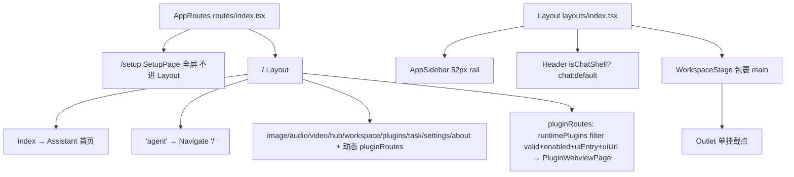
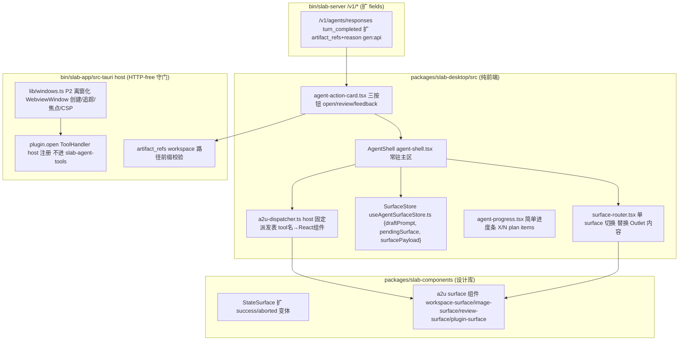
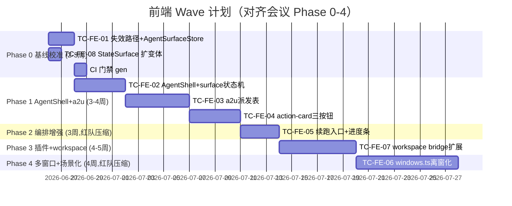

# Slab Next 前端开发计划 TD (03-frontend-td)

> 文档版本：v1.0｜定稿日期：2026-06-26｜性质：前端技术分解（TD）
> 作者：前端 / UX 架构师（起草），产品负责人（北极星守护）
> 依据：以现有源码为准（关键事实已交叉验证），遵守 [AGENTS.md](AGENTS.md) 边界红线，吸收会议结论 [00-meeting-conclusions](00-meeting-conclusions.md) 的 14 条 ADR 与红队 must_add/must_cut
> 北极星：以本地优先、隐私优先、离线可用为默认底座，把 AI 全能力收口到一个简单入口——以 AI Agent 为核心编排者，以受控的 a2u（agent-to-UI）为辅助

---

## 0. 执行摘要

本 TD 把会议结论里"统一入口 = surface 化派发（非多窗口堆砌）"的产品语义，落到 packages/slab-desktop 与 packages/slab-components 的可执行前端改造。核心结论一句话：**Assistant 升级为 AgentShell（主窗内 surface 状态机），原页面降级为可被 a2u tool call 打开的 surface 类型；host 侧固定派发表决定渲染哪个受信 React 组件，模型只决定调哪个工具+参数。**

与会议结论相比，本 TD 做了三处工程化收敛（吸收红队 must_cut，不臆造）：

1. **Phase 1 surface 状态机只做"单 surface 切换"**——一次只开一个面，替换 [layouts/index.tsx#L35](packages/slab-desktop/src/layouts/index.tsx#L35) 的 `<Outlet/>` 内容；分屏/浮窗/内联卡片三态叠加推迟。理由：红队 must_cut 指出多 surface 并存焦点/键盘/aria 管理是 a11y 雷区（portal + focus trap），不在统一入口最小可用阶段承担。
2. **agent-action-card 三动作按钮 + 简单进度条优先**——红队 must_cut 砍掉 ADR-010 的 AgentTimeline DAG 节点图 / subagent 子时间线 / checkpoint，因本地任务 max_turns=10 撑不起一张有意义的 DAG。
3. **能力可达性发现不新增工具**——红队 must_cut 砍 P5 `capabilities.available(domain)` 独立工具，改为 system prompt 注入现有 plugins/mcp.list 能力清单，减少 tool 表膨胀。

同时吸收红队 must_add 的两条与前端强相关的安全门：**artifact_refs workspace 路径前缀校验**（host 层）、**敏感路径审批黑名单**（前端审批卡显示）。

**关键代码事实（已交叉验证，本 TD 现状引用均来自此处）**：

| 事实 | 证据 | 含义 |
|---|---|---|
| 路由平铺，Assistant 已是首页 | [routes/index.tsx#L72](packages/slab-desktop/src/routes/index.tsx#L72) `{ index: true, element: <Assistant /> }` | 统一入口无需搬首页，但要降级其它页为 surface |
| 失效跨页路径真实存在 | [use-workspace-page.ts#L683](packages/slab-desktop/src/pages/workspace/hooks/use-workspace-page.ts#L683) `navigate("/assistant")`，而 [routes/index.tsx#L73](packages/slab-desktop/src/routes/index.tsx#L73) 只有 `'agent'→Navigate "/"`（无 `/assistant`） | ADR-011 必须先修，否则跨页契约继续漂移 |
| 跨页 draft 双步模式 | [useAssistantDraftStore.ts](packages/slab-desktop/src/store/useAssistantDraftStore.ts) + [use-workspace-page.ts#L669](packages/slab-desktop/src/pages/workspace/hooks/use-workspace-page.ts#L669) | 用单一 AgentSurfaceStore 收敛 {draftPrompt, pendingSurface, surfacePayload} |
| `location.state` 散用 | [use-workspace-page.ts#L615](packages/slab-desktop/src/pages/workspace/hooks/use-workspace-page.ts#L615) `workspaceRevealPath` | 一并收敛进 AgentSurfaceStore |
| tool_call 折叠进 ThoughtChain 无派发 | [use-assistant-agent.ts#L529](packages/slab-desktop/src/pages/assistant/hooks/use-assistant-agent.ts#L529) `tool_call_started`→`replaceThought` | a2u 派发表缺失，是统一入口的代码级根因 |
| `turn_completed` 只写文本 | [use-assistant-agent.ts#L540](packages/slab-desktop/src/pages/assistant/hooks/use-assistant-agent.ts#L540) | 任务总结三动作按钮无数据载体（缺 artifact_refs） |
| SSE 事件 schema 在前端硬编码解析 | [assistant-agent-events.ts#L3](packages/slab-desktop/src/pages/assistant/lib/assistant-agent-events.ts#L3) `AssistantAgentStreamEvent` 联合类型 | turn_completed 扩 artifact_refs+reason 需同步改这里 + gen:api |
| 无 WebviewWindow 多窗口基建（桌面） | [window-controls.tsx#L1](packages/slab-desktop/src/layouts/window-controls.tsx#L1) 仅 `getCurrentWindow()` 的 minimize/maximize/close | ADR-002 P0 不破单窗，主窗内 surface 状态机；离窗化 P2 |
| 插件 WebView 是内嵌占满 Outlet | [plugin-webview-page.tsx#L113](packages/slab-desktop/src/pages/plugins/components/plugin-webview-page.tsx#L113) iframe `sandbox="allow-scripts allow-forms"` | 无法被 agent 带参动态打开，pluginMountView 缺 initialPayload |
| caller id 从 WebView label 推导已成立 | [view.rs#L15](bin/slab-app/src-tauri/src/plugins/view.rs#L15) `PLUGIN_WEBVIEW_PREFIX = "plugin-"` + `plugin_webview_label(plugin_id)` | AGENTS.md:42 红线已在 host 落地，离窗化不得破坏（禁通配 label 前缀） |
| StateSurface 组件已存在但仅空/错/加载三态 | [state-surface.tsx#L35](packages/slab-components/src/state-surface.tsx#L35) `variant: "empty" | "error" | "loading"` | 设计系统变体裂变需补 success/aborted 状态 |
| slab-components 是独立设计库 | [slab-components/src/](packages/slab-components/src/) accordion~workspace 60+ 组件 | a2u surface 组件应落此包，与 layouts 解耦 |
| slab-server.log 已 919MB 无 rotation | [assistant-markdown.test.tsx#L262](packages/slab-desktop/src/pages/assistant/components/__tests__/assistant-markdown.test.tsx#L262) 测试断言 `size_bytes:919059921` | Phase 0 诊断包白名单 + log rotation（红队 must_add） |

---

## 1. 现状评估（As-Is）

### 1.1 路由 / Shell 结构



**现状问题**：

1. **平铺路由 ≠ 统一入口**：[routes/index.tsx#L71-L97](packages/slab-desktop/src/routes/index.tsx#L71) 所有页面是 Layout 的并列 children，Assistant 只是 index route，与 workspace/image 并列。用户仍需手动点 [sidebar.tsx#L30](packages/slab-desktop/src/layouts/sidebar.tsx#L30) 的 52px rail 切换。北极星要"对话内闭环"，但代码层面 Assistant 与其它页面是平级而非编排者。
2. **isChatShell 二态散落**：[layouts/index.tsx#L14](packages/slab-desktop/src/layouts/index.tsx#L14) `isChatShell = pathname === "/"` 在 [:L20](packages/slab-desktop/src/layouts/index.tsx#L20)、[:L22](packages/slab-desktop/src/layouts/index.tsx#L22)、[:L29](packages/slab-desktop/src/layouts/index.tsx#L29)、[:L41](packages/slab-desktop/src/layouts/index.tsx#L41) 四处分支。新增 surface 状态机会让变体继续裂变——需上提为单一 surface 状态机而非二态布尔。
3. **失效跨页路径**：[use-workspace-page.ts#L683](packages/slab-desktop/src/pages/workspace/hooks/use-workspace-page.ts#L683) `navigate("/assistant")` 是死路径，[routes/index.tsx#L73](packages/slab-desktop/src/routes/index.tsx#L73) 没有 `/assistant` 路由（只有 `'agent'`→redirect）。说明跨页契约已漂移，是统一入口必须先修的隐藏地基。

### 1.2 多窗口基础设施（缺失）

| 维度 | 现状 | 证据 |
|---|---|---|
| 桌面前端多窗口 API | **无**。仅有 `getCurrentWindow()` 的 minimize/maximize/close | [window-controls.tsx#L1](packages/slab-desktop/src/layouts/window-controls.tsx#L1)、[window-controls.tsx#L93-L113](packages/slab-desktop/src/layouts/window-controls.tsx#L93) |
| 插件 WebView | Tauri child WebView，由 host `WebviewBuilder` 创建，**内嵌**在 plugin-webview-page 占满 Outlet，非浮窗 | [plugin-webview-page.tsx#L107](packages/slab-desktop/src/pages/plugins/components/plugin-webview-page.tsx#L107)、[view.rs#L5](bin/slab-app/src-tauri/src/plugins/view.rs#L5) `WebviewBuilder` |
| label → caller id 推导 | 已落地：`plugin_webview_label(plugin_id)` = `plugin-<id>` 前缀 | [view.rs#L15](bin/slab-app/src-tauri/src/plugins/view.rs#L15)、[view.rs#L59](bin/slab-app/src-tauri/src/plugins/view.rs#L59) |
| tab 体系 | 无 | — |

**结论**：全仓无 `WebviewWindow`/`createWindow` 的桌面级多窗口基建（[window-controls.tsx](packages/slab-desktop/src/layouts/window-controls.tsx) 只有窗口控制按钮）。红队可行性风险指出——直接上多窗口会触发：每窗独立 WebView 上下文丢失 Zustand/TanStack 共享、CSP/capabilities 红线、低配机 OOM（每 WebView ~150-300MB）、与 pluginMountView bounds 契约冲突。**因此 P0 主窗内 surface 状态机优先，Tauri WebviewWindow 离窗化 P2 按需推进**（ADR-002）。

### 1.3 Agent 控制台组件树（待升级）

[assistant/index.tsx](packages/slab-desktop/src/pages/assistant/index.tsx) 当前组件树（[:L748-L889](packages/slab-desktop/src/pages/assistant/index.tsx#L748)）：

```
XProvider
└─ 根容器 (greeting + hero + ScrollArea + Composer + SessionSheet + ModelSwitchDialog)
   ├─ AssistantSessionSummaryCard  (会话摘要，桌面右上 / 移动端内联)
   ├─ ScrollArea
   │  └─ Bubble.List (ant-design/x)  ← 消息流，tool_call 在此折叠
   │     └─ ASSISTANT_BUBBLE_ROLES → assistant-bubble-content.tsx (含 approval 卡片)
   └─ AssistantComposer  ← 输入框 + 高级面板 (reasoningEffort/toolConcurrency/toolChoice)
```

**现状问题**：

1. **tool_call 折叠进 ThoughtChain，无派发表**：[use-assistant-agent.ts#L529](packages/slab-desktop/src/pages/assistant/hooks/use-assistant-agent.ts#L529) `tool_call_started` → `replaceThought`，[use-assistant-agent.ts#L526-L528](packages/slab-desktop/src/pages/assistant/hooks/use-assistant-agent.ts#L526) `tool_call_output` → `updateThoughtStatus`。所有工具调用被折叠成扁平 thought 节点（[:L113](packages/slab-desktop/src/pages/assistant/hooks/use-assistant-agent.ts#L113) `thoughts`），host 无"tool 名→受信 React 组件"映射。这是 a2u 派发缺失的代码级根因。
2. **任务总结无动作按钮**：[use-assistant-agent.ts#L540-L555](packages/slab-desktop/src/pages/assistant/hooks/use-assistant-agent.ts#L540) `turn_completed` 只 `completeAssistantTurn(event.text)` 写文本，无 artifact_refs 数据载体，无 open/review/feedback 按钮。
3. **无中断后续跑入口**：[use-assistant-agent.ts#L1144](packages/slab-desktop/src/pages/assistant/hooks/use-assistant-agent.ts#L1144) `interruptThread` 调用后，UI 无"从 checkpoint 续跑"按钮——interrupt 已解耦（control.rs:381）但前端能力被浪费。
4. **thoughts 是线性列表**：[use-assistant-agent.ts#L113](packages/slab-desktop/src/pages/assistant/hooks/use-assistant-agent.ts#L113) `useState<AssistantThought[]>`，长任务用户失去全局进度感（任务黑盒断点）。

### 1.4 跨页契约（散落漂移）

| 契约 | 位置 | 问题 |
|---|---|---|
| draft 双步 | [useAssistantDraftStore.ts](packages/slab-desktop/src/store/useAssistantDraftStore.ts) `setDraft` + [use-workspace-page.ts#L683](packages/slab-desktop/src/pages/workspace/hooks/use-workspace-page.ts#L683) `navigate("/assistant")` | navigate 死路径，draft 注入依赖 Assistant 挂载 |
| revealPath | [use-workspace-page.ts#L615](packages/slab-desktop/src/pages/workspace/hooks/use-workspace-page.ts#L615) `location.state.workspaceRevealPath` | location.state 散用，类型不安全 |
| image prompt | [assistant/index.tsx#L634](packages/slab-desktop/src/pages/assistant/index.tsx#L634) `navigate('/image', { state: { prompt } })` | 同样依赖目标页挂载读取 state |

**结论**：跨页契约已漂移为 3 套并存机制（navigate 死路径 / draft store / location.state），ADR-011 必须收敛为单一 AgentSurfaceStore。

### 1.5 workspace bridge 与 settings 现状

[workspace-bridge.ts](packages/slab-desktop/src/lib/workspace-bridge.ts) 已覆盖完整 workspace 能力（:L223-L465）：state/open/close、directory/files/search、git status/stage/unstage/discard/commit/diff、console/terminal、watch、plugin preference。**缺失**：

1. **无项目切换器 UI**：[WorkspaceStateResponse](packages/slab-desktop/src/lib/workspace-bridge.ts#L31) 已返回 `recent?: RecentWorkspace[]`（:L16-L20），但 AgentShell header 无切换入口。
2. **settings 合并语义未在 UI 体现**：workspace settings 覆盖全局（[CLAUDE.md shared context 4.4]），但 settings 页无"全局 vs workspace 覆盖"的可视化合并。
3. **无 context 选择器**：workspace 的产物/选区无法作为上下文带回对话（跨页双向断点）。

### 1.6 与 /v1/* 契约现状

- [assistant-agent-events.ts#L3-L15](packages/slab-desktop/src/pages/assistant/lib/assistant-agent-events.ts#L3) `AssistantAgentStreamEvent` 是前端硬编码联合类型，**未由 gen:api 生成**。`turn_completed` 当前只有 `{ type: 'turn_completed'; text: string }`（:L13）。
- [workspace-bridge.ts](packages/slab-desktop/src/lib/workspace-bridge.ts) 通过 `apiClient.GET/POST`（@slab/api）走 gen:api 生成的 [v1.d.ts](packages/api/src/v1.d.ts)。
- tool 注册在 [runtime.rs#L48](crates/slab-app-core/src/infra/agent/runtime.rs#L48) `refresh_memory_tools`（register fs 工具的活样本），a2u 工具应走同样路径。

---

## 2. 目标架构（To-Be）

### 2.1 AgentShell 总览



### 2.2 三态语义产品契约（ADR-001）

| 态 | 触发判据（输出形态，非 LLM 主观） | 前端实现 | 用户可覆盖 |
|---|---|---|---|
| 对话内完成 | 纯文本问答 / 计划审阅 / 结果摘要 | Bubble.List 气泡流，[assistant/index.tsx#L817](packages/slab-desktop/src/pages/assistant/index.tsx#L817) | 是（composer 续问） |
| a2u 打开新面 | 生成媒体 / 长代码 / 多文件 diff / 需迭代编辑 | surface-router 替换 Outlet 内容，host 固定组件派发 | 是（Canvas 范式，可钉住/折叠） |
| 专业页面深度 | 多文件重构 / 视频时间线精修 | surface 全屏化 + sidebar rail 仍可手动切 | 是（手动切页） |

**派发表是 host 固定映射，不是 LLM 决定渲染**（Vercel Generative UI / Claude Artifacts 范式）。模型只决定调哪个工具+参数，渲染哪个 React 组件由 [a2u-dispatcher.ts](packages/slab-desktop/src/pages/assistant/lib/a2u-dispatcher.ts) 完全固定。

### 2.3 To-Be 新增文件与边界归属

| 新增/改动文件 | 归属 | 边界论证 |
|---|---|---|
| `packages/slab-desktop/src/pages/assistant/agent-shell.tsx` | slab-desktop（纯前端） | 无需破例，升级现有 Assistant 为常驻 shell |
| `packages/slab-desktop/src/pages/assistant/lib/a2u-dispatcher.ts` | slab-desktop（纯前端） | host 固定派发表，纯前端映射，不涉及后端 |
| `packages/slab-desktop/src/pages/assistant/lib/surface-router.tsx` | slab-desktop（纯前端） | 单 surface 切换，替换 Outlet 内容 |
| `packages/slab-desktop/src/store/useAgentSurfaceStore.ts` | slab-desktop（纯前端） | 收敛 {draftPrompt, pendingSurface, surfacePayload}，废弃 useAssistantDraftStore 双步 |
| `packages/slab-desktop/src/pages/assistant/components/agent-action-card.tsx` | slab-desktop（纯前端） | 三动作按钮 open/review/feedback |
| `packages/slab-desktop/src/pages/assistant/components/agent-progress.tsx` | slab-desktop（纯前端） | 简单进度条 X/N plan items（红队 must_cut 砍 DAG 图） |
| `packages/slab-desktop/src/pages/assistant/components/agent-surface-layer.tsx` | slab-desktop（纯前端） | surface 容器层，单 surface 切换 + Escape 收敛 |
| `packages/slab-components/src/a2u/workspace-surface.tsx` 等 | slab-components（设计库） | 与 layouts 解耦，a2u surface 受信组件 |
| `packages/slab-desktop/src/lib/windows.ts`（P2） | slab-desktop（纯前端） | 离窗化 WebviewWindow 创建/追踪/焦点，P2 才推进 |
| `bin/slab-app/src-tauri/src/.../artifact_path_guard.rs`（host） | bin/slab-app/src-tauri（host-only） | workspace 路径前缀校验，host 守门不扩 /v1/*（红队 must_add） |

---

## 3. 任务卡（Task Cards）

> 每条任务卡：证据（file:line）+ 问题 + 方案步骤 + 验收 checklist + 依赖 + effort（人天）+ priority。

### TC-FE-01｜修复失效跨页路径 + 统一 AgentSurfaceStore

**状态（2026-06-30）**：已落地核心前端切片。`packages/slab-desktop/src/store/useAgentSurfaceStore.ts` 取代 `useAssistantDraftStore`，Workspace/Video → Workspace reveal 与 Workspace → Assistant 草稿入口已收敛到 store；Hub language/coding 入口与 E2E helper 已改回首页 `/`；Image prompt 只保留 query string 入口。已用单测与 browser flow 覆盖 draft consume、pending surface consume、composer 聚焦。

- **证据**：[use-workspace-page.ts#L683](packages/slab-desktop/src/pages/workspace/hooks/use-workspace-page.ts#L683) `navigate("/assistant")` 死路径；[useAssistantDraftStore.ts](packages/slab-desktop/src/store/useAssistantDraftStore.ts) 双步模式；[use-workspace-page.ts#L615](packages/slab-desktop/src/pages/workspace/hooks/use-workspace-page.ts#L615) `location.state.workspaceRevealPath` 散用；[assistant/index.tsx#L634](packages/slab-desktop/src/pages/assistant/index.tsx#L634) image prompt state。
- **问题**：跨页契约 3 套并存（死路径 navigate / draft store / location.state），类型不安全，navigate 死路径证明契约已漂移。多 surface 并存焦点/键盘管理无前提。
- **方案步骤**：
  1. 新建 `packages/slab-desktop/src/store/useAgentSurfaceStore.ts`，承载 `{ draftPrompt: string | null, pendingSurface: { type: 'workspace'|'image'|'review'|..., payload: unknown } | null, consumedRevealPath: string | null }`，Zustand create。
  2. 废弃 [useAssistantDraftStore.ts](packages/slab-desktop/src/store/useAssistantDraftStore.ts)，迁移 [assistant/index.tsx#L82](packages/slab-desktop/src/pages/assistant/index.tsx#L82) `useAssistantDraftStore` → `useAgentSurfaceStore`。
  3. [use-workspace-page.ts#L669-L683](packages/slab-desktop/src/pages/workspace/hooks/use-workspace-page.ts#L669) 改为 `useAgentSurfaceStore.getState().setDraft({ ... })` + `setPendingSurface({ type: 'assistant', payload: null })`，**删除 `navigate("/assistant")`**。
  4. [use-workspace-page.ts#L615](packages/slab-desktop/src/pages/workspace/hooks/use-workspace-page.ts#L615) `workspaceRevealPath` 改读 `useAgentSurfaceStore.pendingSurface.payload.revealPath`。
  5. AgentShell 监听 `pendingSurface`，命中 `{type:'assistant'}` 时自动聚焦 composer + 注入 draft。
- **验收 checklist**：
  - [x] `navigate("/assistant")` 产品入口归零（源码与测试 helper 改为 `/`；文档历史引用仍保留）
  - [x] workspace "用助手解释代码" 仍能注入 prompt 到 composer，并主动聚焦 composer
  - [x] `location.state.workspaceRevealPath` 散用收敛到 store
  - [x] vitest：useAgentSurfaceStore 单测覆盖 set/clear/consume
- **依赖**：无（Phase 0 第一卡）
- **effort**：2 人天｜**priority**：P0（Phase 0 阻塞所有后续 surface 工作）

### TC-FE-02｜AgentShell 常驻主区 + surface 状态机（单 surface 切换）

**状态（2026-06-30）**：已落地 assistant 内部可用切片。`AgentSurfaceLayer` 挂在 Assistant 主区内，消费 `AgentSurfaceStore.pendingSurface` 并渲染单一 a2u surface；关闭按钮与 Escape 可收敛 surface、恢复 composer 焦点，并通过持久 `aria-live` 节点公告打开/关闭状态，主对话流不卸载。用户可钉住当前 surface 阻止后续 pending surface 替换，取消钉住后再消费最新 pending；也可折叠/展开 surface 内容但保留上下文与控制条。browser harness 已覆盖 draft 聚焦、workspace surface 展示、workspace-targeted pending 保留、requeue 到 `/workspace`、surface 打开/关闭公告、关闭后 composer 聚焦、钉住与折叠覆盖。未完成项：按原 TD 把 layout `<Outlet/>` 提升为完整 AgentShell/surface-router、真实服务/真实 agent 全链路 E2E。

- **证据**：[layouts/index.tsx#L14](packages/slab-desktop/src/layouts/index.tsx#L14) `isChatShell` 二态散落 [:L20/:L22/:L29/:L41](packages/slab-desktop/src/layouts/index.tsx#L20)；[routes/index.tsx#L72](packages/slab-desktop/src/routes/index.tsx#L72) Assistant index route；[layouts/index.tsx#L35](packages/slab-desktop/src/layouts/index.tsx#L35) `<Outlet/>` 单挂载点。
- **问题**：Assistant 与其它页面平级，非编排者；isChatShell 二态会随 surface 裂变。
- **方案步骤**（吸收红队 must_cut：Phase 1 只做单 surface 切换，不做分屏/浮窗/卡片三态）：
  1. 新建 `packages/slab-desktop/src/pages/assistant/agent-shell.tsx`，包裹现有 [assistant/index.tsx](packages/slab-desktop/src/pages/assistant/index.tsx) 内容作为主对话流常驻区。
  2. 新建 `packages/slab-desktop/src/pages/assistant/lib/surface-router.tsx`：订阅 `useAgentSurfaceStore.pendingSurface`，当 `pendingSurface.type !== 'assistant'` 时，**替换** Outlet 内容为对应 surface 组件（非叠加）；Escape 键 / 关闭按钮回 `assistant`。
  3. [layouts/index.tsx#L23-L38](packages/slab-desktop/src/layouts/index.tsx#L23) `WorkspaceStage` 内 `<Outlet/>` 替换为 `<AgentShell>`（内含主对话流 + surface-router）。
  4. 上提 `isChatShell` 为 `surfaceState.active === 'assistant'`，消除 [:L20/:L22/:L29/:L41](packages/slab-desktop/src/layouts/index.tsx#L20) 四处布尔散落。
  5. sidebar rail 52px 视觉契约**不推翻**（[sidebar.tsx#L116](packages/slab-desktop/src/layouts/sidebar.tsx#L116) `--shell-rail-width` 保留），手动切页仍可用。
- **验收 checklist**：
  - [x] 路由表 [routes/index.tsx](packages/slab-desktop/src/routes/index.tsx) 零破坏（Assistant 仍是 index）
  - [x] sidebar rail 52px 视觉契约不变
  - [x] assistant 内部 surface 切换时主对话流**不卸载**（Zustand/TanStack 状态不丢）
  - [x] Escape 键/关闭按钮收敛回 assistant，焦点回到 composer
  - [x] a11y：surface 切换有 aria-live 公告，无 focus trap（单 surface 不需要）
- **依赖**：TC-FE-01
- **effort**：4 人天｜**priority**：P0（Phase 1 核心）

### TC-FE-03｜a2u 派发表（host 固定 tool 名→React 组件映射）

**状态（2026-06-30）**：已落地派发表、surface 组件、hook 接入与后端内置 a2u tool 注册。`a2u-dispatcher.ts` 固定映射 `workspace.open` / `review.show` / `image.edit` / `plugin.launch` / `hub.browse` 到 `AgentSurfaceStore` payload；`use-assistant-agent.ts` 在 `tool_call_started` 命中 a2u 工具时写 pending surface，未知工具继续 ThoughtChain 兜底；`packages/slab-components/src/a2u/` 已提供 workspace/image/review/plugin/hub 受信组件；`crates/slab-app-core/src/infra/agent/a2u_tools.rs` 注册内置 a2u 工具。用户 pin/collapse 覆盖已在 `AgentSurfaceLayer` 落地并有 browser 覆盖。未完成项：完整 layout-level surface-router、真实服务/真实 agent 全链路 E2E。

- **证据**：[use-assistant-agent.ts#L529-L539](packages/slab-desktop/src/pages/assistant/hooks/use-assistant-agent.ts#L529) `tool_call_started`→`replaceThought` 折叠，无派发；无派发表文件。
- **问题**：tool_call 全部折叠进 ThoughtChain，host 无"tool 名→受信 React 组件"映射——a2u 派发缺失的代码级根因。
- **方案步骤**：
  1. 新建 `packages/slab-desktop/src/pages/assistant/lib/a2u-dispatcher.ts`，导出 `A2U_DISPATCH_TABLE: Record<string, A2USurfaceHandler>`，初版固定映射：
     ```
     workspace.open     → WorkspaceSurface (revealPath)
     review.show        → ReviewSurface (diff)
     image.edit         → ImageSurface (payload)
     plugin.launch      → PluginSurface (pluginId, surface, payload)  [P2]
     hub.browse         → HubSurface
     ```
  2. 改 [use-assistant-agent.ts#L529](packages/slab-desktop/src/pages/assistant/hooks/use-assistant-agent.ts#L529) `tool_call_started`：先查 `A2U_DISPATCH_TABLE[event.tool_name]`，命中则 `useAgentSurfaceStore.setPendingSurface({ type, payload })` 触发 surface-router；未命中仍走 `replaceThought`（兜底未知工具）。
  3. surface 组件落 `packages/slab-components/src/a2u/`（与 layouts 解耦）。
  4. **副作用域红线**：a2u 工具只允许"打开受信 host 面 / 读写 sandbox 文件 / 调 /v1 API"，绝不操控任意像素（非目标：不做完整 Computer Use）。
- **验收 checklist**：
  - [x] 派发表是纯前端 Record，无后端依赖
  - [x] 未知 tool_name 走 ThoughtChain 兜底，不崩溃
  - [x] 受信 a2u surface 组件落 `packages/slab-components/src/a2u/` 并有 browser component 覆盖
  - [x] 后端内置 a2u tool 注册到 app-core agent router
  - [ ] 真实服务/真实 agent E2E：agent 调 workspace.open → WorkspaceSurface 在主窗打开
  - [x] 用户可显式覆盖（Canvas 范式：钉住/折叠 surface）
- **依赖**：TC-FE-02、后端内置 a2u 工具注册（[runtime.rs#L48](crates/slab-app-core/src/infra/agent/runtime.rs#L48) 模式）
- **effort**：5 人天｜**priority**：P0（Phase 1 核心）

### TC-FE-04｜agent-action-card 三动作按钮 + artifact_refs

**状态（2026-06-30）**：已落地可用闭环。`response.output_text.done` 已携带 `artifact_refs` 与 `reason`，server serialization、frontend SSE parser、`useAssistantAgent` 消息状态与 `AgentActionCard` 渲染均已覆盖；open/review 先经 `/v1/workspace/path/validate` 做 root-aware workspace 前缀校验，再写入 `AgentSurfaceStore`；feedback 注入 composer 并复用当前 assistant 会话；unsafe path 在 frontend parser/dispatcher/action-card 与 app-core a2u tool、slab-agent artifact 提取层过滤。`bun run gen:api` 已刷新 `packages/api/src/v1.d.ts` 与 Python SDK。剩余项：SSE event 当前不是 `packages/api/src/v1.d.ts` 生成类型，若后续把 SSE schema 纳入 OpenAPI，再补对应 CI 契约门。

- **证据**：[use-assistant-agent.ts#L540-L555](packages/slab-desktop/src/pages/assistant/hooks/use-assistant-agent.ts#L540) `turn_completed` 只 `completeAssistantTurn(event.text)`；[assistant-agent-events.ts#L13](packages/slab-desktop/src/pages/assistant/lib/assistant-agent-events.ts#L13) `{ type: 'turn_completed'; text: string }` 无 artifact_refs。
- **问题**：任务总结无动作按钮，无法 open/review/feedback 闭环（北极星核心）。
- **方案步骤**：
  1. 后端扩 `/v1/agents/responses` 的 `turn_completed` 事件加 `artifact_refs: { path: string, kind: 'file'|'diff'|'image'|... }[]` + `reason: string`（gen:api）。
  2. [assistant-agent-events.ts#L13](packages/slab-desktop/src/pages/assistant/lib/assistant-agent-events.ts#L13) `turn_completed` 扩字段（同步前端解析）。
  3. 新建 `packages/slab-desktop/src/pages/assistant/components/agent-action-card.tsx`，当 `turn_completed` 携带 `artifact_refs` 时在末条 assistant 气泡后渲染：
     - **open** → `useAgentSurfaceStore.setPendingSurface({ type:'workspace', payload:{ revealPath } })`
     - **review** → `useAgentSurfaceStore.setPendingSurface({ type:'review', payload:{ diff } })`
     - **feedback** → composer 注入草稿续跑，**不重启线程**（复用 threadId）
  4. **红队 must_add 安全门**：open/review 按钮在 host 层（[bin/slab-app/src-tauri](bin/slab-app/src-tauri)）校验 `artifact_refs[].path` 必须在 workspace 根下，跨目录/绝对路径拒绝。前端按钮 disabled + tooltip 提示"路径越界"。
- **验收 checklist**：
  - [x] 服务端 `response.output_text.done` wire payload 含 artifact_refs/reason，并有序列化测试
  - [x] turn_completed 带 artifact_refs 时渲染三按钮
  - [x] open/review 按钮 root-aware workspace 前缀校验（workspace 根外拒绝）
  - [x] feedback 续跑复用当前 assistant 会话，不新建线程
  - [x] vitest：agent-action-card 三按钮回调 + 路径越界 disabled
  - [x] REST 契约门：`/v1/workspace/path/validate` 已纳入 OpenAPI 并跑 `bun run gen:api`
  - [ ] SSE 契约门：若 SSE schema 后续进入 OpenAPI，再补 `gen:api` 强制检查
- **依赖**：TC-FE-01、TC-FE-02、后端 gen:api
- **effort**：4 人天｜**priority**：P0（Phase 1 核心，北极星闭环）

### TC-FE-05｜中断后续跑入口 + 进度条（吸收红队 must_cut 简化版）

- **证据**：[use-assistant-agent.ts#L1144-L1164](packages/slab-desktop/src/pages/assistant/hooks/use-assistant-agent.ts#L1144) `interruptThread` 后无续跑 UI；[use-assistant-agent.ts#L113](packages/slab-desktop/src/pages/assistant/hooks/use-assistant-agent.ts#L113) `thoughts` 线性列表无进度。
- **问题**：中断后只能重发，长任务前功尽弃（中断后续跑断点）；任务黑盒无进度感。
- **方案步骤**（吸收红队 must_cut：砍 AgentTimeline DAG 节点图/subagent 子时间线/checkpoint，只做简单进度条）：
  1. `turn_cancelled`（[use-assistant-agent.ts#L506](packages/slab-desktop/src/pages/assistant/hooks/use-assistant-agent.ts#L506)）后，在末条气泡渲染"从检查点续跑"按钮，复用 threadId 发 `agent.input`（不重启）。
  2. 新建 `agent-progress.tsx`：订阅 `plan_update` 事件（后端 plan 工具已有），渲染简单进度条 `X/N plan items completed`，**不画 DAG 节点图**（红队 must_cut）。
  3. 终止理由结构化展示：`status` 含 `MaxTurns`/`Interrupted`/`Errored` 时显示对应文案 + 续跑/重试按钮。
- **验收 checklist**：
  - [ ] 中断后点"续跑"复用 threadId，不重发原 prompt
  - [ ] 进度条显示 X/N，无 DAG 图
  - [ ] MaxTurns 终止显示"已达轮次上限，可续跑"
  - [ ] 续跑成功 e2e
- **依赖**：TC-FE-04、后端 plan result_ref 回填（不依赖 DAG）
- **effort**：3 人天｜**priority**：P1（Phase 2）

### TC-FE-06｜多窗口基础设施（P2 离窗化）

- **证据**：[window-controls.tsx#L1](packages/slab-desktop/src/layouts/window-controls.tsx#L1) 仅 getCurrentWindow()；[view.rs#L5](bin/slab-app/src-tauri/src/plugins/view.rs#L5) 已有 `WebviewBuilder`/`NewWindowResponse`（插件 WebView 专用）；[view.rs#L15](bin/slab-app/src-tauri/src/plugins/view.rs#L15) label 前缀推导。
- **问题**：桌面级多窗口基建缺失（仅插件专用），离窗化需补通用 windows.ts。
- **方案步骤**（P2 才推进，不在 P0 引入风险）：
  1. 新建 `packages/slab-desktop/src/lib/windows.ts`，封装 `createSurfaceWindow(surfaceId, url, bounds)` / `focusSurfaceWindow(surfaceId)` / `trackSurfaceWindow(surfaceId)`，基于 Tauri `WebviewWindow`。
  2. **caller-id-from-label 红线**：每个 surface 一个独立 label `surface-window-<surfaceId>`，**禁通配前缀**（红队边界违规警告：通配 `surface-window-*` 让 caller id 不可靠推导，违反 [AGENTS.md#L42](AGENTS.md#L42)）。
  3. CSP/capabilities 审计：每窗独立 WebView 需配 capabilities，走 `surface-window-<surfaceId>` label 推导，不逐个声明也不通配。
  4. 内存熔断：主窗口外 ≤8 同时存活，超 70% 物理内存停止新建（与后端 ADR-013 并发预算联动）。
  5. surface 组件支持 `mountMode: 'inline' | 'popout'`，popout 走 windows.ts。
- **验收 checklist**：
  - [ ] windows.ts createSurfaceWindow/focus/track 可用
  - [ ] 每个 surface 独立 label，grep 无 `surface-window-*` 通配
  - [ ] capabilities 审计文档签字
  - [ ] 内存超 70% 停止新建 + 用户提示
  - [ ] inline↔popout 切换状态不丢
- **依赖**：TC-FE-02、TC-FE-03、安全评审签字
- **effort**：8 人天｜**priority**：P2（Phase 4，按需推进）

### TC-FE-07｜workspace bridge 扩展（项目切换器 / settings 合并 UI / context 选择器）

- **证据**：[workspace-bridge.ts#L31](packages/slab-desktop/src/lib/workspace-bridge.ts#L31) `WorkspaceStateResponse` 已含 `recent`；[workspace-bridge.ts#L455](packages/slab-desktop/src/lib/workspace-bridge.ts#L455) plugin preference；settings 合并语义见 CLAUDE.md shared context 4.4。
- **问题**：无项目切换器 UI；settings 全局 vs workspace 覆盖不可视化；workspace 产物无法带回对话（跨页双向断点）。
- **方案步骤**：
  1. **项目切换器**：AgentShell header 加 `ProjectSwitcher`，读 `workspaceState().recent`（[workspace-bridge.ts#L223](packages/slab-desktop/src/lib/workspace-bridge.ts#L223)），切换走 `workspaceOpen(rootPath)`（:L230）。切换前 host 层枚举 active thread → interrupt → session 快照（ADR-012，**session 与 project 一对一绑定**，红队边界违规警告要求）。
  2. **settings 合并 UI**：settings 页加"全局 / workspace 覆盖"切换标签，workspace 覆盖项高亮，显示合并结果（agent.tools.allowed 并集/交集、agent.hooks workspace 可禁用）。
  3. **context 选择器**：AgentShell composer 加"附带上下文"按钮，可选拖入 workspace 文件/选区，注入为 user message 附带引用。
- **验收 checklist**：
  - [ ] 项目切换器列 recent，切换前 interrupt + 快照，UI 显示"N 个任务已挂起"
  - [ ] settings 合并 UI 区分全局/覆盖，merge 结果正确
  - [ ] context 选择器拖入文件生成引用块
  - [ ] session 切 workspace 不泄漏到新 workspace（project 绑定）
- **依赖**：TC-FE-02、后端 ADR-012 sidecar 优雅重启
- **effort**：6 人天｜**priority**：P1（Phase 3）

### TC-FE-08｜StateSurface 扩 success/aborted 变体（设计系统收敛）

**状态（2026-06-30）**：已落地。`@slab/components` 的 `StateSurface` 支持 `success`、`aborted` 与 `interrupted`，并用 browser component test 覆盖新状态和 loading role。

- **证据**：[state-surface.tsx#L35](packages/slab-components/src/state-surface.tsx#L35) `variant: "empty" | "error" | "loading"` 仅三态；[:L23-L27](packages/slab-components/src/state-surface.tsx#L23) defaultIcons 仅 Inbox/TriangleAlert/Loader2。
- **问题**：a2u surface 新增内联卡片/浮窗会让设计系统变体继续裂变（设计系统变体裂变痛点）。
- **方案步骤**：
  1. [state-surface.tsx#L35](packages/slab-components/src/state-surface.tsx#L35) `variant` 扩 `"success" | "aborted"`，defaultIcons 加 CheckCircle2 / Ban。
  2. 所有 a2u surface 组件统一用 StateSurface 渲染空/加载/错误/成功/中断，禁止各 surface 自造变体。
- **验收 checklist**：
  - [x] variant 扩 success/aborted，向后兼容（旧 empty/error/loading 不变）
  - [ ] a2u surface 组件 100% 用 StateSurface
  - [x] vitest/browser：StateSurface 新变体渲染覆盖
- **依赖**：无
- **effort**：1 人天｜**priority**：P1（Phase 1，与 TC-FE-03 并行）

---

## 4. Zustand / TanStack 改动

| 改动 | 文件 | 内容 |
|---|---|---|
| 新增 store | `useAgentSurfaceStore.ts`（新） | `{ draftPrompt, pendingSurface, surfacePayload }` 替代 useAssistantDraftStore |
| 废弃 store | [useAssistantDraftStore.ts](packages/slab-desktop/src/store/useAssistantDraftStore.ts) | 迁移后删除（仅自家代码引用） |
| 扩展 store | [useWorkspaceUiStore.ts](packages/slab-desktop/src/store/useWorkspaceUiStore.ts) | 加 `activeSurface` 派生（与 AgentSurfaceStore 联动） |
| TanStack Query | [workspace-bridge.ts](packages/slab-desktop/src/lib/workspace-bridge.ts) | 项目切换器用 `useQuery('workspace-state')`（[:L4](packages/slab-desktop/src/lib/workspace-bridge.ts#L4) key 已存在），切换 mutation 失败回滚 |
| TanStack Query | agent responses | turn_completed artifact_refs 走事件流（非 query），但 capabilities 清单用 `useQuery('plugins')`/`useQuery('mcp-list')` 注入 system prompt（红队 must_cut：复用现有不新增工具） |

**Zustand 边界**：客户端状态（surface/draft/UI）走 Zustand；服务端状态（workspace/models/sessions）走 TanStack Query——保持现有分层不破。

---

## 5. 与 /v1/* 契约对齐（gen:api）

| 契约改动 | 触发 | 前端同步 |
|---|---|---|
| `/v1/agents/responses` turn_completed 扩 `artifact_refs` + `reason` | 后端 SSE 事件 schema 变 | `bun run gen:api` 刷 [v1.d.ts](packages/api/src/v1.d.ts)；[assistant-agent-events.ts#L13](packages/slab-desktop/src/pages/assistant/lib/assistant-agent-events.ts#L13) 同步扩 |
| 终止理由结构化（MaxTurns/Interrupted 等） | 后端 ThreadStatus reason 字段（复用现有 status+reason，**不新增 enum 变体**——红队可行性风险要求零 migration） | [assistant-agent-events.ts#L4](packages/slab-desktop/src/pages/assistant/lib/assistant-agent-events.ts#L4) `AgentStatus` 扩 reason；UI 展示 |
| workspace settings 合并 | settings schema 变 | `bun run gen:schemas`；settings 页 UI 同步 |

**红线**：[assistant-agent-events.ts](packages/slab-desktop/src/pages/assistant/lib/assistant-agent-events.ts) 当前是前端硬编码联合类型（未由 gen:api 生成）——本 TD 不把它改成 gen:api 生成（SSE 事件流非 REST schema），但**字段变更必须与 [handler.rs#L553](bin/slab-server/src/api/v1/agent/handler.rs#L553) `response.output_text.done` 服务端发射处同步**，加 CI 门禁防漂移。

---

## 6. 组件库（slab-components）改动

| 改动 | 文件 | 内容 |
|---|---|---|
| 扩变体 | [state-surface.tsx](packages/slab-components/src/state-surface.tsx) | success/aborted（TC-FE-08） |
| 新增 a2u surface | `packages/slab-components/src/a2u/{workspace,image,review,plugin,hub}-surface.tsx` | 受信 surface 组件，与 layouts 解耦 |
| index 导出 | [slab-components/src/index.ts](packages/slab-components/src/index.ts) | 导出新 surface 组件 |

**边界**：a2u surface 组件是**纯展示**，副作用（路径校验/工具调用）走 host 或 useAgentSurfaceStore，不直接调 /v1/*（保持 slab-components 无网络依赖）。

---

## 7. Wave 计划与里程碑



| Wave | 任务卡 | 里程碑 | 退出标准 |
|---|---|---|---|
| **Wave 0（Phase 0）** | TC-FE-01, TC-FE-08, CI 门禁 | 契约收敛 | **已完成前端切片**：`navigate("/assistant")` 产品入口归零；AgentSurfaceStore 上线；StateSurface 状态扩展；`bun run check:frontend` 通过。gen:api/gen:schemas CI 门禁仍属独立 CI 工作 |
| **Wave 1（Phase 1）** | TC-FE-02, TC-FE-03, TC-FE-04 | AgentShell + a2u 最小可用 | **可用切片已落地，仍进行中**：assistant 内部 AgentSurfaceLayer、a2u 派发表/组件、后端内置 a2u tools、artifact_refs/action-card 闭环、relative-path 过滤与 root-aware workspace 校验、用户 pin/collapse 覆盖已完成。剩余：layout-level surface-router、真实服务/真实 agent E2E |
| **Wave 2（Phase 2）** | TC-FE-05 | 编排增强前端 | 中断续跑入口；进度条 X/N；MaxTurns 显示"可续跑" |
| **Wave 3（Phase 3）** | TC-FE-07 | 插件 + workspace 智能化 | 项目切换器（含 session project 绑定）；settings 合并 UI；context 选择器 |
| **Wave 4（Phase 4）** | TC-FE-06 | 多窗口离窗化（按需） | windows.ts；caller-id 独立 label；内存熔断；inline↔popout |

---

## 8. 风险与回滚

| 风险 | 缓解 | 回滚 |
|---|---|---|
| **surface 状态机 a11y 退化**（焦点/键盘/aria） | Phase 1 只做单 surface 切换（红队 must_cut），无 focus trap 需求；Escape 收敛；aria-live 公告 | 回滚到 [layouts/index.tsx](packages/slab-desktop/src/layouts/index.tsx) `<Outlet/>` 单挂载，AgentShell 退化为 Assistant 包装 |
| **artifact_refs 路径越界泄漏**（agent 产出指向 workspace 外） | 已加 relative-path 过滤：frontend parser/dispatcher/action-card + app-core a2u tool + slab-agent artifact 提取；open/review 再经 `/v1/workspace/path/validate` 做 root-aware workspace 前缀校验 | 关闭 action-card open/review 按钮，仅保留 feedback |
| **gen:api 漂移**（turn_completed 字段前后端不同步） | [assistant-agent-events.ts](packages/slab-desktop/src/pages/assistant/lib/assistant-agent-events.ts) 与 [handler.rs#L553](bin/slab-server/src/api/v1/agent/handler.rs#L553) 同 PR 改；SSE event 当前非 `v1.d.ts` 生成类型，后续若纳入 OpenAPI 再加 gen:api CI 门禁 | 回滚 artifact_refs 字段，action-card 不渲染 |
| **caller-id-from-label 红线**（离窗化通配 label） | 每 surface 独立 label `surface-window-<surfaceId>`，禁通配（红队边界违规警告）；安全评审签字 | 推迟 TC-FE-06 到下个 Phase |
| **session 跨 workspace 泄漏**（ADR-012） | session 与 project 一对一绑定（红队要求钉死，不放开放问题）；切换前 interrupt + 快照 | 切换器禁用，仅允许单 workspace |
| **surface 切换主对话流状态丢失** | AgentShell 常驻不卸载，surface-router 替换内容而非卸载主区 | surface 切换改为新路由（牺牲状态保留） |
| **plugin.open ToolHandler 滑向 slab-agent-tools**（红队边界违规警告） | plugin.open 必须落 [bin/slab-app/src-tauri](bin/slab-app/src-tauri) host 层，通过 host→app-core port trait 注入，不让 app-core 直接调 slab-plugin | 代码评审强校验，违规即否决 |
| **诊断包泄漏**（slab-server.log 919MB + secret） | 字段白名单 SRE+安全签字先行（Phase 0）；log rotation + redaction（红队 must_add） | export_diagnostics host-only 不上线 |

---

## 9. 红队修正吸收清单

### 必须补上（must_add，本 TD 已吸收）

| must_add | 落点 | 状态 |
|---|---|---|
| artifact_refs workspace 路径前缀校验 | TC-FE-04（relative-path 过滤 + `/v1/workspace/path/validate` root-aware 校验） | ✅ 已落地 |
| 敏感路径审批黑名单（read 类命中 ~/.ssh/.env 强制 ask） | 前端审批卡（[assistant-bubble-content.tsx](packages/slab-desktop/src/pages/assistant/components/assistant-bubble-content.tsx) approval 卡）显示"敏感路径"标记，后端 ADR-008 黑名单 | ✅ 已标注（后端主导，前端展示） |
| effects 由 host 静态推断（堵 ADR-009 插件自报） | 前端不渲染插件自报 effects，只显示 host 推断的 js→sandbox/python→isolate/wasm→extism | ✅ 已标注（plugin-surface 不信任自报） |

> 注：离线降级模式 / per-thread token 硬预算 / interrupt grace period / 任务级文件改动快照属后端 TD 范畴，本前端 TD 仅在 UI 展示层对接（离线模式 banner、预算耗尽终止理由、回滚按钮），不重复展开。

### 必须移除（must_cut，本 TD 已执行）

| must_cut | 本 TD 处理 |
|---|---|
| 砍 ADR-010 AgentTimeline DAG 节点图/subagent 子时间线/checkpoint | TC-FE-05 只做简单进度条 X/N，无 DAG 图 |
| 砍 Phase 1 surface 状态机分屏/浮窗/内联卡片三态叠加 | TC-FE-02 只做单 surface 切换 |
| 砍 P5 capabilities.available 独立工具 | 不新增工具，system prompt 注入现有 plugins/mcp.list（[第 4 节](#4-zustand--tanstack-改动)） |
| 砍 Phase 4 场景化 onboarding 三类预配 | 本 TD 不涉及（产品差异化工程，推迟） |

---

## 10. 边界红线遵守声明

本 TD 所有改动遵守 [AGENTS.md](AGENTS.md)：

- ✅ 只扩 /v1/*（turn_completed 扩 fields），不新增平行 API 树（[AGENTS.md#L25](AGENTS.md#L25)）
- ✅ API shape 变触发 `bun run gen:api`（[AGENTS.md#L26](AGENTS.md#L26)），CI 门禁
- ✅ 多窗口/tab 全落 packages/slab-desktop 与 bin/slab-app/src-tauri host 层，不让 slab-app-core 感知多窗口（HTTP-free 红线，[AGENTS.md#L28](AGENTS.md#L28)）
- ✅ 诊断包 export_diagnostics host-only，不扩 /v1（[AGENTS.md#L24](AGENTS.md#L24)）
- ✅ plugin WebView caller id 从 label 推导（[AGENTS.md#L42](AGENTS.md#L42)），离窗化禁通配前缀
- ✅ Tauri CSP/capabilities/permissions/sidecar 沙箱不绕过（[AGENTS.md#L31](AGENTS.md#L31)）
- ✅ 不把 DAG/规划/校验塞进 slab-agent 编排核心（[AGENTS.md#L29](AGENTS.md#L29)）——本 TD 不涉及后端编排
- ✅ plugin.open ToolHandler 落 host 层不进 slab-agent-tools（守纯编排红线）
- ✅ 不引入 Module Federation（[AGENTS.md#L38](AGENTS.md#L38)），插件 WebView 继续走 Tauri child WebView / iframe sandbox（[plugin-webview-page.tsx#L113](packages/slab-desktop/src/pages/plugins/components/plugin-webview-page.tsx#L113)）

---

## 11. 与本计划相关的其它文档

- [00-meeting-conclusions.md](00-meeting-conclusions.md) — 会议结论（14 条 ADR，本 TD 的上游依据）
- [01-product-design.md](01-product-design.md) — 产品 TD（北极星、三态语义、场景化）
- [04-backend-td.md](04-backend-td.md) — Agent 编排 TD（plan/task.complete/循环兜底/假完成修复，与本 TD 的 TC-FE-04/05 强耦合）
- [04-backend-td.md](04-backend-td.md) — 后端 TD（ToolContext 扩容/审批分级/sidecar 优雅重启/gen:api，本 TD 的后端依赖）
- [05-sre-td.md](05-sre-td.md) — SRE TD（诊断包白名单/secret store/并发预算，本 TC-FE-06 内存熔断联动）
- [AGENTS.md](AGENTS.md) — 仓库边界红线（本 TD 强制遵守）
- [docs/development/workspace-mode-design.md](docs/development/workspace-mode-design.md) — workspace 模式设计（settings 合并语义来源）

---

> 本 TD 以现有源码为准（关键事实已交叉验证 file:line），遵守 AGENTS.md 边界红线，不臆造 API/文件。所有 To-Be 新增文件已显式标注边界归属与论证。红队 must_add 已吸收、must_cut 已执行。下一步进入 Wave 0 执行（TC-FE-01 + TC-FE-08）。
