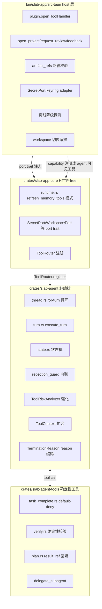
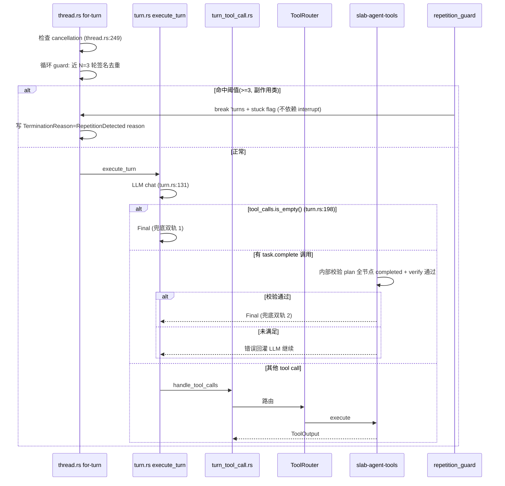
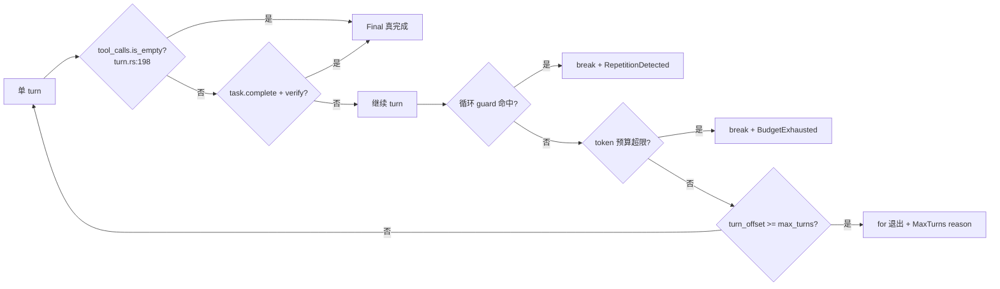
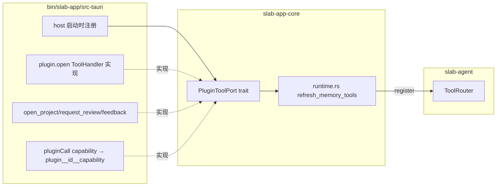
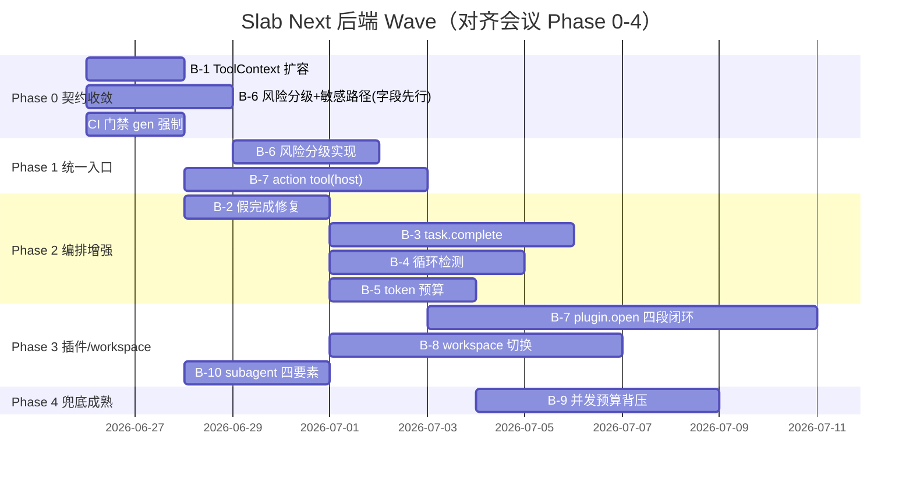

# Slab Next 后端开发计划 TD（04-backend-td）

- 文档版本：v2026-06-26
- 状态：Planning（To-Be，待落地）
- 作者：后端工程师（Agent/AI 架构师 + SRE 协同）
- 适用范围：`crates/slab-agent`、`crates/slab-agent-tools`、`crates/slab-agent-memories`、`crates/slab-app-core`（agent runtime/tools 注册/host port）、`bin/slab-app/src-tauri`（host 层能力注册/sidecar 切换）、`bin/slab-server`（`/v1/*` 扩展点）
- 北极星守护：产品负责人（统一入口三态语义 / 结构化终止纪律 / 任务总结闭环）

> 本 TD 是 [00-meeting-conclusions](#与本计划相关的其它文档) 的工程化落地，聚焦"后端 / Agent 编排控制面"。所有 As-Is 引用均以现有源码为准（关键事实已交叉验证），所有 To-Be 新增文件显式标注边界归属与论证，遵守 [AGENTS.md](AGENTS.md) 边界红线。红队 `must_add` 已吸收，`must_cut` 已移除。

---

## 0. 执行摘要

本 TD 把会议 14 条 ADR + 红队 7 条 must_add 中**落在后端控制面**的部分，落成可执行的 Rust 改造计划。后端要交付四件事：

1. **Agent 编排纪律**：把 Agent 从纯 ReAct 升级为 *plan-and-execute + 结构化终止*。`task.complete` default-deny + 确定性 verify 把"任务完成"的判定权从模型手里夺回给确定性逻辑；`max_turns` 耗尽不再被标成 `Completed`（修复"假完成"）；循环/重复检测走 `interrupt` 软停不硬杀。确定性逻辑一律落 `slab-agent-tools`，`slab-agent` 保持纯编排。
2. **上下文与工具基础设施**：`ToolContext` 扩容（Option + builder，不破坏测试矩阵）；workspace-scoped agent context（项目级 settings 合并、session/memory 隔离、`WorkspaceRef` 按需注入）。
3. **a2u / 插件 capability → tool 注册路径闭合**：`plugin.open` 高阶工具与 `pluginCall` capability 注册落 **host 层**（`bin/slab-app/src-tauri`），通过 host→app-core 的 port trait 注入，**不进 `slab-agent-tools`**，守纯编排红线；任务总结 action tool（`open_project`/`request_review`/`feedback`）由 host/app-core 注册。
4. **兜底与可观测**：`max_turns`/token 硬预算兜底；并发预算可配置 + 背压降级；`/v1/*` 扩展点契约对齐（`gen:api`/`gen:schemas`）；测试与验收（`cargo test -p ...`）。

**关键边界决策（一句话）**：纯编排（for-turn 循环、状态机、cancellation）留 `slab-agent`；确定性工具（`task.complete`/verify/plan 标准化）进 `slab-agent-tools`；插件/API 能力由 **host（`bin/slab-app/src-tauri`）注册并通过 port trait 注入 app-core**，不让 app-core 直接依赖 `slab-plugin` 运行时。

---

## 1. 边界红线（AGENTS.md 硬约束，违反即否决）

| 红线 | 本 TD 落地方式 |
|---|---|
| `slab-agent` 保持纯编排；内置确定性工具进 `slab-agent-tools`；插件/API 能力由 host/app-core 注册 | DAG/`task.complete`/verify/plan 标准化落 `slab-agent-tools`；`plugin.open`/`open_project` 等动作工具落 **host**；app-core 通过 port trait（`SecretPort`/`WorkspacePort` 风格）拿到句柄，不反向依赖 `slab-plugin` |
| `slab-app-core` 保持 HTTP-free | host 经 `runtime.rs` 的 `refresh_memory_tools` 模式（[runtime.rs:48](crates/slab-app-core/src/infra/agent/runtime.rs#L48)）注册工具，app-core 只持有 port 句柄 |
| 只扩 `/v1/*`；shape 变化跑 `bun run gen:api` | `turn_completed` 扩 `artifact_refs`+`reason`（[use-assistant-agent.ts:540](packages/slab-desktop/src/pages/assistant/hooks/use-assistant-agent.ts#L540)） |
| SQLx migration 只追加 | ThreadStatus **不新增 enum 变体**（红队可行性风险），复用 `update_thread_status` 现有 `Option<&str> reason` 字段（[thread.rs:449](crates/slab-agent/src/thread.rs#L449)），零 migration |
| Tauri CSP/capabilities/插件沙箱不可绕过；caller id 从 WebView label 推导 | 离窗化（P2+）每个 surface 独立 label，禁止 `surface-window-*` 通配前缀 |
| schema 变 `gen:schemas`/`gen:plugin-packs`；API 变 `gen:api` | `PluginCapabilityKind::a2u_surface`、`agent.runtime.limits` 域触发对应 gen |

---

## 2. 现状（As-Is，证据化）

> 以下全部引用真实 `file_path:line`。这是 To-Be Gap 分析的基线。

### 2.1 Agent 循环 / 终止

| 事实 | 证据 | 影响 |
|---|---|---|
| 主循环是 `for turn_offset in 0..self.config.max_turns` | [thread.rs:248](crates/slab-agent/src/thread.rs#L248) | 单 turn 在 [turn.rs:57](crates/slab-agent/src/turn.rs#L57) `execute_turn` |
| 终止已是结构化的：`response.tool_calls.is_empty()` → `TurnOutcome::Final` | [turn.rs:198](crates/slab-agent/src/turn.rs#L198)、[turn.rs:52](crates/slab-agent/src/turn.rs#L52) | 用户担心的"文本判停"代码里不存在——保持并强化 |
| `reject_missing_required_tool_call` 仅在 `tool_choice=Required/Tool` 时生效，`Auto/None` 放行 | [turn.rs:310-320](crates/slab-agent/src/turn.rs#L310) | default-deny 不完全，需 `task.complete` 强化 |
| **假完成隐患**：`'turns` for 循环**正常退出（非 break、非 interrupted、非 last_error）会落到 L424-451 的 `ResponseCompleted` + `set_status(Completed)`** | [thread.rs:424-451](crates/slab-agent/src/thread.rs#L424) | max_turns 耗尽本质是未完成却被持久化成完成态，是 resume 无据可依的根因 |
| `update_thread_status` 已支持 `Option<&str> reason` | [thread.rs:449](crates/slab-agent/src/thread.rs#L449)、[thread.rs:363](crates/slab-agent/src/thread.rs#L363) | 复用此字段承载 `TerminationReason`，**零 migration** |
| interrupt 与 shutdown 已解耦：interrupt 取消当前 turn 保留线程可续跑 | [control.rs:381](crates/slab-agent/src/control.rs#L381)、[control.rs:357](crates/slab-agent/src/control.rs#L357) | 但 thread.rs break 'turns 路径绕过了 interrupt 的 soft-stop（[thread.rs:331](crates/slab-agent/src/thread.rs#L331)） |
| 兜底只有 `max_turns`（默认 10）+ `invalid_tool_call_retries` 预算 + 并发 32/深度 4 | [config.rs:86](crates/slab-agent/src/config.rs#L86)、[bootstrap.rs:168](crates/slab-app-core/src/infra/agent/bootstrap.rs#L168) | 无循环/重复检测；无 per-thread token 预算 |

### 2.2 plan / subagent

| 事实 | 证据 | 影响 |
|---|---|---|
| `plan_update` 只 `normalize_plan` 后回显给 LLM，无 DAG、无 `result_ref`、无 `mark_done`、无持久化 | [plan.rs:91-106](crates/slab-agent-tools/src/plan.rs#L91)、[plan.rs:109](crates/slab-agent-tools/src/plan.rs#L109) | plan 是纯回显，不是 plan-and-execute |
| subagent 已隔离：独立 thread_id、全新对话只含委派任务、继承 config 可覆盖、`parent_id` 回链、`transient=true` | [subagent.rs:93-106](crates/slab-agent-tools/src/subagent.rs#L93) | 隔离基建已就绪 |
| subagent `wait_for_terminal_snapshot` **同步阻塞**，主 agent 在等子 agent 期间完全阻塞 | [subagent.rs:117](crates/slab-agent-tools/src/subagent.rs#L117) | 无法并行 spawn（Phase 4，本 TD 默认单 subagent 同步委派） |
| subagent 默认 `DEFAULT_SUBAGENT_TURNS=8`；主 agent `max_turns=10` | [subagent.rs:9](crates/slab-agent-tools/src/subagent.rs#L9)、[config.rs:86](crates/slab-agent/src/config.rs#L86) | 规模撑不起 DAG 节点图（红队过度工程风险） |

### 2.3 ToolContext / 审批 / 风险

| 事实 | 证据 | 影响 |
|---|---|---|
| `ToolContext` 仅 `thread_id`/`turn_index`/`depth` 三字段 | [tool.rs:17-24](crates/slab-agent/src/tool.rs#L17) | workspace/plan/循环签名共同卡点 |
| 唯一构造点在 `handle_tool_calls` | [turn_tool_call.rs:39-43](crates/slab-agent/src/turn_tool_call.rs#L39) | Option + builder 扩容可单点注入 |
| `ToolRouter` 是 `Arc<RwLock<HashMap>>`，`register`/`unregister`/`tool_specs` | [tool.rs:72-114](crates/slab-agent/src/tool.rs#L72) | turn 内工具表快照语义需显式定义（防热更新漂移） |
| 审批门：每个 tool 按需阻塞等 `ApprovalPort` 决策；`approval_request` 返回 None 则无审批直跑 | [turn_tool_call.rs:418](crates/slab-agent/src/turn_tool_call.rs#L418)、[turn_tool_call.rs:319](crates/slab-agent/src/turn_tool_call.rs#L319) | read_file 与 write_file 走同一审批流（一刀切） |
| `ToolRiskAnalyzer` trait + `BasicToolRiskAnalyzer` **仅识别 shell** | [risk.rs:7-45](crates/slab-agent/src/risk.rs#L7) | 分级基建已部分就绪，是 P1 强化而非从零 |
| `ToolRiskAssessment`/`ToolRiskLevel`（High/Medium/Low） | [risk.rs:5](crates/slab-agent/src/risk.rs#L5) | 已有三态雏形，需映射到 allow/sandbox/ask |

### 2.4 插件 capability / 工具注册

| 事实 | 证据 | 影响 |
|---|---|---|
| `PluginCapabilityKind` 仅 `{Tool, Workflow}`，无 `a2u_surface` | [plugin.rs:392-395](crates/slab-types/src/plugin.rs#L392) | 需新增变体（`gen:plugin-packs`+`gen:schemas`） |
| `effects: Vec<String>` 字段已存在但**未消费** | [plugin.rs:290](crates/slab-types/src/plugin.rs#L290) | 需 host 静态推断（红队 ADR：runtime 类型决定 effects 信任等级） |
| `PluginCapabilityTransportType` 仅 `PluginCall` | [plugin.rs:407-409](crates/slab-types/src/plugin.rs#L407) | pluginCall capability 是闭合缺口的载体 |
| `registry.rs` 校验 `exposeAsMcpTool` 需 `mcpTool:expose` 权限，但 pluginCall capability **没被 host 注册成 agent 可见工具** | [registry.rs:498-507](crates/slab-plugin/src/registry.rs#L498) | 闭合缺口确认 |
| `refresh_memory_tools` 是 host/app-core 注册工具的活样本（按工具名 register） | [runtime.rs:48](crates/slab-app-core/src/infra/agent/runtime.rs#L48)、[bootstrap.rs:173](crates/slab-app-core/src/infra/agent/bootstrap.rs#L173) | plugin.open 注册沿用此模式，但**实现体落 host** |
| 已注册工具：`shell`/`read_file`/`write_file`/`list_dir`/`file_glob`/`grep`/`plan_update`/`web_search`/`fs_watch`/`apply_patch`/`git(*)`/`mcp(*)`/`delegate_subagent` | [lib.rs:75-108](crates/slab-agent-tools/src/lib.rs#L75) | 工具表已不小，a2u 工具需刻意高阶、命名空间化 |

### 2.5 sidecar / settings / 状态机

| 事实 | 证据 | 影响 |
|---|---|---|
| `shutdown_server_sidecar` 是 stdin `shutdown` + 8s 超时 + `child.kill()` | [sidecar.rs:11](bin/slab-app/src-tauri/src/setup/sidecar.rs#L11)、[sidecar.rs:44](bin/slab-app/src-tauri/src/setup/sidecar.rs#L44) | workspace 切换必然杀进程重拉，留假 running 线程 |
| `AgentThreadStatus` 是 `Pending/Running/Interrupting/Interrupted/Completed/Errored/Shutdown`，跨层枚举 | [agent.rs:17-32](crates/slab-types/src/agent.rs#L17) | 新增变体回归面巨大（红队可行性风险），**不新增**，复用 reason 字段 |
| 状态迁移表硬编码 | [state.rs:50-73](crates/slab-agent/src/state.rs#L50) | 不改枚举则零迁移表改动 |
| `control.active_thread_count` 已存在 | [control.rs:415](crates/slab-agent/src/control.rs#L415) | workspace 切换前枚举 active thread 复用此能力 |

---

## 3. To-Be：新增/改动文件与边界归属

> 每条 To-Be 显式标注归属 crate/包 + 边界论证。红队边界违规警告已逐条吸收。

### 3.1 Agent 编排（确定性逻辑落 slab-agent-tools）

| 新增/改动 | 归属 | 边界论证 |
|---|---|---|
| `task_complete.rs`（`TaskCompleteTool`，default-deny 完成判定工具） | `crates/slab-agent-tools/src/`（**新增**） | 确定性工具，符合 AGENTS.md 红线；由 app-core `runtime.rs` 经 `refresh_memory_tools` 模式注册（[runtime.rs:48](crates/slab-app-core/src/infra/agent/runtime.rs#L48)） |
| `verify.rs`（`VerifyTool`，确定性校验：`workspace_build`/`lint`/`diff`） | `crates/slab-agent-tools/src/`（**新增**） | 确定性工具，作 plan 节点 `result_ref` |
| `plan.rs` 扩 `result_ref` 字段 + `mark_done(task_id)` | `crates/slab-agent-tools/src/plan.rs`（**改动**） | 标准化逻辑本就在此 crate；**砍掉 DAG + `replan(plan_patch)` + 独立 namespace 持久化**（红队 must_cut：YAGNI，max_turns=10 撑不起 DAG） |
| `TerminationReason`（普通枚举 + reason 字符串编码，**不进 ThreadStatus enum**） | `crates/slab-agent/src/thread.rs`（**改动**）+ 复用 `update_thread_status` 的 `Option<&str> reason` | 编排核心只加 reason 解析/写入，零状态机迁移、零 SQLx migration（红队可行性风险吸收） |
| 循环/重复检测 `repetition_guard`（内联 thread.rs） | `crates/slab-agent/src/thread.rs`（**改动**） | 读 `TurnOutcome` 属编排内置状态；**需架构签字**（开放问题 4）；命中直接 `break 'turns` + 设 stuck flag，**不依赖 interrupt 异步 cancellation**（红队可行性风险吸收） |
| `ToolContext` 扩容（`Option<WorkspaceRef>` + builder） | `crates/slab-agent/src/tool.rs`（**改动**） | 公共类型 shape 变，只加 Option 字段；**不上 trait object 注入一套句柄**（红队过度工程风险吸收） |

#### 边界论证（红队边界违规警告吸收）

- **DAG/replan 砍掉**：红队过度工程风险明确——Anthropic Multi-Agent DAG 是为跨小时研究任务设计，Slab 是 max_turns=10 的本地桌面工具。Phase 2 只做"`task.complete` default-deny + `result_ref` 回填到现有 `normalize_plan`"。
- **`TerminationReason` 不进 enum**：红队可行性风险明确——`ThreadStatus` 是跨层枚举（slab-types→state.rs→store→前端→WS），新增变体所有 `match` 都要补分支，漏一处 panic。复用现有 `reason` 字段，零 migration。
- **循环 guard 不依赖 interrupt 异步 cancellation**：红队可行性风险明确——interrupt 走 `cancellation.cancel()`，下一轮 turn 开头才检查（[thread.rs:249](crates/slab-agent/src/thread.rs#L249)），guard 命中时是当前 turn 内，若正好是最后一轮则 interrupt 永不生效。guard 必须 `break 'turns` + 设独立 stuck flag 走独立终止路径。

### 3.2 a2u / 插件 capability → tool 注册（host 层注册，不进 slab-agent-tools）

| 新增/改动 | 归属 | 边界论证 |
|---|---|---|
| `PluginCapabilityKind::a2u_surface` 变体 | `crates/slab-types/src/plugin.rs`（**改动**） | 确定性数据结构，跨 crate 契约；`gen:plugin-packs`+`gen:schemas`；向后兼容 serde default |
| `plugin.open` ToolHandler（`plugin_id`/`surface`/`payload`） | `bin/slab-app/src-tauri/src/`（**新增 host 层实现**） | **红队边界违规警告吸收**：plugin.open 涉插件 sandbox 生命周期/capabilities，属 host 职责（AGENTS.md Tauri child WebViews 默认）；若落 app-core 会把 slab-plugin 运行时依赖反向引入 HTTP-free 业务核心，破坏分层。host 通过 port trait 把"打开 surface"能力注入 app-core |
| `pluginCall` capability 注册成 agent 可见工具（`plugin__{id}__{capability}` 命名空间，与 mcp sanitize 一致） | `bin/slab-app/src-tauri/src/`（host 注册）+ port trait 经 `runtime.rs` 注入 | host 调用 `slab-plugin` registry/integrity/permission，不让 app-core 直接依赖 |
| effects 静态推断（runtime 类型决定信任等级） | `bin/slab-app/src-tauri/src/`（host 推断） | **红队 must_add 吸收**：js→Tauri sandbox、python→PyO3 isolate、wasm→extism，插件自报 effects 只作 hint |
| 任务总结 action tool：`open_project`/`request_review`/`feedback` | `bin/slab-app/src-tauri/src/`（host 注册）+ `crates/slab-app-core`（port trait） | open/review 涉 host surface 派发；feedback 涉前端 composer；均非确定性工具，不进 slab-agent-tools |
| `artifact_refs` workspace 根路径前缀校验 | `bin/slab-app/src-tauri/src/`（host 层校验） | **红队 must_add 吸收**：open/review 按钮在 host 层校验路径必须在工作区根下，跨目录/绝对路径拒绝（Phase 1 exit criteria 硬门） |
| `/v1/agents/responses` `turn_completed` 扩 `artifact_refs`+`reason` | `bin/slab-server`（扩 fields） | 仅扩不新增 API 树，`gen:api` |

### 3.3 兜底与可观测（host + agent 混合）

| 新增/改动 | 归属 | 边界论证 |
|---|---|---|
| per-thread token 硬预算（`BudgetExhausted` reason） | `crates/slab-agent/src/thread.rs`（编排内联）+ `config.rs`（配置） | **红队 must_add 吸收**：LLM 调用累计 token 超 thread 预算触发终止；比循环检测更现实的成本失控兜底 |
| 离线降级（探测 provider 可达性，收窄工具集） | `bin/slab-app/src-tauri/src/`（host 探测）+ port trait 注入 | **红队 must_add 吸收**：北极星"离线可用"硬要求；host 探测后经 port 通知 app-core 收窄 |
| 敏感路径审批黑名单（`~/.ssh`/`.env`/`*credentials*`/`*.pem` 强制 ask） | `crates/slab-agent/src/risk.rs`（强化 `BasicToolRiskAnalyzer`） | **红队 must_add 吸收**：覆盖 read 类默认 allow，守隐私优先红线 |
| `agent.runtime.limits` 可配置域 + FIFO 背压 | `crates/slab-config`（PMID 配置）+ `crates/slab-app-core/src/infra/agent/bootstrap.rs` | **红队可行性风险吸收**：bootstrap.rs:168 硬编码 32/4 提为可配置；FIFO 排队语义暴露给前端；冷却窗口防振荡 |
| workspace 切换 = sidecar 优雅重启 + task 受控迁移 | `bin/slab-app/src-tauri/src/`（host 编排）+ 复用 `control.interrupt` | **红队边界违规警告吸收**：切换前枚举 active thread → 逐个 interrupt（带 grace period 等 watch channel 确认 Interrupted）→ session 快照（原子性）→ shutdown；session 与 project 一对一绑定，**不放开放问题** |
| 统一 secret store（`SecretPort` trait） | `crates/slab-config`（**新增 `SecretPort` port trait**）+ `bin/slab-app/src-tauri`/`bin/slab-runtime`（keyring adapter 实现） | **红队边界违规警告吸收**：keyring 跨平台 OS 集成是运行时副作用，不能放 `crates/` 纯库 crate（会被 slab-agent-tools/slab-plugin 反向引入）；port trait 在 crates/，实现落 composition root |

---

## 4. Agent 编排器（控制层设计）

> 本节论证"编排器"的边界归属——什么留 `slab-agent`、什么进 `slab-agent-tools`、什么由 host/app-core 注册。

### 4.1 边界归属总表



| 控制层职责 | 归属 | 论证 |
|---|---|---|
| for-turn 循环、状态机、cancellation、turn 执行 | `slab-agent`（thread.rs/turn.rs/state.rs） | 纯编排，AGENTS.md 红线 |
| `task.complete` default-deny 判定 + 确定性 verify | `slab-agent-tools`（task_complete.rs/verify.rs） | 确定性工具；判定权从模型手里夺回给确定性逻辑 |
| plan `result_ref` 回填 | `slab-agent-tools`（plan.rs） | 标准化逻辑本在此 crate |
| 循环/重复检测 | `slab-agent`（thread.rs 内联，架构签字） | 读 `TurnOutcome` 属编排内置状态 |
| `TerminationReason` reason 编码 | `slab-agent`（thread.rs） | 编排核心，仅 reason 解析/写入，零 migration |
| 工具审批三态分级（allow/sandbox/ask）+ 敏感路径黑名单 | `slab-agent`（risk.rs 强化） | risk analyzer 是编排内置 port（[risk.rs:7](crates/slab-agent/src/risk.rs#L7)） |
| `plugin.open` / action tool / capability 注册 | **host**（`bin/slab-app/src-tauri`） | 涉插件 sandbox 生命周期/capabilities，属 host 职责 |
| `ToolContext` 扩容 | `slab-agent`（tool.rs） | 公共类型 shape |
| secret store / 离线降级 / workspace 切换 | host 编排 + app-core port trait | 运行时副作用在 host/composition root |

### 4.2 单 turn 执行流（To-Be）



---

## 5. 结构化终止强化（task.complete default-deny）

### 5.1 设计要点

- **绝不引入文本/正则判停**（[turn.rs:198](crates/slab-agent/src/turn.rs#L198) 已结构化判停，保持）。
- 完成判定 = `(LLM 调用 task.complete)` AND `(plan 全节点 status=completed)` AND `(确定性 verify 通过)`。
- `task.complete` 内部校验未满足 → 返回错误回灌 LLM 继续；满足 → 走 Final。
- 与 [turn.rs:198](crates/slab-agent/src/turn.rs#L198) `tool_calls.is_empty()` 兜底**双轨**，不互斥。

### 5.2 强制策略与代码落点

| 落点 | 改动 |
|---|---|
| [turn.rs:198](crates/slab-agent/src/turn.rs#L198) | `tool_calls.is_empty()` 分支保持（双轨 1）；新增对 `task.complete` 工具输出的特殊识别（双轨 2，开放问题 1 倾向特殊控制工具——调即 Final 短路） |
| [turn.rs:199-211](crates/slab-agent/src/turn.rs#L199) | `reject_missing_required_tool_call` 保持，但 `task.complete` 调用即满足"required tool call"语义 |
| [thread.rs:424-451](crates/slab-agent/src/thread.rs#L424) | **假完成修复**：for 循环正常退出（非 Final、非 break）时写 `TerminationReason::MaxTurns` reason，状态仍 `Completed`（**不新增 enum 变体**），但 reason 字段区分"真完成"与"turn 耗尽" |
| [thread.rs:363](crates/slab-agent/src/thread.rs#L363) | interrupt 路径已有 reason="interrupted"；循环 guard 命中走独立 stuck flag 路径写 reason="repetition_detected" |

### 5.3 task.complete 强制策略 checklist

- [ ] `task_complete.rs` 新增 `TaskCompleteTool`（`crates/slab-agent-tools`）
- [ ] 参数：`summary`/`artifact_refs`/`followup_actions`
- [ ] 内部校验：plan 全节点 completed + verify 通过（失败返回 `AgentError::ToolExecution` 回灌）
- [ ] `app-core` `runtime.rs` 经 `refresh_memory_tools` 模式注册（[runtime.rs:48](crates/slab-app-core/src/infra/agent/runtime.rs#L48)）
- [ ] `turn.rs` 识别 `task.complete` 调用即 Final（特殊控制工具，开放问题 1 待确认优先级，倾向后者）
- [ ] `verify.rs` 新增 `VerifyTool`（`workspace_build`/`lint`/`diff`），作 plan 节点 `result_ref`
- [ ] cargo test -p slab-agent-tools 全绿

### 5.4 TerminationReason（不进 ThreadStatus enum）

```rust
// crates/slab-agent/src/thread.rs（新增，不进 slab-types AgentThreadStatus）
/// 结构化终止理由，编码进 update_thread_status 的 Option<&str> reason 字段。
/// 不新增 AgentThreadStatus enum 变体（红队可行性风险吸收），零 SQLx migration。
pub(crate) enum TerminationReason {
    Completed,           // task.complete + verify 通过
    MaxTurns,            // thread.rs:424 for 循环正常退出（假完成修复）
    RepetitionDetected,  // 循环 guard 命中（直接 break，不走 interrupt）
    BudgetExhausted,     // per-thread token 预算耗尽（红队 must_add）
    Interrupted,         // control.interrupt（保留线程可续跑）
    Errored,             // last_error
}

impl TerminationReason {
    pub fn as_reason_str(&self) -> &'static str {
        match self {
            Self::Completed => "completed",
            Self::MaxTurns => "max_turns_reached",
            Self::RepetitionDetected => "repetition_detected",
            Self::BudgetExhausted => "budget_exhausted",
            Self::Interrupted => "interrupted",
            Self::Errored => "errored",
        }
    }
}
```

> 前端通过 `reason` 字段渲染"已达轮次上限，可续跑"等文案；`Completed + reason="completed"` 才是真完成，其余 reason 即使 status=Completed 也提示可续跑/可介入。

---

## 6. subagent 隔离与上下文边界

### 6.1 现状已就绪

- 独立 thread_id、全新对话只含委派任务、继承 config 可覆盖、`parent_id` 回链、`transient=true`（[subagent.rs:93-106](crates/slab-agent-tools/src/subagent.rs#L93)）。
- `spawn_child_for_parent` 校验 depth 上限（[control.rs:234-257](crates/slab-agent/src/control.rs#L234)）。

### 6.2 To-Be 补四要素 + artifact 落盘只回引用

| 要素 | 现状 | To-Be |
|---|---|---|
| objective（明确目标） | `task` 字段已有（[subagent.rs:22](crates/slab-agent-tools/src/subagent.rs#L22)） | prompt 模板强化"只做委派任务" |
| output_format（输出格式） | 缺 | `DelegateSubagentArgs` 加 `output_format: Option<String>` |
| 来源（继承 vs 隔离） | 继承 parent config（[subagent.rs:93](crates/slab-agent-tools/src/subagent.rs#L93)） | 显式 `allowed_tools` 隔离已支持 |
| 边界（scope 限制） | 部分（depth/transient） | 加 `workspace_scope: Option<WorkspaceRef>` 限制子 agent 文件访问范围 |
| artifact 落盘 | 缺 | 子 agent 产物落 `.slab/artifacts/<thread_id>/`，`completion_text` 只回路径引用 |

### 6.3 边界

- subagent 是 **researchers not coders**（non_goals：编码类主仓库修改留主线程）。
- **默认单 subagent 同步委派**（红队 must_cut：砍掉 Phase 4 并行 `delegate_subagent(tasks: Vec)`，与 non_goals"不默认就上多 agent" + GLM ~10-14 并发 429 冲突）。
- subagent 上下文隔离：`transient=true` 已保证不污染 parent session 检索。

---

## 7. 循环/重复检测算法与落点

### 7.1 算法（红队过度工程风险吸收后）

```
输入：近 N=3 轮的 (tool_name, 规范化 args 签名)
签名：SHA-256( tool_name || ":" || canonical_args )
豁免：只读工具（read_file/grep/list_dir/file_glob）不计入
计数：仅对副作用类工具（write_file/apply_patch/shell/git/mcp_call）计数
阈值：连续命中 >= 3 次同签名（红队建议从 2 提到 3-4，防迭代式工作流误报）
命中处置阶梯：
  1. 直接 break 'turns + 设 stuck flag（不依赖 interrupt 异步 cancellation）
  2. 写 TerminationReason::RepetitionDetected reason
  3. 前端提示"检测到重复操作，可介入调整"（escalate 到人）
绝不 shutdown 硬杀（保留线程可续跑）
```

### 7.2 落点

| 落点 | 改动 |
|---|---|
| `crates/slab-agent/src/thread.rs`（内联，**需架构签字**——开放问题 4） | for-turn 循环开头维护 `VecDeque<(String, String)>`（近 N 轮签名）；副作用类工具命中后 `break 'turns` |
| `crates/slab-agent/src/config.rs` | 加 `repetition: RepetitionConfig { window: u8=3, threshold: u8=3, exempt_readonly: bool=true }` |

### 7.3 误报缓解

- 只读工具豁免（合法渐进探索 read 不同文件不计数）。
- 阈值提到 3（write_file 改同文件多版迭代不误报）。
- 命中先 soft-stop（break）给人工介入，不直接判失败。

---

## 8. max-turn / 预算兜底

### 8.1 max_turns 假完成修复（ADR-005，红队可行性风险吸收版）

| 项 | 决策 |
|---|---|
| ThreadStatus 枚举 | **不新增变体**（复用 `Completed`/`Interrupted`/`Errored`/`Shutdown`） |
| 区分手段 | 复用 `update_thread_status` 的 `Option<&str> reason` 字段（[thread.rs:449](crates/slab-agent/src/thread.rs#L449)） |
| MaxTurns 走 interrupt 语义 | thread.rs:424 for 循环正常退出时，**不直接 set Completed**，而是按是否曾命中 cancellation/intent 分支：真 Final → `Completed`+reason="completed"；turn 耗尽 → `Completed`+reason="max_turns_reached"（保留线程可续跑） |
| state.rs 迁移表 | 零改动（不新增枚举值） |
| SQLx migration | **零 migration**（红队可行性风险吸收） |
| 前端 | 通过 reason 字段区分展示，`gen:api` 同步 reason 字段（已有） |

### 8.2 per-thread token 硬预算（红队 must_add）

```rust
// crates/slab-agent/src/config.rs（新增）
pub struct TokenBudget {
    pub prompt_tokens_limit: Option<u64>,
    pub completion_tokens_limit: Option<u64>,
    pub total_tokens_limit: Option<u64>,  // 累计，超限触发 BudgetExhausted
}

// crates/slab-agent/src/thread.rs（编排内联）
// 每次 LlmResponse 返回后累加 usage（需 LlmPort 暴露 usage），超限 break 'turns + reason="budget_exhausted"
```

- 防 runaway agent 烧光 provider 配额（比循环检测更现实的成本失控兜底）。
- 与循环检测正交，可叠加。

### 8.3 兜底层次总览



---

## 9. a2u tool / function 注入

### 9.1 注册路径（host → app-core port → ToolRouter）



### 9.2 任务总结 action tool

| tool | 参数 | host 动作 | 边界 |
|---|---|---|---|
| `open_project` | `artifact_ref`（workspace 相对路径） | host 校验路径在工作区根下 → `shell.openSurface('workspace',{revealPath})` | **红队 must_add**：路径前缀校验，跨目录/绝对路径拒绝 |
| `request_review` | `diff_ref` | host → `shell.openSurface('review',{diff})` | 同上校验 |
| `feedback` | `draft_text` | composer 注入草稿续跑不重启线程 | 非任意跳转 |

### 9.3 插件 capability → agent 可见工具闭合

| 步骤 | 落点 | 说明 |
|---|---|---|
| 声明 | plugin.json `contributes.agentCapabilities[].kind=a2u_surface` + `input_schema`/`output_schema`/`effects` | `gen:plugin-packs`+`gen:schemas` |
| 注册 | host 启动时遍历已启用插件，对 pluginCall transport 的 capability 注册成 `plugin__{id}__{capability}` | 命名空间与 mcp.rs sanitize 一致 |
| 调用 | agent 调用 → host 走审批门（effects 静态推断决定 allow/ask/sandbox）→ sandbox 执行 | effects 信任等级由 runtime 类型决定（红队 must_add） |
| 渲染 | host 注入 initialPayload 到 pluginMountView，caller id **从 WebView label 推导**（AGENTS.md:42 红线） | payload 可来自 agent，但 caller 身份不可从 payload 取 |
| 回灌 | surface output 经 host 转 `ToolOutput` 回灌 agent turn | 同步/异步待定（开放问题 3） |

### 9.4 能力可达性（红队 must_cut：砍独立工具，改 system prompt 注入）

- **砍 `capabilities.available(domain)` 独立工具**（红队过度工程风险）。
- 改为 host 启动时把已启用插件/MCP 能力清单注入 agent system prompt（复用现有 plugin registry 数据），减少 tool 表膨胀。

---

## 10. workspace-scoped agent context

### 10.1 项目级 settings 合并（Phase 0 钉死契约）

| 配置项 | 合并语义 |
|---|---|
| `agent.tools.allowed` | 全局并集 ∩ workspace 覆盖（workspace 可收窄不可放宽） |
| `agent.runtime.limits`（max_threads/max_depth/token_budget） | workspace 覆盖全局 |
| `agent.hooks` | workspace 可禁用（不可新增全局未声明的 hook） |
| `agent.tools.mcp` | workspace 可禁用 server（不可新增） |
| 审批分级策略 | **全局锁底**，workspace 不可放宽（红队开放问题 6：安全策略全局锁底） |

### 10.2 session / memory 隔离

- 每个 workspace 独立 `.slab/{slab.db,sessions,models,settings.json,workspace.json}`（docs workspace-mode-design.md）。
- sidecar 以 `--session-state-dir`/`--database-url`/`--model-config-dir`/`--plugins-dir` 启动 → session 天然按 workspace 隔离。
- **session 与 project 一对一绑定**（红队边界违规警告吸收：不放开放问题，切换 workspace 时旧 workspace 的 thread/plan/memory 不泄漏到新 workspace Agent 上下文）。

### 10.3 ToolContext 注入（红队过度工程风险吸收版）

```rust
// crates/slab-agent/src/tool.rs（改动：只加 Option 字段，不上 trait object）
#[derive(Debug, Clone)]
pub struct ToolContext {
    pub thread_id: String,
    pub turn_index: u32,
    pub depth: u32,
    /// workspace-scoped 工具按需注入（a2u 类工具需要），不污染所有 ToolHandler 构造。
    pub workspace: Option<WorkspaceRef>,
    /// plan 句柄（task.complete/verify 需要），按需注入。
    pub plan: Option<PlanRef>,
}

impl ToolContext {
    /// 唯一 builder，向后兼容（现有测试用字面量构造保持编译）。
    pub fn for_thread(thread_id: impl Into<String>) -> ToolContextBuilder { /* ... */ }
}

#[derive(Debug, Clone)]
pub struct WorkspaceRef {
    pub root: std::path::PathBuf,
    pub session_id: String,
}

#[derive(Debug, Clone)]
pub struct PlanRef {
    pub thread_id: String,
    // plan 持久化句柄（slab-agent-memories 文件存储，不碰 DB migration）
}
```

- 唯一构造点 [turn_tool_call.rs:39-43](crates/slab-agent/src/turn_tool_call.rs#L39) 统一注入。
- tests.rs/subagent.rs 测试构造用 `ToolContext::for_thread(...).build()`，Option 默认 None 不破坏。

---

## 11. /v1/* 扩展点与契约对齐

| 扩展点 | 改动 | gen 命令 |
|---|---|---|
| `/v1/agents/responses` `turn_completed` 事件扩 `artifact_refs`+`reason` | `bin/slab-server` 扩 fields | `bun run gen:api` |
| `PluginCapabilityKind::a2u_surface` | `crates/slab-types/src/plugin.rs` 加变体 | `bun run gen:plugin-packs`+`bun run gen:schemas` |
| `agent.runtime.limits` 配置域 | `crates/slab-config`（PMID） | `bun run gen:schemas` |
| `repetition`/`token_budget` 配置域 | `crates/slab-agent/src/config.rs` | （agent config 不走 PMID gen，但若暴露 /v1 需 gen:api） |
| ThreadStatus reason 字段 | 已存在 `Option<&str> reason`（[thread.rs:449](crates/slab-agent/src/thread.rs#L449)） | 无需 gen（不新增 enum 变体） |

> **CI 门禁（Phase 0 exit）**：API shape 变 `gen:api`、schema 变 `gen:schemas`/`gen:plugin-packs` 进 CI 强制。

---

## 12. Rust 结构草图

```
crates/slab-agent/src/
├── thread.rs            # 改动：for-turn 假完成修复 + repetition_guard 内联 + TerminationReason
├── turn.rs              # 改动：task.complete 识别（双轨 2）
├── turn_tool_call.rs    # 改动：ToolContext 扩容唯一构造点
├── tool.rs              # 改动：ToolContext 加 Option<WorkspaceRef>/Option<PlanRef> + builder
├── risk.rs              # 改动：BasicToolRiskAnalyzer 强化 allow/sandbox/ask + 敏感路径黑名单
├── state.rs             # 零改动（不新增 ThreadStatus 变体）
└── config.rs            # 改动：repetition/token_budget 配置

crates/slab-agent-tools/src/
├── task_complete.rs     # 新增：TaskCompleteTool（default-deny）
├── verify.rs            # 新增：VerifyTool（workspace_build/lint/diff）
├── plan.rs              # 改动：加 result_ref 字段（砍 DAG/replan）
├── subagent.rs          # 改动：补四要素 + artifact 落盘引用
└── lib.rs               # 改动：register_all_tools 加 task_complete/verify

crates/slab-agent-memories/src/
└── （plan 持久化推迟——红队 must_cut 砍独立 namespace，max_turns=10 不需要）

bin/slab-app/src-tauri/src/
├── agent_tools/         # 新增：plugin.open/open_project/request_review/feedback ToolHandler 实现
├── setup/sidecar.rs     # 改动：workspace 切换优雅重启 + interrupt grace period
├── secret.rs            # 新增：SecretPort keyring adapter（composition root）
└── agent_capability.rs  # 新增：pluginCall capability → agent 可见工具注册

crates/slab-app-core/src/infra/agent/
├── runtime.rs           # 改动：refresh_memory_tools 注册 task_complete/verify + host port trait 注入
└── bootstrap.rs         # 改动：max_threads/max_depth 可配置化 + TokenBudget 注入

crates/slab-config/src/
├── app_config.rs        # （admin_api_token 迁移到 SecretPort——Phase 4）
└── secret_port.rs       # 新增：SecretPort trait（纯 port，实现落 host/runtime）
```

---

## 13. 任务卡（可执行分解）

> 每卡：证据 / 方案 / 验收 / 依赖 / effort / priority。effort 单位人日（d）。

### 卡 B-1：ToolContext 扩容（Phase 0）

- **证据**：[tool.rs:17-24](crates/slab-agent/src/tool.rs#L17) 三字段；[turn_tool_call.rs:39-43](crates/slab-agent/src/turn_tool_call.rs#L39) 唯一构造点。
- **方案**：加 `Option<WorkspaceRef>`+`Option<PlanRef>` + `for_thread()` builder；不上 trait object。
- **验收**：`cargo test -p slab-agent -p slab-agent-tools` 全绿；tests.rs/subagent.rs 构造处改 builder 编译通过。
- **依赖**：无。
- **effort**：2d。**priority**：P0。

### 卡 B-2：max_turns 假完成修复（Phase 2）

- **证据**：[thread.rs:424-451](crates/slab-agent/src/thread.rs#L424) for 循环正常退出落 Completed。
- **方案**：新增 `TerminationReason` 枚举（不进 slab-types）；thread.rs:424 for 退出按 Final/MaxTurns 分支写 reason；复用 `update_thread_status` reason 字段。
- **验收**：单测覆盖 for 退出 → reason="max_turns_reached"；前端通过 reason 区分展示；零 SQLx migration。
- **依赖**：卡 B-1（reason 字段需经 ToolContext 透传给 verify——可选）。
- **effort**：3d。**priority**：P0。

### 卡 B-3：task.complete default-deny（Phase 2）

- **证据**：[turn.rs:198-211](crates/slab-agent/src/turn.rs#L198) 兜底双轨 1；[plan.rs:91](crates/slab-agent-tools/src/plan.rs#L91) 无完成判定。
- **方案**：新增 `task_complete.rs`/`verify.rs`；app-core `runtime.rs` 注册；turn.rs 识别 task.complete 即 Final（双轨 2）。
- **验收**：`cargo test -p slab-agent-tools` 覆盖 task.complete 校验失败回灌 + 成功 Final；E2E 长任务正确终止。
- **依赖**：卡 B-1、卡 B-2。
- **effort**：5d。**priority**：P0。

### 卡 B-4：循环/重复检测（Phase 2）

- **证据**：[thread.rs:248](crates/slab-agent/src/thread.rs#L248) 无重复检测；[control.rs:381](crates/slab-agent/src/control.rs#L381) interrupt 已解耦。
- **方案**：thread.rs 内联 `repetition_guard`（架构签字）；近 N=3 签名去重，阈值=3，只读豁免；命中 `break 'turns`+stuck flag+reason="repetition_detected"。
- **验收**：单测覆盖副作用类连续 3 次同签名 → RepetitionDetected；只读豁免不误报。
- **依赖**：卡 B-2（reason 编码）。
- **effort**：4d。**priority**：P1。

### 卡 B-5：per-thread token 预算（Phase 2）

- **证据**：[config.rs](crates/slab-agent/src/config.rs) 无 token 预算。
- **方案**：config.rs 加 `TokenBudget`；thread.rs 每次 LlmResponse 累加 usage（需 LlmPort 暴露 usage），超限 break+reason="budget_exhausted"。
- **验收**：单测覆盖超限终止；防 runaway。
- **依赖**：卡 B-2。
- **effort**：3d。**priority**：P1。

### 卡 B-6：ToolRiskAnalyzer 强化 + 敏感路径黑名单（Phase 1）

- **证据**：[risk.rs:7-45](crates/slab-agent/src/risk.rs#L7) 仅识别 shell。
- **方案**：`BasicToolRiskAnalyzer` 按工具名静态分级（allow/sandbox/ask）+ 敏感路径黑名单（`~/.ssh`/`.env`/`*credentials*`/`*.pem` 强制 ask）；分级由 app-core 静态配置，插件不可自报。
- **验收**：`cargo test -p slab-agent` 覆盖 read_file 命中 .env → ask；write_file → ask；read_file 普通 → allow。
- **依赖**：无。
- **effort**：3d。**priority**：P0（红队 must_add）。

### 卡 B-7：plugin.open / action tool / capability 注册（Phase 3）

- **证据**：[plugin.rs:392](crates/slab-types/src/plugin.rs#L392) 无 a2u_surface；[registry.rs:498](crates/slab-plugin/src/registry.rs#L498) 未注册 agent 工具。
- **方案**：slab-types 加 `a2u_surface`；host 实现 `plugin.open`/`open_project`/`request_review`/`feedback` ToolHandler + pluginCall capability 注册；artifact_refs 路径前缀校验；effects 静态推断。
- **验收**：plugin.open 四段闭环可测（声明→调用→渲染→回灌）；artifact_refs 跨目录路径被拒；caller id 从 label 推导。
- **依赖**：卡 B-1、卡 B-6。
- **effort**：8d。**priority**：P1。

### 卡 B-8：workspace 切换优雅重启（Phase 3）

- **证据**：[sidecar.rs:44](bin/slab-app/src-tauri/src/setup/sidecar.rs#L44) kill；[control.rs:415](crates/slab-agent/src/control.rs#L415) active_thread_count。
- **方案**：切换前枚举 active thread → 逐个 interrupt（grace period 等 watch 确认 Interrupted）→ session 快照（原子性）→ shutdown；session 与 project 一对一绑定；任一步失败中止。
- **验收**：切换时无幽灵线程；UI 显示"N 个任务已挂起"；切换失败报错不静默 kill。
- **依赖**：卡 B-2。
- **effort**：6d。**priority**：P1。

### 卡 B-9：并发预算可配置 + 背压（Phase 4）

- **证据**：[bootstrap.rs:168](crates/slab-app-core/src/infra/agent/bootstrap.rs#L168) 硬编码 32/4。
- **方案**：PMID `agent.runtime.limits` 域；超软阈值 FIFO 排队；冷却窗口防振荡；前端暴露排队语义。
- **验收**：超阈值 spawn 进队列不拒绝；冷却窗口无振荡。
- **依赖**：卡 B-5。
- **effort**：5d。**priority**：P2。

### 卡 B-10：subagent 补四要素 + artifact 落盘（Phase 3）

- **证据**：[subagent.rs:22](crates/slab-agent-tools/src/subagent.rs#L22) 仅 task。
- **方案**：加 `output_format`/`workspace_scope`；产物落 `.slab/artifacts/<thread_id>/`，completion_text 只回路径引用。
- **验收**：`cargo test -p slab-agent-tools` 覆盖新参数；artifact 路径回灌。
- **依赖**：卡 B-1。
- **effort**：3d。**priority**：P2。

---

## 14. Wave / 里程碑



| 里程碑 | 退出标准（后端部分） |
|---|---|
| **M0 契约收敛**（2-3 周） | 卡 B-1 完成；卡 B-6 字段定义先行（敏感路径黑名单 + token 预算 schema 冻结，与诊断包白名单同级别签字）；CI gen 门禁上线 |
| **M1 统一入口最小可用**（3-4 周） | 卡 B-6 风险分级 allow/sandbox/ask 实现；卡 B-7 action tool host 注册 + artifact_refs 路径校验（硬门）；`turn_completed` 扩字段（gen:api 跑过） |
| **M2 编排增强**（3 周，红队 must_cut 压缩） | 卡 B-2/B-3/B-4/B-5 完成；E2E：长任务到 max_turns → 显示"可续跑"+ reason |
| **M3 插件/workspace**（4-5 周） | 卡 B-7 plugin.open 四段闭环；卡 B-8 workspace 切换无幽灵线程；卡 B-10 subagent 四要素 |
| **M4 兜底成熟**（4 周，红队 must_cut 压缩） | 卡 B-9 并发预算背压；统一 secret store（SecretPort trait + host keyring adapter）；诊断包 host-only（按 Phase 0 白名单） |

---

## 15. 测试与验收

### 15.1 cargo test 矩阵

```sh
# Phase 0
cargo test -p slab-agent -p slab-agent-tools          # ToolContext 扩容不破坏测试矩阵
cargo test -p slab-agent risk::                        # 风险分级 + 敏感路径黑名单

# Phase 2
cargo test -p slab-agent thread::                      # 假完成修复 + 循环检测 + TerminationReason
cargo test -p slab-agent-tools task_complete           # default-deny 校验回灌
cargo test -p slab-agent-tools verify                  # 确定性校验
cargo test -p slab-agent-tools plan                    # result_ref 回填

# Phase 3
cargo test -p slab-types plugin::                      # a2u_surface 变体
cargo test -p slab-agent-tools subagent                # 四要素 + artifact 引用

# 全量回归
bun run test:rust
bun run gen:api && bun run gen:schemas && bun run gen:plugin-packs   # CI 门禁
```

### 15.2 E2E 验收场景

| 场景 | 预期 |
|---|---|
| 长任务跑到 max_turns | 显示"已达轮次上限，可续跑"+ reason="max_turns_reached"；点续跑从中断处继续 |
| task.complete 提前调用但 plan 未完成 | 错误回灌 LLM 继续，不 Final |
| 循环检测命中（write_file 同文件 3 次） | RepetitionDetected reason，前端提示介入 |
| read_file 命中 .env | 强制 ask 审批（敏感路径黑名单） |
| plugin.open 四段闭环 | 声明→调用→渲染（caller id 从 label）→回灌 |
| workspace 切换时有 running thread | interrupt→快照→kill→恢复，UI 显示"N 个任务已挂起" |
| artifact_refs 指向 workspace 外 | open 按钮拒绝（host 路径校验） |

---

## 16. 风险与回滚

| 风险 | 缓解 | 回滚 |
|---|---|---|
| DAG/规划被塞进 slab-agent 编排核心（违反纯编排红线） | 代码评审强校验：task.complete/verify/result_ref 全落 slab-agent-tools；循环 guard 是唯一可例外（架构签字） | task_complete.rs/verify.rs 是新增文件，可直接 unregister 回滚 |
| task.complete 被模型过早调用绕过校验 | 内部校验 plan 全节点 completed + verify 通过才 Final，否则错误回灌；保留 turn.rs:198 兜底双轨 | 关闭 task.complete 注册（runtime.rs 注释一行），回退到纯 tool_calls.is_empty() 判停 |
| 循环检测误报（合法迭代式工作流） | 阈值提到 3、只读豁免、命中先 soft-stop 给人工介入 | repetition_guard 是 thread.rs 内联，加 feature flag `agent_repetition_guard` 默认关闭可回滚 |
| MaxTurnsReached 误判（for 循环正常退出但实际 Final） | 区分手段用 reason 字段而非 enum 变体，Final 路径 reason="completed"，for 退出 reason="max_turns_reached" | reason 字段是附加信息，前端忽略 reason 即回退到原行为 |
| per-thread token 预算误杀（usage 统计不准） | 预算默认 None（不限），需显式配置；超限走 reason 不改 status | config TokenBudget 默认 None |
| plugin.open ToolHandler 滑向 slab-agent-tools（边界违规） | 实现强制落 bin/slab-app/src-tauri；CI lint 禁止 app-core 依赖 slab-plugin 运行时 | port trait 抽象，host 实现可整体移除 |
| 循环 guard 与 interrupt 异步 cancellation 时序（guard 命中是最后一轮） | guard 直接 break 'turns + stuck flag，不依赖 interrupt（红队可行性风险吸收） | guard feature flag 关闭 |
| workspace 切换 data loss race（interrupt 未确认就 kill） | interrupt grace period 等 watch channel 确认 Interrupted 才写快照；超时中止切换不强 kill | 切换失败报错，保留原 workspace 不切换 |
| 诊断包打包泄漏 secret | 字段白名单先行（SRE+安全签字）；默认排除 slab.db/sessions 全量/args 原文/明文 secret | export_diagnostics host-only，不扩 /v1 |

---

## 17. 红队修正吸收清单

### must_add（已吸收）

| 红队 must_add | 落地章节 |
|---|---|
| 离线降级模式（探测 provider 收窄工具集） | §3.3（host 探测 + port 注入） |
| 敏感路径审批黑名单（read 类强制 ask） | §卡 B-6、§5.3 |
| per-thread token 硬预算（BudgetExhausted） | §8.2、卡 B-5 |
| artifact_refs workspace 路径前缀校验 | §9.2、卡 B-7（Phase 1 硬门） |
| effects 由 host 静态推断（runtime 类型决定信任等级） | §9.3、§3.2 |
| interrupt grace period + session 快照原子性 | §卡 B-8 |
| 任务级文件改动快照 + 一键回滚 | §16（undo 视角，git stash 快照，review 按钮支持回滚——Phase 3+） |
| Phase 0 字段定义先行（敏感路径黑名单 + token 预算 schema 冻结） | §M0 |

### must_cut（已移除）

| 红队 must_cut | 处理 |
|---|---|
| 砍 ADR-003 DAG + replan(plan_patch) + 独立 namespace 持久化 | §3.1：plan.rs 只加 result_ref 回填，Phase 2 从 4-5 周压到 3 周 |
| 砍 ADR-010 AgentTimeline DAG 节点图 + subagent 子时间线 | 不在后端 TD 范围（前端 TD 处理）；后端只保证 plan result_ref 数据可得 |
| 砍 Phase 4 并行 delegate_subagent(tasks: Vec) | §6.3：默认单 subagent 同步委派，Phase 4 压到 4 周 |
| 砍 P5 capabilities.available 独立工具 | §9.4：改 system prompt 注入能力清单 |
| 砍 Phase 1 surface 状态机分屏/浮窗/内联卡片三态 | 前端 TD 范围；后端不涉及 |
| 砍 Phase 4 场景化 onboarding 三类预配 | 产品 TD 范围；后端不涉及 |

### 边界违规警告（已逐条吸收）

| 警告 | 吸收 |
|---|---|
| plugin.open 归属自相矛盾（滑向 slab-agent-tools） | §3.2/§9.1：实现强制落 bin/slab-app/src-tauri，port trait 注入 app-core，CI lint 禁止 app-core 依赖 slab-plugin 运行时 |
| 统一 secret store crates/slab-secrets 归属未论证 | §3.3：SecretPort trait 在 crates/slab-config（纯 port），keyring adapter 实现落 bin/slab-app/src-tauri/bin/slab-runtime（composition root） |
| ADR-012 session 跨 workspace 恢复无 project 绑定 | §10.2：session 与 project 一对一绑定，不放开放问题 |
| capability 走 surface-window-* 通配 label 推导（违反 caller-id-from-label） | 离窗化（P2+）每个 surface 独立 label，禁止通配前缀 |

### 可行性风险（已逐条吸收）

| 风险 | 吸收 |
|---|---|
| ThreadStatus 扩 MaxTurnsReached 回归面巨大 | §5.4/§8.1：不新增 enum 变体，复用 reason 字段，零 migration |
| 循环 guard 与 interrupt 异步 cancellation 时序 | §7.2：guard 直接 break 'turns + stuck flag，不依赖 interrupt |
| 并发预算 + 场景化 + 离窗化 + secret + 安装器 Phase 4 5-6 周低估 | Phase 4 压到 4 周（砍并行 subagent + 场景化 onboarding） |
| surface 状态机 a11y 雷区 | 前端 TD：Phase 1 只做单 surface 切换 |
| artifact_refs 路径泄漏 | §9.2：host 层 workspace 根路径前缀校验，Phase 1 硬门 |
| subagent 改并行触及 control.rs 注册表 | §6.3：默认同步，并行推迟（与 ADR-013 一起设计不分阶段——但本阶段不做） |

---

## 18. 开放问题（不阻塞 Phase 0-1，需后续对齐）

1. **task.complete 触发 Final 的优先级**：普通工具调用（调完下一轮 LLM 不调工具走 turn.rs:198）vs 特殊控制工具（调即 Final 短路）？倾向后者，需确认不破坏 tool_calls 判停契约。
2. **plugin.open 单一高阶工具 vs 每 surface 独立命名工具**？前者工具表小但多一轮 list，后者膨胀但 ACI 友好——结合按需启用机制定。
3. **a2u surface outputSchema 回灌同步（阻塞 turn）vs 异步（background）**？影响 turn.rs 等待语义。
4. **循环 guard 放 slab-agent 内联 vs 独立 crate**？倾向内联（读 TurnOutcome 属编排内置状态），需架构签字。
5. **审批分级策略表放全局 settings vs workspace settings**？workspace 覆盖全局但安全策略全局锁底（§10.1 已倾向）。
6. **MaxTurnsReached 是否需 SQLx migration**？**否**——复用现有 reason 字段（§5.4 已定）。
7. **keyring crate 归属**？SecretPort trait 在 crates/slab-config，keyring adapter 落 composition root（§3.3 已定）。
8. **followup_actions 与现有 useAssistantDraftStore 跨页跳转如何对接**？复用 vs 独立 action schema——前端 TD 定。

---

## 与本计划相关的其它文档

- [00-meeting-conclusions](./00-meeting-conclusions.md) —— 会议结论与 14 条 ADR（本文的输入）
- [01-product-design](./01-product-design.md) —— 产品 TD（北极星 / 统一入口三态语义 / 任务总结闭环 / 场景化）
- [02-frontend-td](./02-frontend-td.md) —— 前端 TD（AgentShell / a2u-dispatcher / agent-action-card / AgentSurfaceStore / surface 状态机）
- [04-backend-td](./04-backend-td.md) —— 插件 TD（a2u 四段闭环 / capability schema / DevX / 调试反馈）
- [05-sre-td](./05-sre-td.md) —— SRE TD（诊断包白名单 / log rotation / secret redaction / 并发预算 / sidecar 恢复）
- [slab-agent-td-2026-05-26](../slab-agent-td-2026-05-26.md) —— 既有 Agent TD（本文 As-Is 基线）
- [slab-goal-plain-2026-06-12](../slab-goal-plain-2026-06-12.md) —— 路线图阶段 0-6
- [slab-source-of-truth-2026-06-13](../slab-source-of-truth-2026-06-13.md) —— source of truth
- [AGENTS.md](../../../AGENTS.md) —— 仓库级架构边界红线（本文硬约束来源）

---

> 本 TD 以现有源码为准（关键事实已交叉验证），遵守 AGENTS.md 边界红线，不臆造 API/文件。所有 To-Be 新增文件已显式标注边界归属与论证。红队 must_add 已吸收，must_cut 已移除。
