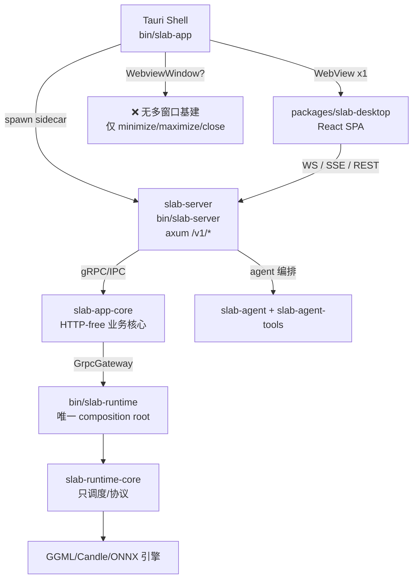
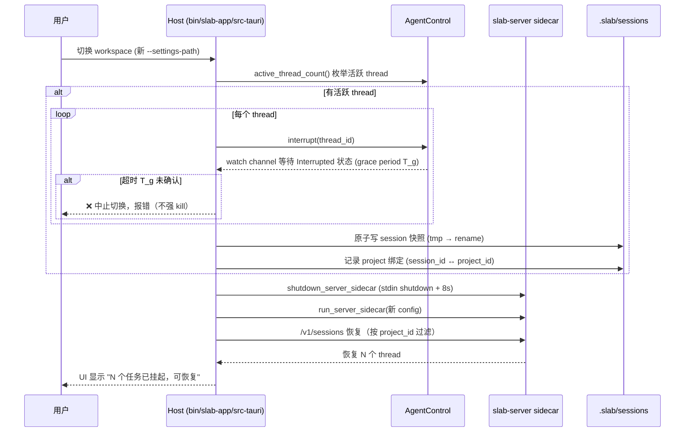
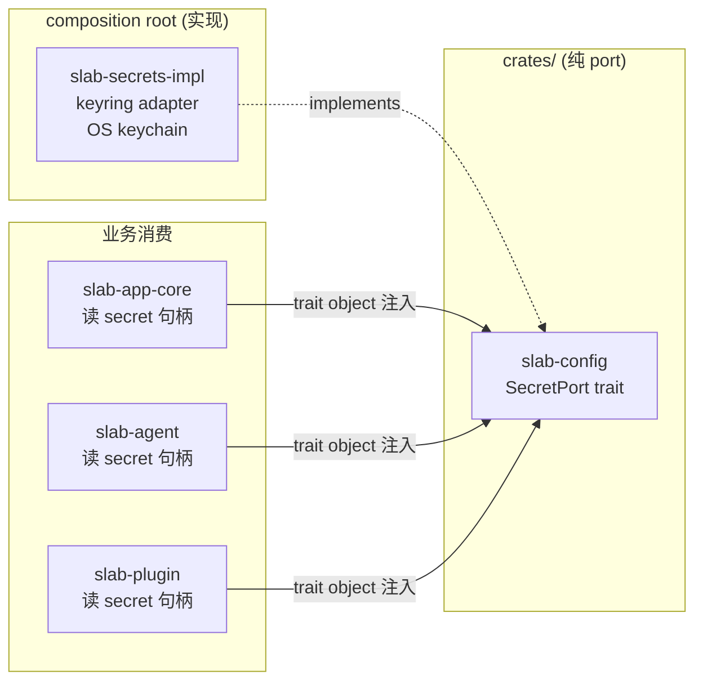
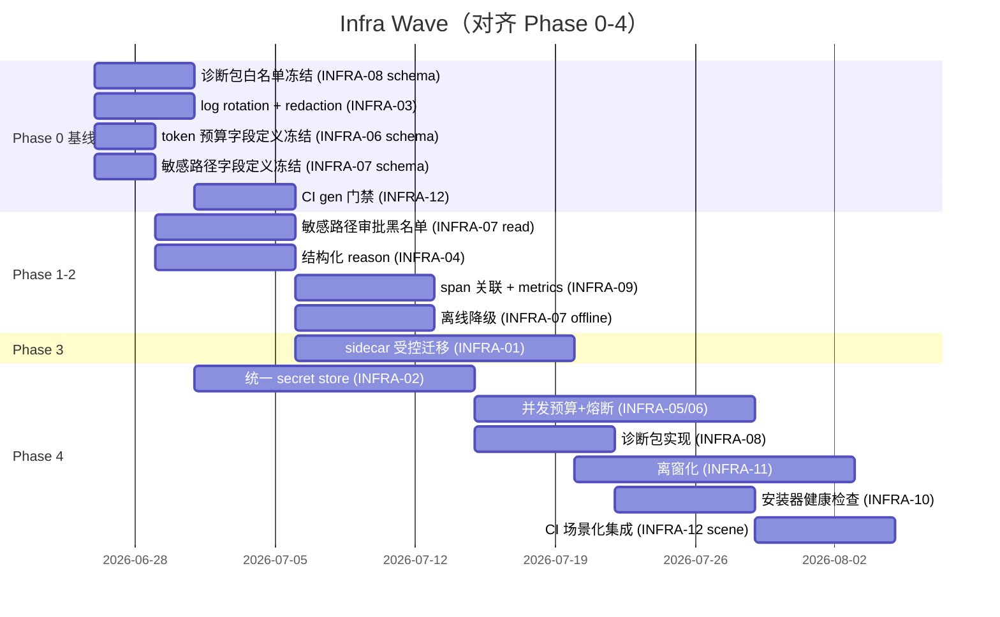

# Slab Next 基础设施建设 Infra 工程 TD

> 日期：2026-06-26
> 性质：Infrastructure 工程技术决策文档（TD）
> 依据：以现有源码为准（关键事实已交叉验证），遵守 [AGENTS.md](AGENTS.md) 边界红线，吸收会议结论 ADR-005/012/013/014 及红队 must_add/must_cut
> 配套文档：[00-meeting-conclusions](00-meeting-conclusions.md)、[01-product-design](01-product-design.md)、[04-backend-td](04-backend-td.md)、[04-backend-td](04-backend-td.md)、[03-frontend-td](03-frontend-td.md)

---

## 0. 执行摘要

本 TD 聚焦 Slab Next 在统一入口（AgentShell）+ Agent 编排增强 + 插件 a2u + workspace 项目化大重构下的**隐藏地基**：进程模型与分发安全、sidecar 生命周期与任务恢复一致性、统一 secret store、可观测性、资源治理、安装器/CI 门。这些是北极星"本地优先 + 隐线可用 + 一个简单入口"能否成立的工程前提。

**核心结论一句话**：统一入口的所有产品层创新（a2u 派发、Plan Mode、循环兜底、插件能力注入）都依赖四个 Infra 地基同时修复——① 进程/分发模型（P0 不破单窗，离窗化 P2 带 capability 审计）；② sidecar 切换的任务一致性（interrupt grace period + session 快照原子性 + session↔project 一对一绑定）；③ 统一 secret store（实现落 host/composition root，crates 只放纯 port）；④ 可观测性与资源治理（诊断包白名单、log rotation、并发预算可配置 + 背压降级）。

**关键代码事实（已交叉验证）**：

| 事实 | 证据 |
|---|---|
| sidecar shutdown = stdin `shutdown` + 8s 超时 + `child.kill()` | [sidecar.rs:45-57](bin/slab-app/src-tauri/src/setup/sidecar.rs#L45)、`SERVER_SHUTDOWN_TIMEOUT=8s` [sidecar.rs:11](bin/slab-app/src-tauri/src/setup/sidecar.rs#L11) |
| sidecar 启动参数 7 个全部 `Option`、运行中切换必然杀进程重拉 | [sidecar.rs:75-117](bin/slab-app/src-tauri/src/setup/sidecar.rs#L75) |
| 并发硬编码 `max_threads:32/max_depth:4` 无降级 | [bootstrap.rs:168](crates/slab-app-core/src/infra/agent/bootstrap.rs#L168) |
| `interrupt`（保留线程，[:381](crates/slab-agent/src/control.rs#L381)）与 `shutdown`（终态，[:357](crates/slab-agent/src/control.rs#L357)）已解耦 | [control.rs:357-413](crates/slab-agent/src/control.rs#L357) |
| `active_thread_count()` 已存在，是切换前枚举活跃线程的现成能力 | [control.rs:415](crates/slab-agent/src/control.rs#L415) |
| `update_thread_status` 已支持 `Option<&str> reason` 字段——无需新增 enum 变体即可承载结构化终止理由 | [port.rs:232](crates/slab-agent/src/port.rs#L232)、[port.rs:32](crates/slab-agent/src/port.rs#L32) `finish_reason` |
| admin_api_token 明文落盘 | [app_config.rs:81](crates/slab-config/src/app_config.rs#L81)、[descriptor.rs:424](crates/slab-config/src/descriptor.rs#L424) |
| pmid secret 占位符机制仅保护配置 API 往返（redact/restore），不保护日志/落盘存储 | [pmid_service.rs:105-109](crates/slab-config/src/pmid_service.rs#L105)、[:1151](crates/slab-config/src/pmid_service.rs#L1151) `fn secret()` |
| slab-server.log 无 rotation，测试断言里已 919MB | [app_home.rs:27](crates/slab-utils/src/app_home.rs#L27) `server_log_file()` 单文件、[assistant-markdown.test.tsx:262](packages/slab-desktop/src/pages/assistant/components/__tests__/assistant-markdown.test.tsx#L262) `919059921` bytes |
| `process_supervisor` 已存在（plugin_runtime / runtime 多处） | [crates/slab-app-core/src/infra/runtime/process.rs](crates/slab-app-core/src/infra/runtime/process.rs)、[crates/slab-app-core/src/infra/plugin_runtime/process.rs](crates/slab-app-core/src/infra/plugin_runtime/process.rs) |
| `/v1/tasks` 已有 list/get/result/cancel/restart 5 路由 | [tasks/handler.rs:34-38](bin/slab-server/src/api/v1/tasks/handler.rs#L34) |
| `/v1/sessions` 已有 list/get/delete/update/messages | [session/handler.rs:33-35](bin/slab-server/src/api/v1/session/handler.rs#L33) |

---

## 1. 现状评估（As-Is）

### 1.1 进程模型与窗口

- **单窗口**：全仓只有 [window-controls.tsx](packages/slab-desktop/src/layouts/window-controls.tsx) 的 `getCurrentWindow()`，无 `WebviewWindow`/`createWindow`。
- **插件 WebView**：内嵌于 [plugin-webview-page.tsx](packages/slab-desktop/src/pages/plugins/components/plugin-webview-page.tsx)，`allow-scripts allow-forms` sandbox，非浮窗。
- **CSP/capabilities**：由 Tauri 静态配置（`src-tauri/capabilities/`、`tauri.conf.json`），AGENTS.md 红线不可绕过。

### 1.2 sidecar 生命周期（脆弱点）

| 维度 | 现状 | 风险 |
|---|---|---|
| 启动 | [sidecar.rs:75-117](bin/slab-app/src-tauri/src/setup/sidecar.rs#L75) 7 个 `--settings-path`/`--database-url`/`--model-config-dir`/`--session-state-dir`/`--plugins-dir` 全 `Option` | 启动期解析，运行中切换 workspace 必然杀进程重拉 |
| 停止 | [sidecar.rs:45-57](bin/slab-app/src-tauri/src/setup/sidecar.rs#L45) `write(b"shutdown\n")` → `sleep 8s` → `child.kill()` | kill 是兜底；8s 内未优雅退出则强杀 |
| 切换 workspace | 无受控迁移路径 | Agent thread 随进程消失，store 仍记 `Running` → **假 running 线程**（SRE 痛点） |
| 任务恢复 | `/v1/sessions` 已支持 list/get/update，但与 sidecar 重启无协调 | 重启后无法知道"哪些 thread 是被切换中断的、哪些是真完成" |

### 1.3 secret 存储

| secret 类型 | 现状存储 | 问题 |
|---|---|---|
| `admin_api_token` | [app_config.rs:81](crates/slab-config/src/app_config.rs#L81) 明文 `settings.json` | 落盘明文，`.slab/settings.json` 作 workspace overlay 会被 git/同步工具带走 |
| `server.admin.token` | [descriptor.rs:424](crates/slab-config/src/descriptor.rs#L424) 明文 | 同上 |
| provider key（LLM API key） | settings.json 明文 | 同上，且是隐私优先红线的最大张力 |
| MCP env / plugin secret | 走 plugin manifest/env，明文 | 插件可信度低于 host，明文更危险 |
| 配置 API 往返保护 | [pmid_service.rs:105-109](crates/slab-config/src/pmid_service.rs#L105) redact/restore 占位符 | **仅保护 API 往返**（读时 redact、写时 restore），不保护日志、不保护落盘存储 |

### 1.4 可观测性

| 维度 | 现状 | 缺口 |
|---|---|---|
| agent trace | `slab-agent-tracing` crate 已存在，trace_dir 落盘 | subagent span 无 parent_span_id 跨进程透传关联 |
| metrics | 无统一 metrics event | 无 token/turn/工具调用次数预算看板 |
| 循环检测埋点 | 无 | 循环 guard 命中需结构化事件 |
| 日志 rotation | [app_home.rs:27](crates/slab-utils/src/app_home.rs#L27) 单文件 `slab-server.log`，无 appender | 测试断言 919MB，生产长期累积 |
| 诊断包 | 无 `export_diagnostics` 命令 | 排障靠手动捞日志，存在泄漏 .slab/slab.db/sessions 风险 |

### 1.5 资源治理

| 维度 | 现状 | 缺口 |
|---|---|---|
| 并发上限 | [bootstrap.rs:168](crates/slab-app-core/src/infra/agent/bootstrap.rs#L168) `max_threads:32/max_depth:4` 硬编码 | 无降级、无 FIFO 排队、无内存熔断；16GB 机 32 并发易 OOM |
| token 预算 | 无 per-thread 硬预算 | runaway agent 可烧光 provider 配额（GLM 本机 ~10-14 并发即 429） |
| 内存监控 | `process_supervisor` 已存在（[runtime/process.rs](crates/slab-app-core/src/infra/runtime/process.rs)、[plugin_runtime/process.rs](crates/slab-app-core/src/infra/plugin_runtime/process.rs)） | 未暴露 per-process 内存给 agent runtime 做熔断决策 |

---

## 2. 目标状态（To-Be）

### 2.1 进程/窗口/CSP/capabilities 模型

**决策 I-01（多窗口进程模型，P0 不破单窗）**：

| 阶段 | 决策 | 边界 |
|---|---|---|
| P0-2 | 主窗内 surface 状态机（替换 `<Outlet/>` 单挂载，**一次只开一个面**，分屏/浮窗推迟） | 全落 `packages/slab-desktop`，host 不新增多窗口基建 |
| P2（离窗化） | Tauri `WebviewWindow` 离窗化（`mountMode:'popout'`）按需推进 | 落 `bin/slab-app/src-tauri`；**每个 surface 一个独立 label，禁止通配前缀** |

> **红队边界红线（caller-id-from-label）**：会议结论曾写 `surface-window-<surfaceId>` 通配 label，红队判定违反 [AGENTS.md](AGENTS.md) "Plugin WebView commands must derive the caller plugin id from the WebView label"。本 TD 钉死：**离窗化每个 surface 独立 label（`surface-window-{surface_id}` 单值，非通配），capability 逐个声明**，否则 caller id 不可靠推导。capability 审计由 SRE+安全评审签字后才能进 P2。

**决策 I-02（CSP/capabilities 守恒）**：

- 所有 a2u surface / 插件动态面渲染**必须遵守 Tauri CSP/capabilities/permissions/sidecar 沙箱**，不用任意 origin inline 内容（Claude Artifacts iOS 渲染失败教训）。
- 插件 WebView 继续走 [plugin-webview-page.tsx](packages/slab-desktop/src/pages/plugins/components/plugin-webview-page.tsx) sandbox（`allow-scripts allow-forms`），不引入 Module Federation 作默认插件模型（AGENTS.md 红线）。

### 2.2 workspace sidecar 生命周期（受控迁移）

**决策 I-03（workspace 切换 = 优雅重启 + 任务受控迁移）**：吸收 ADR-012 + 红队"interrupt grace period + session 快照原子性"must_add。

**关键约束（钉死，不留开放问题）**：

1. **session ↔ project 一对一绑定**（红队边界红线）：session 快照写入时必须记录 `project_id`（workspace root 派生），新 sidecar 恢复时**按 project_id 过滤**，禁止跨 workspace 恢复旧 thread——否则违反 [workspace-mode-design.md](docs/development/workspace-mode-design.md) "每个 workspace 独立 .slab/slab.db/sessions/models" 沙箱边界。
2. **interrupt grace period + 快照原子性**（红队 must_add）：interrupt 后**等 watch channel 确认 `Interrupted` 终态**才写快照（不依赖异步 cancellation 的下一轮检查），超时 T_g（建议 2s）中止切换，**绝不静默 kill**。快照写 `tmp` 文件 + `rename` 保证原子性。
3. **任一步失败中止切换**：枚举/interrupt/快照/shutdown 任一失败 → 回滚 UI、保留原 sidecar、报错给用户。
4. **不扩 `/v1/*` 新 API 树**：恢复复用 `/v1/sessions`（[session/handler.rs:33](bin/slab-server/src/api/v1/session/handler.rs#L33)），任务状态对齐 `/v1/tasks`（[tasks/handler.rs:34](bin/slab-server/src/api/v1/tasks/handler.rs#L34)）的 list/cancel/restart。修改全落 `bin/slab-app/src-tauri` host 层 + 复用 [control.rs:381](crates/slab-agent/src/control.rs#L381) `interrupt`。

### 2.3 任务恢复/中断一致性（不留假 running）

**决策 I-04（假完成修复走 reason 字段，零 migration）**：吸收 ADR-005 但采纳红队可行性修正——**复用现有 `update_thread_status` 的 `Option<&str> reason` 字段（[port.rs:232](crates/slab-agent/src/port.rs#L232)），不新增 `ThreadStatus` enum 变体，零 SQLx migration**。

> 红队判定：`ThreadStatus` 是跨层枚举（slab-types→state.rs→store→前端→WS），新增 `MaxTurnsReached` 变体会让所有 `match ThreadStatus` 分支漏一处即 panic。复用 `status + reason` 字符串字段（`Completed` + `reason="max_turns_reached"`）零迁移、零分支爆炸。

**结构化终止理由字典**（写 tracing + session，前端据 reason 展示）：

| reason 字符串 | 触发 | 终态 status | 可续跑 |
|---|---|---|---|
| `completed` | task.complete 通过 + plan 全节点 completed + verify 通过 | Completed | - |
| `max_turns_reached` | for-turn 循环正常退出（[thread.rs:248-451](crates/slab-agent/src/thread.rs#L248)） | Interrupted（保留线程） | ✅ |
| `repetition_detected` | 循环 guard 命中 | Interrupted | ✅ |
| `budget_exhausted` | per-thread token 硬预算耗尽（红队 must_add） | Interrupted | ✅（提预算后续跑） |
| `interrupted` | 用户/control.interrupt | Interrupted | ✅ |
| `workspace_switch` | sidecar 受控迁移 | Interrupted | ✅（新 sidecar 恢复） |
| `errored` | last_error | Errored | 视错误 |
| `shutdown` | control.shutdown | Shutdown | ❌（终态） |

**对齐 `/v1/tasks`**：`/v1/tasks` 已有 `cancel`/`restart`（[tasks/handler.rs:37-38](bin/slab-server/src/api/v1/tasks/handler.rs#L37)），Interrupted 类（含 max_turns/repetition/budget/switch）走 `restart` 续跑语义，Shutdown 走 `cancel` 终态。前端据 reason 文案区分"已达轮次上限，可续跑" vs "任务完成"。

### 2.4 统一 secret store

**决策 I-05（统一不可回显存储，实现落 composition root）**：吸收 ADR-014 + 红队边界红线——**secret store 实现必须在 `bin/slab-app/src-tauri` 或 `bin/slab-runtime`（composition root），`crates/` 只放纯 `SecretPort` trait（port）**。

> **红队边界红线**：会议结论曾建议"新 `crates/slab-secrets`（keyring）"，红队判定 keyring 跨平台二进制 + OS 集成属运行时副作用，放 `crates/` 让任意 crate 可依赖，最终会被 slab-agent-tools/slab-plugin 反向引入，破坏端口适配器分层（AGENTS.md: slab-app-core HTTP-free、slab-runtime-core 只调度）。
>
> **本 TD 钉死**：`crates/slab-config` 只新增 `SecretPort` trait（纯 port，无 OS 依赖）；keyring adapter 实现落 `bin/slab-app/src-tauri`（桌面 host）或 `bin/slab-runtime`（无头 composition root）；消费方（app-core/agent/plugin）只依赖 trait，由 composition root 注入。**配置文件只存 keychain 引用句柄**（如 `secret://provider/openai`），不存明文。

**secret 类型映射**：

| secret 类型 | 现状 | To-Be keychain key | 配置文件残留 |
|---|---|---|---|
| `admin_api_token`（[app_config.rs:81](crates/slab-config/src/app_config.rs#L81)） | 明文 | `secret://admin/api_token` | 句柄 |
| provider LLM key | 明文 | `secret://provider/{provider_id}` | 句柄 |
| `server.admin.token`（[descriptor.rs:424](crates/slab-config/src/descriptor.rs#L424)） | 明文 | `secret://server/admin_token` | 句柄 |
| MCP env secret | 插件 manifest 明文 | `secret://mcp/{server}/{key}` | 句柄 |
| plugin secret | 插件 manifest 明文 | `secret://plugin/{plugin_id}/{key}` | 句柄 |

**不可回显**：读 secret 走 `SecretPort::resolve(handle) -> Zeroizing<String>`，日志/诊断包/trace 一律 redact（匹配 `sk-`/`Bearer`/`token`/`api_key`/`secret://`），pmid secret 占位符（[pmid_service.rs:105](crates/slab-config/src/pmid_service.rs#L105)）继续保护配置 API 往返。

### 2.5 可观测性

**决策 I-06（agent trace/metrics + 循环埋点 + subagent span 关联）**：

| 维度 | To-Be | 归属 |
|---|---|---|
| subagent span 关联 | spawn_child 时透传 `parent_span_id`，trace JSONL 落 `trace_dir` | `crates/slab-agent`（spawn_inner）+ `crates/slab-agent-tracing` |
| 循环检测埋点 | guard 命中 emit `LoopDetected { thread_id, signature_hash, hit_count }` event | `crates/slab-agent`（循环 guard，内联 thread.rs 需架构签字） |
| metrics event | `MetricsEvent { thread_id, turn_index, tokens_in, tokens_out, tool_calls }` 写 session + tracing | `crates/slab-agent-tracing` |
| 预算看板（三重） | token / turn / 工具调用次数，超阈值触发 `BudgetExhausted`（红队 must_add per-thread token 硬预算） | `crates/slab-agent`（thread.rs 预算检查） |
| log rotation | `tracing-appender` rolling 50MB×5 份 | `bin/slab-server`（启动初始化）+ `crates/slab-utils`（路径） |
| secret redaction filter | tracing layer 匹配 secret 模式掩码 | `crates/slab-agent-tracing` / 新 redaction layer |

### 2.6 资源治理（并发/预算/限流/OOM）

**决策 I-07（并发预算可配置 + 背压降级）**：吸收 ADR-013，对齐现有 `32/4`。

| 维度 | To-Be | 现状基线 |
|---|---|---|
| 上限可配置 | settings 新增 `agent.runtime.limits` 域（`gen:schemas`） | [bootstrap.rs:168](crates/slab-app-core/src/infra/agent/bootstrap.rs#L168) 硬编码 32/4 |
| 软阈值 FIFO | 超 16（可配）新 spawn 进 FIFO 队列，队列语义暴露前端 | 无排队，超限直接拒 |
| 内存熔断 | `process_supervisor`（已存在）暴露 per-process RSS，超 70% 物理内存停止新 spawn subagent，通知主 agent replan | 未接入 agent runtime |
| 冷却窗口 | 降级→升级带冷却窗口防振荡（建议 30s） | 无 |
| per-thread token 硬预算 | LLM 调用累计 token 超 thread 预算触发 `BudgetExhausted`（红队 must_add） | 无 |
| GLM workflow 限流 | 本机 ~10-14 并发 429（MEMORY 索引），并发上限默认对齐此约束，非云端 32 | 无 |

> **红队可行性修正**：会议结论 Phase 4 列"并行 delegate_subagent(tasks: Vec) + 按复杂度缩放（事实 1/对比 2-4/研究 8-10）"，红队判定与 non_goals"不默认就上多 agent"+ GLM ~10-14 并发 429 直接冲突。**本 TD 移除并行 subagent（must_cut）**，Phase 4 仅保留"单 subagent 同步委派 + 预算看板 + 限流"，并发预算子系统单独成 Phase 4 主线。

**敏感路径审批黑名单（红队 must_add I-08）**：覆盖 ADR-008 的 read 类默认 allow——`read_file`/`grep`/`list_dir` 命中 `~/.ssh`、`.env`、`*credentials*`、`*token*`、`*.pem`、`.slab/slab.db` 时强制 `ask`，守隐私优先红线。

**离线降级模式（红队 must_add I-09）**：agent 启动探测 provider 可达性，离线时自动收窄工具集（禁 `web_search`/外部 MCP/云端模型），UI 标注"离线模式"。这是北极星"离线可用"的硬要求。

### 2.7 诊断包（host-only）

**决策 I-10（诊断包字段白名单 + host-only）**：吸收 ADR-014。

- **归属**：`export_diagnostics` 是 **host-only Tauri command**（落 `bin/slab-app/src-tauri`），**不扩 `/v1/*` 新 API 树**（AGENTS.md 红线）。
- **白名单先行**（Phase 0 SRE+安全签字冻结，即使实现推迟）：

| ✅ 包含 | ❌ 排除 |
|---|---|
| 版本/git/OS | `slab.db` 全量 |
| sidecar 启动参数（路径不显示内容） | sessions 全量 messages 原文 |
| log 末尾 N KB（已 redact） | `admin_api_token`/provider key 明文 |
| agent thread 统计（status/turn_index/depth/reason，**不含 messages 原文**） | trace 中 args 原文 |
| 失败工具调用摘要（tool_name + error 字符串，**不含 args 原文**） | workspace 内用户代码文件内容 |
| 资源快照（RSS/并发数/token 累计） | `.slab/sessions` 全量 |
| 活跃 plugin/模型清单（仅 id，不含配置 secret 句柄明文） | secret 句柄对应的实际值 |

> 红线："比不做诊断包更危险"的打包方式（含 db/sessions/args 原文）一票否决。

### 2.8 安装器/分发影响

**决策 I-11（安装器健康检查 + 跨平台差异表）**：

| 平台 | 分发物 | 健康检查 | 已知差异 |
|---|---|---|---|
| Windows | `.msi`/`exe`（`build:windows-installer`） | sidecar spawn 降级提示 + `bundled_lib_dir`（[sidecar.rs:64](bin/slab-app/src-tauri/src/setup/sidecar.rs#L64)）完整性 | path 含中文/空格、 Defender 拦截 sidecar |
| macOS | `.dmg` | 同上 + Gatekeeper 签名 | keychain 权限弹窗（secret store 首次访问） |
| Linux | AppImage/deb/rpm | 同上 + fuse（AppImage） | keyring backend 差异（GNOME Keyring vs KWallet vs 无） |

- **`.slab` 引导**：首次打开 workspace 自动创建 `.slab/{settings.json,workspace.json,slab.db,sessions,models}`（对齐 [workspace-mode-design.md](docs/development/workspace-mode-design.md)），安装器首次运行检查写权限。
- **诊断包字段跨平台**：OS 字段、RSS 取法（Windows `GetProcessMemoryInfo`/Linux `/proc/[pid]/status`/macOS `mach_task_basic_info`）。

### 2.9 CI/回归门

**决策 I-12（CI 门禁强制）**：

| 门 | 命令 | 触发 | 阻断 |
|---|---|---|---|
| cargo check | `cargo check --all-targets` | 每次 PR | ✅ |
| cargo test | `cargo test` | 每次 PR | ✅ |
| gen:api | `bun run gen:api`（[gen 工作流](packages/api/src/v1.d.ts)） | API shape 变 | ✅（diff 检查） |
| gen:schemas | `bun run gen:schemas` | settings schema 变（`agent.runtime.limits` 等） | ✅ |
| gen:plugin-packs | `bun run gen:plugin-packs` | plugin manifest shape 变 | ✅ |
| build:app | `bun run build:app` | 前端构建 | ✅ |
| build:windows-installer | `bun run build:windows-installer` | 发布前 | ⚠️ nightly |
| 场景化集成测试（P4） | 多窗口/并发/恢复 | Phase 4 起 | ✅ |

---

## 3. 任务分解（任务卡）

> effort：S=1-2d，M=3-5d，L=1-2w。priority：P0>Phase 0、P1>Phase 1、P2>Phase 2、P3>Phase 3、P4>Phase 4。

### INFRA-01 sidecar 受控迁移 + session↔project 绑定
- **证据**：[sidecar.rs:45-57](bin/slab-app/src-tauri/src/setup/sidecar.rs#L45)、[control.rs:381](crates/slab-agent/src/control.rs#L381)、[control.rs:415](crates/slab-agent/src/control.rs#L415)
- **方案**：host 层新增 `switch_workspace_with_migration(new_config)`：枚举 active thread → 逐个 interrupt + grace period 等 Interrupted → 原子写 session 快照（tmp+rename）记 `project_id` → shutdown → 重启 → `/v1/sessions` 按 project_id 过滤恢复。任一失败中止。
- **验收**：切换时有活跃 agent → UI 显示"N 个任务已挂起" → 切回恢复；store 无假 running；跨 workspace 不恢复旧 thread。
- **依赖**：INFRA-04（reason 字段）
- **effort/priority**：L / P3

### INFRA-02 统一 secret store（port trait + host adapter）
- **证据**：[app_config.rs:81](crates/slab-config/src/app_config.rs#L81)、[descriptor.rs:424](crates/slab-config/src/descriptor.rs#L424)、[pmid_service.rs:105](crates/slab-config/src/pmid_service.rs#L105)
- **方案**：`crates/slab-config` 新增 `SecretPort` trait（纯 port）；keyring adapter 实现落 `bin/slab-app/src-tauri`（桌面）/ `bin/slab-runtime`（无头）；配置文件改存 `secret://...` 句柄；读路径走 trait object 注入；日志 redaction filter。
- **验收**：admin_token/provider key/keychain 不在 settings.json 明文出现；日志 grep 不到明文；离线 keychain 不可用时降级提示。
- **依赖**：无（但迁移需向后兼容旧明文配置一次性 import）
- **effort/priority**：L / P4（Phase 0 先冻结 schema 字段定义）

### INFRA-03 slab-server.log rotation + secret redaction
- **证据**：[app_home.rs:27](crates/slab-utils/src/app_home.rs#L27)、[assistant-markdown.test.tsx:262](packages/slab-desktop/src/pages/assistant/components/__tests__/assistant-markdown.test.tsx#L262)
- **方案**：`bin/slab-server` 启动改 `tracing-appender` rolling 50MB×5 份；新增 redaction layer 匹配 `sk-`/`Bearer`/`token`/`api_key`/`secret://` 掩码。
- **验收**：日志单文件不超 50MB；secret 模式不出现在日志；旧 919MB 文件可清理。
- **依赖**：无
- **effort/priority**：M / P0

### INFRA-04 结构化终止 reason（零 migration）
- **证据**：[port.rs:232](crates/slab-agent/src/port.rs#L232) `update_thread_status(.., Option<&str> reason)`、[thread.rs:248-451](crates/slab-agent/src/thread.rs#L248)
- **方案**：max_turns 循环正常退出路径写 `reason="max_turns_reached"` + status=Interrupted（可续跑）；前端据 reason 文案区分。
- **验收**：长任务跑到 max_turns 显示"已达轮次上限，可续跑"+ 终止理由；store 不再标 Completed；零 migration。
- **依赖**：无
- **effort/priority**：M / P2

### INFRA-05 并发预算可配置 + FIFO + 内存熔断
- **证据**：[bootstrap.rs:168](crates/slab-app-core/src/infra/agent/bootstrap.rs#L168)、`process_supervisor`（[runtime/process.rs](crates/slab-app-core/src/infra/runtime/process.rs)）
- **方案**：`agent.runtime.limits` settings 域（`gen:schemas`）；软阈值 FIFO 队列；`process_supervisor` 暴露 RSS；超 70% 内存熔断 + 冷却窗口 30s。
- **验收**：超软阈值 spawn 进队列前端可见；OOM 阈值停止 spawn；无降级-升级振荡。
- **依赖**：INFRA-06
- **effort/priority**：L / P4

### INFRA-06 per-thread token 硬预算
- **证据**：无现成实现；[port.rs:32](crates/slab-agent/src/port.rs#L32) `finish_reason`
- **方案**：thread.rs 累计 LLM token，超 thread 预算触发 `BudgetExhausted`（reason）。
- **验收**：runaway agent 达预算中断，reason 写入，可提预算续跑。
- **依赖**：INFRA-04
- **effort/priority**：M / P4（Phase 0 先冻结字段定义）

### INFRA-07 敏感路径审批黑名单 + 离线降级
- **证据**：红队 must_add；[risk.rs](crates/slab-agent/src/risk.rs)（ToolRiskAnalyzer）
- **方案**：read 类命中 `~/.ssh`/`.env`/`*credentials*`/`*token*`/`*.pem`/`.slab/slab.db` 强制 ask；agent 启动探测 provider 可达性，离线收窄工具集。
- **验收**：read 敏感路径弹审批；离线时禁 web_search/外部 MCP 并 UI 标注。
- **依赖**：无
- **effort/priority**：M / P1（敏感路径）/ P2（离线）

### INFRA-08 诊断包 export_diagnostics（host-only）
- **证据**：ADR-014 白名单
- **方案**：host-only Tauri command，按冻结白名单打包；排除 db/sessions 原文/secret。
- **验收**：诊断包含白名单字段；不含明文 secret/db 原文；SRE+安全签字。
- **依赖**：INFRA-03（redaction）
- **effort/priority**：M / P4（Phase 0 先冻结白名单）

### INFRA-09 subagent span 关联 + metrics event
- **证据**：`slab-agent-tracing`、[control.rs spawn_inner](crates/slab-agent/src/control.rs)
- **方案**：spawn_child 透传 parent_span_id；MetricsEvent 落 tracing + session。
- **验收**：trace JSONL 含 parent_span_id 链；预算看板可读 metrics。
- **依赖**：无
- **effort/priority**：M / P2

### INFRA-10 安装器健康检查 + .slab 引导
- **方案**：首次运行检查 sidecar spawn 降级 + bundled_lib_dir 完整性 + 写权限；`.slab` 自动创建。
- **验收**：三平台首次运行健康检查通过；sidecar 失败有降级提示。
- **依赖**：无
- **effort/priority**：M / P4

### INFRA-11 Tauri 离窗化（每 surface 独立 label）
- **证据**：红队边界红线（caller-id-from-label）
- **方案**：`mountMode:'popout'`；每个 surface 独立 label `surface-window-{surface_id}`，capability 逐个声明，**禁止通配**；安全评审签字。
- **验收**：caller id 从 label 可靠推导；capability 审计通过；a11y 焦点陷阱正常。
- **依赖**：INFRA-01
- **effort/priority**：L / P4

### INFRA-12 CI 门禁（gen:* + build:* + 场景化集成）
- **方案**：CI 强制 gen:api/gen:schemas/gen:plugin-packs diff 检查；build:app/build:windows-installer；Phase 4 加多窗口/并发/恢复集成测试。
- **验收**：CI 阻断未跑 gen 的 PR；场景化测试覆盖切换/并发/恢复。
- **依赖**：无
- **effort/priority**：M / P0（gen 门）/ P4（场景化）

---

## 4. Wave / 里程碑

| Wave | 里程碑 | 关键交付 |
|---|---|---|
| Phase 0（2-3 周） | 纪律工程化 | 诊断包白名单签字、log rotation、schema 字段冻结、CI gen 门 |
| Phase 1-2（4-5 周） | 恢复一致性地基 | 结构化 reason、敏感路径黑名单、span 关联、离线降级 |
| Phase 3（4-5 周） | workspace 受控迁移 | sidecar 切换不留假 running、session↔project 绑定 |
| Phase 4（4 周） | 治理成熟 | secret store、并发预算+熔断、诊断包实现、离窗化、安装器健康检查 |

---

## 5. 风险与回滚

| 风险 | 等级 | 缓解 | 回滚 |
|---|---|---|---|
| sidecar 切换 race 导致数据丢失 | 高 | interrupt grace period + 快照 tmp+rename 原子性 + 任一失败中止 | 切换失败保留原 sidecar，不 kill |
| session 跨 workspace 恢复泄漏 | 高 | session↔project 一对一绑定，按 project_id 过滤 | 恢复前校验 project_id，不匹配拒绝 |
| secret store 落 crates/ 反向污染 | 高 | port trait 在 crates，实现落 composition root | code review 强校验 crates 不依赖 keyring |
| 离窗化通配 label 违反 caller-id-from-label | 高 | 每 surface 独立 label，禁止通配，安全评审 | 退回主窗内 surface 状态机 |
| 并发预算振荡 | 中 | 冷却窗口 30s + FIFO 排队语义暴露前端 | 回退硬编码 32/4 |
| MaxTurns enum 扩展漏 match 分支 panic | 高 | 复用 reason 字符串字段，零 enum 变体 | - |
| 循环 guard 内联 slab-agent 破纯编排 | 中 | 架构签字；guard 直接 break+stuck flag，不依赖异步 interrupt | 独立 slab-agent-loopguard crate |
| 诊断包泄漏 db/sessions/args | 高 | 白名单 SRE+安全签字，默认排除原文 | host-only + redaction filter 双保险 |
| keyring 跨平台 backend 差异（Linux 无 keyring） | 中 | 降级提示 + 备用加密文件存储（仍落 composition root） | 句柄失效时回退明文配置 + 警告 |
| GLM workflow ~10-14 并发 429 | 中 | 默认并发对齐此约束，非云端 32 | 触发限流时 FIFO 排队 |

**回滚总策略**：所有 Infra 改动以 feature flag 开关（settings `infra.*` 域），可单点回退到现状行为而不影响产品层。

---

## 6. 非目标（本 TD 不做）

- **不在 P0 引入多窗口基建**（主窗内 surface 状态机优先；离窗化 P4 按需）。
- **不扩 `/v1/*` 新 API 树**（诊断包 host-only；session 恢复复用 `/v1/sessions`；任务对齐 `/v1/tasks`）。
- **不新增 SQLx migration 承载 ThreadStatus 扩展**（复用 `status + reason` 字符串字段，零 migration）。
- **不引入 Module Federation 作默认插件模型**（继续 Tauri child WebView / iframe sandbox）。
- **不把 secret store 实现落 `crates/`**（只放 port trait）。
- **不引入通配 label 前缀**（每 surface 独立 label，守 caller-id-from-label）。
- **不默认上并行多 agent**（移除 Phase 4 并行 delegate_subagent，保留单 subagent 同步委派）。
- **不做完整 Computer Use**（截图-坐标路线违反隐私优先）。
- **不让 slab-app-core 感知多窗口/调用 keyring**（HTTP-free + 端口适配器分层）。

---

## 7. 与本计划相关的其它文档

- [00-meeting-conclusions](00-meeting-conclusions.md) — 会议结论（ADR-005/012/013/014 是本 TD 母决策）
- [01-product-design](01-product-design.md) — 产品 TD（统一入口三态语义）
- [04-backend-td](04-backend-td.md) — Agent TD（Plan Mode/循环 guard/假完成修复编排侧）
- [04-backend-td](04-backend-td.md) — 插件 TD（a2u_surface/capability 注册/sandbox）
- [03-frontend-td](03-frontend-td.md) — 桌面前端 TD（surface 状态机/a2u-dispatcher）
- [AGENTS.md](AGENTS.md) — 架构边界红线
- [docs/development/workspace-mode-design.md](docs/development/workspace-mode-design.md) — workspace 沙箱设计
- [docs/development/planning/slab-goal-plain-2026-06-12.md](docs/development/planning/slab-goal-plain-2026-12.md) — 路线图阶段 0-6

---

> **本文档已吸收**：红队 must_add（离线降级 I-09、敏感路径黑名单 I-08、per-thread token 预算 INFRA-06、session↔project 绑定 INFRA-01、interrupt grace period+快照原子性、host 静态推断 effects 由 plugin TD 承载）；已移除 must_cut（并行 delegate_subagent、通配 label）；已钉死边界归属（secret store 实现落 composition root、plugin.open 落 host 层见 plugin TD、离窗化每 surface 独立 label）。所有 As-Is 引用已交叉验证源码。
