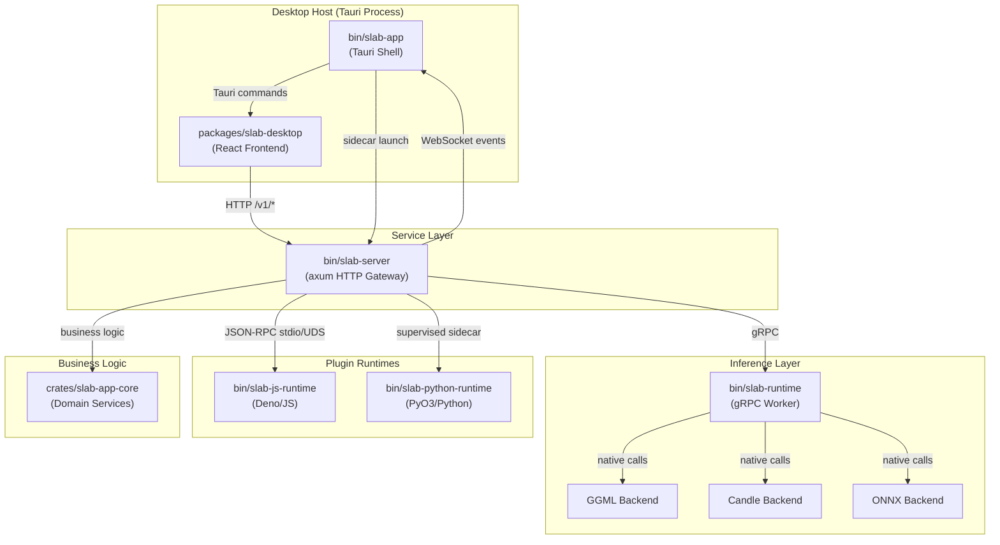
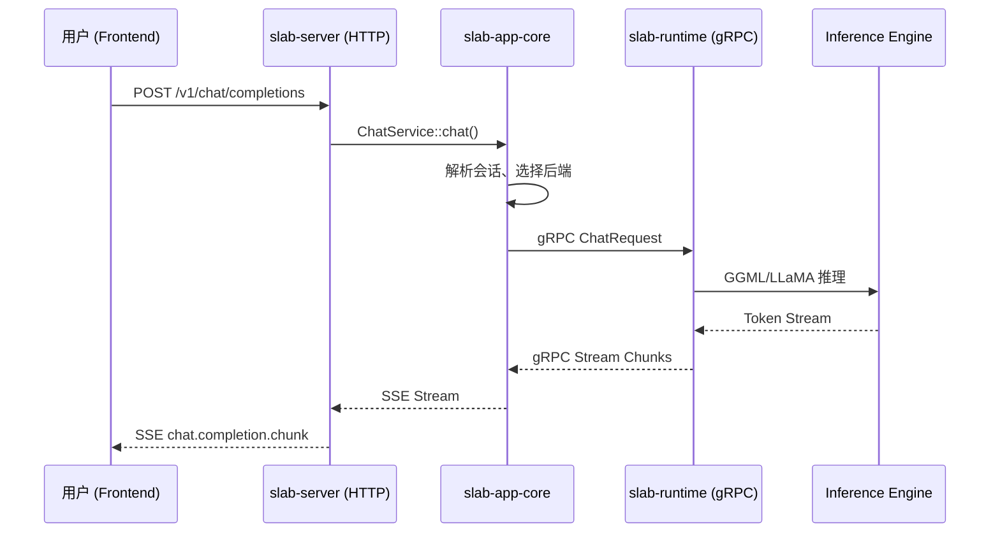
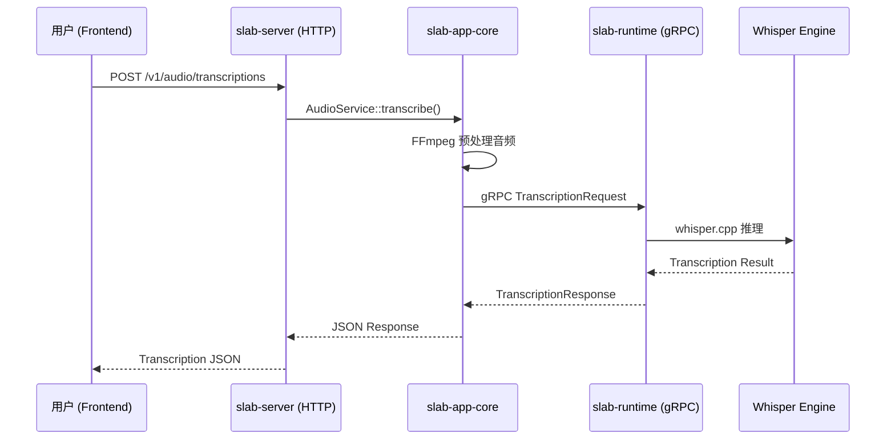
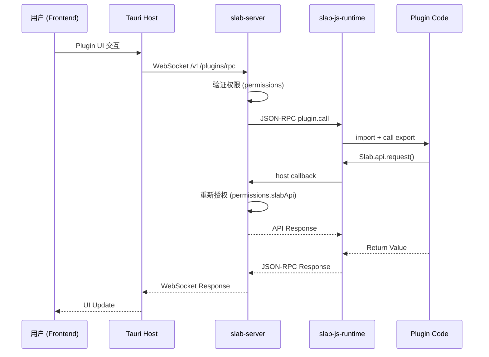
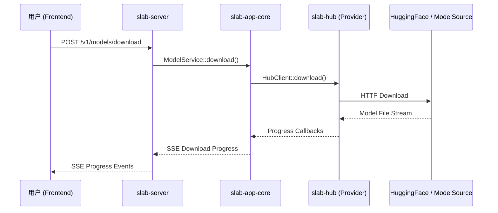

# Slab 产品功能全局地图

> **版本**: v1.0 | **状态**: Draft | **日期**: 2026-06-12

---

## 1. 产品定位与核心价值

**一句话定位**: Slab 是一款本地优先（Local-First）的 AI 桌面工作台，将 AI 对话、语音转录、图像生成、视频处理与模型管理统一整合到一个应用中，让用户无需在多个工具之间跳转即可完成全部 AI 工作流。

**核心价值主张**:

- **隐私优先、离线可用** — 所有推理在本地执行，数据不离开用户设备
- **一体化工作台** — Chat / Audio / Image / Video / Hub 五大模块在一个应用内闭环
- **插件驱动扩展** — 通过 JS / Python / WASM 三种运行时支持第三方能力扩展
- **多后端兼容** — 支持 NVIDIA CUDA、AMD HIP、Apple Silicon、Vulkan、CPU 多种硬件路径

---

## 2. 全局功能拓扑（目录清单）

基于产品功能域划分，技术文档拆分为以下独立 `.md` 文件：

| 序号 | 文件名 | 功能域 | 覆盖的代码位置 |
|:---|:---|:---|:---|
| 00 | `00_global_map.md` | 全局地图（本文档） | — |
| 01 | `01_architecture_overview.md` | 系统架构总览：进程拓扑、IPC 通信、分层原则 | 全局 |
| 02 | `02_desktop_host.md` | 桌面宿主进程（Tauri Shell） | `bin/slab-app/src-tauri/` |
| 03 | `03_http_api_server.md` | HTTP API 网关（axum） | `bin/slab-server/` |
| 04 | `04_runtime_worker.md` | gRPC 推理运行时 Worker | `bin/slab-runtime/`, `crates/slab-runtime-core/` |
| 05 | `05_business_logic_core.md` | 共享业务逻辑层 | `crates/slab-app-core/` |
| 06 | `06_inference_engines.md` | 推理引擎层（GGML / LLaMA / Candle / Whisper / Diffusion） | `crates/slab-ggml*`, `slab-llama*`, `slab-candle`, `slab-whisper*`, `slab-diffusion*` |
| 07 | `07_agent_system.md` | Agent 编排系统（控制面、工具、追踪、记忆） | `crates/slab-agent/`, `slab-agent-tools/`, `slab-agent-tracing/`, `slab-agent-memories/` |
| 08 | `08_model_hub.md` | 模型管理中心 | `crates/slab-hub/`, `crates/slab-model-pack/` |
| 09 | `09_plugin_system.md` | 插件系统（Manifest、JS/Python/WASM 运行时、UI） | `crates/slab-plugin/`, `bin/slab-js-runtime/`, `bin/slab-python-runtime/`, `plugins/` |
| 10 | `10_config_and_settings.md` | 配置与设置管理 | `crates/slab-config/`, `crates/slab-types/` |
| 11 | `11_desktop_frontend.md` | 桌面前端应用 | `packages/slab-desktop/`, `packages/slab-components/`, `packages/api/`, `packages/slab-i18n/` |
| 12 | `12_mcp_protocol.md` | MCP 协议支持 | `crates/slab-mcp/`, `crates/slab-mcp-client/`, `bin/slab-mcp-server/` |
| 13 | `13_workspace_and_lsp.md` | 工作区与语言服务器协议 | `crates/slab-app-core/` (workspace services), `plugins/web-language-servers/`, `plugins/native-language-servers/` |
| 14 | `14_media_processing.md` | 媒体处理（音频转录、视频处理、字幕、FFmpeg） | `crates/slab-subtitle/`, `crates/slab-app-core/` (ffmpeg/audio/video services) |
| 15 | `15_installation_and_distribution.md` | 安装与分发 | `bin/slab-windows-full-installer/`, `crates/slab-libfetch/` |
| 16 | `api_and_data_contract.md` | 跨模块 API 契约与数据一致性审计 | 全局 |

---

## 3. 全局核心数据流向（业务主流程）

### 3.1 进程拓扑



### 3.2 核心业务主流程

#### 流程 A: AI Chat 对话



#### 流程 B: 音频转录



#### 流程 C: 插件调用



#### 流程 D: 模型下载



### 3.3 分层架构原则

```
┌─────────────────────────────────────────────────────┐
│                  Desktop Frontend                    │
│          (React / TypeScript / Ant Design X)         │
├─────────────────────────────────────────────────────┤
│               Tauri Host (bin/slab-app)              │
│         sidecar 管理 / WebView 容器 / CSP            │
├─────────────────────────────────────────────────────┤
│             HTTP Gateway (bin/slab-server)           │
│       axum REST / WebSocket / Swagger / CORS         │
├─────────────────────────────────────────────────────┤
│           Business Logic (crates/slab-app-core)      │
│    domain services / infra / context / schemas       │
├──────────────┬──────────────────────────────────────┤
│   gRPC       │          Plugin Runtimes              │
│  Runtime     │  JS (Deno) │ Python (PyO3) │ WASM    │
│  Worker      │            │               │(Extism)  │
├──────────────┴──────────────────────────────────────┤
│            Inference Engine Layer                     │
│   GGML │ LLaMA │ Candle │ Whisper │ Diffusion        │
├─────────────────────────────────────────────────────┤
│        Shared Contracts & Configuration              │
│   slab-types │ slab-proto │ slab-config │ slab-hub   │
└─────────────────────────────────────────────────────┘
```

---

## 4. 技术栈总览

| 层级 | 技术栈 |
|:---|:---|
| Desktop Shell | Tauri v2, Rust |
| Frontend | React 19, Vite, React Router 7, Ant Design X, Tailwind CSS 4, Radix UI |
| State Management | Zustand (client), TanStack Query (server) |
| HTTP Server | axum, tokio, utoipa (OpenAPI) |
| gRPC | tonic, prost (protobuf) |
| Database | SQLite via SQLx |
| Inference | ggml (GGUF), llama.cpp, candle, whisper.cpp |
| Plugin JS | Deno (embedded) |
| Plugin Python | CPython via PyO3 |
| Plugin WASM | Extism (Wasmtime) |
| Build | Bun (JS), Cargo (Rust), NSIS (Windows installer) |
| i18n | i18next |
| Testing | Vitest, Playwright, cargo test |

---

## 5. API Surface 概览

| 路径前缀 | 域 | 说明 |
|:---|:---|:---|
| `/v1/chat/*` | Chat | AI 对话补全（SSE 流式） |
| `/v1/audio/*` | Audio | 音频转录 |
| `/v1/images/*` | Image | 图像生成 |
| `/v1/video/*` | Video | 视频处理 |
| `/v1/models/*` | Models | 模型列表、下载、管理 |
| `/v1/tasks/*` | Tasks | 后台任务队列 |
| `/v1/sessions/*` | Sessions | 会话管理 |
| `/v1/settings/*` | Settings | 应用设置 |
| `/v1/setup/*` | Setup | 初始化设置向导 |
| `/v1/system/*` | System | 系统信息 |
| `/v1/backend/*` | Backend | 推理后端管理 |
| `/v1/agent/*` | Agent | Agent 调用 |
| `/v1/ffmpeg/*` | FFmpeg | 媒体转码 |
| `/v1/subtitles/*` | Subtitles | 字幕处理 |
| `/v1/plugins/rpc` | Plugin RPC | WebSocket JSON-RPC 2.0 |
| `/v1/plugins/events` | Plugin Events | WebSocket 事件广播 |
| `/v1/workspace/lsp/*` | Workspace LSP | WebSocket LSP JSON-RPC |
| `/v1/ui-state/*` | UI State | 前端 UI 状态持久化 |

---

## 6. 阅读导航

建议按以下顺序阅读各模块文档：

1. **01_architecture_overview** — 建立全局架构认知
2. **02_desktop_host** → **03_http_api_server** → **04_runtime_worker** — 理解进程通信链路
3. **05_business_logic_core** — 掌握核心业务逻辑
4. **06_inference_engines** → **08_model_hub** — 理解推理与模型管理
5. **07_agent_system** — 理解 Agent 编排
6. **09_plugin_system** — 理解插件扩展机制
7. **10_config_and_settings** → **11_desktop_frontend** — 配置与 UI
8. **12_mcp_protocol** → **13_workspace_and_lsp** — 协议支持
9. **14_media_processing** — 媒体处理管线
10. **15_installation_and_distribution** — 分发与安装
11. **api_and_data_contract** — 跨模块契约审计（收尾）
