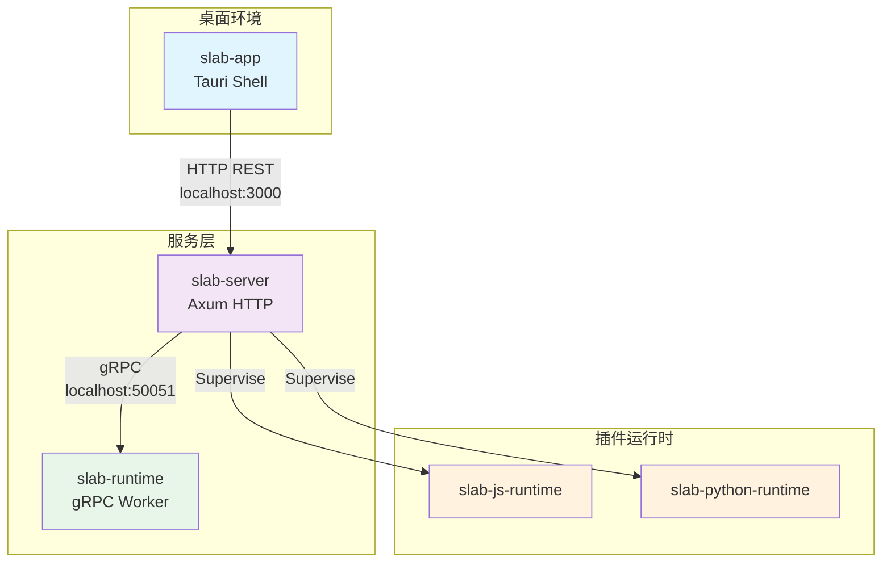
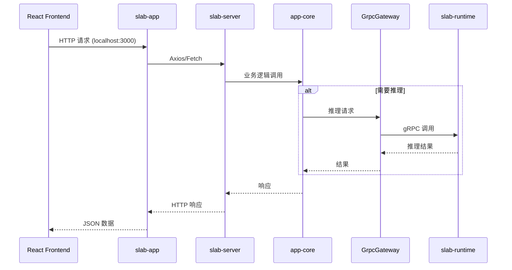
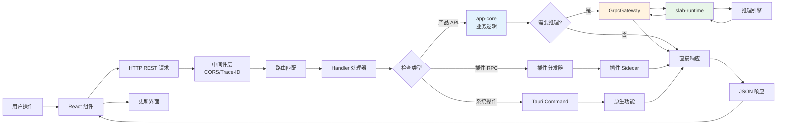
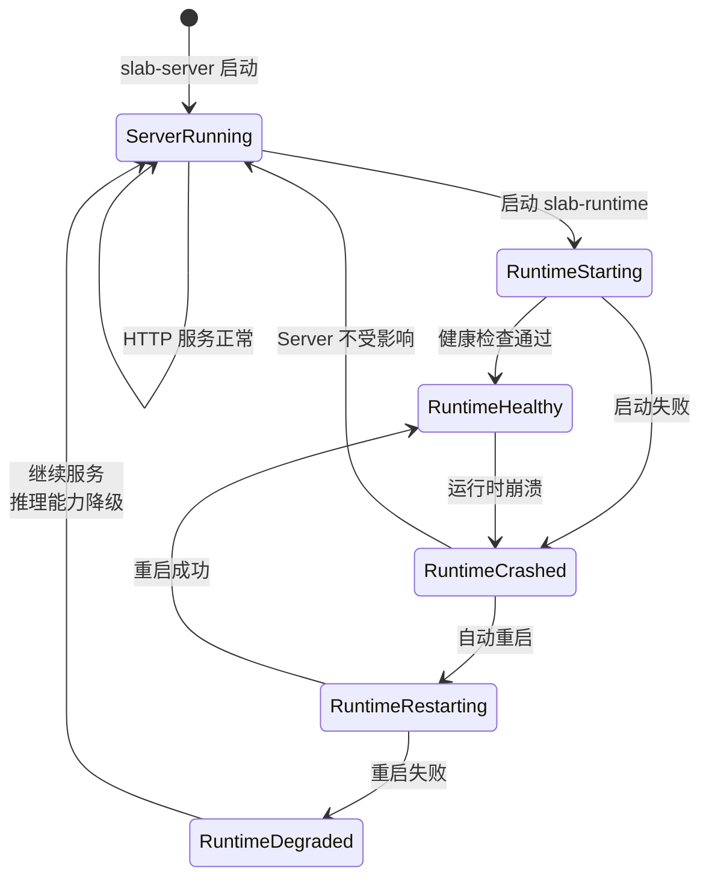

# Slab 架构总览

## 文档元数据

| 属性 | 值 |
|------|-----|
| **文件名** | `01_architecture_overview.md` |
| **版本** | 1.0.0 |
| **状态** | Production Design |
| **最后更新** | 2026-06-12 |
| **维护者** | Slab Architecture Team |
| **适用范围** | 全体开发人员、架构师、技术决策者 |

---

## 功能概述与用户故事

### 核心定位

Slab 是一个本地优先的 AI 桌面工作空间，采用 Tauri v2 + React 19 + Rust 技术栈构建。系统架构设计遵循以下核心原则：

- **本地优先**：所有核心数据和计算能力驻留在用户设备上
- **多进程隔离**：关键功能模块独立进程运行，故障不相互影响
- **类型安全**：核心业务逻辑采用 Rust 编写，确保内存安全和线程安全
- **插件化**：支持 JavaScript 和 Python 插件扩展能力
- **AI 原生**：内置多模型推理引擎，支持本地和云端推理

### 用户故事

**US-ARCH-001：本地数据主权**
> 作为一名注重隐私的用户，我希望我的所有对话、文档和 AI 模型都存储在本地，这样我的数据不会上传到云端。

**US-ARCH-002：多 AI 能力集成**
> 作为一名知识工作者，我希望在一个工作空间中使用不同的 AI 模型（文本、图像、音频），而不需要在多个工具间切换。

**US-ARCH-003：插件扩展**
> 作为一名开发者，我希望能够编写自定义插件来扩展 Slab 的功能，以便集成我的工作流工具。

**US-ARCH-004：系统稳定性**
> 作为一名用户，即使某个 AI 模型或插件崩溃，我希望整个应用不会崩溃，我能够继续使用其他功能。

---

## 用户界面与交互规范

### 进程边界

系统由以下主要进程组成：



### IPC 通信矩阵

| 通信方 | 协议 | 端口/路径 | 用途 | 数据格式 |
|--------|------|-----------|------|----------|
| slab-app → slab-server | HTTP REST | `:3000/v1/*` | 产品 API 调用 | JSON |
| slab-server → slab-runtime | gRPC | `:50051` | 推理任务调度 | Protobuf |
| slab-app → slab-server | WebSocket | `/v1/plugins/events` | 插件事件订阅 | JSON-RPC 2.0 |
| slab-app → slab-server | WebSocket | `/v1/plugins/rpc` | 插件 RPC 调用 | JSON-RPC 2.0 |
| slab-app → slab-server | WebSocket | `/v1/workspace/lsp/{lang}` | LSP 协议 | JSON-RPC 2.0 |
| Frontend → slab-app | Tauri Commands | N/A | 宿主功能 | Rust 调用 |

### 交互时序图



---

## 核心业务逻辑与流程

### 分层架构原则

系统严格遵循分层架构，每一层只能依赖下层：

```
┌─────────────────────────────────────────────────────────────┐
│                    Frontend Layer (React 19)                │
│                  用户界面、状态管理、交互逻辑                 │
└─────────────────────────────────────────────────────────────┘
                              │ HTTP REST
                              ▼
┌─────────────────────────────────────────────────────────────┐
│                   HTTP Gateway Layer (Axum)                 │
│              路由、中间件、WebSocket、OpenAPI                 │
└─────────────────────────────────────────────────────────────┘
                              │ Function Call
                              ▼
┌─────────────────────────────────────────────────────────────┐
│              Business Logic Layer (slab-app-core)           │
│              聊天、模型管理、任务调度、插件分发                │
│              【HTTP-Free，纯业务逻辑】                        │
└─────────────────────────────────────────────────────────────┘
                              │ gRPC (tonic)
                              ▼
┌─────────────────────────────────────────────────────────────┐
│               Runtime Worker Layer (slab-runtime)           │
│              推理引擎调度、资源管理、任务执行                  │
└─────────────────────────────────────────────────────────────┘
                              │ Engine Protocol
                              ▼
┌─────────────────────────────────────────────────────────────┐
│                    Engine Layer (LLM/ML)                    │
│         本地模型、云端 API、向量数据库、工具执行              │
└─────────────────────────────────────────────────────────────┘
```

### 请求生命周期



### 数据流向原则

1. **产品 API 流量**：所有面向用户的功能 API 严格走 HTTP REST 通道
2. **推理流量**：所有 AI 推理请求通过 gRPC 从 server 转发到 runtime
3. **插件流量**：插件 RPC 走 WebSocket JSON-RPC 2.0 协议
4. **宿主流量**：Tauri Commands 仅用于宿主级功能（插件运行时集成）

### 错误隔离机制



**关键隔离点**：

- **进程隔离**：Runtime 独立进程，崩溃不影响 HTTP Server
- **监督重启**：Server 通过 `tokio::process` 监督 Runtime，自动重启
- **优雅降级**：Runtime 不可用时，其他功能继续服务
- **资源边界**：Runtime 拥有独立的资源配额（GPU/内存）

### 共享契约层

系统通过共享库确保跨进程类型安全：

| 契约库 | 作用 | 位置 |
|--------|------|------|
| `slab-types` | 语义类型定义 | `crates/slab-types/` |
| `slab-proto` | gRPC Protobuf 定义 | `crates/slab-proto/` |
| `slab-config` | 配置与设置 | `crates/slab-config/` |

**契约同步原则**：

- Protobuf 变更需要同步更新所有依赖方
- 类型变更需要 semver 版本管理
- 配置迁移通过版本化 schema 处理

---

## 功能点原子级拆分

### AT-ARCH-001：进程拓扑管理

| 子功能 | 描述 | 优先级 | 复杂度 | 依赖 |
|--------|------|--------|--------|------|
| 进程注册 | 在启动时注册所有 sidecar 进程 | P0 | 低 | 无 |
| 健康检查 | 定期检查进程健康状态 | P0 | 低 | 无 |
| 自动重启 | 检测到崩溃后自动重启进程 | P0 | 中 | 健康检查 |
| 优雅关闭 | 关闭时按依赖顺序停止进程 | P1 | 中 | 进程注册 |
| 资源监控 | 监控进程 CPU/内存使用 | P2 | 中 | 无 |

### AT-ARCH-002：IPC 通信路由

| 子功能 | 描述 | 优先级 | 复杂度 | 依赖 |
|--------|------|--------|--------|------|
| HTTP 路由 | Axum 路由表定义 | P0 | 低 | 无 |
| gRPC 代理 | GrpcGateway 实现 | P0 | 中 | slab-proto |
| WebSocket 管理 | 连接管理与消息广播 | P0 | 中 | 无 |
| 协议转换 | HTTP ↔ gRPC 转换 | P0 | 中 | GrpcGateway |
| 错误传播 | 跨进程错误传递 | P0 | 中 | slab-types |

### AT-ARCH-003：分层边界守护

| 子功能 | 描述 | 优先级 | 复杂度 | 依赖 |
|--------|------|--------|--------|------|
| HTTP-Free 验证 | 确保 app-core 不含 HTTP 代码 | P0 | 低 | CI |
| gRPC-Only 验证 | 确保 runtime 仅通过 gRPC 通信 | P0 | 低 | CI |
| 依赖审计 | 定期审计层间依赖 | P1 | 低 | 无 |
| 类型检查 | 跨进程类型一致性检查 | P0 | 中 | slab-types |

### AT-ARCH-004：推理链路

| 子功能 | 描述 | 优先级 | 复杂度 | 依赖 |
|--------|------|--------|--------|------|
| 请求分发 | app-core → GrpcGateway | P0 | 低 | 无 |
| 连接池 | gRPC 连接复用 | P0 | 中 | 无 |
| 流式传输 | 支持流式推理响应 | P0 | 高 | tonic |
| 超时控制 | 推理任务超时管理 | P0 | 低 | 无 |
| 取消机制 | 推理任务取消 | P1 | 中 | 流式传输 |

### AT-ARCH-005：插件分发

| 子功能 | 描述 | 优先级 | 复杂度 | 依赖 |
|--------|------|--------|--------|------|
| 插件注册 | 插件元数据注册 | P0 | 低 | slab-config |
| RPC 路由 | JSON-RPC 2.0 消息路由 | P0 | 中 | WebSocket |
| Sidecar 启动 | 启动插件运行时 | P0 | 中 | 进程管理 |
| 事件广播 | 插件事件分发 | P0 | 中 | WebSocket |
| 权限控制 | 插件权限验证 | P1 | 高 | slab-config |

---

## 非功能性需求与技术约束

### 性能要求

| 指标 | 目标 | 测量方法 |
|------|------|----------|
| HTTP 响应时间 | P95 < 100ms | 分布式追踪 |
| gRPC 推理延迟 | P95 < 50ms（不含推理） | gRPC metrics |
| WebSocket 消息延迟 | P95 < 50ms | 客户端计时 |
| 冷启动时间 | < 3s | 端到端测量 |
| 内存占用 | Runtime < 2GB, Server < 500MB | 进程监控 |

### 安全性要求

1. **进程隔离**：每个 sidecar 进程运行在最小权限下
2. **网络安全**：所有 IPC 通信绑定 localhost，禁止外部访问
3. **类型安全**：核心逻辑使用 Rust，防止内存安全漏洞
4. **插件沙箱**：插件运行时受权限系统限制
5. **CSP 策略**：Tauri WebView 严格的内容安全策略

### 可靠性要求

1. **故障隔离**：单个组件故障不影响其他组件
2. **自动恢复**：关键进程崩溃后自动重启
3. **数据持久化**：所有用户数据本地持久化
4. **事务完整性**：关键操作支持 ACID 语义

### 可维护性要求

1. **模块化**：每个 crate 职责单一，边界清晰
2. **文档化**：所有公共 API 必须有文档注释
3. **测试覆盖**：核心业务逻辑覆盖率 > 80%
4. **可观测性**：所有关键路径有分布式追踪

### 技术约束

1. **HTTP-Free**：`slab-app-core` crate 不能包含 HTTP 相关代码
2. **gRPC-Only**：`slab-runtime` 仅通过 gRPC 接受请求
3. **单一入口**：`slab-runtime` 是唯一的 Runtime 组合根
4. **Agent 纯净性**：`slab-agent` 保持纯净，工具在 `slab-agent-tools`
5. **Host 注册**：API 适配器由 host/app-core 层注册

### 架构决策记录 (ADR)

| ADR | 决策 | 原因 | 状态 |
|-----|------|------|------|
| ADR-001 | 多进程架构 | 故障隔离、资源隔离 | 已接受 |
| ADR-002 | HTTP + gRPC 双协议 | 前端兼容性 + 推理性能 | 已接受 |
| ADR-003 | WebSocket 用于插件 | 实时性、双向通信 | 已接受 |
| ADR-004 | Rust 用于核心逻辑 | 安全性、性能 | 已接受 |
| ADR-005 | React 19 用于前端 | 生态、开发效率 | 已接受 |

---

## 附录：关键文件引用

| 组件 | 入口文件 |
|------|----------|
| slab-app | `bin/slab-app/src-tauri/src/main.rs` |
| slab-server | `bin/slab-server/src/main.rs` |
| slab-runtime | `bin/slab-runtime/src/main.rs` |
| app-core | `crates/slab-app-core/src/lib.rs` |
| runtime-core | `crates/slab-runtime-core/src/lib.rs` |
| GrpcGateway | `crates/slab-app-core/src/domain/services/chat/grpc_gateway.rs` |
| Runtime Supervisor | `crates/slab-app-core/src/domain/services/runtime/supervisor.rs` |

---

**文档变更历史**：

| 版本 | 日期 | 变更说明 | 作者 |
|------|------|----------|------|
| 1.0.0 | 2026-06-12 | 初始版本 | Architecture Team |
