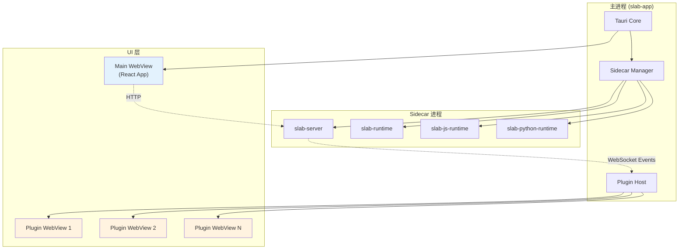
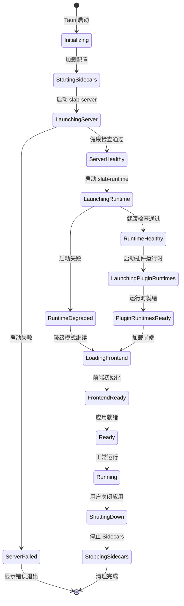
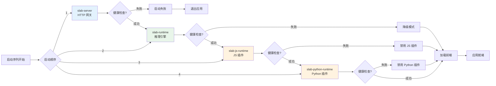
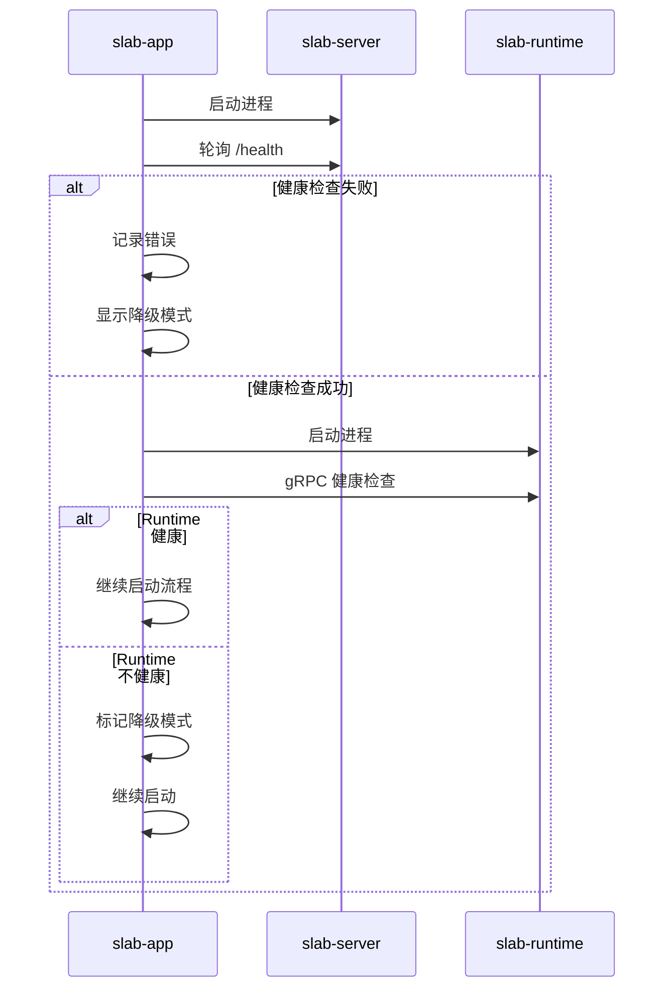
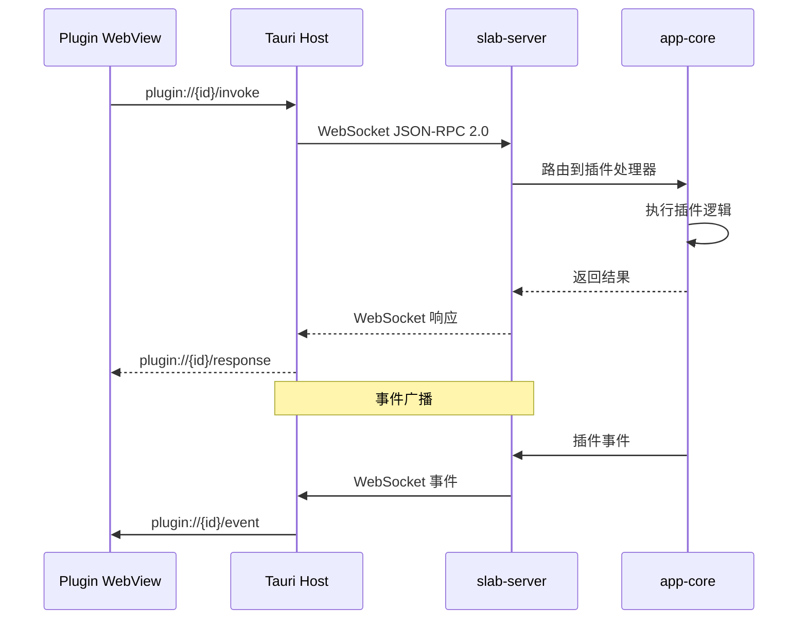
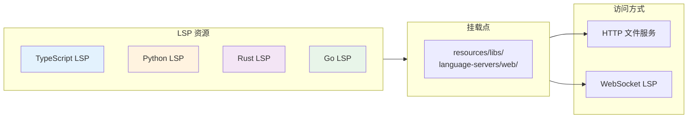
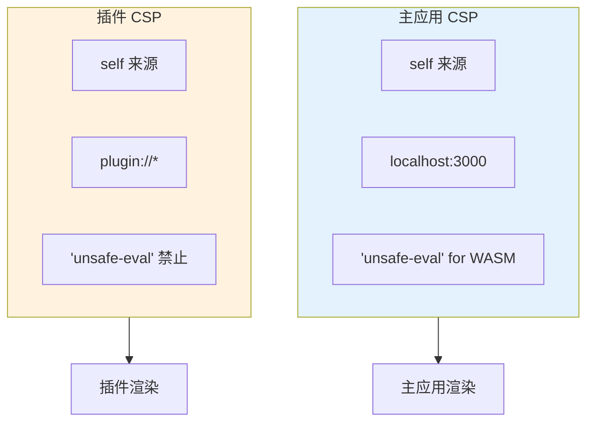

# Slab 桌面宿主 (Desktop Host)

## 文档元数据

| 属性 | 值 |
|------|-----|
| **文件名** | `02_desktop_host.md` |
| **版本** | 1.0.0 |
| **状态** | Production Design |
| **最后更新** | 2026-06-12 |
| **维护者** | Slab Desktop Team |
| **适用范围** | 桌面开发人员、DevOps、打包发布团队 |

---

## 功能概述与用户故事

### 核心定位

`slab-app` 是 Slab 应用的桌面宿主进程，基于 Tauri v2 框架构建。它负责：

- **应用封装**：将 Web 前端打包为原生桌面应用
- **Sidecar 管理**：启动和管理所有后台服务进程
- **插件 WebView**：为插件提供独立的 WebView 容器
- **LSP 资源**：内置语言服务器协议支持
- **安全边界**：通过 Tauri 能力系统控制权限

### 用户故事

**US-DESKTOP-001：一键启动**
> 作为一名用户，我希望点击应用图标后能够快速启动整个工作空间，而不需要手动启动任何后台服务。

**US-DESKTOP-002：插件界面**
> 作为一名插件开发者，我希望我的插件能够拥有独立的用户界面，并与主应用进行通信。

**US-DESKTOP-003：离线运行**
> 作为一名用户，我希望在没有网络连接的情况下仍然能够使用本地 AI 功能。

**US-DESKTOP-004：安全隔离**
> 作为一名用户，我希望插件不能访问我的系统文件，除非我明确授权。

---

## 用户界面与交互规范

### 进程架构



### 应用启动状态机



### Sidecar 启动顺序



---

## 核心业务逻辑与流程

### Sidecar 管理器

Sidecar 管理器负责所有后台进程的生命周期：

```rust
// 伪代码示意
struct SidecarManager {
    server: ChildProcess,
    runtime: ChildProcess,
    js_runtime: ChildProcess,
    python_runtime: ChildProcess,
}

impl SidecarManager {
    async fn start_all(&mut self) -> Result<StartupStatus> {
        // 1. 启动 slab-server
        self.start_server().await?;
        
        // 2. 等待健康检查
        self.wait_for_server_health().await?;
        
        // 3. 启动 slab-runtime
        self.start_runtime().await?;
        
        // 4. 启动插件运行时
        self.start_plugin_runtimes().await?;
        
        Ok(StartupStatus::AllReady)
    }
    
    async fn shutdown_gracefully(&mut self) {
        // 按相反顺序关闭
        self.stop_plugin_runtimes().await;
        self.stop_runtime().await;
        self.stop_server().await;
    }
}
```

### 健康检查机制

每个 Sidecar 进程必须提供健康检查端点：

| 进程 | 健康检查方式 | 端点/信号 | 超时 |
|------|--------------|-----------|------|
| slab-server | HTTP GET | `http://localhost:3000/health` | 30s |
| slab-runtime | gRPC Health | `localhost:50051/grpc.health.v1.Health` | 30s |
| slab-js-runtime | IPC 信号 | 进程信号 | 10s |
| slab-python-runtime | IPC 信号 | 进程信号 | 10s |



### 插件 WebView 管理

插件通过独立的 WebView 容器运行：

```rust
// 伪代码示意
struct PluginWebView {
    plugin_id: String,
    webview: Webview,
    permissions: Permissions,
}

impl PluginWebView {
    fn create(plugin: &PluginConfig) -> Result<Self> {
        let webview = WebviewBuilder::new()
            .title(plugin.name.clone())
            .url(plugin.entry_point.clone())
            .build()?;
            
        Ok(Self {
            plugin_id: plugin.id.clone(),
            webview,
            permissions: plugin.permissions.clone(),
        })
    }
    
    fn send_message(&self, msg: PluginMessage) {
        self.webview.emit(&format!("plugin://{}", self.plugin_id), msg)?;
    }
}
```

#### 插件 WebView 通信流程



### LSP 资源管理

Tauri 宿主内置 Web LSP 支持：



**LSP 路由配置**：

| 语言 | HTTP 路径 | WebSocket 路径 |
|------|-----------|----------------|
| TypeScript | `/languages/typescript/` | `/v1/workspace/lsp/typescript` |
| Python | `/languages/python/` | `/v1/workspace/lsp/python` |
| Rust | `/languages/rust/` | `/v1/workspace/lsp/rust` |
| Go | `/languages/go/` | `/v1/workspace/lsp/go` |

### 安全边界与权限控制

#### Tauri 能力系统

```json
// 伪配置示意
{
  "capabilities": [
    {
      "identifier": "plugin-host",
      "permissions": [
        "core:default",
        "plugin:register",
        "plugin:unregister"
      ]
    },
    {
      "identifier": "plugin-webview",
      "permissions": [
        "core:default",
        "webview:create",
        "webview:destroy"
      ]
    }
  ]
}
```

#### 插件权限矩阵

| 权限 | 描述 | 默认状态 | 用户可控 |
|------|------|----------|-----------|
| `fs:read` | 读取文件 | 需授权 | 是 |
| `fs:write` | 写入文件 | 需授权 | 是 |
| `network:request` | 网络请求 | 需授权 | 是 |
| `shell:execute` | 执行命令 | 禁止 | 否 |
| `ai:inference` | AI 推理 | 允许 | 是 |
| `ai:model-access` | 访问模型 | 需授权 | 是 |

### CSP (Content Security Policy)



**CSP 策略示例**：

```
# 主应用
default-src 'self'; connect-src 'self' localhost:3000 ws://localhost:3000; script-src 'self' 'unsafe-eval'

# 插件
default-src 'self'; connect-src 'self' ws://localhost:3000; script-src 'self'
```

---

## 功能点原子级拆分

### AT-DESKTOP-001：Sidecar 进程管理

| 子功能 | 描述 | 优先级 | 复杂度 | 依赖 |
|--------|------|--------|--------|------|
| 进程发现 | 查找 Sidecar 可执行文件 | P0 | 低 | 无 |
| 进程启动 | 启动 Sidecar 进程 | P0 | 低 | 进程发现 |
| 健康检查 | 验证进程健康状态 | P0 | 中 | 进程启动 |
| 重试逻辑 | 启动失败时重试 | P0 | 中 | 健康检查 |
| 优雅关闭 | 按顺序关闭进程 | P0 | 中 | 无 |
| 崩溃处理 | 处理进程崩溃 | P1 | 高 | 无 |

### AT-DESKTOP-002：插件 WebView 容器

| 子功能 | 描述 | 优先级 | 复杂度 | 依赖 |
|--------|------|--------|--------|------|
| 容器创建 | 创建 WebView 实例 | P0 | 低 | 无 |
| URL 路由 | 加载插件入口 | P0 | 低 | 容器创建 |
| 消息传递 | 双向消息通信 | P0 | 中 | 无 |
| 事件订阅 | 订阅插件事件 | P0 | 中 | 消息传递 |
| 窗口管理 | 窗口大小/位置 | P1 | 中 | 容器创建 |
| 生命周期 | 创建/销毁管理 | P0 | 中 | 无 |

### AT-DESKTOP-003：LSP 资源打包

| 子功能 | 描述 | 优先级 | 复杂度 | 依赖 |
|--------|------|--------|--------|------|
| 资源收集 | 收集 LSP 文件 | P0 | 低 | 无 |
| 资源打包 | 打包到 resources | P0 | 低 | 资源收集 |
| 路径映射 | HTTP 路径映射 | P0 | 低 | 无 |
| WebSocket 代理 | LSP WebSocket 代理 | P0 | 中 | 无 |

### AT-DESKTOP-004：安全边界

| 子功能 | 描述 | 优先级 | 复杂度 | 依赖 |
|--------|------|--------|--------|------|
| 能力定义 | 定义 Tauri 能力 | P0 | 低 | 无 |
| 权限检查 | 运行时权限检查 | P0 | 中 | 能力定义 |
| CSP 策略 | 配置 CSP 头 | P0 | 低 | 无 |
| 插件沙箱 | 隔离插件环境 | P0 | 高 | 无 |
| 审计日志 | 记录敏感操作 | P2 | 中 | 无 |

### AT-DESKTOP-005：应用生命周期

| 子功能 | 描述 | 优先级 | 复杂度 | 依赖 |
|--------|------|--------|--------|------|
| 启动序列 | 按顺序启动组件 | P0 | 中 | 无 |
| 状态管理 | 管理应用状态 | P0 | 中 | 无 |
| 退出处理 | 优雅退出处理 | P0 | 中 | 无 |
| 更新处理 | 应用更新处理 | P1 | 高 | 无 |

---

## 非功能性需求与技术约束

### 性能要求

| 指标 | 目标 | 测量方法 |
|------|------|----------|
| 应用启动时间 | < 3s (健康 Sidecar) | 端到端测量 |
| WebView 创建 | < 500ms | 客户端计时 |
| 内存占用 | < 200MB (宿主) | 进程监控 |
| 插件启动 | < 1s | 客户端计时 |

### 安全性要求

1. **进程隔离**：Sidecar 进程不能直接访问 UI 进程内存
2. **最小权限**：Sidecar 以最小权限运行
3. **网络安全**：所有 IPC 限制在 localhost
4. **插件沙箱**：插件在受限环境中运行
5. **资源限制**：插件 WebView 有资源配额

### 可靠性要求

1. **健康监控**：持续监控 Sidecar 健康状态
2. **自动恢复**：Sidecar 崩溃时自动重启
3. **错误处理**：优雅处理所有错误情况
4. **日志记录**：记录所有关键操作

### 可维护性要求

1. **模块化设计**：每个功能独立模块
2. **文档化**：所有公共 API 有文档
3. **可测试性**：核心逻辑可单元测试
4. **可调试性**：支持开发模式调试

### 技术约束

1. **Tauri v2**：基于 Tauri v2 框架
2. **Sidecar 路径**：开发模式从 `./bin/` 加载，打包从应用数据目录加载
3. **插件挂载**：开发模式从 `plugins/` 加载，打包从 `app-data/plugins/` 加载
4. **LSP 资源**：必须打包到 `resources/libs/language-servers/web/`
5. **HTTP 端口**：Sidecar 监听固定端口（server:3000, runtime:50051）

### 打包发布约束

| 平台 | 打包工具 | Sidecar 处理 | LSP 资源 |
|------|----------|--------------|----------|
| Windows | NSIS | 嵌入到安装目录 | resources/ |
| macOS | DMG/bundle | 嵌入到 .app/Contents | Resources/ |
| Linux | AppImage/deb/rpm | 嵌入到 AppImage | usr/share/ |

### 开发与生产差异

| 项目 | 开发模式 | 生产模式 |
|------|----------|----------|
| Sidecar 路径 | `./target/debug/` | 应用数据目录 |
| 插件路径 | `./plugins/` | `app-data/plugins/` |
| 前端资源 | Dev Server | 打包资源 |
| 日志级别 | Debug | Info |
| 热重载 | 支持 | 不支持 |

---

## 附录：关键配置文件

### Tauri 配置 (tauri.conf.json)

```json
{
  "build": {
    "beforeDevCommand": "npm run dev",
    "beforeBuildCommand": "npm run build",
    "devUrl": "http://localhost:1420",
    "frontendDist": "../dist"
  },
  "bundle": {
    "active": true,
    "targets": ["nsis", "dmg", "appimage"],
    "icon": ["icons/32x32.png", "icons/128x128.png", "icons/icon.icns"]
  },
  "app": {
    "withGlobalTauri": true,
    "windows": [{
      "title": "Slab",
      "width": 1200,
      "height": 800,
      "resizable": true,
      "fullscreen": false
    }]
  }
}
```

### Sidecar 路径配置

```rust
// 伪代码示意
#[derive(Debug, Clone)]
struct SidecarPaths {
    server: PathBuf,
    runtime: PathBuf,
    js_runtime: PathBuf,
    python_runtime: PathBuf,
}

impl SidecarPaths {
    fn detect() -> Result<Self> {
        if cfg!(debug_assertions) {
            // 开发模式
            Ok(Self {
                server: PathBuf::from("./target/debug/slab-server.exe"),
                runtime: PathBuf::from("./target/debug/slab-runtime.exe"),
                js_runtime: PathBuf::from("./target/debug/slab-js-runtime.exe"),
                python_runtime: PathBuf::from("./target/debug/slab-python-runtime.exe"),
            })
        } else {
            // 生产模式
            let app_data = dirs::data_local_dir()
                .ok_or_else(|| anyhow!("无法获取应用数据目录"))?;
            
            Ok(Self {
                server: app_data.join("Slab/slab-server.exe"),
                runtime: app_data.join("Slab/slab-runtime.exe"),
                js_runtime: app_data.join("Slab/slab-js-runtime.exe"),
                python_runtime: app_data.join("Slab/slab-python-runtime.exe"),
            })
        }
    }
}
```

---

**文档变更历史**：

| 版本 | 日期 | 变更说明 | 作者 |
|------|------|----------|------|
| 1.0.0 | 2026-06-12 | 初始版本 | Desktop Team |
