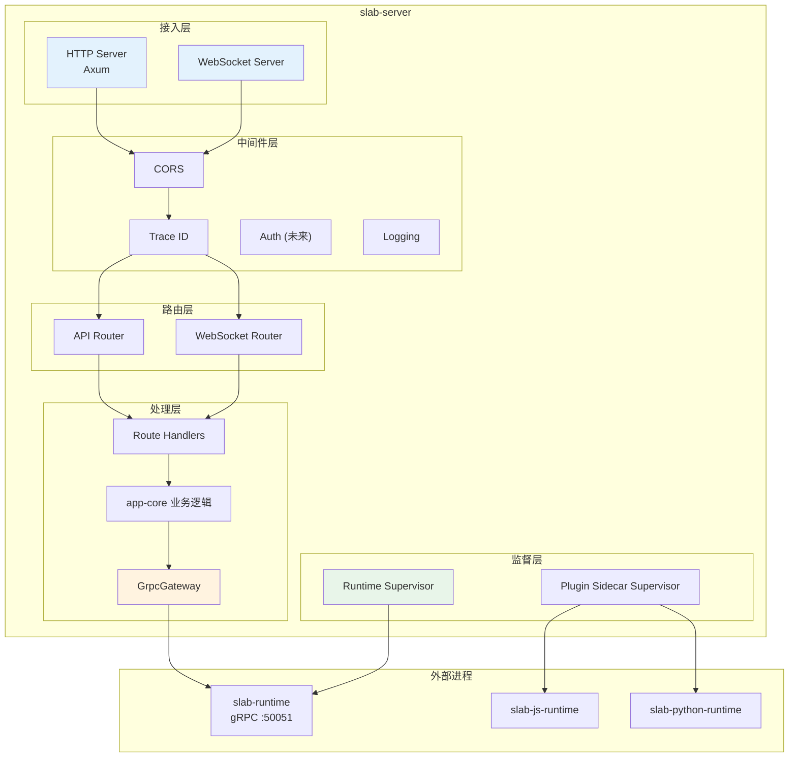
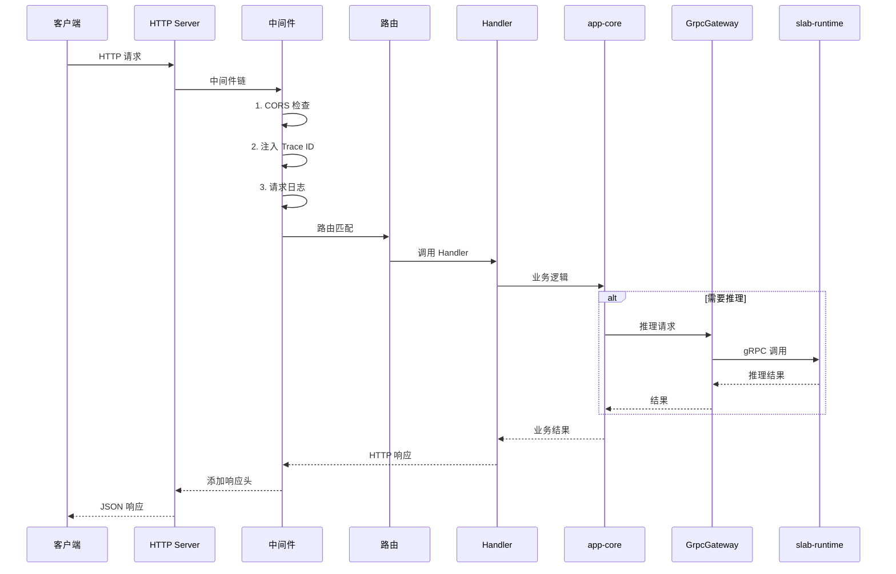
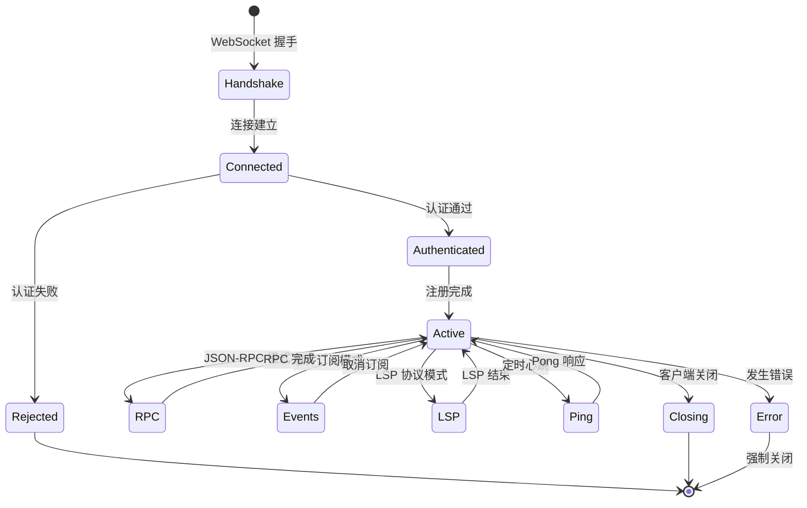
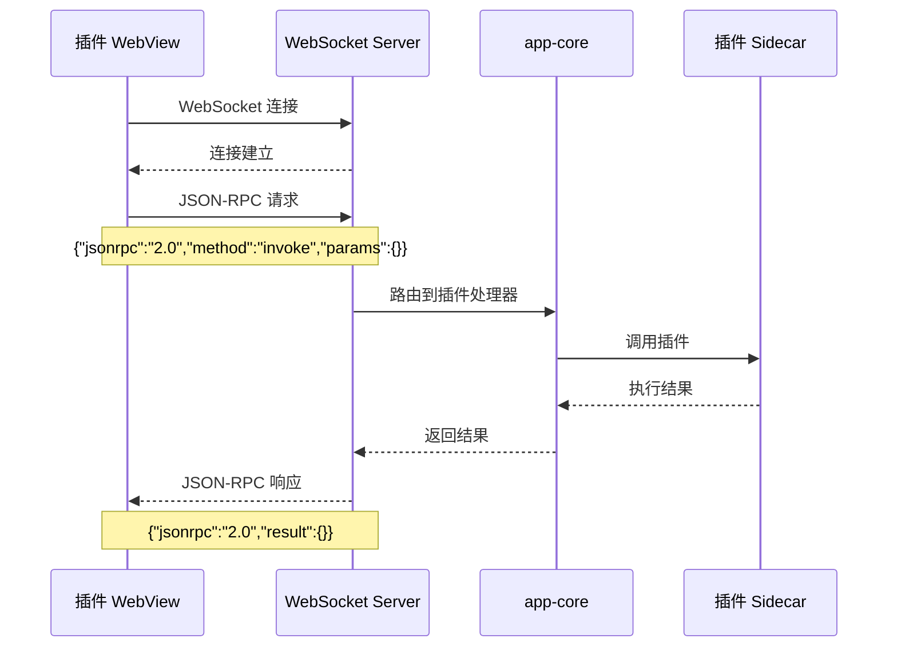
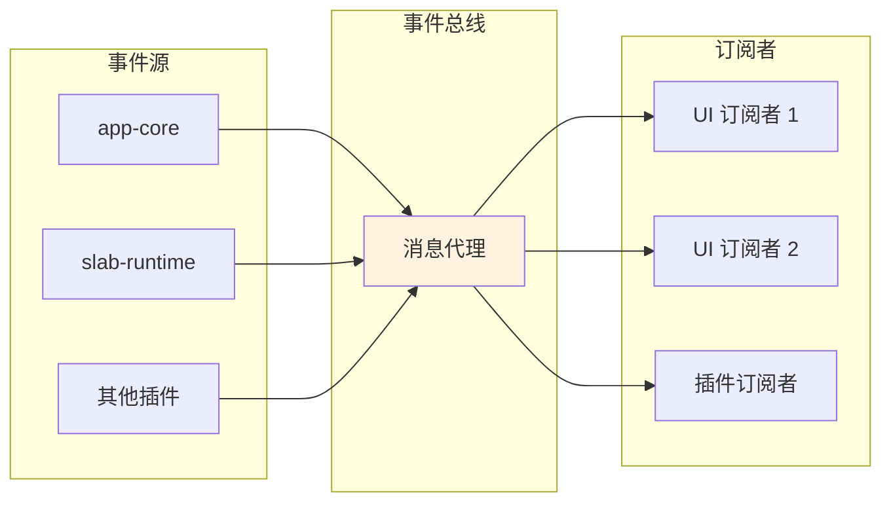
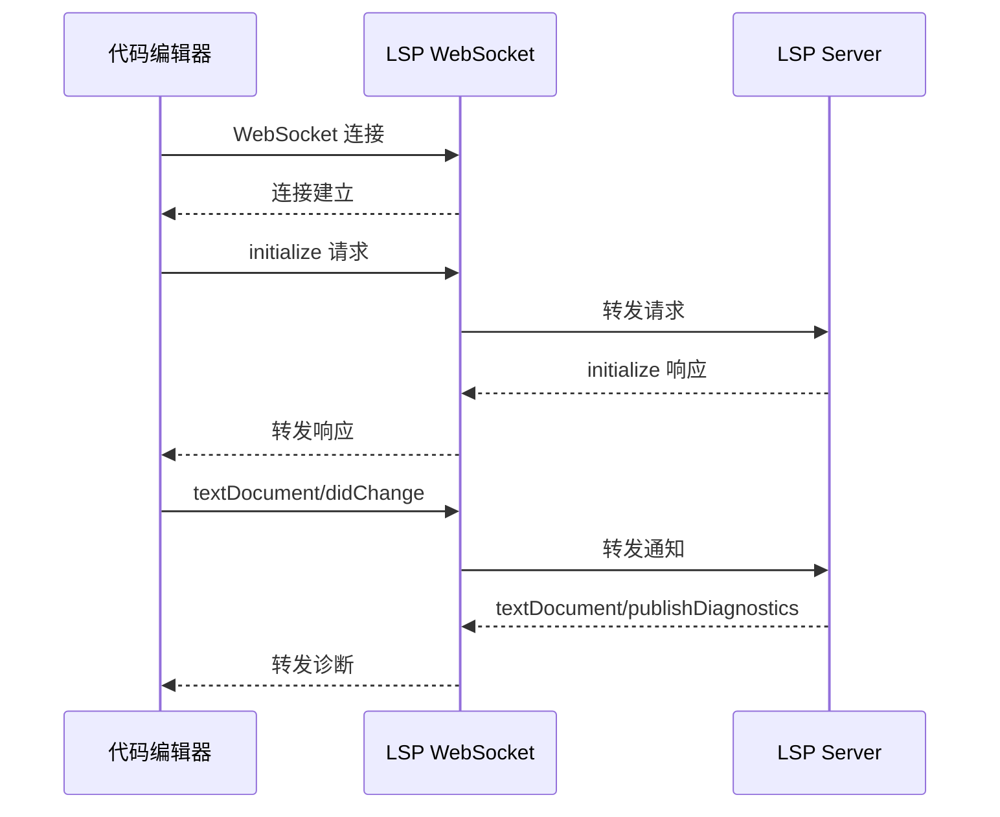
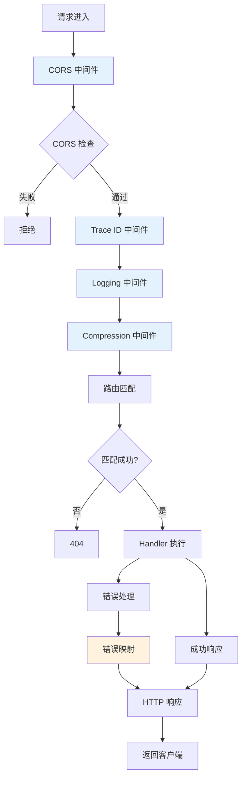
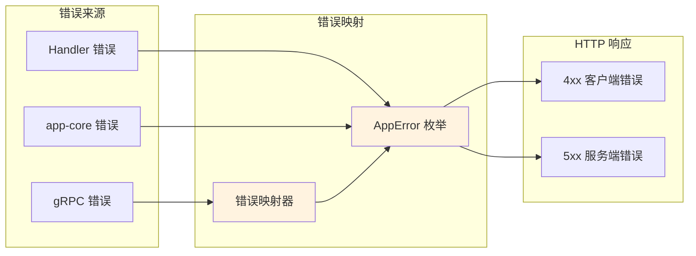
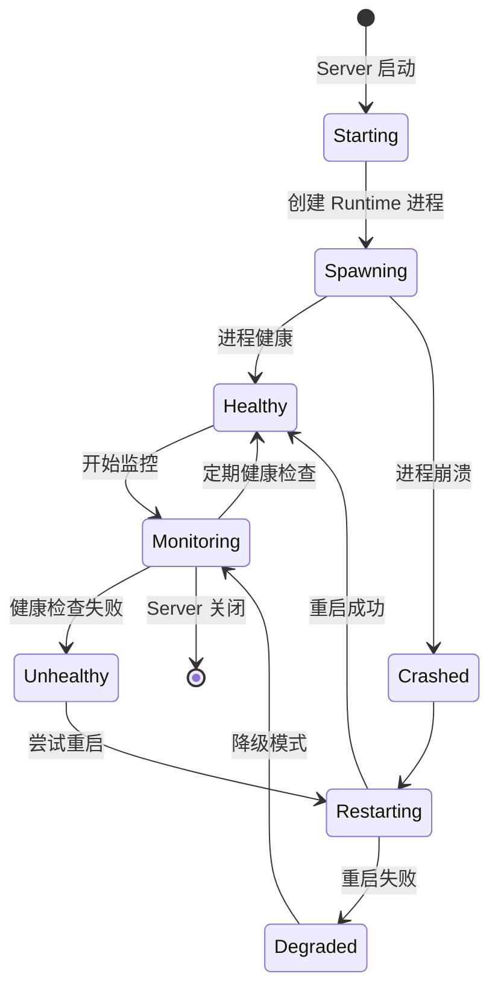

# Slab HTTP API 网关

## 文档元数据

| 属性 | 值 |
|------|-----|
| **文件名** | `03_http_api_server.md` |
| **版本** | 1.0.0 |
| **状态** | Production Design |
| **最后更新** | 2026-06-12 |
| **维护者** | Slab Backend Team |
| **适用范围** | 后端开发人员、API 消费者、集成开发人员 |

---

## 功能概述与用户故事

### 核心定位

`slab-server` 是 Slab 应用的 HTTP API 网关，基于 Axum 框架构建。它负责：

- **API 路由**：提供所有 `/v1/*` REST API 端点
- **WebSocket 服务**：支持插件 RPC、事件广播、LSP 协议
- **Runtime 监督**：启动和监控 slab-runtime 进程
- **插件 Sidecar 管理**：管理 JS 和 Python 插件运行时
- **OpenAPI 文档**：提供 Swagger UI 和 API schema
- **中间件**：CORS、追踪、错误处理

### 用户故事

**US-API-001：统一 API 入口**
> 作为一名前端开发者，我希望所有产品功能都通过统一的 HTTP API 访问，这样我可以用标准的 REST 客户端调用。

**US-API-002：实时通信**
> 作为一名插件开发者，我希望通过 WebSocket 与服务端通信，以获得实时响应和双向消息传递。

**US-API-003：API 文档**
> 作为一名集成开发者，我希望有完整的 API 文档和示例，这样我可以快速理解如何使用 API。

**US-API-004：推理隔离**
> 作为一名用户，我希望 AI 推理任务在独立进程中运行，这样推理错误不会影响其他功能。

---

## 用户界面与交互规范

### 服务器架构



### 请求处理流程



### WebSocket 连接管理



---

## 核心业务逻辑与流程

### API 路由表

| 路径前缀 | 方法 | 功能 | Handler |
|----------|------|------|---------|
| `/v1/chat/*` | GET/POST | 聊天 API | `chat_handler` |
| `/v1/audio/*` | GET/POST | 音频处理 | `audio_handler` |
| `/v1/images/*` | GET/POST | 图像处理 | `images_handler` |
| `/v1/video/*` | GET/POST | 视频处理 | `video_handler` |
| `/v1/models/*` | GET/POST/PUT/DELETE | 模型管理 | `models_handler` |
| `/v1/tasks/*` | GET/POST | 任务管理 | `tasks_handler` |
| `/v1/sessions/*` | GET/POST | 会话管理 | `sessions_handler` |
| `/v1/settings/*` | GET/PUT | 设置管理 | `settings_handler` |
| `/v1/setup/*` | POST | 初始化设置 | `setup_handler` |
| `/v1/system/*` | GET | 系统信息 | `system_handler` |
| `/v1/backends*` | GET | 后端状态 | `backend_handler` |
| `/v1/agents/*` | GET/POST | Agent API | `agent_handler` |
| `/v1/ffmpeg/*` | POST | FFmpeg 操作 | `ffmpeg_handler` |
| `/v1/subtitles/*` | GET/POST | 字幕处理 | `subtitles_handler` |
| `/v1/plugins/rpc` | WS | 插件 RPC | `plugin_rpc_ws` |
| `/v1/plugins/events` | WS | 插件事件 | `plugin_events_ws` |
| `/v1/workspace/lsp/{lang}` | WS | LSP 协议 | `lsp_ws` |
| `/v1/ui-state/*` | GET/PUT | UI 状态 | `ui_state_handler` |
| `/health` | GET | 健康检查 | `health_handler` |
| `/swagger-ui/*` | GET | Swagger UI | 静态资源 |
| `/api-docs/openapi.json` | GET | OpenAPI schema | utoipa 生成 |

### WebSocket 端点详解

#### 1. 插件 RPC (`/v1/plugins/rpc`)

**协议**：JSON-RPC 2.0 over WebSocket



**消息格式**：

```json
// 请求
{
  "jsonrpc": "2.0",
  "id": "1",
  "method": "plugin/invoke",
  "params": {
    "plugin_id": "my-plugin",
    "method": "do_something",
    "args": {}
  }
}

// 响应
{
  "jsonrpc": "2.0",
  "id": "1",
  "result": {
    "status": "success",
    "data": {}
  }
}
```

#### 2. 插件事件 (`/v1/plugins/events`)

**协议**：事件广播 over WebSocket



**事件格式**：

```json
{
  "type": "plugin.state_changed",
  "timestamp": 1686580000,
  "data": {
    "plugin_id": "my-plugin",
    "state": "running"
  }
}
```

#### 3. LSP 协议 (`/v1/workspace/lsp/{language}`)

**协议**：Language Server Protocol over WebSocket



**支持的语言**：

| 语言 | LSP 实现 | 路径参数 |
|------|----------|----------|
| TypeScript | TypeScript Language Server | `typescript` |
| Python | Python LSP Server | `python` |
| Rust | rust-analyzer | `rust` |
| Go | gopls | `go` |

### 中间件链



### 中间件详解

#### 1. CORS 中间件

```rust
// 伪代码示意
async fn cors_middleware(
    req: Request,
    next: Next,
) -> Result<Response, StatusCode> {
    // 仅允许 localhost 来源
    let origin = req
        .headers()
        .get("origin")
        .and_then(|h| h.to_str().ok());
        
    if !is_localhost(origin) {
        return Err(StatusCode::FORBIDDEN);
    }
    
    Ok(next.run(req).await)
}
```

#### 2. Trace ID 中间件

```rust
async fn trace_id_middleware(
    req: Request,
    next: Next,
) -> Response {
    let trace_id = generate_trace_id();
    
    // 添加到请求扩展
    let mut req = req;
    req.extensions_mut().insert(trace_id.clone());
    
    // 执行下一个中间件
    let mut response = next.run(req).await;
    
    // 添加到响应头
    response.headers_mut().insert(
        "X-Trace-ID",
        trace_id.parse().unwrap()
    );
    
    response
}
```

### 错误处理



**错误代码映射**：

| AppError | HTTP 状态 | 描述 |
|----------|-----------|------|
| `BadRequest` | 400 | 请求参数错误 |
| `Unauthorized` | 401 | 未授权 |
| `Forbidden` | 403 | 权限不足 |
| `NotFound` | 404 | 资源不存在 |
| `Conflict` | 409 | 资源冲突 |
| `UnprocessableEntity` | 422 | 语义错误 |
| `InternalServerError` | 500 | 内部错误 |
| `ServiceUnavailable` | 503 | 服务不可用 |

### Runtime 监督



**监督代码示意**：

```rust
struct RuntimeSupervisor {
    process: Option<Child>,
    restart_count: u32,
    max_restarts: u32,
}

impl RuntimeSupervisor {
    async fn spawn(&mut self) -> Result<()> {
        let process = Command::new("slab-runtime")
            .spawn()
            .context("启动 Runtime 失败")?;
            
        self.process = Some(process);
        self.restart_count = 0;
        
        Ok(())
    }
    
    async fn monitor_health(&mut self) -> Result<()> {
        loop {
            tokio::time::sleep(Duration::from_secs(5)).await;
            
            match self.check_health().await {
                Ok(true) => continue,
                Ok(false) | Err(_) => {
                    self.restart().await?;
                }
            }
        }
    }
    
    async fn restart(&mut self) -> Result<()> {
        if self.restart_count >= self.max_restarts {
            bail!("Runtime 重启次数超限");
        }
        
        self.process = None;
        self.spawn().await?;
        self.restart_count += 1;
        
        Ok(())
    }
}
```

### OpenAPI 集成

**使用 utoipa 生成 OpenAPI schema**：

```rust
use utoipa::OpenApi;
use utoipa_swagger_ui::SwaggerUi;

#[derive(OpenApi)]
#[openapi(
    paths(
        chat::create_chat,
        models::list_models,
    ),
    components(
        schemas(ChatRequest, ChatResponse)
    ),
    tags(
        (name = "chat", description = "聊天 API"),
        (name = "models", description = "模型管理"),
    )
)]
struct ApiDoc;

let app = Router::new()
    .merge(SwaggerUi::new("/swagger-ui")
        .url("/api-docs/openapi.json", ApiDoc::openapi()))
    .route("/api-docs/openapi.json", get(openapi_json));
```

---

## 功能点原子级拆分

### AT-API-001：HTTP 路由

| 子功能 | 描述 | 优先级 | 复杂度 | 依赖 |
|--------|------|--------|--------|------|
| 路由定义 | 定义所有 /v1/* 路由 | P0 | 低 | 无 |
| 路由匹配 | Axum 路由匹配 | P0 | 低 | 路由定义 |
| 路径参数 | 提取路径参数 | P0 | 低 | 无 |
| 查询参数 | 解析查询参数 | P0 | 低 | 无 |
| 路由分组 | 按功能分组路由 | P1 | 中 | 无 |

### AT-API-002：WebSocket 服务

| 子功能 | 描述 | 优先级 | 复杂度 | 依赖 |
|--------|------|--------|--------|------|
| 连接建立 | WebSocket 握手 | P0 | 低 | 无 |
| 连接管理 | 管理活动连接 | P0 | 中 | 连接建立 |
| 消息路由 | 路由消息到处理器 | P0 | 中 | 连接管理 |
| 消息序列化 | JSON-RPC 序列化 | P0 | 低 | 无 |
| 心跳机制 | 检测连接存活 | P0 | 中 | 连接管理 |
| 优雅关闭 | 关闭连接 | P0 | 中 | 连接管理 |

### AT-API-003：中间件

| 子功能 | 描述 | 优先级 | 复杂度 | 依赖 |
|--------|------|--------|--------|------|
| CORS 处理 | CORS 头处理 | P0 | 低 | 无 |
| Trace ID | 生成追踪 ID | P0 | 低 | 无 |
| 日志记录 | 记录请求/响应 | P0 | 中 | Trace ID |
| 错误处理 | 统一错误处理 | P0 | 中 | 无 |
| 压缩 | 响应压缩 | P2 | 低 | 无 |

### AT-API-004：Runtime 监督

| 子功能 | 描述 | 优先级 | 复杂度 | 依赖 |
|--------|------|--------|--------|------|
| 进程启动 | 启动 Runtime 进程 | P0 | 中 | 无 |
| 健康检查 | 检查进程健康 | P0 | 中 | 进程启动 |
| 自动重启 | 崩溃后重启 | P0 | 中 | 健康检查 |
| 资源监控 | 监控资源使用 | P2 | 高 | 无 |
| 优雅关闭 | 关闭进程 | P0 | 中 | 无 |

### AT-API-005：OpenAPI 文档

| 子功能 | 描述 | 优先级 | 复杂度 | 依赖 |
|--------|------|--------|--------|------|
| Schema 生成 | utoipa 生成 schema | P0 | 低 | 无 |
| 文档注解 | 添加 API 文档 | P0 | 低 | 无 |
| Swagger UI | 集成 Swagger UI | P0 | 低 | Schema 生成 |
| 示例代码 | 生成示例代码 | P1 | 中 | 无 |

---

## 非功能性需求与技术约束

### 性能要求

| 指标 | 目标 | 测量方法 |
|------|------|----------|
| HTTP 响应时间 | P95 < 100ms | 分布式追踪 |
| WebSocket 延迟 | P95 < 50ms | 客户端计时 |
| 并发连接 | 支持 100+ 并发 | 压力测试 |
| 内存占用 | < 500MB | 进程监控 |
| CPU 使用 | < 50% | 系统监控 |

### 可靠性要求

1. **错误隔离**：Handler 错误不影响其他请求
2. **连接恢复**：WebSocket 断线自动重连
3. **优雅降级**：Runtime 不可用时降级服务
4. **请求超时**：所有请求有合理超时

### 可观测性要求

1. **分布式追踪**：所有请求有 Trace ID
2. **日志记录**：记录所有关键操作
3. **指标收集**：收集性能指标
4. **错误追踪**：追踪所有错误

### 安全性要求

1. **CORS 限制**：仅允许 localhost 访问
2. **输入验证**：验证所有输入参数
3. **错误隐藏**：不暴露内部实现细节
4. **速率限制**：防止资源滥用

### 技术约束

1. **框架**：基于 Axum + Tokio
2. **协议**：HTTP/1.1 + WebSocket
3. **端口**：固定监听 3000 端口
4. **文档**：使用 utoipa + Swagger UI
5. **序列化**：使用 serde + serde_json

---

## 附录：API 端点速查表

### 核心 API 端点

```markdown
## 聊天 API
- POST   /v1/chat/completions          - 创建聊天补全
- POST   /v1/completions               - 创建文本补全
- GET    /v1/chat/models               - 聊天模型兼容列表

## 模型管理
- GET    /v1/models                    - 列出所有模型
- POST   /v1/models                    - 创建模型记录
- GET    /v1/models/:id                - 获取模型详情
- PUT    /v1/models/:id                - 更新模型
- DELETE /v1/models/:id                - 删除模型
- GET    /v1/models/available          - 列出可下载模型文件
- POST   /v1/models/import-pack        - 导入模型包
- POST   /v1/models/download           - 创建模型下载任务
- POST   /v1/models/load               - 加载模型
- POST   /v1/models/unload             - 卸载模型
- POST   /v1/models/switch             - 切换活动模型

## 任务管理
- GET    /v1/tasks                      - 列出任务
- GET    /v1/tasks/:id                 - 获取任务状态
- GET    /v1/tasks/:id/result          - 获取任务结果
- POST   /v1/tasks/:id/cancel          - 取消任务
- POST   /v1/tasks/:id/restart         - 重启任务

## 会话 API
- GET    /v1/sessions                  - 列出会话
- POST   /v1/sessions                  - 创建会话
- PUT    /v1/sessions/:id              - 更新会话
- DELETE /v1/sessions/:id              - 删除会话
- GET    /v1/sessions/:id/messages     - 获取会话消息

## 插件 API (WebSocket)
- WS     /v1/plugins/rpc               - 插件 RPC
- WS     /v1/plugins/events            - 插件事件

## LSP API (WebSocket)
- WS     /v1/workspace/lsp/typescript  - TypeScript LSP
- WS     /v1/workspace/lsp/python       - Python LSP
- WS     /v1/workspace/lsp/rust         - Rust LSP
- WS     /v1/workspace/lsp/go          - Go LSP

## 系统 API
- GET    /health                       - 健康检查
- GET    /v1/system/info              - 系统信息
- GET    /v1/system/stats            - 系统统计

## 文档
- GET    /swagger-ui/*                - Swagger UI
- GET    /api-docs/openapi.json       - OpenAPI Schema
```

---

**文档变更历史**：

| 版本 | 日期 | 变更说明 | 作者 |
|------|------|----------|------|
| 1.0.0 | 2026-06-12 | 初始版本 | Backend Team |
