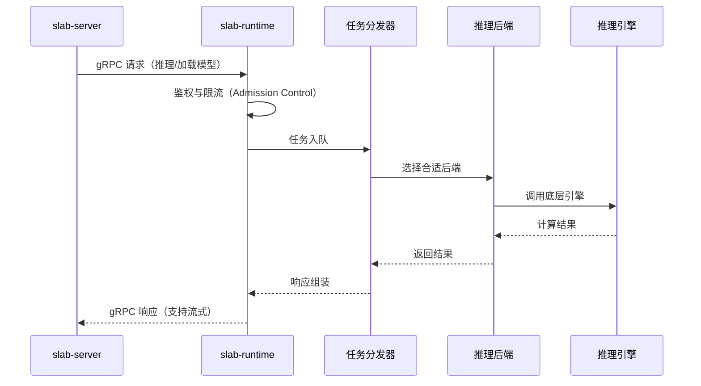
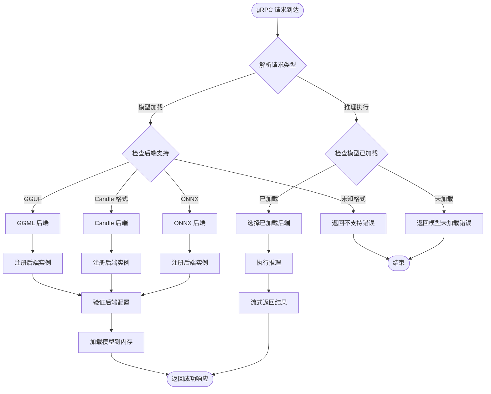
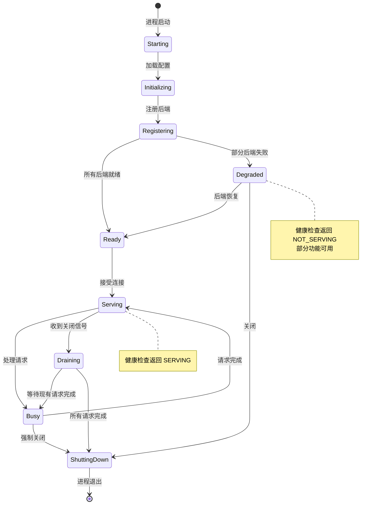

# 04 Runtime Worker 文档

## 文档元数据

| 项目 | 内容 |
|------|------|
| 文件名 | 04_runtime_worker.md |
| 版本 | 1.0.0 |
| 状态 | 初稿 |
| 创建日期 | 2026-06-12 |
| 作者 | Slab 项目组 |
| 组件名称 | slab-runtime (gRPC Runtime Worker) |
| 依赖文档 | 03_architecture_overview.md, 05_business_logic_core.md |

---

## 1. 功能概述与用户故事

### 1.1 组件定位

**slab-runtime** 是 Slab 项目中的独立 gRPC 工作进程，负责承载和管理所有推理引擎后端。作为架构中的关键隔离层，它将模型加载、张量计算、原生库调用等资源密集型操作与 HTTP 网关层完全分离。

### 1.2 核心价值主张

- **进程隔离**：独立进程运行，隔离模型内存占用（可能达到数十 GB）和原生库状态
- **后端统一管理**：提供统一的注册和调度机制，支持 GGML、Candle、ONNX 等多种推理后端
- **可扩展性**：通过 Composition Root 模式支持新后端插拔
- **生命周期管理**：通过 slab-runtime-core 提供完善的进程生命周期控制

### 1.3 用户故事

#### 故事 1：管理员部署推理服务
> 作为系统管理员，我希望将推理服务部署为独立进程，以便：
> - 单独监控进程资源使用
> - 在模型崩溃时不影响 HTTP 网关
> - 根据硬件配置动态调整工作进程数量

#### 故事 2：开发者添加新推理后端
> 作为引擎开发者，我希望通过标准化接口注册新的推理后端（如新的 ML 框架），以便：
> - 无需修改 slab-server 核心代码
> - 复用现有的调度和生命周期管理机制
> - 通过配置文件启用/禁用特定后端

#### 故事 3：系统运维故障排查
> 作为运维工程师，我希望通过 gRPC 健康检查接口监控推理后端状态，以便：
> - 检测模型加载失败
> - 监控 GPU 内存使用情况
> - 在后端异常时快速定位问题

---

## 2. 核心业务逻辑与流程

### 2.1 架构分层

```
bin/slab-runtime/
├── src/
│   ├── bootstrap/          # 启动引导，依赖注入容器
│   ├── api/                # gRPC 服务实现（健康检查、模型加载、推理执行）
│   ├── application/        # 应用服务层（编排用例）
│   ├── domain/             # 领域模型（后端抽象、任务、配置）
│   └── infra/              # 基础设施层
│       └── backends/       # 后端实现注册
│           ├── ggml/       # GGML 后端（GGUF 模型）
│           ├── candle/     # Candle ML 框架后端
│           └── onnx/       # ONNX Runtime 后端
```

### 2.2 核心流程图

#### 2.2.1 请求生命周期



#### 2.2.2 后端调度流程



#### 2.2.3 工作进程生命周期状态机



### 2.3 后端类型详解

#### 2.3.1 GGML 后端
- **支持格式**：GGUF (GPT-Generated Unified Format)
- **用途**：
  - LLM 聊天补全（通过 slab-llama）
  - 语音转写（通过 slab-whisper）
- **硬件加速**：CUDA, HIP, Metal, Vulkan, CPU
- **特点**：内存占用小，支持量化模型（4-bit, 5-bit, 8-bit）

#### 2.3.2 Candle 后端
- **框架**：Candle ML 框架（Hugging Face 开发）
- **用途**：支持更多样化的模型架构
- **特点**：纯 Rust 实现，安全性更高，扩展性好

#### 2.3.3 ONNX 后端
- **运行时**：ONNX Runtime
- **用途**：标准化模型部署，跨框架兼容
- **特点**：生态成熟，支持广泛的模型格式

---

## 3. 功能点原子级拆分

| 功能点 ID | 功能名称 | 输入/触发条件 | 处理逻辑 | 输出/响应 | 异常与边界处理 |
|-----------|----------|---------------|-----------|-----------|----------------|
| RW-001 | 进程启动与初始化 | 操作系统启动进程 | 1. 读取配置文件<br>2. 初始化日志系统<br>3. 创建依赖注入容器<br>4. 注册所有后端 | 进程进入 Ready 状态 | - 配置文件缺失：使用默认配置<br>- 日志初始化失败：退出进程<br>- 依赖注入失败：返回详细错误 |
| RW-002 | gRPC 服务启动 | 初始化完成后 | 1. 绑定 TCP/Unix 套接字<br>2. 注册所有 gRPC 服务<br>3. 启动健康检查服务 | 服务开始监听 | - 端口占用：退出并提示<br>- 权限不足：返回权限错误<br>- Unix 套接字创建失败：尝试 TCP |
| RW-003 | GGML 后端注册 | 启动阶段 | 1. 检测硬件加速支持<br>2. 初始化 slab-ggml-sys<br>3. 注册后端实例 | 后端可用标志 | - FFI 加载失败：禁用后端<br>- 硬件不兼容：降级到 CPU<br>- 重复注册：跳过 |
| RW-004 | Candle 后端注册 | 启动阶段 | 1. 检查 Candle 库可用性<br>2. 初始化设备（CUDA/Metal/CPU）<br>3. 注册模型加载器 | 后端可用标志 | - 库缺失：禁用后端<br>- 设备初始化失败：降级到 CPU |
| RW-005 | ONNX 后端注册 | 启动阶段 | 1. 加载 ONNX Runtime 库<br>2. 初始化执行提供程序<br>3. 注册会话创建器 | 后端可用标志 | - 库版本不兼容：禁用后端<br>- EP 初始化失败：使用 CPU EP |
| RW-006 | 模型加载请求 | gRPC LoadModel 请求 | 1. 验证模型路径存在<br>2. 检测模型格式<br>3. 选择匹配后端<br>4. 分配内存<br>5. 加载模型权重 | 模型句柄 ID | - 文件不存在：返回 NOT_FOUND<br>- 格式不支持：返回 INVALID_ARGUMENT<br>- 内存不足：返回 RESOURCE_EXHAUSTED<br>- 加载超时：返回 DEADLINE_EXCEEDED |
| RW-007 | 推理执行请求 | gRPC Infer 请求 | 1. 验证模型句柄有效<br>2. 解析输入张量<br>3. 执行推理计算<br>4. 流式返回结果 | 推理结果（流式） | - 句柄无效：返回 NOT_FOUND<br>- 输入维度错误：返回 INVALID_ARGUMENT<br>- 计算错误：返回 INTERNAL<br>- 中断信号：优雅终止 |
| RW-008 | 模型卸载 | 主动卸载或内存压力 | 1. 停止使用该模型的所有请求<br>2. 释放 GPU/系统内存<br>3. 清理缓存 | 卸载确认 | - 句柄不存在：返回 NOT_FOUND<br>- 仍有活动请求：返回 FAILED_PRECONDITION<br>- 释放失败：记录警告 |
| RW-009 | 健康检查处理 | gRPC HealthCheck 请求 | 1. 检查进程存活<br>2. 检查后端状态<br>3. 检查资源使用 | SERVING/NOT_SERVING 状态 | - 超过阈值：返回 NOT_SERVING<br>- 后端全部崩溃：返回 NOT_SERVING<br>- 部分故障：返回 SERVING |
| RW-010 | 优雅关闭 | SIGTERM/SIGINT 信号 | 1. 停止接受新请求<br>2. 等待现有请求完成（超时 30s）<br>3. 卸载所有模型<br>4. 释放资源<br>5. 退出进程 | 进程退出码 0 | - 强制关闭（SIGKILL）：立即退出<br>- 超时未完成：强制清理 |
| RW-011 | 后端自动降级 | 后端初始化失败 | 1. 记录失败原因<br>2. 尝试备选加速方案<br>3. 最终降级到 CPU | 降级状态通知 | - 无备选方案：禁用后端<br>- CPU 不可用：记录严重错误 |
| RW-012 | 流式响应控制 | 客户端请求流式输出 | 1. 建立双向流<br>2. 分批发送 token<br>3. 处理背压<br>4. 检测客户端断开 | 流式数据块 | - 客户端断开：取消推理<br>- 背压超时：暂停生成<br>- 序列化错误：返回 INTERNAL |

---

## 4. 非功能性需求与技术约束

### 4.1 性能要求

| 指标 | 要求 | 说明 |
|------|------|------|
| 首次模型加载时间 | < 60s (7B 模型, GPU) | 从请求到模型就绪的时间 |
| 推理首延迟 | < 500ms | 首个 token 生成时间 |
| 吞吐量 | > 30 tokens/s (GPU) | 流式输出速度 |
| 内存占用 | 可预测上限 | 需提供内存预估接口 |
| gRPC 延迟 | < 10ms (P99) | 网络往返延迟（本地网络） |

### 4.2 可靠性要求

- **进程隔离**：模型崩溃不得影响 slab-server
- **优雅降级**：单个后端失败不影响其他后端
- **资源清理**：进程退出时必须释放 GPU 内存
- **无状态设计**：进程重启后状态由 slab-server 重建

### 4.3 安全性要求

- **鉴权**：gRPC 请求必须验证来源（mTLS 或 Unix socket 权限）
- **沙箱**：推理代码执行受限（如支持动态模型）
- **资源限制**：限制单个模型最大内存使用
- **输入验证**：严格验证模型文件路径和格式

### 4.4 可维护性要求

- **日志规范**：结构化日志，包含请求追踪 ID
- **指标导出**：Prometheus 格式（后端健康度、队列长度、GPU 使用率）
- **配置热更新**：支持运行时重载部分配置
- **版本兼容**：向后兼容的 protobuf API 设计

### 4.5 技术约束

| 约束项 | 说明 |
|--------|------|
| 通信协议 | 必须使用 slab-proto 定义的 protobuf schema |
| 依赖库 | 所有推理引擎通过 -sys crate 封装 FFI |
| 平台支持 | Windows, macOS, Linux |
| 硬件检测 | 启动时自动检测 CUDA/HIP/Metal/Vulkan |
| 线程模型 | 使用 tokio 异步运行时，推理任务在线程池执行 |

### 4.6 监控指标

```yaml
# Prometheus 指标示例
slab_runtime_backend_loaded:  # 后端加载状态
  { backend: "ggml", status: "ready" }
slab_runtime_model_loaded:     # 模型加载状态
  { model_id: "llama-7b", backend: "ggml" }
slab_runtime_inference_duration_seconds:  # 推理耗时
  { model_id: "llama-7b", quantization: "q4_0" }
slab_runtime_queue_length:      # 请求队列长度
slab_runtime_gpu_memory_bytes:  # GPU 内存使用
  { device: "0" }
slab_runtime_process_cpu_seconds_total:  # 进程 CPU 时间
```

---

## 5. 相关文档

- **依赖**：
  - [slab-runtime-core](../../crates/slab-runtime-core/) - 工作进程协议与生命周期
  - [slab-proto](../../crates/slab-proto/) - gRPC 协议定义
  - [slab-ggml](../../crates/slab-ggml/) - GGML FFI 绑定
  - [slab-candle](../../crates/slab-candle/) - Candle 集成

- **后续文档**：
  - [05_business_logic_core.md](05_business_logic_core.md) - 业务逻辑层
  - [06_inference_engines.md](06_inference_engines.md) - 推理引擎详解
