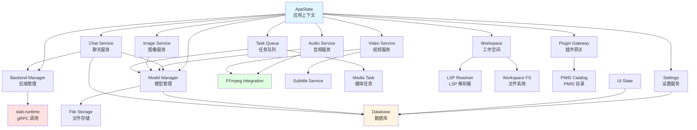
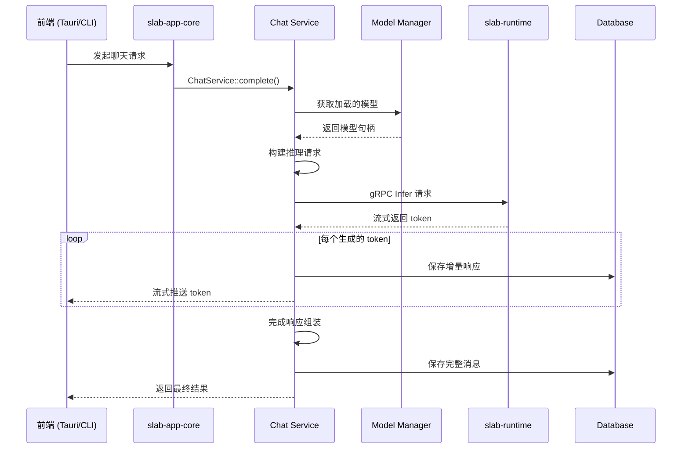
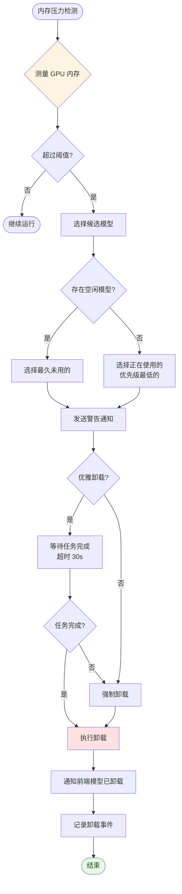

# 05 业务逻辑核心 (Business Logic Core) 文档

## 文档元数据

| 项目 | 内容 |
|------|------|
| 文件名 | 05_business_logic_core.md |
| 版本 | 1.0.0 |
| 状态 | 初稿 |
| 创建日期 | 2026-06-12 |
| 作者 | Slab 项目组 |
| 组件名称 | slab-app-core (HTTP-Free Business Logic Layer) |
| 依赖文档 | 03_architecture_overview.md, 04_runtime_worker.md |

---

## 1. 功能概述与用户故事

### 1.1 组件定位

**slab-app-core** (`crates/slab-app-core/`) 是 Slab 项目的核心业务逻辑层，提供完全独立于 HTTP 协议的领域服务。该 crate 可被桌面应用（Tauri）、CLI 工具、测试套件等多种前端复用，遵循"业务逻辑与传输层解耦"的架构原则。

### 1.2 核心价值主张

- **传输无关性**：业务逻辑与 HTTP/gRPC 完全解耦，支持多种前端接入
- **领域驱动**：按照业务领域（chat, audio, image, video）清晰分层
- **可测试性**：所有服务可通过依赖注入进行单元测试
- **持久化隔离**：统一的数据库访问层（SQLx）和文件存储抽象

### 1.3 用户故事

#### 故事 1：开发者实现新 AI 功能
> 作为功能开发者，我希望在 slab-app-core 中添加新的 AI 服务（如图像生成），以便：
> - Tauri 桌面应用和 CLI 工具都能使用同一套逻辑
> - 无需重复编写业务规则
> - 通过统一的依赖注入获取配置和数据库访问

#### 故事 2：测试工程师编写集成测试
> 作为 QA 工程师，我希望直接调用业务逻辑层进行测试，以便：
> - 无需启动完整的 HTTP 服务器
> - 可以模拟各种边界条件和异常场景
> - 测试执行速度更快

#### 故事 3：运维人员配置数据持久化
> 作为系统管理员，我希望通过配置控制数据库存储位置，以便：
> - 将数据存储在高速 SSD 上
> - 支持多实例数据目录分离
> - 方便备份和迁移

---

## 2. 核心业务逻辑与流程

### 2.1 架构组织

```
crates/slab-app-core/
├── context/                    # 应用上下文与依赖注入
│   └── mod.rs                  # AppState 结构体定义
├── domain/                      # 领域模型与服务
│   ├── services/                # 领域服务（按业务领域）
│   │   ├── chat/               # AI 聊天补全服务
│   │   │   ├── mod.rs          # 聊天服务入口
│   │   │   ├── completion.rs   # 补全生成
│   │   │   ├── streaming.rs    # 流式输出
│   │   │   └── session.rs      # 会话管理
│   │   ├── audio.rs            # 音频转录服务
│   │   ├── image.rs            # 图像生成服务
│   │   ├── video.rs            # 视频处理服务
│   │   ├── backend.rs          # 推理后端管理
│   │   ├── task.rs             # 后台任务队列
│   │   ├── session.rs          # 对话会话
│   │   ├── settings.rs         # 应用设置
│   │   ├── setup.rs            # 首次运行向导
│   │   ├── system.rs           # 系统信息
│   │   ├── model/              # 模型管理
│   │   ├── plugin/             # 插件运行时网关
│   │   ├── pmid.rs             # PMID 目录服务
│   │   ├── workspace.rs        # 工作空间管理
│   │   ├── workspace_lsp.rs    # LSP 提供者解析
│   │   ├── workspace_file_system.rs  # 工作空间文件系统
│   │   ├── ffmpeg.rs           # FFmpeg 集成（静态/构建）
│   │   ├── ffmpeg_next_audio.rs      # FFmpeg 音频处理
│   │   ├── ffmpeg_next_remux.rs      # FFmpeg 重封装
│   │   ├── ffmpeg_runtime.rs         # FFmpeg 运行时
│   │   ├── subtitle.rs         # 字幕处理
│   │   ├── ui_state.rs         # 前端 UI 状态持久化
│   │   └── media_task.rs       # 媒体任务协调
│   └── entities/                # 领域实体（如需要）
├── infra/                       # 基础设施层
│   ├── db/                     # 数据库访问（SQLx/SQLite）
│   ├── storage/                # 文件存储抽象
│   └── external/               # 外部服务集成
├── schemas/                     # 共享请求/响应 DTO
└── migrations/                  # SQLx 数据库迁移（仅追加）
```

### 2.2 核心流程图

#### 2.2.1 服务依赖关系图



#### 2.2.2 聊天服务请求流程



#### 2.2.3 模型自动卸载决策流程



### 2.3 领域服务详解

#### 2.3.1 Chat 服务 (domain/services/chat/)
- **completion.rs**: 生成文本补全，支持多轮对话上下文
- **streaming.rs**: Server-Sent Events (SSE) 流式输出实现
- **session.rs**: 会话状态管理，支持会话恢复和分支

#### 2.3.2 FFmpeg 集成
多个模块提供不同层次的 FFmpeg 支持：
- **ffmpeg.rs**: 基础集成，静态/构建二进制检测
- **ffmpeg_next_audio.rs**: 音频转码、重采样
- **ffmpeg_next_remux.rs**: 容器格式转换
- **ffmpeg_runtime.rs**: 运行时进程管理与管道通信

**解析顺序**（优先级从高到低）：
1. `SLAB_FFMPEG_BIN` 环境变量
2. Setup 目录（首次运行时下载）
3. `SLAB_FFMPEG_DIR` 环境变量
4. `FFMPEG_DIR` 环境变量
5. 捆绑资源目录 (`resources/libs/`)
6. 系统 `PATH`

#### 2.3.3 工作空间 LSP 解析
- **workspace_lsp.rs**: 解析项目类型，选择合适的 LSP 服务器
- **workspace_file_system.rs**: 虚拟文件系统，支持工作空间隔离
- 支持的 LSP: TypeScript/JavaScript, Python, Rust, Go, C++, 等

---

## 3. 功能点原子级拆分

| 功能点 ID | 功能名称 | 输入/触发条件 | 处理逻辑 | 输出/响应 | 异常与边界处理 |
|-----------|----------|---------------|-----------|-----------|----------------|
| BLC-001 | 应用上下文初始化 | 应用启动 | 1. 加载配置文件<br>2. 初始化数据库连接池<br>3. 创建依赖注入容器<br>4. 注册所有领域服务 | AppState 实例 | - 配置无效：返回错误<br>- 数据库损坏：尝试恢复<br>- 依赖缺失：禁用相关服务 |
| BLC-002 | 聊天补全生成 | 用户发送消息 | 1. 加载对话会话历史<br>2. 构建推理 prompt<br>3. 调用推理后端<br>4. 流式返回结果 | 补全文本（流式） | - 模型未加载：提示加载<br>- 上下文超长：截断或摘要<br>- 推理失败：返回友好错误 |
| BLC-003 | 流式输出处理 | 推理结果生成 | 1. 接收 token 流<br>2. 应用格式化规则<br>3. 发送 SSE 事件 | SSE 事件流 | - 连接断开：取消推理<br>- 序列化错误：跳过该 token<br>- 背压：暂停消费 |
| BLC-004 | 会话创建与管理 | 新建对话 | 1. 生成唯一会话 ID<br>2. 初始化消息存储<br>3. 关联模型和参数 | 会话对象 | - ID 冲突：重试生成<br>- 存储失败：返回错误<br>- 参数无效：拒绝创建 |
| BLC-005 | 会话上下文恢复 | 继续历史对话 | 1. 从数据库加载消息<br>2. 应用 token 限制<br>3. 构建上下文窗口 | 消息列表（截断） | - 消息过多：智能摘要<br>- 损坏的会话：部分恢复<br>- 数据库错误：使用空上下文 |
| BLC-006 | 音频转写处理 | 上传音频文件 | 1. 验证文件格式<br>2. 调用 FFmpeg 预处理<br>3. 发送至 Whisper 后端<br>4. 返回转写结果 | 转写文本 + 时间戳 | - 格式不支持：尝试转码<br>- 文件过大：拒绝处理<br>- 转写失败：返回部分结果 |
| BLC-007 | 图像生成请求 | 用户提示词 | 1. 解析生成参数<br>2. 调用 Diffusion 后端<br>3. 流式返回进度<br>4. 保存生成的图像 | 图像文件 URL | - 参数无效：返回默认值<br>- 生成失败：返回错误<br>- 存储不足：拒绝请求 |
| BLC-008 | 视频转码处理 | 上传视频文件 | 1. 分析媒体信息<br>2. 选择转码参数<br>3. 调用 FFmpeg 处理<br>4. 进度回调通知 | 转码后文件路径 | - 格式未知：尝试探测<br>- 转码超时：取消任务<br>- 磁盘不足：提前检测 |
| BLC-009 | 字幕提取与嵌入 | 视频处理请求 | 1. 探测现有字幕轨道<br>2. 提取/生成字幕<br>3. 嵌入到容器 | 字幕文件/嵌入式轨道 | - 编码不支持：跳过<br>- 时间戳错误：修复尝试<br>- 语言识别失败：使用默认 |
| BLC-010 | 模型下载与安装 | 用户选择模型 | 1. 验证 PMID 源<br>2. 流式下载文件<br>3. 校验文件哈希<br>4. 注册到模型库 | 模型元数据 | - 网络错误：支持断点续传<br>- 哈希不匹配：删除重下<br>- 磁盘不足：提前检测 |
| BLC-011 | 模型加载与卸载 | 用户请求或自动触发 | 1. 检查后端可用性<br>2. 请求 Runtime 加载<br>3. 监控内存使用<br>4. 自动卸载决策 | 模型句柄/卸载确认 | - 后端不可用：降级提示<br>- 内存不足：触发卸载<br>- 加载超时：取消并提示 |
| BLC-012 | 插件生命周期管理 | 插件安装/启用/禁用 | 1. 验证插件签名<br>2. 加载插件清单<br>3. 初始化插件沙箱<br>4. 注册插件贡献 | 插件实例 | - 签名无效：拒绝加载<br>- 依赖冲突：禁用插件<br>- 沙箱失败：回滚操作 |
| BLC-013 | PMID 目录查询 | 模型源请求 | 1. 解析 PMID 查询<br>2. 访问本地缓存<br>3. 远程源获取<br>4. 验证数据完整性 | 模型源列表 | - 缓存过期：后台更新<br>- 远程不可达：使用缓存<br>- 数据损坏：重建缓存 |
| BLC-014 | 工作空间创建 | 用户创建工作空间 | 1. 创建虚拟文件系统<br>2. 初始化 Git 仓库<br>3. 检测项目类型<br>4. 启动合适的 LSP | 工作空间实例 | - 路径无效：拒绝创建<br>- Git 失败：创建无 VFS<br>- LSP 启动失败：降级模式 |
| BLC-015 | LSP 解析与启动 | 工作空间初始化 | 1. 扫描项目文件<br>2. 识别项目类型<br>3. 选择 LSP 服务器<br>4. 启动进程并连接 | LSP 客户端实例 | - 类型未识别：使用通用模式<br>- LSP 缺失：提示安装<br>- 启动超时：重试或放弃 |
| BLC-016 | 后台任务调度 | 异步操作需求 | 1. 创建任务记录<br>2. 加入队列<br>3. 工作线程执行<br>4. 更新任务状态 | 任务 ID | - 队列满：拒绝任务<br>- 执行失败：标记失败<br>- 任务取消：清理资源 |
| BLC-017 | 应用设置持久化 | 用户修改设置 | 1. 验证设置值<br>2. 更新内存缓存<br>3. 写入数据库<br>4. 触发变更事件 | 更新确认 | - 值无效：拒绝修改<br>- 写入失败：回滚<br>- 并发修改：乐观锁 |
| BLC-018 | UI 状态同步 | 前端状态变更 | 1. 接收状态更新<br>2. 合并到状态树<br>3. 持久化到数据库<br>4. 通知其他窗口 | 同步确认 | - 状态过大：拒绝同步<br>- 序列化失败：记录错误<br>- 冲突检测：后写入胜 |
| BLC-019 | 首次运行向导 | 新用户启动 | 1. 检测首次运行标志<br>2. 引导用户完成设置<br>3. 下载默认模型<br>4. 初始化数据库 | 完成向导 | - 向导中断：下次继续<br>- 下载失败：使用离线模式<br>- 设置无效：使用默认 |
| BLC-020 | FFmpeg 路径解析 | 媒体处理需求 | 1. 检查环境变量<br>2. 扫描已知目录<br>3. 验证二进制版本<br>4. 缓存路径结果 | FFmpeg 可执行路径 | - 未找到：提示用户<br>- 版本过旧：警告<br>- 权限不足：记录错误 |
| BLC-021 | 数据库迁移执行 | 版本升级 | 1. 检测当前版本<br>2. 应用待执行迁移<br>3. 验证迁移结果<br>4. 更新版本号 | 迁移完成 | - 迁移失败：回滚<br>- 数据冲突：手动处理<br>- 磁盘不足：拒绝迁移 |
| BLC-022 | 系统信息采集 | 诊断/设置需求 | 1. 检测硬件配置<br>2. 测量可用资源<br>3. 收集平台信息<br>4. 生成诊断报告 | 系统信息对象 | - 检测失败：使用默认值<br>- 权限不足：部分信息<br>- 平台不支持：标记不支持 |
| BLC-023 | 媒体任务协调 | 复杂媒体处理 | 1. 分解处理步骤<br>2. 创建子任务<br>3. 协调执行顺序<br>4. 汇总最终结果 | 媒体处理输出 | - 步骤失败：跳过或取消<br>- 资源竞争：排队等待<br>- 输出冲突：自动命名 |
| BLC-024 | 文件存储访问 | 所有文件操作 | 1. 解析存储路径<br>2. 验证访问权限<br>3. 执行文件操作<br>4. 记录操作日志 | 操作结果 | - 路径无效：返回错误<br>- 权限不足：拒绝访问<br>- 磁盘满：提前检测 |

---

## 4. 非功能性需求与技术约束

### 4.1 性能要求

| 指标 | 要求 | 说明 |
|------|------|------|
| 服务响应时间 | < 100ms (P95) | 业务逻辑处理耗时（不含推理） |
| 数据库查询 | < 20ms (P95) | 单次 SQL 查询 |
| 流式延迟 | < 50ms | token 生成到前端推送 |
| 并发会话数 | 100+ | 同时活跃的对话会话 |
| 内存占用 | < 500MB (不含模型) | 业务逻辑层自身内存 |

### 4.2 可靠性要求

- **事务一致性**：关键操作使用数据库事务保证原子性
- **优雅降级**：单个服务失败不影响其他服务
- **状态恢复**：应用重启后从数据库恢复运行状态
- **错误传播**：领域错误统一转换为 Result 类型

### 4.3 安全性要求

- **输入验证**：所有外部输入必须验证
- **SQL 注入防护**：强制使用参数化查询（SQLx）
- **路径遍历防护**：文件操作严格限制在沙箱目录
- **敏感数据加密**：API Key 等敏感配置加密存储

### 4.4 可维护性要求

- **领域分层**：严格遵循应用层/领域层/基础设施层
- **依赖注入**：所有服务通过 AppState 注入
- **接口抽象**：外部依赖使用 trait 抽象
- **测试友好**：支持 mock 和集成测试

### 4.5 技术约束

| 约束项 | 说明 |
|--------|------|
| 数据库 | SQLite（通过 SQLx），迁移仅追加 |
| 异步运行时 | tokio，所有 I/O 操作异步 |
| 序列化 | serde（JSON）用于 DTO |
| 日志 | tracing 结构化日志 |
| 错误处理 | thiserror 和 anyhow |

### 4.6 数据库设计原则

```sql
-- 迁移文件命名规范
-- 20240101_init_schema.sql
-- 20240215_add_sessions_table.sql

-- 设计原则
-- 1. 所有表包含 id (PRIMARY KEY), created_at, updated_at
-- 2. 软删除使用 deleted_at (nullable)
-- 3. 外键约束手动维护（SQLite 限制）
-- 4. JSON 列用于灵活 schema
-- 5. 全文搜索使用 FTS5 虚拟表
```

---

## 5. 相关文档

- **上游依赖**：
  - [slab-runtime](04_runtime_worker.md) - 推理后端调用
  - [slab-config](../../crates/slab-config/) - 配置管理

- **下游消费者**：
  - [slab-app](../../bin/slab-app/) - Tauri 桌面应用
  - [slab-server](../../bin/slab-server/) - HTTP API 网关

- **同级文档**：
  - [06_inference_engines.md](06_inference_engines.md) - 推理引擎详解
  - [03_architecture_overview.md](03_architecture_overview.md) - 架构总览
