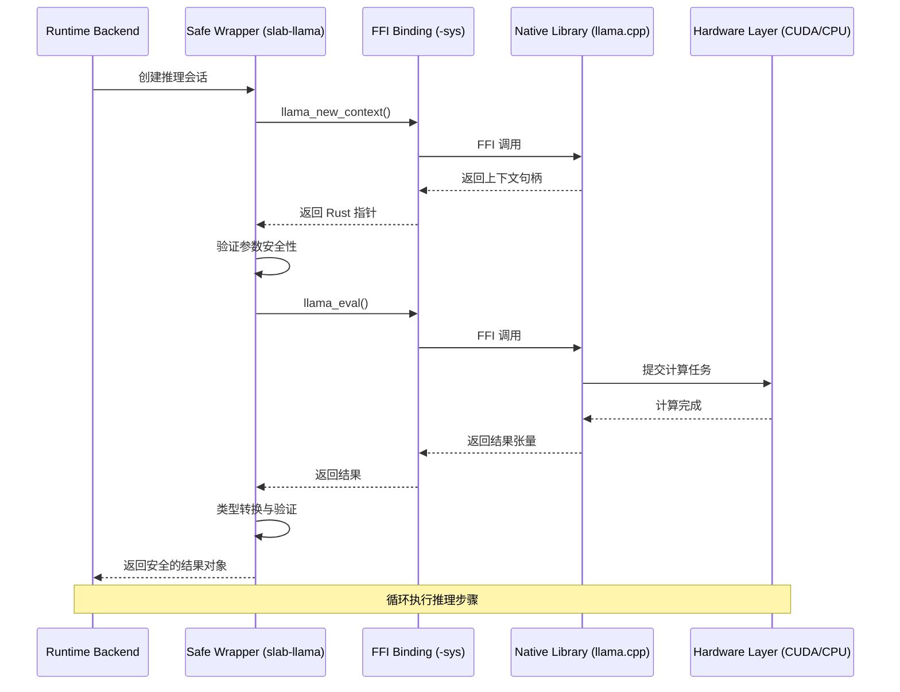

# 06 推理引擎 (Inference Engines) 文档

## 文档元数据

| 项目 | 内容 |
|------|------|
| 文件名 | 06_inference_engines.md |
| 版本 | 1.0.0 |
| 状态 | 初稿 |
| 创建日期 | 2026-06-12 |
| 作者 | Slab 项目组 |
| 组件名称 | 推理引擎 Crates (Inference Engine Crates) |
| 依赖文档 | 04_runtime_worker.md, 05_business_logic_core.md |

---

## 1. 功能概述与用户故事

### 1.1 组件定位

Slab 的推理引擎层提供了一系列用于本地 AI 推理的 Rust 绑定和封装，涵盖大语言模型（LLM）、语音识别（ASR）、图像生成（Diffusion）等多种 AI 能力。每个引擎遵循 **"-sys crate + 安全封装 crate"** 的双层架构模式。

### 1.2 核心价值主张

- **FFI 安全封装**：通过 bindgen 生成 -sys crate，在上层提供类型安全的 Rust API
- **多硬件支持**：自动检测并使用 CUDA、HIP、Metal、Vulkan 等加速方案
- **模块化设计**：每个引擎独立发布，可按需集成
- **本地优先**：所有推理在本地执行，无需外部 API 调用

### 1.3 用户故事

#### 故事 1：用户在 NVIDIA GPU 上运行 LLM
> 作为拥有 NVIDIA GPU 的用户，我希望系统能自动检测并使用 CUDA 加速，以便：
> - 获得最快的推理速度
> - 无需手动配置环境变量
> - 在 GPU 不可用时自动降级到 CPU

#### 故事 2：开发者添加新的模型架构支持
> 作为引擎开发者，我希望通过 Candle 框架支持新的模型架构（如最新的 Transformer 变体），以便：
> - 利用纯 Rust 实现的安全性
> - 复用现有的调度和管理机制
> - 快速验证新架构性能

#### 故事 3：Mac 用户进行语音转写
> 作为 Mac 用户，我希望使用 Metal 加速的 Whisper 引擎进行语音转写，以便：
> - 充分利用 Apple Silicon 的性能
> - 获得实时转写体验
> - 不需要外部云服务

---

## 2. 核心业务逻辑与流程

### 2.1 引擎架构分层

```
推理引擎分层架构：
┌─────────────────────────────────────────────────────────────┐
│                    Runtime Worker (slab-runtime)             │
│              ┌─────────────────────────────────────┐         │
│              │     Backend Registration & Dispatch │         │
│              └─────────────────────────────────────┘         │
└─────────────────────────────────────────────────────────────┘
                              │
        ┌─────────────────────┼─────────────────────┐
        │                     │                     │
┌───────▼────────┐  ┌────────▼────────┐  ┌────────▼────────┐
│  slab-llama     │  │  slab-whisper    │  │  slab-diffusion │
│  (Safe Wrapper) │  │  (Safe Wrapper) │  │  (Safe Wrapper) │
├────────────────┤  ├─────────────────┤  ├─────────────────┤
│ slab-llama-sys │  │slab-whisper-sys │  │slab-diffusion-  │
│  (FFI Binding) │  │  (FFI Binding)  │  │  sys (FFI Bind) │
└────────┬───────┘  └────────┬────────┘  └────────┬────────┘
         │                   │                     │
┌────────▼────────┐  ┌──────▼──────────┐  ┌────────▼────────┐
│    llama.cpp    │  │   whisper.cpp   │  │   Diffusion C   │
│     (Native)    │  │     (Native)    │  │     (Native)    │
└─────────────────┘  └─────────────────┘  └─────────────────┘
         │                   │                     │
┌────────▼───────────────────────────────────────────────────┐
│                    Hardware Acceleration                     │
│  [CUDA] [HIP] [Metal] [Vulkan] [CPU Fallback]               │
└─────────────────────────────────────────────────────────────┘
```

### 2.2 核心流程图

#### 2.2.1 引擎加载与初始化流程

```mermaid
flowchart TD
    Start([Runtime Worker 启动]) --> Detect[检测硬件加速支持]
    
    Detect --> CUDA{NVIDIA GPU<br/>可用?}
    Detect --> HIP{AMD GPU<br/>可用?}
    Detect --> Metal{Apple<br/>Silicon?}
    Detect --> Vulkan{Vulkan<br/>可用?}
    
    CUDA -->|是| LoadCUDA[加载 CUDA 库]
    CUDA -->|否| CheckHIP
    
    HIP -->|是| LoadHIP[加载 HIP 库]
    HIP -->|否| CheckMetal
    
    CheckHIP[HIP 检测] --> HIP
    CheckMetal[Metal 检测] --> Metal
    CheckVulkan[Vulkan 检测] --> Vulkan
    
    Metal -->|是| LoadMetal[加载 Metal 框架]
    Metal -->|否| CheckVulkan
    
    Vulkan -->|是| LoadVulkan[加载 Vulkan]
    Vulkan -->|否| CPUOnly[仅 CPU 模式]
    
    LoadCUDA --> InitGGML[初始化 slab-ggml]
    LoadHIP --> InitGGML
    LoadMetal --> InitGGML
    LoadVulkan --> InitGGML
    CPUOnly --> InitGGML
    
    InitGGML --> RegisterLLama[注册 Llama 引擎]
    InitGGML --> RegisterWhisper[注册 Whisper 引擎]
    
    RegisterLLama --> TestLLama[测试 Llama 推理]
    RegisterWhisper --> TestWhisper[测试 Whisper 推理]
    
    TestLLama --> Ready([引擎就绪])
    TestWhisper --> Ready
    
    style CUDA fill:#76b900
    style HIP fill:#ff4500
    style Metal fill:#a8aaad
    style Vulkan fill:#1a1a1a
    style CPUOnly fill:#888888
```



#### 2.2.2 推理执行流程



### 2.3 引擎详解

#### 2.3.1 slab-ggml / slab-ggml-sys
- **定位**：底层张量运算库的 FFI 封装
- **上游**：ggml C 库
- **功能**：
  - 张量创建、操作、运算
  - 量化支持（4-bit, 5-bit, 8-bit）
  - 多后端抽象（CUDA, Metal, Vulkan, CPU）
- **使用场景**：被 slab-llama 和 slab-whisper 底层依赖

#### 2.3.2 slab-llama / slab-llama-sys
- **定位**：LLM 聊天补全引擎
- **上游**：llama.cpp
- **支持模型**：
  - LLaMA/LLaMA 2/LLaMA 3
  - Mistral / Mixtral
  - Qwen
  - 其他 GGUF 格式模型
- **功能特性**：
  - 流式 token 生成
  - 上下文窗口管理
  - 采样策略控制
  - 多 GPU 并行推理

#### 2.3.3 slab-whisper / slab-whisper-sys
- **定位**：语音转写引擎
- **上游**：whisper.cpp（Slab 定制分支）
- **功能**：
  - 多语言语音识别
  - 时间戳输出
  - 翻译模式（transcribe + translate）
  - 流式音频处理
- **特点**：基于 whisper-rs 修改，集成 Slab 特定优化

#### 2.3.4 slab-candle
- **定位**：Candle ML 框架集成
- **上游**：Hugging Face Candle
- **用途**：
  - 实验性模型架构支持
  - 自定义模型训练/推理
  - 跨框架兼容
- **特点**：纯 Rust 实现，内存安全保证

#### 2.3.5 slab-diffusion / slab-diffusion-sys
- **定位**：图像生成引擎
- **上游**：Stable Diffusion C 绑定
- **功能**：
  - 文本到图像生成
  - 图像到图像转换
  - ControlNet 支持
  - LoRA 模型加载
- **硬件加速**：CUDA 优先，支持 CPU fallback

---

## 3. 功能点原子级拆分

| 功能点 ID | 功能名称 | 输入/触发条件 | 处理逻辑 | 输出/响应 | 异常与边界处理 |
|-----------|----------|---------------|-----------|-----------|----------------|
| IE-001 | 硬件加速检测 | 引擎初始化 | 1. 扫描系统 GPU 列表<br>2. 检测 CUDA/HIP/Metal/Vulkan 库<br>3. 验证驱动版本兼容性 | 加速方案列表 | - 库缺失：降级到 CPU<br>- 版本过旧：警告<br>- 检测超时：使用 CPU |
| IE-002 | GGML 后端初始化 | Runtime 启动 | 1. 加载 slab-ggml-sys<br>2. 选择硬件后端<br>3. 初始化张量分配器 | GGML 上下文 | - 初始化失败：禁用相关引擎<br>- 内存分配失败：减少缓存<br>- 后端冲突：选择优先级高的 |
| IE-003 | Llama 模型加载 | 加载 GGUF 文件 | 1. 验证 GGUF 格式<br>2. 读取模型元数据<br>3. 分配权重内存<br>4. 初始化 KV Cache | 模型上下文句柄 | - 文件损坏：拒绝加载<br>- 量化不支持：警告<br>- 内存不足：返回错误 |
| IE-004 | Llama 推理执行 | 推理请求 | 1. 编码输入 token<br>2. 执行前向传播<br>3. 采样下一个 token<br>4. 更新 KV Cache | 生成的 token | - 上下文超长：截断<br>- 采样失败：重试<br>- KV Cache 满：停止生成 |
| IE-005 | 流式 token 生成 | 流式推理请求 | 1. 循环执行推理<br>2. 每个 token 立即返回<br>3. 检测停止条件<br>4. 清理临时状态 | Token 流 | - 连接断开：取消推理<br>- 生成速度慢：背压控制<br>- 停止词检测：终止生成 |
| IE-006 | Whisper 模型加载 | 加载 Whisper 模型 | 1. 验证模型文件<br>2. 初始化 mel 谱计算器<br>3. 分配音频缓冲区 | Whisper 上下文 | - 模型损坏：拒绝加载<br>- 音频格式不支持：转换 |
| IE-007 | 音频转写执行 | 音频数据输入 | 1. 预处理音频（重采样）<br>2. 计算 mel 谱图<br>3. 执行编码器推理<br>4. 解码器生成文本 | 转写文本 + 时间戳 | - 音频过长：分段处理<br>- 转写失败：返回部分结果<br>- 语言检测失败：使用默认 |
| IE-008 | 翻译模式执行 | 翻译请求 | 1. 先执行转写<br>2. 将文本送入翻译模型<br>3. 输出目标语言文本 | 翻译结果 | - 翻译模型未加载：拒绝<br>- 语言不支持：错误<br>- 翻译质量差：警告 |
| IE-009 | Candle 模型创建 | 自定义模型需求 | 1. 构建模型计算图<br>2. 加载权重<br>3. 编译优化 | Candle 模型实例 | - 计算图无效：返回错误<br>- 权重格式错误：拒绝<br>- 编译失败：使用解释模式 |
| IE-010 | Diffusion 模型加载 | 加载 SD 模型 | 1. 加载 UNet 权重<br>2. 加载 VAE 和 CLIP<br>3. 初始化调度器 | Diffusion 管道 | - 组件缺失：拒绝加载<br>- 版本不兼容：警告<br>- 内存不足：减少批次大小 |
| IE-011 | 图像生成执行 | 文本提示词输入 | 1. 编码文本（CLIP）<br>2. 采样噪声<br>3. 执行去噪循环<br>4. 解码图像（VAE） | 生成的图像 | - 提示词过长：截断<br>- 去噪步数过多：限制<br>- VAE 解码失败：返回潜变量 |
| IE-012 | 多 GPU 并行推理 | 多 GPU 检测 | 1. 分割模型层到各 GPU<br>2. 建立 GPU 间通信<br>3. 同步推理步骤 | 加速的推理结果 | - GPU 数量不足：警告<br>- 通信失败：降级到单 GPU<br>- 内存不均衡：重新分割 |
| IE-013 | 量化模型加载 | 加载量化 GGUF | 1. 读取量化元数据<br>2. 初始化反量化器<br>3. 验证量化精度 | 量化模型实例 | - 量化格式不支持：拒绝<br>- 反量化失败：加载全精度<br>- 精度过低：警告 |
| IE-014 | KV Cache 管理 | 推理执行中 | 1. 预分配 Cache 空间<br>2. 存储历史键值<br>3. 处理 Cache 满载 | Cache 状态 | - Cache 满清空旧内容<br>- 分配失败：减少大小<br>- 碎片化：整理空间 |
| IE-015 | LoRA 模型加载 | 加载 LoRA 权重 | 1. 验证 LoRA 兼容性<br>2. 合并到基础模型<br>3. 缩放因子应用 | 增强模型实例 | - LoRA 不兼容：拒绝<br>- 合并失败：保持基础模型<br>- 缩放无效：使用默认 |
| IE-016 | 引擎资源清理 | 卸载模型/关闭 | 1. 停止所有推理任务<br>2. 释放 GPU 内存<br>3. 卸载原生库 | 清理确认 | - 仍有任务：等待或强制<br>- 内存泄漏：记录警告<br>- 卸载失败：记录错误 |
| IE-017 | 采样策略控制 | 推理参数配置 | 1. 解析采样参数<br>2. 应用温度/top_p/重复惩罚<br>3. 实现采样算法 | 采样的 token | - 参数无效：使用默认<br>- 采样失败：重新采样<br>- 结果退化：调整策略 |
| IE-018 | 时间戳生成 | Whisper 转写 | 1. 对齐音频和时间<br>2. 生成逐字时间戳<br>3. 合并段落 | 带时间戳的转写 | - 对齐失败：返回无时间戳<br>- 时间精度低：警告<br>- 段落合并错误：手动调整 |
| IE-019 | 图像编码器处理 | ControlNet 输入 | 1. 加载输入图像<br>2. 提取特征图<br>3. 融合到生成流程 | 增强的生成控制 | - 图像尺寸错误：缩放<br>- 特征提取失败：跳过<br>- 融合失败：忽略 ControlNet |
| IE-020 | 批量推理执行 | 批量请求 | 1. 组合输入批次<br>2. 并行执行推理<br>3. 分离结果 | 批量结果 | - 批次大小超限：拆分<br>- 内存不足：减少批次<br>- 部分失败：返回部分成功 |
| IE-021 | 引擎健康检查 | 定期检查 | 1. 验证引擎状态<br>2. 检测 GPU 内存<br>3. 测试简单推理 | 健康状态 | - 检测失败：标记不健康<br>- 内存泄漏：警告<br>- 性能下降：记录 |
| IE-022 | FFI 错误处理 | 原生库调用 | 1. 捕获原生错误码<br>2. 转换为 Rust 错误<br>3. 添加上下文信息 | Rust Result 类型 | - 错误码未知：包装通用错误<br>- 错误传播：保持链式<br>- 严重错误：终止引擎 |
| IE-023 | 引擎性能监控 | 推理执行中 | 1. 测量推理耗时<br>2. 统计 GPU 利用率<br>3. 记录内存使用 | 性能指标 | - 测量失败：使用估算<br>- 数据过旧：标记过期<br>- 统计异常：过滤 |
| IE-024 | 模型格式验证 | 模型文件加载 | 1. 读取文件头<br>2. 验证魔数<br>3. 检查版本兼容性 | 验证结果 | - 魔数不匹配：拒绝<br>- 版本过旧：支持转换<br>- 格式损坏：拒绝加载 |

---

## 4. 非功能性需求与技术约束

### 4.1 性能要求

| 引擎 | 指标 | 要求 | 测试条件 |
|------|------|------|----------|
| Llama | 首延迟 | < 500ms | 7B 模型, GPU |
| Llama | 吞吐量 | > 30 tokens/s | 7B 模型, GPU |
| Llama | 吞吐量 | > 5 tokens/s | 7B 模型, CPU |
| Whisper | 转写速度 | < 实时时长 | 16kHz 音频 |
| Whisper | 准确率 | WER < 5% | 清晰语音 |
| Diffusion | 生成速度 | < 10s/图 | 512x512, 20 steps |
| Diffusion | 生成速度 | < 30s/图 | 512x512, CPU |

### 4.2 可靠性要求

- **FFI 安全**：所有原生调用通过 safe Rust 函数封装
- **内存管理**：RAII 模式管理原生资源生命周期
- **错误恢复**：引擎崩溃后可重启并恢复服务
- **资源清理**：确保 GPU 内存在进程退出前释放

### 4.3 安全性要求

- **输入验证**：所有模型文件和音频/图像数据验证
- **沙箱执行**：推理代码在受限环境执行
- **资源限制**：限制单个引擎的 GPU 内存上限
- **代码签名**：原生库验证签名（未来）

### 4.4 可维护性要求

- **模块化**：每个引擎独立编译和测试
- **文档完善**：-sys crate 包含完整的 bindgen 文档
- **版本兼容**：支持多版本原生库共存
- **调试友好**：保留原生库日志输出

### 4.5 技术约束

| 约束项 | 说明 |
|--------|------|
| 编译要求 | 需要 C/C++ 工具链构建 -sys crate |
| 平台支持 | Windows/macOS/Linux，硬件加速依赖平台 |
| Rust 版本 | 最新稳定版，使用 edition 2021 |
| 依赖管理 | 通过 Cargo.toml 严格指定版本 |
| 许可证 | 遵循上游原生库许可证（如 MIT/Apache） |

### 4.6 硬件加速优先级

```yaml
# 硬件检测优先级（从高到低）
acceleration_priority:
  - CUDA:      # NVIDIA GPU
      library: "libcuda.so" / "cuda.dll"
      min_version: "11.0"
      features: ["tensor cores", "multi-gpu"]
  
  - HIP:       # AMD GPU
      library: "libamdhip64.so" / "amdhip64.dll"
      min_version: "5.0"
      features: ["rocm"]
  
  - Metal:     # Apple Silicon
      framework: "Metal"
      min_os: "macOS 12.0"
      features: [" MPS graph"]
  
  - Vulkan:    # 跨平台
      library: "libvulkan.so" / "vulkan-1.dll"
      min_version: "1.2"
      features: ["compute shaders"]
  
  - CPU:       # 兜底方案
      features: ["SIMD (AVX2/NEON)", "multi-threading"]
```

---

## 5. 相关文档

- **依赖项目**：
  - [llama.cpp](https://github.com/ggerganov/llama.cpp) - LLM 推理引擎
  - [whisper.cpp](https://github.com/ggerganov/whisper.cpp) - 语音识别引擎
  - [Candle](https://github.com/huggingface/candle) - Rust ML 框架
  - [Stable Diffusion](https://github.com/Stability-AI/stablediffusion) - 图像生成

- **集成文档**：
  - [04_runtime_worker.md](04_runtime_worker.md) - Runtime Worker 集成
  - [05_business_logic_core.md](05_business_logic_core.md) - 业务逻辑调用

- **FFI 规范**：
  - [bindgen 使用指南](https://rust-lang.github.io/rust-bindgen/)
  - [FFI 安全最佳实践](https://doc.rust-lang.org/nomicon/ffi.html)

---

## 附录 A：引擎版本映射

| 引擎 Crate | 上游版本 | 支持模型格式 | 维护状态 |
|------------|----------|-------------|----------|
| slab-ggml | ggml (latest) | GGUF 内部 | 活跃 |
| slab-llama | llama.cpp b4055+ | GGUF (LLM) | 活跃 |
| slab-whisper | whisper.cpp v1.5+ | GGUF (Whisper) | 活跃 |
| slab-candle | Candle latest | Candle 格式 | 活跃 |
| slab-diffusion | SD 1.5/2.1 | Safetensors/.safetensors | 实验性 |

---

## 附录 B：性能调优参数

```toml
# 推理引擎性能配置示例
[engine_config]

[engine_config.llama]
# 批处理大小
batch_size = 512
# KV Cache 大小（token 数）
ctx_size = 2048
# 线程数
n_threads = 8
# GPU 层数（-1 = 全部 GPU 层）
n_gpu_layers = -1
# 内存映射（减少加载时间）
use_mmap = true
# 内存锁定（防止交换）
use_mlock = false

[engine_config.whisper]
# 音频处理线程
n_threads = 4
# 翻译模型加载
translate = false
# 语言（auto = 自动检测）
language = "auto"
# 任务类型（transcribe/translate）
task = "transcribe"

[engine_config.diffusion]
# 批处理大小
batch_size = 1
# 去噪步数
num_inference_steps = 20
# CFG 引导比例
guidance_scale = 7.5
# 图像尺寸
width = 512
height = 512
# 使用 CPU fallback
use_cpu = false
```
