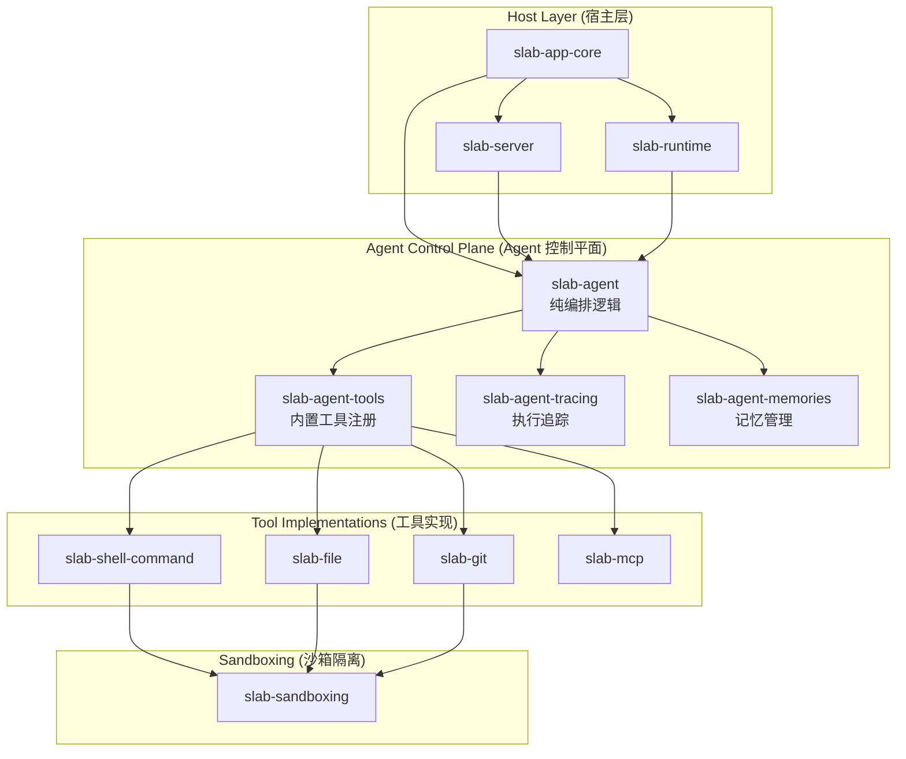
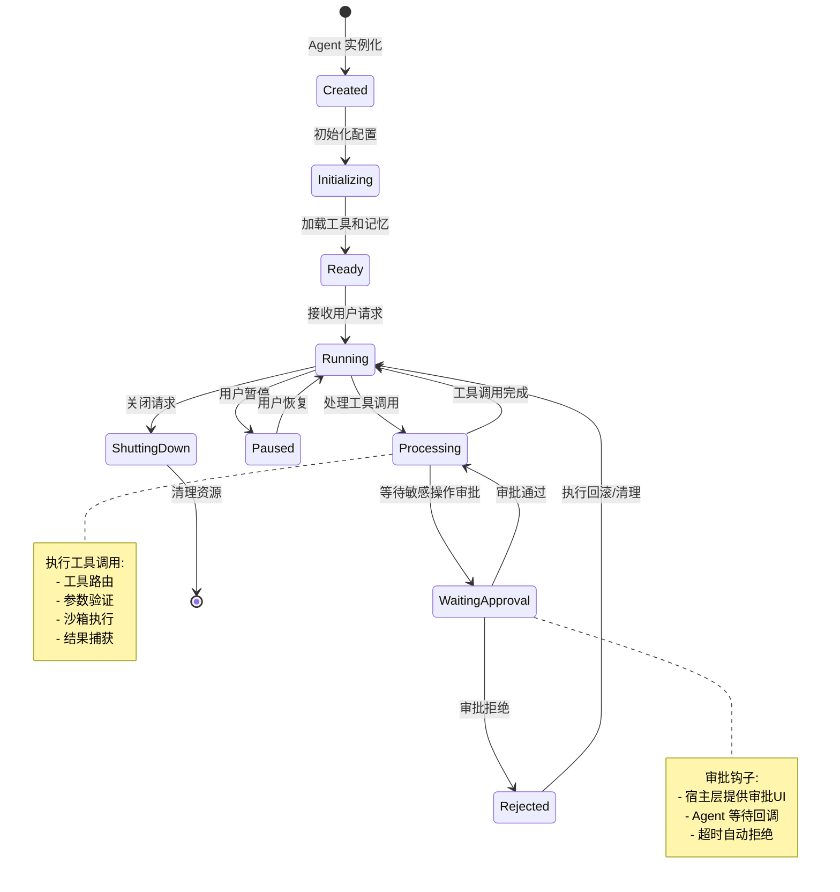

# Agent 编排系统技术设计文档

## 文档元数据

| 属性 | 值 |
|------|-----|
| 文件名 | 07_agent_system.md |
| 版本 | 1.0.0 |
| 状态 | Draft |
| 最后更新 | 2026-06-12 |
| 维护者 | Slab 核心团队 |

---

## 功能概述与用户故事

### 系统概述

Slab Agent 编排系统是一个轻量级、纯控制平面的 AI Agent 管理框架，负责协调多步骤 AI 工作流的执行、工具路由和生命周期管理。该系统设计为无状态的纯逻辑层，不涉及存储、网络通信或模型适配，确保架构的清晰性和可测试性。

### 用户故事

1. **作为开发者**，我需要一个纯控制平面的 Agent 管理库，以便能够在不同的宿主环境中（桌面应用、服务器、CLI）灵活集成 Agent 功能，而无需依赖特定的存储或网络实现。

2. **作为插件开发者**，我需要通过标准化的工具接口扩展 Agent 能力，包括内置工具（文件操作、Git 命令等）和自定义工具（MCP、自定义脚本等），同时保持清晰的权限边界。

3. **作为系统管理员**，我需要通过 Approval Hooks 机制对敏感工具调用进行细粒度审批控制，确保 Agent 在执行危险操作（如文件删除、网络请求）前经过授权。

4. **作为终端用户**，我需要 Agent 能够编排复杂的多步骤工作流（如"分析项目结构 → 生成文档 → 提交 Git"），并在每个步骤中获得清晰的执行追踪和错误反馈。

---

## 核心业务逻辑与流程

### 架构分层



### Agent 生命周期状态机



### 工具分发流程

```mermaid
sequenceDiagram
    participant User as 用户/宿主应用
    participant Agent as slab-agent
    participant Router as ToolRouter
    participant Tool as 工具实现
    participant Sandbox as 沙箱环境
    participant Hook as Approval Hook

    User->>Agent: 发起 Agent 请求
    Agent->>Agent: 生成工具调用计划
    Agent->>Router: 路由工具调用
    
    alt 需要审批的工具
        Router->>Hook: 触发审批钩子
        Hook->>User: 显示审批界面
        User->>Hook: 用户决策
        Hook-->>Router: 审批结果
        
        alt 审批拒绝
            Router-->>Agent: 返回拒绝错误
            Agent->>Agent: 调整策略跳过
        end
    end

    Router->>Sandbox: 创建沙箱上下文
    Sandbox->>Tool: 执行工具逻辑
    Tool-->>Sandbox: 返回执行结果
    Sandbox->>Sandbox: 清理资源
    Sandbox-->>Router: 返回最终结果
    Router-->>Agent: 工具调用结果
    Agent->>Agent: 更新对话记忆
    Agent-->>User: 返回响应

    Note over Router,Sandbox: 沙箱确保:
    - 文件系统隔离
    - 网络访问控制
    - 资源限制
    ```

### 多步骤工作流编排

```mermaid
graph LR
    A[用户请求] --> B{解析意图}
    B --> C[生成工作流计划]
    C --> D[步骤 1: 工具调用]
    D --> E{成功?}
    E -->|是| F[步骤 2: 工具调用]
    E -->|否| G[错误恢复]
    G --> H[调整策略]
    H --> D
    F --> I{成功?}
    I -->|是| J[步骤 N: 工具调用]
    I -->|否| G
    J --> K[综合结果]
    K --> L[更新记忆]
    L --> M[返回响应]

    style C fill:#e1f5e1
    style G fill:#ffe1e1
    style L fill:#e1e1ff
```

---

## 功能点原子级拆分

| ID | 功能模块 | 原子功能点 | 实现位置 | 依赖 | 优先级 |
|----|----------|-----------|----------|------|--------|
| AG-001 | slab-agent 核心引擎 | Agent 实例化与配置加载 | `crates/slab-agent/src/lib.rs` | 无 | P0 |
| AG-002 | slab-agent 核心引擎 | 线程管理与生命周期控制 | `crates/slab-agent/src/lifecycle.rs` | AG-001 | P0 |
| AG-003 | slab-agent 核心引擎 | 工具调用解析与验证 | `crates/slab-agent/src/turn_tool_call.rs` | AG-001 | P0 |
| AG-004 | slab-agent 核心引擎 | 多步骤工作流编排 | `crates/slab-agent/src/workflow.rs` | AG-003 | P1 |
| AG-005 | slab-agent 核心引擎 | 错误恢复与策略调整 | `crates/slab-agent/src/recovery.rs` | AG-004 | P1 |
| AG-006 | 工具路由系统 | ToolRouter 注册机制 | `crates/slab-agent/src/router/mod.rs` | AG-001 | P0 |
| AG-007 | 工具路由系统 | 基于端口（port）的抽象 | `crates/slab-agent/src/router/port.rs` | AG-006 | P0 |
| AG-008 | 工具路由系统 | 工具发现与加载 | `crates/slab-agent/src/router/discovery.rs` | AG-006 | P1 |
| AG-009 | 审批钩子系统 | Approval Hook 接口定义 | `crates/slab-agent/src/hooks/mod.rs` | AG-003 | P0 |
| AG-010 | 审批钩子系统 | 敏感工具标记策略 | `crates/slab-agent/src/hooks/sensitivity.rs` | AG-009 | P1 |
| AG-011 | 审批钩子系统 | 审批超时与拒绝处理 | `crates/slab-agent/src/hooks/timeout.rs` | AG-009 | P2 |
| AG-012 | 内置工具集 | Shell 命令工具注册 | `crates/slab-agent-tools/src/shell.rs` | AG-006 | P0 |
| AG-013 | 内置工具集 | 文件操作工具注册 | `crates/slab-agent-tools/src/file.rs` | AG-006 | P0 |
| AG-014 | 内置工具集 | Git 操作工具注册 | `crates/slab-agent-tools/src/git.rs` | AG-006 | P1 |
| AG-015 | 内置工具集 | MCP 工具聚合注册 | `crates/slab-agent-tools/src/mcp.rs` | AG-006 | P1 |
| AG-016 | 执行追踪 | Span 创建与上下文传播 | `crates/slab-agent-tracing/src/lib.rs` | AG-003 | P1 |
| AG-017 | 执行追踪 | 工具调用事件记录 | `crates/slab-agent-tracing/src/events.rs` | AG-016 | P1 |
| AG-018 | 记忆管理 | 对话上下文存储接口 | `crates/slab-agent-memories/src/context.rs` | AG-001 | P1 |
| AG-019 | 记忆管理 | 记忆检索与相关性评分 | `crates/slab-agent-memories/src/retrieval.rs` | AG-018 | P2 |
| AG-020 | 工具实现 | slab-shell-command 执行 | `crates/slab-shell-command/src/lib.rs` | 无 | P0 |
| AG-021 | 工具实现 | slab-file 安全文件操作 | `crates/slab-file/src/lib.rs` | 无 | P0 |
| AG-022 | 工具实现 | slab-git 命令封装 | `crates/slab-git/src/lib.rs` | 无 | P1 |
| AG-023 | 工具实现 | slab-mcp 工具聚合 | `crates/slab-mcp/src/lib.rs` | 无 | P1 |
| AG-024 | 沙箱支持 | 进程隔离与资源限制 | `crates/slab-sandboxing/src/lib.rs` | 无 | P2 |
| AG-025 | 沙箱支持 | 文件系统命名空间隔离 | `crates/slab-sandboxing/src/fs.rs` | AG-024 | P2 |

---

## 非功能性需求与技术约束

### 架构约束

1. **纯控制平面原则**
   - `slab-agent` crate 必须保持无状态、无副作用
   - 禁止直接实现存储、HTTP、SSE/WebSocket 或模型适配器
   - 所有 I/O 操作必须通过抽象接口委托给宿主层
   - 理由：确保控制逻辑可在不同环境（桌面、服务器、CLI）中复用

2. **工具注册边界**
   - 内置工具（deterministic）仅限 `slab-agent-tools` crate
   - 插件/API 适配器由宿主层（`slab-app-core`）注册
   - 工具路由表与具体实现解耦
   - 理由：保持核心库的简洁性和安全性

3. **审批传输分离**
   - `slab-agent` 定义 Approval Hook 接口
   - 宿主层提供审批 UI 和传输机制
   - Agent 通过回调/Channel 接收审批结果
   - 理由：支持不同宿主环境的审批 UI（桌面弹窗、CLI 交互、Web 界面）

### 性能要求

1. **工具调用延迟**
   - 单个工具调用（不含执行时间）< 10ms（路由 + 验证）
   - 审批超时可配置，默认 30 秒
   - 沙箱创建开销 < 50ms

2. **并发能力**
   - 支持多 Agent 实例并发执行
   - 工具调用线程池可配置（默认 4 线程）
   - 记忆检索异步化，不阻塞主流程

### 安全要求

1. **沙箱隔离**
   - 所有工具执行必须在受限环境中进行
   - 文件访问限制在授权工作区范围内
   - 禁止未授权的网络访问（除白名单域名）

2. **权限控制**
   - 敏感工具（文件删除、网络请求）必须触发审批
   - 工具权限与插件权限系统集成
   - 审计日志记录所有工具调用及其结果

3. **输入验证**
   - 工具参数必须经过严格类型检查和值验证
   - 防止注入攻击（Shell 命令、路径遍历等）
   - 最大递归深度限制（防止无限循环）

### 可观测性要求

1. **追踪标准**
   - 所有工具调用必须创建独立的 Span
   - 关键事件（审批、错误、重试）作为 Event 记录
   - 支持分布式追踪上下文传播

2. **日志规范**
   - 结构化日志（JSON 格式）
   - 日志级别：TRACE、DEBUG、INFO、WARN、ERROR
   - 敏感数据（密码、密钥）自动脱敏

### 测试要求

1. **单元测试覆盖率**
   - `slab-agent` 核心逻辑覆盖率 ≥ 90%
   - 工具路由逻辑覆盖率 100%
   - 审批钩子系统覆盖率 ≥ 85%

2. **集成测试**
   - 端到端工作流测试（至少 5 个真实场景）
   - 工具执行沙箱隔离测试
   - 错误恢复路径测试

### 文档要求

1. **API 文档**
   - 所有公共 API 必须有 Rustdoc 注释
   - 包含使用示例和错误场景说明
   - 关键概念（ToolRouter、Approval Hook）有独立文档页

2. **架构文档**
   - 组件交互图（使用 Mermaid）
   - 数据流说明
   - 扩展指南（如何添加自定义工具）

---

## 相关模块

- [08_model_hub.md](./08_model_hub.md) - 模型中心系统（为 Agent 提供模型能力）
- [09_plugin_system.md](./09_plugin_system.md) - 插件系统（通过 agentHooks 扩展 Agent）
- [05_chat_system.md](./05_chat_system.md) - 聊天系统（Agent 与用户交互界面）

---

## 变更历史

| 版本 | 日期 | 变更内容 | 作者 |
|------|------|----------|------|
| 1.0.0 | 2026-06-12 | 初始版本 | Slab 核心团队 |
