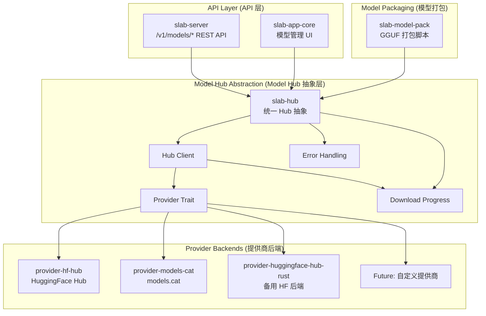
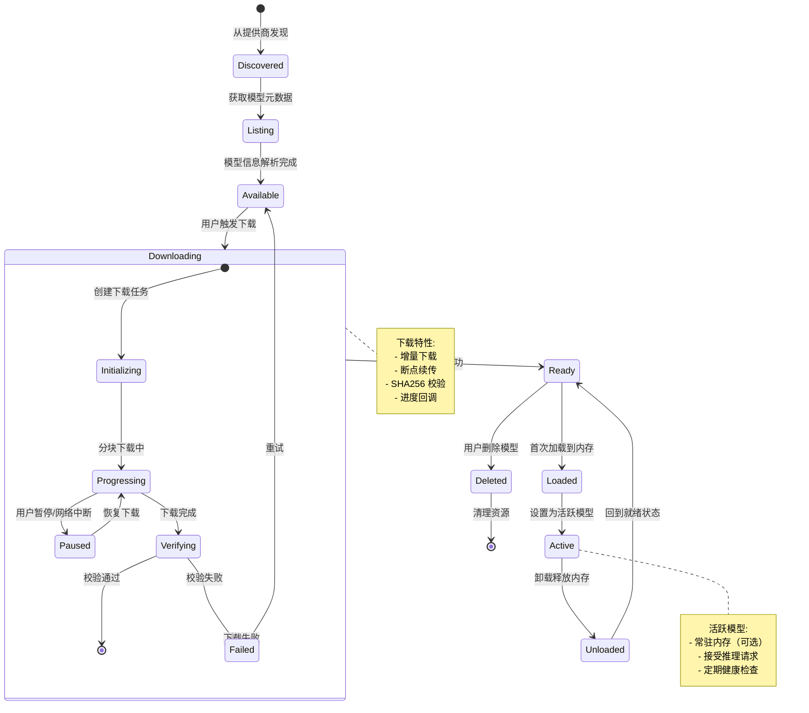
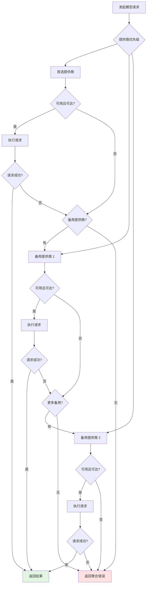

# Model Hub 系统技术设计文档

## 文档元数据

| 属性 | 值 |
|------|-----|
| 文件名 | 08_model_hub.md |
| 版本 | 1.0.0 |
| 状态 | Draft |
| 最后更新 | 2026-06-12 |
| 维护者 | Slab 核心团队 |

---

## 功能概述与用户故事

### 系统概述

Slab Model Hub 是一个统一的模型管理抽象层，负责从多个模型提供商（HuggingFace Hub、models.cat 等）发现、下载和管理本地模型。系统通过 feature-gated 的后端实现支持多种提供商，提供统一的 API 供上层应用（Agent、聊天、推理服务）使用。模型以 GGUF 格式打包，支持增量下载、进度追踪和自动健康检查。

### 用户故事

1. **作为终端用户**，我需要在一个统一的界面浏览所有可用的 AI 模型，包括本地已安装模型和云端可下载模型，以便选择最适合当前任务的模型。

2. **作为开发者**，我需要通过标准的 REST API (`/v1/models/*`) 集成模型管理功能，无需关心底层提供商的差异，实现模型切换、下载和删除等操作。

3. **作为系统管理员**，我需要监控模型下载进度、磁盘空间使用情况和模型健康状态，以便及时处理异常并优化资源分配。

4. **作为插件开发者**，我需要通过 `slab-hub` 提供的抽象接口扩展新的模型提供商（如自定义私有模型仓库），而无需修改上层应用代码。

---

## 核心业务逻辑与流程

### 架构概览



### 模型生命周期



### 提供商选择与降级流程



### 模型下载流程

```mermaid
sequenceDiagram
    participant User as 用户
    participant API as slab-server API
    participant Hub as slab-hub
    participant Provider as Provider Backend
    participant Storage as 本地存储
    participant Progress as 进度通知

    User->>API: POST /v1/models/download
    API->>Hub: start_download(model_id)
    Hub->>Hub: 验证磁盘空间
    Hub->>Provider: 获取模型元数据
    Provider-->>Hub: 元数据（大小、SHA256）
    
    Hub->>Storage: 创建临时下载目录
    Hub->>Hub: 初始化下载任务
    
    loop 分块下载
        Hub->>Provider: 请求分块（range request）
        Provider-->>Hub: 分块数据
        Hub->>Storage: 写入临时文件
        Hub->>Progress: 发送进度更新
        Progress-->>User: SSE/WebSocket 推送
    end
    
    Hub->>Hub: 计算文件 SHA256
    Hub->>Hub: 校验完整性
    
    alt 校验通过
        Hub->>Storage: 移动到最终位置
        Hub->>Hub: 更新模型注册表
        Hub-->>API: 下载完成
        API-->>User: 200 OK + 模型信息
    else 校验失败
        Hub->>Storage: 删除临时文件
        Hub-->>API: 校验失败错误
        API-->>User: 422 Unprocessable Entity
    end

    Note over Hub,Storage: 支持断点续传:
    - 记录已下载分块偏移
    - 网络中断后恢复
    - 跳过已完成的分块
```

---

## 功能点原子级拆分

| ID | 功能模块 | 原子功能点 | 实现位置 | 依赖 | 优先级 |
|----|----------|-----------|----------|------|--------|
| MH-001 | slab-hub 核心 | Hub 统一抽象定义 | `crates/slab-hub/src/lib.rs` | 无 | P0 |
| MH-002 | slab-hub 核心 | Hub Client 实现 | `crates/slab-hub/src/client.rs` | MH-001 | P0 |
| MH-003 | slab-hub 核心 | Provider Trait 定义 | `crates/slab-hub/src/provider/mod.rs` | MH-001 | P0 |
| MH-004 | slab-hub 核心 | 错误处理与类型定义 | `crates/slab-hub/src/error.rs` | MH-001 | P0 |
| MH-005 | slab-hub 核心 | 下载进度跟踪 | `crates/slab-hub/src/progress.rs` | MH-001 | P0 |
| MH-006 | slab-hub 核心 | 提供商健康检查 | `crates/slab-hub/src/health.rs` | MH-003 | P1 |
| MH-007 | slab-hub 核心 | 提供商降级策略 | `crates/slab-hub/src/fallback.rs` | MH-006 | P1 |
| MH-008 | provider-hf-hub | HuggingFace Hub 实现 | `crates/slab-hub/provider-hf-hub/` | MH-003 | P0 |
| MH-009 | provider-hf-hub | 模型列表获取 | `crates/slab-hub/provider-hf-hub/src/list.rs` | MH-008 | P0 |
| MH-010 | provider-hf-hub | 模型元数据解析 | `crates/slab-hub/provider-hf-hub/src/metadata.rs` | MH-008 | P0 |
| MH-011 | provider-hf-hub | 分块下载实现 | `crates/slab-hub/provider-hf-hub/src/download.rs` | MH-008 | P0 |
| MH-012 | provider-hf-hub | HF API 认证 | `crates/slab-hub/provider-hf-hub/src/auth.rs` | MH-008 | P1 |
| MH-013 | provider-models-cat | models.cat 后端实现 | `crates/slab-hub/provider-models-cat/` | MH-003 | P0 |
| MH-014 | provider-huggingface-hub-rust | 备用 HF 后端 | `crates/slab-hub/provider-huggingface-hub-rust/` | MH-003 | P1 |
| MH-015 | slab-model-pack | GGUF 打包脚本 | `crates/slab-model-pack/scripts/` | 无 | P1 |
| MH-016 | slab-model-pack | 模型量化配置 | `crates/slab-model-pack/config/` | 无 | P1 |
| MH-017 | API - 模型列表 | GET /v1/models | `bin/slab-server/src/api/models.rs` | MH-002 | P0 |
| MH-018 | API - 模型下载 | POST /v1/models/download | `bin/slab-server/src/api/models.rs` | MH-002 | P0 |
| MH-019 | API - 下载进度 | GET /v1/models/download/:id/progress | `bin/slab-server/src/api/models.rs` | MH-005 | P0 |
| MH-020 | API - 取消下载 | DELETE /v1/models/download/:id | `bin/slab-server/src/api/models.rs` | MH-005 | P1 |
| MH-021 | API - 切换模型 | PUT /v1/models/active | `bin/slab-server/src/api/models.rs` | MH-002 | P0 |
| MH-022 | API - 删除模型 | DELETE /v1/models/:id | `bin/slab-server/src/api/models.rs` | MH-002 | P1 |
| MH-023 | API - 模型元数据 | GET /v1/models/:id | `bin/slab-server/src/api/models.rs` | MH-002 | P1 |
| MH-024 | 存储 | 模型注册表持久化 | `crates/slab-hub/src/storage/registry.rs` | 无 | P0 |
| MH-025 | 存储 | 磁盘空间检查 | `crates/slab-hub/src/storage/disk.rs` | 无 | P0 |
| MH-026 | 存储 | 模型文件完整性校验 | `crates/slab-hub/src/storage/integrity.rs` | 无 | P0 |
| MH-027 | 通知 | 进度 SSE 推送 | `bin/slab-server/src/sse/models.rs` | MH-005 | P0 |
| MH-028 | 通知 | 下载完成通知 | `bin/slab-server/src/notify/models.rs` | MH-005 | P1 |

---

## 非功能性需求与技术约束

### 架构约束

1. **提供商抽象原则**
   - 所有提供商必须实现统一的 Provider Trait
   - 提供商切换对上层透明
   - 支持动态注册新提供商（无需重新编译）
   - 理由：确保系统可扩展性和提供商灵活性

2. **Feature-gated 实现**
   - 提供商后端通过 Rust feature flags 启用/禁用
   - 默认启用最稳定的后端（provider-hf-hub）
   - 备用后端可选启用
   - 理由：减少二进制大小，允许用户按需选择

3. **API 兼容性**
   - REST API 遵循 OpenAPI 3.0 规范
   - 保持向后兼容性（至少一个大版本）
   - 错误响应遵循 RFC 7807 (Problem Details)
   - 理由：确保第三方集成稳定性

### 性能要求

1. **下载性能**
   - 支持并发分块下载（默认 4 连接）
   - 断点续传恢复时间 < 1 秒
   - 进度更新延迟 < 100ms
   - 大文件（>10GB）下载稳定

2. **查询性能**
   - 模型列表查询延迟 < 500ms（含网络请求）
   - 本地模型列表查询 < 50ms
   - 元数据缓存 TTL 5 分钟

3. **存储效率**
   - 模型文件压缩率 ≥ 80%（GGUF 格式）
   - 注册表大小 < 1MB（1000 个模型）
   - 磁盘空间预留准确率 ≥ 95%

### 可靠性要求

1. **下载可靠性**
   - 自动重试（最多 3 次，指数退避）
   - 网络中断自动恢复
   - 校验失败自动清理临时文件
   - 下载任务持久化（进程重启可恢复）

2. **提供商可用性**
   - 健康检查间隔 30 秒
   - 故障提供商自动标记为不可用
   - 可用性恢复后自动重新启用
   - 降级策略可配置（优先级、权重）

3. **数据完整性**
   - 所有下载文件必须 SHA256 校验
   - 元数据签名验证（支持时）
   - 注册表原子更新
   - 损坏文件自动重新下载

### 安全要求

1. **模型安全**
   - 下载来源验证（TLS 1.3+）
   - 模型完整性校验（SHA256）
   - 恶意模型扫描（可选，未来支持）
   - 沙箱环境执行模型（未来支持）

2. **API 安全**
   - 认证：Bearer Token / API Key
   - 授权：基于角色的访问控制（RBAC）
   - 速率限制：每用户 10 req/s
   - 审计日志：所有模型操作记录

3. **存储安全**
   - 模型目录权限限制（所有者独占）
   - 临时文件自动清理
   - 敏感信息（API Token）加密存储

### 可扩展性要求

1. **提供商扩展**
   - 新提供商实现无需修改核心代码
   - Provider Trait 清晰文档
   - 提供商示例代码
   - 集成测试模板

2. **存储扩展**
   - 支持不同存储后端（本地、S3、NFS）
   - 存储接口抽象化
   - 存储策略可配置（缓存、分层）

3. **通知扩展**
   - 支持多种通知渠道（SSE、WebSocket、HTTP Callback）
   - 事件格式标准化（CloudEvents）
   - 通知过滤与订阅

### 可观测性要求

1. **监控指标**
   - 下载成功率
   - 下载平均耗时（P50、P95、P99）
   - 提供商可用性
   - 磁盘使用率
   - 活跃模型数量

2. **日志规范**
   - 结构化日志（JSON 格式）
   - 下载任务完整追踪（Trace ID）
   - 错误堆栈完整记录
   - 敏感数据（Token、路径）脱敏

3. **告警规则**
   - 下载失败率 > 10%
   - 提供商不可用
   - 磁盘空间 < 10%
   - 模型校验失败

### 测试要求

1. **单元测试**
   - Provider 实现覆盖率 ≥ 80%
   - 错误处理路径覆盖率 100%
   - 进度计算逻辑覆盖率 100%

2. **集成测试**
   - 真实提供商 E2E 测试（至少 2 个）
   - 下载中断恢复测试
   - 并发下载测试
   - 大文件下载测试（>5GB）

3. **性能测试**
   - 下载吞吐量基准测试
   - 并发请求压力测试
   - 内存泄漏检测（长时间运行）

---

## 相关模块

- [07_agent_system.md](./07_agent_system.md) - Agent 系统（模型的使用者）
- [09_plugin_system.md](./09_plugin_system.md) - 插件系统（可扩展模型提供商）
- [06_runtime_system.md](./06_runtime_system.md) - 运行时系统（模型执行环境）

---

## 变更历史

| 版本 | 日期 | 变更内容 | 作者 |
|------|------|----------|------|
| 1.0.0 | 2026-06-12 | 初始版本 | Slab 核心团队 |
