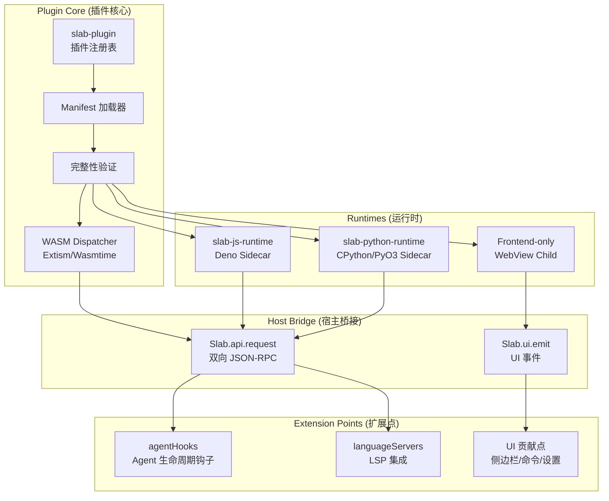
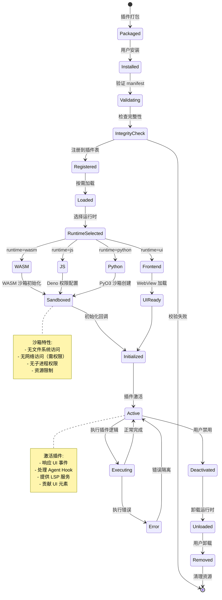
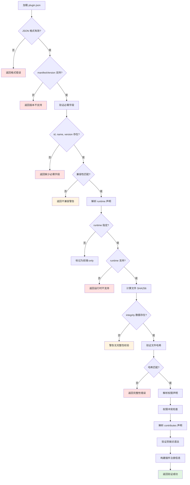

# Plugin 系统技术设计文档

## 文档元数据

| 属性 | 值 |
|------|-----|
| 文件名 | 09_plugin_system.md |
| 版本 | 1.0.0 |
| 状态 | Draft |
| 最后更新 | 2026-06-12 |
| 维护者 | Slab 核心团队 |

---

## 功能概述与用户故事

### 系统概述

Slab Plugin System 是一个多运行时、框架无关的插件管理框架，支持 WASM、JavaScript (Deno)、Python (CPython/PyO3) 和前端-only (WebView) 四种插件类型。系统通过统一的 `plugin.json` Manifest 定义插件元数据、权限声明和功能贡献点（Contributes），并通过细粒度的权限控制和沙箱隔离确保插件安全性。插件可通过 agentHooks 扩展 Agent 能力，通过语言服务器（LSP）集成提供代码智能，通过 UI 贡献点扩展用户界面。

### 用户故事

1. **作为插件开发者**，我需要使用熟悉的语言（JavaScript/TypeScript、Python、Rust/WASM）编写插件，并通过标准的 manifest 声明所需权限和功能，以便快速集成到 Slab 生态系统中。

2. **作为终端用户**，我需要从插件市场发现和安装插件，自动获得相应的功能（侧边栏面板、命令、Agent 能力等），同时清楚了解每个插件的权限范围。

3. **作为安全审计员**，我需要验证插件的权限声明与实际行为一致，确保插件无法访问超出声明范围的资源（文件、网络、Agent 能力等）。

4. **作为系统集成商**，我需要通过 agentHooks 将自定义工具和工作流注入 Slab Agent，使其具备特定领域的专业能力（如代码分析、文档生成等）。

---

## 核心业务逻辑与流程

### 架构概览



### 插件生命周期



### Manifest 验证流程



### 权限执行流程

```mermaid
sequenceDiagram
    participant Plugin as 插件代码
    participant Runtime as 运行时
    participant Bridge as Host Bridge
    participant Auth as 权限检查器
    participant Resource as 系统资源

    Plugin->>Runtime: 请求操作（读文件）
    Runtime->>Bridge: Slab.api.request("file.read", path)
    Bridge->>Auth: 检查权限
    
    alt 权限已授予
        Auth-->>Bridge: 权限有效
        Bridge->>Resource: 执行操作
        Resource-->>Bridge: 操作结果
        Bridge-->>Runtime: 返回结果
        Runtime-->>Plugin: 返回数据
    else 权限未授予
        Auth-->>Bridge: 权限拒绝
        Bridge-->>Runtime: 抛出 PermissionDenied
        Runtime->>Plugin: 返回错误
    else 权限需用户批准
        Auth-->>Bridge: 需要审批
        Bridge->>Auth: 显示审批对话框
        Auth->>Auth: 用户决策
        
        alt 用户批准
            Auth-->>Bridge: 一次性批准
            Bridge->>Resource: 执行操作
            Resource-->>Bridge: 操作结果
            Bridge-->>Runtime: 返回结果
        else 用户拒绝
            Auth-->>Bridge: 用户拒绝
            Bridge-->>Runtime: 抛出 PermissionDenied
        end
    end

    Note over Bridge,Auth: 权限类型:
    - network: 网络访问（域名白名单）
    - files: 文件访问（路径范围）
    - agent: Agent 能力调用
    - slabApi: API 访问
    - ui: UI 修改权限
```

### 多运行时分发

```mermaid
graph TD
    A[插件请求] --> B{runtime 类型}
    
    B -->|wasm| C[WASM Dispatcher]
    B -->|js| D[JS Runtime]
    B -->|python| E[Python Runtime]
    B -->|ui| F[Frontend UI]
    
    C --> G{WASM 引擎选择}
    G -->|默认| H[Extism]
    G -->|配置| I[Wasmtime]
    
    H --> J[WASM 模块实例化]
    I --> J
    J --> K[Extism Host Function 调用]
    
    D --> L[Deno 实例创建]
    L --> M[权限白名单配置]
    M --> N[JS/TS 执行]
    N --> O[JSON-RPC over stdio/Unix Socket]
    
    E --> P[CPython 解释器初始化]
    P --> Q[PyO3 沙箱创建]
    Q --> R[.py/.slabpy 加载]
    R --> S[Python 代码执行]
    S --> T[JSON-RPC Bridge]
    
    F --> U[Child WebView 创建]
    U --> V[plugin.html 加载]
    V --> W[@slab/plugin-ui 初始化]
    W --> X[window.Slab.ui.emit 事件]

    style K fill:#e1f5e1
    style O fill:#e1f5e1
    style T fill:#e1f5e1
    style X fill:#e1f5e1
```

---

## 功能点原子级拆分

| ID | 功能模块 | 原子功能点 | 实现位置 | 依赖 | 优先级 |
|----|----------|-----------|----------|------|--------|
| PL-001 | slab-plugin 核心 | 插件注册表实现 | `crates/slab-plugin/src/registry.rs` | 无 | P0 |
| PL-002 | slab-plugin 核心 | Manifest 加载与解析 | `crates/slab-plugin/src/manifest.rs` | 无 | P0 |
| PL-003 | slab-plugin 核心 | 完整性验证（SHA256） | `crates/slab-plugin/src/integrity.rs` | PL-002 | P0 |
| PL-004 | slab-plugin 核心 | 权限声明解析 | `crates/slab-plugin/src/permissions.rs` | PL-002 | P0 |
| PL-005 | slab-plugin 核心 | Contributes 解析 | `crates/slab-plugin/src/contributes.rs` | PL-002 | P0 |
| PL-006 | WASM 运行时 | Extism WASM Dispatcher | `crates/slab-plugin/src/wasm/extism.rs` | PL-001 | P0 |
| PL-007 | WASM 运行时 | Wasmtime Dispatcher（备选） | `crates/slab-plugin/src/wasm/wasmtime.rs` | PL-001 | P1 |
| PL-008 | WASM 运行时 | Host Functions 注册 | `crates/slab-plugin/src/wasm/host.rs` | PL-006 | P0 |
| PL-009 | JS 运行时 | Deno Sidecar 管理 | `bin/slab-js-runtime/src/main.rs` | 无 | P0 |
| PL-010 | JS 运行时 | JSON-RPC over stdio | `bin/slab-js-runtime/src/stdio.rs` | PL-009 | P0 |
| PL-011 | JS 运行时 | JSON-RPC over Unix Socket | `bin/slab-js-runtime/src/unix.rs` | PL-009 | P1 |
| PL-012 | JS 运行时 | 权限白名单配置 | `bin/slab-js-runtime/src/permissions.rs` | PL-009 | P0 |
| PL-013 | JS 运行时 | LSP 模式支持 | `bin/slab-js-runtime/src/lsp.rs` | PL-009 | P1 |
| PL-014 | Python 运行时 | PyO3 Sidecar 管理 | `bin/slab-python-runtime/src/main.rs` | 无 | P0 |
| PL-015 | Python 运行时 | .py 文件加载 | `bin/slab-python-runtime/src/loader.rs` | PL-014 | P0 |
| PL-016 | Python 运行时 | .slabpy Bundle 支持 | `bin/slab-python-runtime/src/bundle.rs` | PL-014 | P1 |
| PL-017 | Python 运行时 | 沙箱隔离（subprocess/ctypes 禁用） | `bin/slab-python-runtime/src/sandbox.rs` | PL-014 | P0 |
| PL-018 | Python 运行时 | JSON-RPC Bridge | `bin/slab-python-runtime/src/bridge.rs` | PL-014 | P0 |
| PL-019 | 前端运行时 | Child WebView 管理 | `crates/slab-plugin/src/ui/webview.rs` | PL-001 | P0 |
| PL-020 | 前端运行时 | @slab/plugin-ui SDK | `packages/plugin-ui/` | 无 | P0 |
| PL-021 | 前端运行时 | @slab/plugin-sdk Bridge | `packages/plugin-sdk/` | 无 | P0 |
| PL-022 | agentHooks | Agent 生命周期钩子 | `crates/slab-plugin/src/hooks/agent.rs` | PL-005 | P0 |
| PL-023 | agentHooks | beforeToolCall 钩子 | `crates/slab-plugin/src/hooks/before_tool.rs` | PL-022 | P0 |
| PL-024 | agentHooks | afterToolCall 钩子 | `crates/slab-plugin/src/hooks/after_tool.rs` | PL-022 | P0 |
| PL-025 | agentHooks | agentCapabilities 贡献 | `crates/slab-plugin/src/contributes/capabilities.rs` | PL-005 | P1 |
| PL-026 | 语言服务器 | LSP 客户端管理 | `crates/slab-plugin/src/lsp/client.rs` | PL-005 | P1 |
| PL-027 | 语言服务器 | languageServers 贡献解析 | `crates/slab-plugin/src/contributes/lsp.rs` | PL-005 | P1 |
| PL-028 | UI 贡献点 | routes 贡献（HTTP 路由） | `crates/slab-plugin/src/contributes/routes.rs` | PL-005 | P1 |
| PL-029 | UI 贡献点 | sidebar 贡献（侧边栏面板） | `crates/slab-plugin/src/contributes/sidebar.rs` | PL-005 | P0 |
| PL-030 | UI 贡献点 | commands 贡献（命令注册） | `crates/slab-plugin/src/contributes/commands.rs` | PL-005 | P0 |
| PL-031 | UI 贡献点 | settings 贡献（设置界面） | `crates/slab-plugin/src/contributes/settings.rs` | PL-005 | P1 |
| PL-032 | 插件打包 | slab-plugin-cli 实现 | `bin/slab-plugin-cli/` | 无 | P0 |
| PL-033 | 插件打包 | pack 命令（插件打包） | `bin/slab-plugin-cli/src/pack.rs` | PL-032 | P0 |
| PL-034 | 插件打包 | validate 命令（manifest 验证） | `bin/slab-plugin-cli/src/validate.rs` | PL-032 | P1 |
| PL-035 | 权限系统 | network 权限执行 | `crates/slab-plugin/src/permissions/network.rs` | PL-004 | P0 |
| PL-036 | 权限系统 | files 权限执行 | `crates/slab-plugin/src/permissions/files.rs` | PL-004 | P0 |
| PL-037 | 权限系统 | agent 权限执行 | `crates/slab-plugin/src/permissions/agent.rs` | PL-004 | P1 |
| PL-038 | 权限系统 | 权限批准 UI | `crates/slab-app-core/src/ui/permissions.rs` | 无 | P0 |

---

## 非功能性需求与技术约束

### 架构约束

1. **框架无关性**
   - `slab-plugin` crate 不依赖 Tauri、Electron 或其他宿主框架
   - 插件格式与宿主解耦
   - 支持未来多宿主（桌面、Web、CLI）
   - 理由：确保插件生态的可移植性

2. **运行时边界清晰**
   - JS 执行归 `slab-js-runtime`
   - Python 执行归 `slab-python-runtime`
   - `slab-plugin` 仅负责调度和桥接
   - 理由：职责分离，便于独立升级运行时

3. **沙箱不可变原则**
   - 所有运行时必须禁止以下默认访问：
     - 文件系统（除非显式授权）
     - 网络（除非显式授权）
     - 子进程创建
     - 动态库加载（ctypes、ffi）
   - 理由：确保插件无法突破权限边界

### 安全要求

1. **Manifest 安全**
   - 完整性验证强制启用（SHA256）
   - 未经验证的插件拒绝加载
   - Manifest 签名验证（未来支持）
   - 降级攻击防护（版本回滚检测）

2. **权限最小化原则**
   - 插件仅能访问声明范围内的资源
   - 越权访问立即终止并记录
   - 权限授予可撤销（运行时和持久化）
   - 敏感操作二次确认（文件删除、网络外联）

3. **沙箱隔离强度**
   - 进程级隔离（JS/Python 独立进程）
   - 内存隔离（WASM 线性内存隔离）
   - 资源限制（CPU、内存、文件描述符）
   - 逃逸检测（禁止 syscalls、ptrace）

4. **审计与监控**
   - 所有插件操作记录审计日志
   - 权限使用统计（可审查）
   - 异常行为检测（频繁访问、异常路径）
   - 安全事件告警

### 性能要求

1. **启动性能**
   - 插件加载延迟 < 100ms（非懒加载）
   - Manifest 解析 < 10ms
   - 运行时初始化 < 50ms
   - 沙箱创建 < 30ms

2. **运行时性能**
   - Host Function 调用延迟 < 1ms（本地）
   - Bridge 调用延迟 < 5ms（跨进程）
   - UI 事件响应 < 16ms（60 FPS）
   - LSP 请求延迟 < 100ms（本地服务）

3. **资源占用**
   - 单插件内存限制 < 512MB
   - WASM 插件内存限制 < 256MB
   - 空闲插件自动休眠
   - 总插件内存上限可配置（默认 2GB）

### 可扩展性要求

1. **运行时扩展**
   - 新运行时接入无需修改核心
   - Runtime Trait 清晰定义
   - 运行时发现机制（动态加载）
   - 运行时版本管理

2. **贡献点扩展**
   - 新 contribute 类型向后兼容
   - 未知 contribute 类型忽略并警告
   - 贡献点注册表可查询
   - 贡献点冲突检测

3. **插件生态支持**
   - 插件市场 API（未来）
   - 插件依赖管理（未来）
   - 插件版本迁移（未来）
   - 插件评价系统（未来）

### 兼容性要求

1. **Manifest 版本管理**
   - manifestVersion 语义化版本
   - 跨版本兼容性规则
   - 废弃字段过渡期（至少 2 个大版本）
   - 迁移指南和工具

2. **运行时兼容**
   - Deno 版本兼容（当前 ±1 minor）
   - Python 版本兼容（3.10+）
   - WASM 目标兼容（wasm32-wasi）
   - Node.js/npm 版本兼容（JS 构建）

3. **API 稳定性**
   - Host Bridge API 版本化
   - SDK API 破坏性变更提前公告
   - Deprecated 标记周期（至少 6 个月）
   - API 文档完整

### 可观测性要求

1. **插件追踪**
   - 插件生命周期事件（加载、激活、错误）
   - Host Function 调用追踪
   - 性能指标（延迟、吞吐量）
   - 资源使用监控

2. **调试支持**
   - 插件日志隔离（按插件 ID 分流）
   - 开发模式热重载
   - 运行时 REPL（JS/Python）
   - WASM 调试支持（DWARF）

3. **错误诊断**
   - 堆栈追踪映射（Source Map 支持）
   - 错误上下文捕获
   - 自动崩溃报告
   - 错误归因分析

### 测试要求

1. **单元测试**
   - Manifest 解析覆盖率 100%
   - 权限检查覆盖率 100%
   - Bridge 调用覆盖率 ≥ 90%
   - 沙箱边界测试覆盖率 100%

2. **集成测试**
   - 真实插件 E2E 测试（每个运行时至少 2 个）
   - 权限拒绝路径测试
   - 沙箱逃逸尝试测试
   - 长时间运行稳定性测试

3. **安全测试**
   - 权限提升测试
   - 沙箱逃逸测试
   - 恶意 Manifest 注入测试
   - 资源耗尽攻击测试

### 文档要求

1. **开发文档**
   - 插件开发快速入门
   - Manifest 完整参考
   - Host Bridge API 文档
   - 运行时特定指南
   - 最佳实践和模式

2. **架构文档**
   - 系统架构图
   - 数据流说明
   - 安全模型文档
   - 扩展指南

3. **API 文档**
   - Rustdoc（slab-plugin）
   - JSDoc（@slab/plugin-sdk, @slab/plugin-ui）
   - Python 文档（slab.api 模块）
   - REST API（插件管理 API）

---

## Plugin Manifest v1 参考

```json
{
  "manifestVersion": "1.0",
  "id": "example-plugin",
  "name": "Example Plugin",
  "version": "1.0.0",
  "description": "An example plugin",
  "author": "Slab Team",
  "license": "MIT",
  "compatibility": {
    "slab": ">=1.0.0"
  },
  "runtime": {
    "wasm": "main.wasm",
    "js": "index.ts",
    "python": "main.py",
    "ui": "plugin.html"
  },
  "integrity": {
    "filesSha256": {
      "main.wasm": "abc123...",
      "index.ts": "def456...",
      "plugin.html": "ghi789..."
    }
  },
  "permissions": [
    "network:https://api.example.com",
    "files:read:/workspace/**",
    "files:write:/workspace/output/**",
    "agent:tool:code_analysis",
    "slabApi:models.list",
    "ui:emit:customEvent"
  ],
  "contributes": {
    "routes": [
      {
        "path": "/example-plugin/*",
        "handler": "handleRoute"
      }
    ],
    "sidebar": [
      {
        "id": "example-panel",
        "title": "Example Panel",
        "icon": "panel-icon",
        "component": "PanelComponent"
      }
    ],
    "commands": [
      {
        "id": "example.command",
        "title": "Run Example Command",
        "handler": "handleCommand"
      }
    ],
    "settings": [
      {
        "id": "example-setting",
        "title": "Example Setting",
        "type": "string",
        "default": "value"
      }
    ],
    "agentCapabilities": [
      {
        "id": "code-analysis",
        "name": "Code Analysis",
        "description": "Analyzes code structure",
        "tools": ["analyze_file", "find_references"]
      }
    ],
    "agentHooks": [
      {
        "event": "beforeToolCall",
        "handler": "beforeToolCallHandler"
      },
      {
        "event": "afterToolCall",
        "handler": "afterToolCallHandler"
      }
    ],
    "languageServers": [
      {
        "id": "example-ls",
        "name": "Example Language Server",
        "language": "example",
        "command": "example-ls",
        "args": ["--stdio"]
      }
    ]
  }
}
```

---

## 相关模块

- [07_agent_system.md](./07_agent_system.md) - Agent 系统（通过 agentHooks 扩展）
- [08_model_hub.md](./08_model_hub.md) - Model Hub（插件可贡献模型提供商）
- [10_ui_system.md](./10_ui_system.md) - UI 系统（UI 贡献点集成）

---

## 变更历史

| 版本 | 日期 | 变更内容 | 作者 |
|------|------|----------|------|
| 1.0.0 | 2026-06-12 | 初始版本 | Slab 核心团队 |
