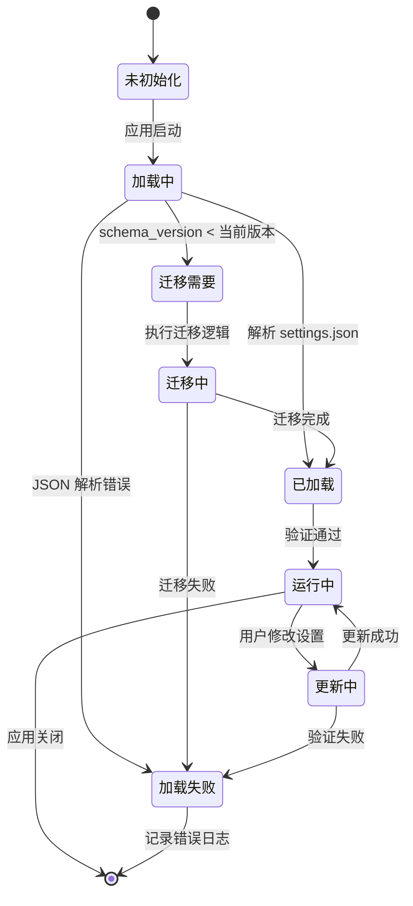
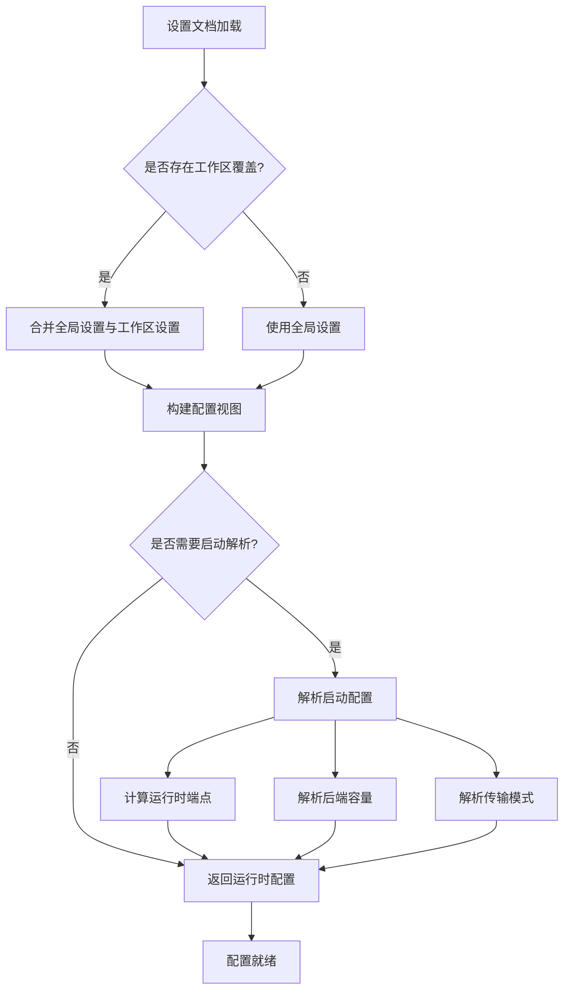
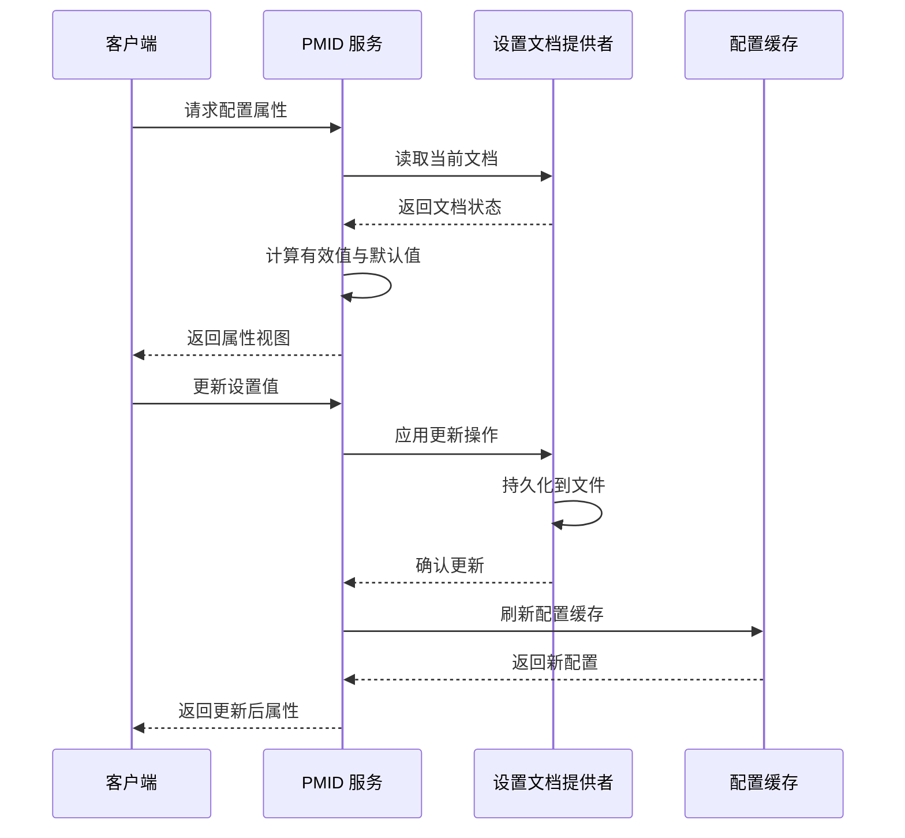

# 配置与设置系统

## 文档元数据

| 属性 | 值 |
|------|-----|
| **文件名** | `10_config_and_settings.md` |
| **版本** | 1.0.0 |
| **状态** | 生产就绪 |
| **最后更新** | 2026-06-12 |
| **维护者** | Slab 架构团队 |

---

## 功能概述与用户故事

### 系统定位

Slab 的配置与设置系统是一个独立的配置管理核心，负责处理应用程序的运行时配置、用户偏好设置以及模型标识符（PMID）目录。该系统完全独立于 HTTP、SQLx、Tauri 和应用核心业务服务，确保配置管理的纯粹性和可测试性。

### 核心能力

1. **设置文档管理**：统一的用户偏好设置存储与访问
2. **PMID 目录服务**：模型标识符的集中管理与查询
3. **类型安全配置**：强类型配置视图与运行时解析
4. **配置迁移**：版本化配置架构与向后兼容

### 用户故事

**作为开发者**，我需要：
- 通过类型安全的 API 访问应用程序配置
- 获取模型配置的默认值与覆盖值
- 在不同环境中管理不同的配置配置
- 确保配置更新的原子性和一致性

**作为最终用户**，我需要：
- 通过友好的界面修改应用程序设置
- 看到配置的默认值和我自定义的值
- 理解每个配置项的作用和影响范围
- 在配置错误时获得清晰的反馈

---

## 核心业务逻辑与流程

### 系统架构

```
┌─────────────────────────────────────────────────────────────────┐
│                     slab-config                                 │
│  ┌───────────────────────────────────────────────────────────┐ │
│  │              Settings Document                              │ │
│  │  • 用户偏好设置                                              │ │
│  │  • 运行时配置                                               │ │
│  │  • 提供商注册表                                             │ │
│  │  • 模型管理设置                                             │ │
│  └───────────────────────────────────────────────────────────┘ │
│  ┌───────────────────────────────────────────────────────────┐ │
│  │              PMID Service                                  │ │
│  │  • 模型标识符管理                                           │ │
│  │  • 配置视图构建                                             │ │
│  │  • 属性查询与更新                                           │ │
│  └───────────────────────────────────────────────────────────┘ │
│  ┌───────────────────────────────────────────────────────────┐ │
│  │              Launch Resolution                              │ │
│  │  • 启动配置解析                                             │ │
│  │  • 运行时端点解析                                           │ │
│  │  • 容量配置计算                                             │ │
│  └───────────────────────────────────────────────────────────┘ │
└─────────────────────────────────────────────────────────────────┘
                              ↓
┌─────────────────────────────────────────────────────────────────┐
│                     slab-types                                  │
│  • 共享语义类型定义                                              │
│  • 模型规范与运行时契约                                          │
│  • 聊天与推理类型                                                │
│  • 插件清单类型                                                  │
└─────────────────────────────────────────────────────────────────┘
```

### 设置文档生命周期



### 配置解析链



### PMID 服务工作流



---

## 功能点原子级拆分

### slab-config 核心模块

| 模块 | 文件路径 | 功能描述 | 暴露 API |
|------|----------|----------|----------|
| **设置文档** | `src/settings/document.rs` | 定义设置文档数据结构 | `SettingsDocument`, `GeneralSettingsConfig`, `LoggingConfig` |
| **描述符系统** | `src/descriptor.rs` | 属性路径到字段映射 | `setting_descriptor()`, `setting_value()` |
| **PMID 服务** | `src/pmid_service.rs` | PMID 目录管理服务 | `PmidService`, `resolve_launch_spec()` |
| **配置视图** | `src/view.rs` | 类型安全的配置视图 | `SettingsDocumentView`, `SettingPropertyView` |
| **启动解析** | `src/settings/launch.rs` | 运行时启动配置解析 | `resolve_launch_spec()`, `ResolvedLaunchSpec` |
| **应用配置** | `src/app_config.rs` | 应用路径与默认值 | `default_settings_path()`, `default_database_path()` |
| **设置提供者** | `src/provider.rs` | 设置文档加载与持久化 | `SettingsDocumentProvider` |
| **PMID 管理** | `src/settings/pmid.rs` | PMID 常量定义 | `PMID` (包含所有属性路径) |

### slab-types 核心类型

| 模块 | 文件路径 | 功能描述 | 暴露类型 |
|------|----------|----------|----------|
| **聊天类型** | `src/chat.rs` | 对话与推理控制 | `ConversationMessage`, `ChatReasoningEffort`, `ChatVerbosity` |
| **运行时类型** | `src/runtime.rs` | 模型规范与加载 | `ModelSpec`, `RuntimeModelLoadCommand`, `ModelSource` |
| **插件类型** | `src/plugin.rs` | 插件清单与贡献 | `PluginManifest`, `PluginCapabilityContribution` |
| **代理类型** | `src/agent.rs` | 代理生命周期与工具 | `AgentThreadStatus`, `ToolCallStatus` |
| **通用类型** | `src/common.rs` | 基础构建块 | `Id`, `JsonOptions`, `Timestamp` |
| **设备类型** | `src/device.rs` | 设备偏好与能力 | `RuntimeDevicePreference` |
| **后端类型** | `src/backend.rs` | 运行时后端标识 | `RuntimeBackendId` |

### 设置文档结构

```json
{
  "$schema": "https://slab.reorgix.com/manifests/v1/settings-document.schema.json",
  "schema_version": 2,
  "general": {
    "language": "auto|en-US|zh-CN"
  },
  "database": {
    "url": "sqlite://slab.db?mode=rwc"
  },
  "logging": {
    "level": "info",
    "json": false,
    "path": null
  },
  "telemetry": {
    "enabled": true,
    "environment": "production",
    "exporter": {...},
    "capture_content": false
  },
  "tools": {
    "ffmpeg": {
      "enabled": true,
      "auto_download": true,
      "install_dir": null
    }
  },
  "agent": {
    "debug": true,
    "hooks": {
      "enabled": false,
      "scripts": []
    },
    "memories": {
      "enabled": false,
      "phase1_scan_limit": 8,
      "phase1_concurrency": 2
    },
    "tools": {
      "mcp": { "enabled": false },
      "websearch": {
        "default_provider": "duckduckgo",
        "providers": {...}
      }
    }
  },
  "runtime": {
    "mode": "managed_children",
    "transport": "ipc",
    "ggml": {
      "install_dir": null,
      "backends": {
        "llama": {
          "enabled": true,
          "context_length": 2048,
          "flash_attn": true
        }
      }
    }
  },
  "providers": {
    "registry": []
  },
  "models": {
    "cache_dir": null,
    "config_dir": null,
    "download_source": "auto",
    "auto_unload": {
      "enabled": false,
      "idle_minutes": 10
    }
  },
  "plugin": {
    "install_dir": null,
    "js_runtime_transport": "stdio",
    "python_runtime_transport": "stdio"
  },
  "server": {
    "address": "127.0.0.1:3000",
    "cors": { "allowed_origins": [] },
    "admin": { "token": null },
    "swagger": { "enabled": true }
  }
}
```

### 属性路径（PMID）系统

每个设置属性通过点分隔的路径（PMID）进行寻址：

| PMID | 类型 | 默认值 | 描述 |
|------|------|--------|------|
| `general.language` | enum | `"auto"` | 界面语言偏好 |
| `database.url` | string | `"sqlite://slab.db?mode=rwc"` | 数据库连接字符串 |
| `logging.level` | string | `"info"` | 日志级别 |
| `telemetry.enabled` | boolean | `true` | 遥测启用 |
| `agent.debug` | boolean | `true` | 代理调试跟踪 |
| `agent.tools.mcp.enabled` | boolean | `false` | MCP 工具启用 |
| `runtime.transport` | enum | `"ipc"` | 运行时传输模式 |
| `runtime.ggml.backends.llama.context_length` | integer | `2048` | Llama 上下文长度 |
| `models.auto_unload.enabled` | boolean | `false` | 自动卸载空闲模型 |
| `server.address` | string | `"127.0.0.1:3000"` | 服务器绑定地址 |

### 配置迁移系统

```rust
// 迁移版本映射
const SETTINGS_MIGRATIONS: &[Migration] = &[
    Migration {
        from_version: 1,
        to_version: 2,
        migrate: |doc| {
            // 重命名字段，添加默认值
            doc.runtime.old_field = doc.runtime.new_field;
            Ok(())
        }
    },
];
```

---

## 非功能性需求

### 技术约束

| 约束类别 | 具体要求 | 实现方式 |
|----------|----------|----------|
| **依赖隔离** | 不依赖 HTTP、SQLx、Tauri | 纯 Rust 核心库设计 |
| **类型安全** | 所有配置类型必须是强类型 | 使用 `schemars` + `serde` |
| **向后兼容** | 支持旧版本配置自动迁移 | 版本化 schema + 迁移逻辑 |
| **原子更新** | 配置更新必须原子化 | 文件锁 + 事务性写入 |
| **默认值分离** | 清晰区分默认值与覆盖值 | 双层文档比较 |

### 性能要求

- **配置加载**：< 100ms（含文件 I/O）
- **属性查询**：< 1ms（内存操作）
- **配置刷新**：< 50ms（增量更新）
- **启动解析**：< 200ms（完整端点计算）

### 可靠性要求

- **数据完整性**：使用 `schemars` 验证配置结构
- **错误恢复**：配置损坏时回退到默认值
- **并发安全**：使用 `Arc<RwLock<>>` 保护配置状态
- **日志记录**：所有配置操作记录结构化日志

### 可维护性要求

- **模块化设计**：每个配置域独立文件
- **测试覆盖**：单元测试覆盖率 > 90%
- **文档完整**：每个公共 API 有文档注释
- **类型推导**：利用 IDE 类型提示简化开发

### 可扩展性要求

- **插件配置**：支持插件注册自定义配置项
- **工作区覆盖**：支持工作区级配置覆盖
- **动态加载**：支持运行时配置热重载
- **多语言**：配置元数据支持多语言标签

### 安全性要求

- **敏感数据处理**：API 密钥字段标记为 `writeOnly`
- **路径验证**：所有路径配置进行安全检查
- **权限控制**：配置更新需要适当权限
- **注入防护**：使用类型系统防止注入攻击

---

## 相关文档

- [11_desktop_frontend.md](./11_desktop_frontend.md) - 桌面前端如何消费配置
- [12_mcp_protocol.md](./12_mcp_protocol.md) - MCP 协议的配置集成
- [01_global_map.md](./01_global_map.md) - 系统整体架构

---

**文档版本**: 1.0.0
**最后更新**: 2026-06-12
**状态**: 生产就绪
