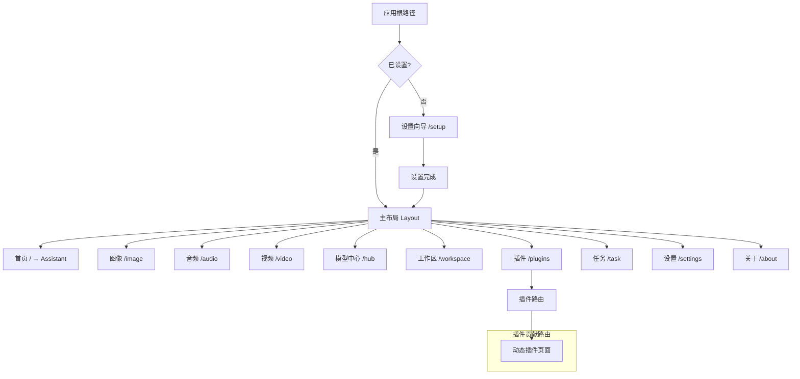
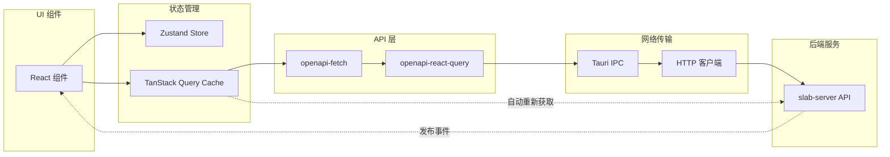

# 桌面前端应用

## 文档元数据

| 属性 | 值 |
|------|-----|
| **文件名** | `11_desktop_frontend.md` |
| **版本** | 1.0.0 |
| **状态** | 生产就绪 |
| **最后更新** | 2026-06-12 |
| **维护者** | Slab 前端团队 |

---

## 功能概述与用户故事

### 应用定位

`@slab/desktop` 是 Slab 的桌面客户端前端，基于 React 19 和 Tauri v2 构建的本地优先 AI 工作空间。该应用采用现代化的技术栈，提供流畅的用户体验和强大的功能集成。

### 核心特性

1. **AI 助手对话**：主要交互界面，支持多模型对话
2. **图像生成**：集成的图像生成工作台
3. **音频转录**：实时音频转录服务
4. **视频处理**：视频编辑与处理功能
5. **模型中心**：模型浏览、下载与管理
6. **插件中心**：插件安装与管理
7. **工作区**：代码编辑器与文件管理
8. **任务队列**：后台任务监控
9. **设置管理**：应用配置界面

### 用户故事

**作为知识工作者**，我需要：
- 与 AI 助手进行流畅的对话交互
- 快速切换不同的 AI 模型
- 管理我的对话历史和会话

**作为开发者**，我需要：
- 在集成环境中编写代码
- 使用 AI 辅助编程
- 管理项目文件和资源

**作为内容创作者**，我需要：
- 使用 AI 生成图像内容
- 转录音频为文本
- 处理视频素材

---

## 核心业务逻辑与流程

### 技术栈架构

```
┌─────────────────────────────────────────────────────────────────┐
│                    Tauri v2 桌面应用                              │
│  ┌───────────────────────────────────────────────────────────┐ │
│  │                   React 19 前端                              │ │
│  │  ┌─────────────────────────────────────────────────────┐   │ │
│  │  │              页面组件 (Routes)                       │   │ │
│  │  │  • Assistant (对话)                                  │   │ │
│  │  │  • Hub (模型中心)                                    │   │ │
│  │  │  • Settings (设置)                                  │   │ │
│  │  │  • Workspace (工作区)                               │   │ │
│  │  └─────────────────────────────────────────────────────┘   │ │
│  │  ┌─────────────────────────────────────────────────────┐   │ │
│  │  │              状态管理                                 │   │ │
│  │  │  • Zustand (客户端状态)                             │   │ │
│  │  │  • TanStack Query (服务器状态)                       │   │ │
│  │  └─────────────────────────────────────────────────────┘   │ │
│  │  ┌─────────────────────────────────────────────────────┐   │ │
│  │  │              UI 组件库                               │   │ │
│  │  │  • Ant Design X                                     │   │ │
│  │  │  • @slab/components (共享组件)                       │   │ │
│  │  │  • Radix UI                                         │   │ │
│  │  └─────────────────────────────────────────────────────┘   │ │
│  └───────────────────────────────────────────────────────────┘ │
│                              ↓↑                                │
│  ┌───────────────────────────────────────────────────────────┐ │
│  │                   Tauri IPC                                │ │
│  │  • OpenAPI v1 客户端                                       │ │
│  │  • 事件订阅与推送                                         │ │
│  └───────────────────────────────────────────────────────────┘ │
└─────────────────────────────────────────────────────────────────┘
                              ↓
┌─────────────────────────────────────────────────────────────────┐
│                   Rust 后端 (slab-app-core)                      │
│  • HTTP API 服务                                                 │
│  • 业务逻辑处理                                                   │
│  • 数据持久化                                                     │
└─────────────────────────────────────────────────────────────────┘
```

### 页面路由结构



### 数据流架构



### 主题系统架构

```mermaid
flowchart TD
    A[CSS 自定义属性] --> B[主题令牌]
    B --> C[亮色主题]
    B --> D[暗色主题]
    B --> E[系统主题]
    
    C --> F[globals.css]
    D --> F
    E --> F
    
    F --> G[@slab/components]
    F --> H[@slab/desktop]
    
    I[用户偏好] --> J[设置文档]
    J --> K[运行时配置]
    K --> L[主题切换器]
    
    L --> M{主题模式}
    M -->|light| C
    M -->|dark| D
    M -->|system| E
```

---

## 功能点原子级拆分

### 核心页面模块

| 页面路径 | 组件路径 | 功能描述 | 关键特性 |
|----------|----------|----------|----------|
| **助手对话** | `src/pages/assistant/` | AI 对话主界面 | • 会话管理<br>• 模型切换<br>• 消息渲染<br>• 工具调用显示 |
| **模型中心** | `src/pages/hub/` | 模型管理界面 | • 模型浏览<br>• 下载管理<br>• 模型配置<br>• 状态监控 |
| **设置** | `src/pages/settings/` | 应用配置界面 | • 分类设置<br>• 实时预览<br>• 验证反馈<br>• 搜索过滤 |
| **工作区** | `src/pages/workspace/` | 代码编辑器 | • 文件树<br>• 编辑器集成<br>• Git 集成<br>• 终端面板 |
| **插件** | `src/pages/plugins/` | 插件管理 | • 插件浏览<br>• 安装管理<br>• 权限配置<br>• Webview 集成 |
| **图像** | `src/pages/image/` | 图像生成工作台 | • 提示词输入<br>• 参数调节<br>• 历史记录<br>• 导出功能 |
| **音频** | `src/pages/audio/` | 音频转录界面 | • 文件上传<br>• 实时转录<br>• VAD 设置<br>• 结果导出 |
| **视频** | `src/pages/video/` | 视频处理工作台 | • 文件导入<br>• 处理选项<br>• 进度监控<br>• 结果预览 |
| **任务** | `src/pages/task/` | 后台任务队列 | • 任务列表<br>• 状态跟踪<br>• 错误处理<br>• 重试机制 |
| **关于** | `src/pages/about/` | 应用信息 | • 版本信息<br>• 许可证<br>• 第三方库<br>• 链接跳转 |

### 核心布局组件

| 组件路径 | 功能描述 | 使用场景 |
|----------|----------|----------|
| **`src/layouts/index.tsx`** | 主布局容器 | 所有页面的外层布局 |
| **`src/layouts/header.tsx`** | 应用头部导航 | 全局导航与操作按钮 |
| **`src/layouts/sidebar.tsx`** | 侧边栏导航 | 主要功能导航菜单 |
| **`src/layouts/footer-status-bar.tsx`** | 底部状态栏 | 显示系统状态与信息 |
| **`src/layouts/window-controls.tsx`** | 窗口控制按钮 | 自定义窗口标题栏 |
| **`src/layouts/global-header-provider.tsx`** | 全局头部上下文 | 头部状态管理 |

### 助手对话页面

#### 核心组件

| 组件 | 功能描述 | 状态管理 |
|------|----------|----------|
| **`assistant-composer.tsx`** | 消息输入与发送 | 表单状态 |
| **`assistant-bubble-content.tsx`** | 消息气泡渲染 | 无状态 |
| **`assistant-markdown.tsx`** | Markdown 内容渲染 | 无状态 |
| **`assistant-model-switch-dialog.tsx`** | 模型切换对话框 | 对话状态 |
| **`assistant-session-summary-card.tsx`** | 会话摘要卡片 | 列表项 |
| **`assistant-session-sheet.tsx`** | 会话历史面板 | 侧边栏状态 |

#### 数据流

```typescript
// 会话数据流
const { data: sessions } = useSessions();           // TanStack Query
const { data: messages } = useMessages(sessionId);   // TanStack Query
const { sendMessage } = useMutation({               // 变更操作
  mutationFn: (content) => api.POST('/v1/chat/completions', {...})
});
```

### 模型中心页面

#### 核心组件

| 组件 | 功能描述 | 交互功能 |
|------|----------|----------|
| **`hub-catalog-table.tsx`** | 模型目录表格 | • 排序<br>• 过滤<br>• 分页 |
| **`hub-create-model-dialog.tsx`** | 创建模型对话框 | • 表单验证<br>• 提交操作 |
| **`hub-delete-model-dialog.tsx`** | 删除模型确认 | • 确认操作<br>• 影响评估 |
| **`hub-model-enhancement-sheet.tsx`** | 模型增强面板 | • 参数调整<br>• 性能优化 |
| **`status-badge.tsx`** | 状态徽章 | • 状态指示<br>• 颜色编码 |
| **`summary-stat.tsx`** | 统计摘要卡片 | • 数据展示<br>• 趋势显示 |

### 设置页面

#### 设置分类

| 分类 ID | PMID 前缀 | 功能模块 |
|---------|-----------|----------|
| **general** | `general.*` | 通用设置 |
| **database** | `database.*` | 数据库配置 |
| **logging** | `logging.*` | 日志设置 |
| **telemetry** | `telemetry.*` | 遥测配置 |
| **runtime** | `runtime.*` | 运行时设置 |
| **providers** | `providers.*` | 提供商管理 |
| **models** | `models.*` | 模型管理 |
| **agent** | `agent.*` | 代理配置 |
| **server** | `server.*` | 服务器设置 |

#### 设置组件

| 组件 | 功能 | 表单类型 |
|------|------|----------|
| **`settings-navigation.tsx`** | 设置导航 | 侧边栏导航 |
| **`setting-field-card.tsx`** | 设置字段卡片 | 表单控件 |
| **`structured-json-field.tsx`** | JSON 字段编辑器 | 代码编辑器 |
| **`provider-registry-field.tsx`** | 提供商注册表 | 数组表单 |

### 工作区页面

#### 核心功能

| 组件 | 功能 | 集成技术 |
|------|------|----------|
| **`workspace-vscode-part/index.tsx`** | VSCode 编辑器集成 | Monaco Editor |
| **`workspace-tree-row.tsx`** | 文件树行 | 拖拽支持 |
| **`workspace-git-panel.tsx`** | Git 面板 | Git 操作 |
| **`workspace-search-panel.tsx`** | 搜索面板 | 文件搜索 |
| **`workspace-console-panel.tsx`** | 控制台面板 | 终端集成 |
| **`workspace-markdown-preview.tsx`** | Markdown 预览 | 实时渲染 |

### 共享组件库 (@slab/components)

#### 组件分类

| 分类 | 组件示例 | 功能描述 |
|------|----------|----------|
| **基础组件** | Button, Input, Select | 表单控件 |
| **布局组件** | Card, Sheet, Dialog | 容器组件 |
| **反馈组件** | Toast, Alert, Spinner | 状态提示 |
| **数据组件** | Table, Badge, Progress | 数据展示 |
| **导航组件** | Tabs, Pagination, Breadcrumb | 导航控件 |

#### 主题系统

```css
/* globals.css 主题令牌 */
:root {
  --color-primary: 220 90% 56%;
  --color-secondary: 280 80% 60%;
  --color-accent: 180 70% 50%;
  
  --background: 0 0% 100%;
  --foreground: 240 10% 3.9%;
  
  --border: 240 5.9% 90%;
  --input: 240 5.9% 90%;
  
  --radius: 0.5rem;
}

.dark {
  --background: 240 10% 3.9%;
  --foreground: 0 0% 98%;
  
  --border: 240 3.7% 15.9%;
  --input: 240 3.7% 15.9%;
}
```

### API 集成 (@slab/api)

#### 核心功能

| 模块 | 功能 | 使用方式 |
|------|------|----------|
| **`openapi-fetch`** | 类型安全的 API 客户端 | 自动生成请求类型 |
| **`openapi-react-query`** | React Query 集成 | 自动缓存与重新验证 |
| **`createClient`** | 客户端工厂 | 配置 baseUrl 与 headers |

#### 使用示例

```typescript
import { createClient } from '@slab/api';

const client = createClient({
  baseUrl: 'http://localhost:3000',
});

// 类型安全的 API 调用
const { data, error } = await client.GET('/v1/models', {
  params: {
    query: { backend: 'llama' }
  }
});
```

### 国际化 (@slab/i18n)

#### 支持语言

| 语言代码 | 语言名称 | 覆盖范围 |
|----------|----------|----------|
| `en-US` | 英语（美国） | 100% |
| `zh-CN` | 简体中文 | 100% |
| `auto` | 自动检测 | 跟随系统 |

#### 集成方式

```typescript
import { useTranslation } from '@slab/i18n';

function Component() {
  const { t } = useTranslation();
  return <h1>{t('common.welcome')}</h1>;
}
```

---

## 非功能性需求

### 性能要求

| 指标 | 目标 | 测量方式 |
|------|------|----------|
| **首屏加载** | < 2s | Lighthouse |
| **路由切换** | < 100ms | Performance API |
| **列表渲染** | 60 FPS | 帧率监控 |
| **内存占用** | < 200MB | 开发者工具 |
| **包体积** | < 1MB (gzipped) | 构建分析 |

### 兼容性要求

| 平台 | 最低版本 | 测试状态 |
|------|----------|----------|
| **Windows** | Windows 10 1809 | ✅ 完全支持 |
| **macOS** | macOS 11 (Big Sur) | ✅ 完全支持 |
| **Linux** | Ubuntu 20.04+ | ✅ 完全支持 |

### 浏览器兼容

| 浏览器 | 版本要求 | 状态 |
|--------|----------|------|
| **Safari** | 16+ | ✅ |
| **Chrome** | 最新 2 版本 | ✅ |
| **Edge** | 最新 2 版本 | ✅ |
| **Firefox** | ESR | ✅ |

### 可访问性要求

- **WCAG 2.1**: AA 级别合规
- **键盘导航**: 全功能键盘支持
- **屏幕阅读器**: NVDA, VoiceOver 支持
- **颜色对比**: 最小 4.5:1 对比度
- **焦点管理**: 清晰的焦点指示

### 安全要求

| 要求 | 实现方式 |
|------|----------|
| **内容安全策略** | Tauri CSP 配置 |
| **输入验证** | 前后端双重验证 |
| **敏感数据处理** | 不在客户端存储密钥 |
| **跨站点防护** | Tauri 沙箱隔离 |

### 可维护性要求

- **代码规范**: ESLint + Prettier
- **类型安全**: TypeScript strict 模式
- **测试覆盖**: Vitest 单元测试
- **文档完整**: JSDoc 注释
- **组件复用**: 共享组件库

### 可扩展性要求

- **插件架构**: 动态 Webview 加载
- **主题定制**: CSS 变量系统
- **路由扩展**: 动态路由注册
- **状态管理**: Zustand 模块化 store

---

## 相关文档

- [10_config_and_settings.md](./10_config_and_settings.md) - 配置系统
- [12_mcp_protocol.md](./12_mcp_protocol.md) - MCP 协议集成
- [01_global_map.md](./01_global_map.md) - 系统整体架构

---

**文档版本**: 1.0.0
**最后更新**: 2026-06-12
**状态**: 生产就绪
