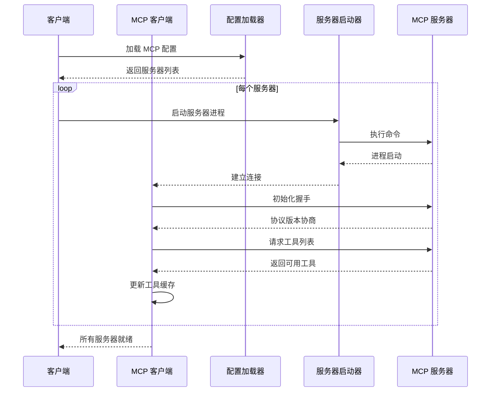
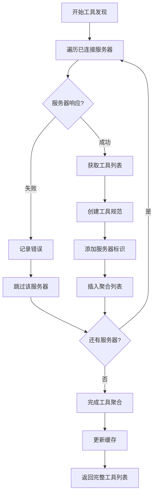
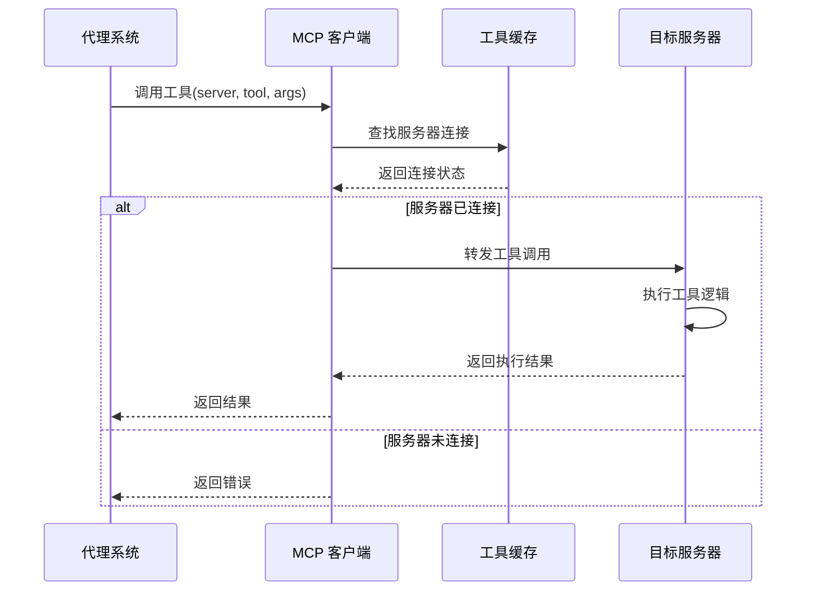
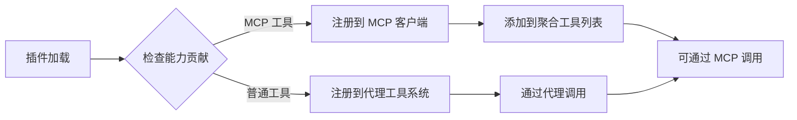

# MCP 协议支持

## 文档元数据

| 属性 | 值 |
|------|-----|
| **文件名** | `12_mcp_protocol.md` |
| **版本** | 1.0.0 |
| **状态** | 生产就绪 |
| **最后更新** | 2026-06-12 |
| **维护者** | Slab 架构团队 |

---

## 功能概述与用户故事

### 系统定位

Slab 的 MCP（Model Context Protocol）支持是一个多服务器管理与工具聚合系统，使 Slab 能够连接到外部 MCP 服务器，发现并调用其提供的工具，同时也可以将 Slab 本身作为 MCP 服务器暴露给外部工具使用。

### 核心能力

1. **多服务器管理**：同时管理多个外部 MCP 服务器连接
2. **工具聚合**：从多个服务器收集和缓存工具列表
3. **工具调用路由**：将工具调用路由到正确的 MCP 服务器
4. **协议抽象**：提供统一的工具调用接口
5. **双向集成**：既可作为 MCP 客户端，也可作为 MCP 服务器

### 用户故事

**作为用户**，我需要：
- 连接到外部 MCP 服务器以扩展代理能力
- 在代理中使用 MCP 工具进行外部操作
- 管理和监控 MCP 服务器连接状态

**作为插件开发者**，我需要：
- 通过插件清单暴露 MCP 工具
- 集成外部服务作为 MCP 工具
- 控制工具的可见性和权限

**作为系统集成者**，我需要：
- 将 Slab 作为 MCP 服务器集成到其他系统
- 通过 MCP 协议与 Slab 进行工具调用
- 管理跨系统的工具调用权限

---

## 核心业务逻辑与流程

### 系统架构

```
┌─────────────────────────────────────────────────────────────────┐
│                        slab-mcp                                 │
│  ┌───────────────────────────────────────────────────────────┐ │
│  │                    McpClient                               │ │
│  │  • 服务器连接管理                                          │ │
│  │  • 工具列表缓存                                            │ │
│  │  • 工具调用路由                                            │ │
│  └───────────────────────────────────────────────────────────┘ │
│  ┌───────────────────────────────────────────────────────────┐ │
│  │                 McpServerLauncher                         │ │
│  │  • 服务器启动配置                                          │ │
│  │  • 环境变量管理                                           │ │
│  │  • 进程生命周期管理                                        │ │
│  └───────────────────────────────────────────────────────────┘ │
│  ┌───────────────────────────────────────────────────────────┐ │
│  │                   McpToolSpec                              │ │
│  │  • 工具规范描述                                            │ │
│  │  • 服务器归属标识                                          │ │
│  │  • 输入输出架构                                            │ │
│  └───────────────────────────────────────────────────────────┘ │
└─────────────────────────────────────────────────────────────────┘
                              ↓↑
┌─────────────────────────────────────────────────────────────────┐
│                     slab-mcp-client                             │
│  • 单连接协议处理                                               │
│  • JSON-RPC 传输                                               │
│  • Stdio 传输实现                                               │
└─────────────────────────────────────────────────────────────────┘
                              ↓
┌─────────────────────────────────────────────────────────────────┐
│                   外部 MCP 服务器                                │
│  • filesystem                                                   │
│  • brave-search                                                │
│  • github                                                      │
│  • postgres                                                   │
│  • slack                                                      │
└─────────────────────────────────────────────────────────────────┘
```

### MCP 服务器管理流程



### 工具发现与缓存流程



### 工具调用路由流程



### Slab 作为 MCP 服务器

```
┌─────────────────────────────────────────────────────────────────┐
│                   bin/slab-mcp-server                            │
│  • 独立进程入口                                                  │
│  • Stdio 协议处理                                               │
│  • 工具暴露管理                                                  │
└─────────────────────────────────────────────────────────────────┘
                              ↓
┌─────────────────────────────────────────────────────────────────┐
│                   外部工具调用                                   │
│  • 通过 MCP 协议调用 Slab 功能                                  │
│  • 访问代理工具                                                  │
│  • 访问插件贡献的工具                                           │
└─────────────────────────────────────────────────────────────────┘
```

---

## 功能点原子级拆分

### slab-mcp 核心模块

| 模块 | 文件路径 | 功能描述 | 暴露 API |
|------|----------|----------|----------|
| **客户端管理** | `src/client.rs` | 多服务器管理客户端 | `McpClient`, `connect_stdio()`, `call_tool()` |
| **配置加载** | `src/config.rs` | 服务器配置定义 | `McpClientConfig`, `McpServerLauncher` |
| **协议类型** | `src/protocol.rs` | 协议数据结构 | `McpToolSpec`, `McpContent`, `McpToolResult` |

### slab-mcp-client 核心模块

| 模块 | 文件路径 | 功能描述 | 暴露 API |
|------|----------|----------|----------|
| **Stdio 客户端** | `src/stdio.rs` | Stdio 传输实现 | `StdioMcpClient`, `StdioLaunchConfig` |
| **协议定义** | `src/protocol.rs` | 底层协议类型 | `McpTool`, `McpContent`, `McpToolResult` |

### 配置结构

```json
{
  "servers": [
    {
      "name": "filesystem",
      "command": "npx",
      "args": ["-y", "@modelcontextprotocol/server-filesystem", "/path/to/allowed"],
      "env": {
        "NODE_ENV": "production"
      }
    },
    {
      "name": "brave-search",
      "command": "npx",
      "args": ["-y", "@modelcontextprotocol/server-brave-search"],
      "env": {
        "BRAVE_API_KEY": "${BRAVE_API_KEY}"
      }
    }
  ]
}
```

### 工具规范结构

```rust
pub struct McpToolSpec {
    pub server_name: String,    // 所属服务器名称
    pub tool: McpTool,          // 工具详细信息
}

pub struct McpTool {
    pub name: String,                      // 工具名称
    pub description: Option<String>,       // 工具描述
    pub input_schema: Value,              // 输入 JSON Schema
}

pub struct McpToolResult {
    pub content: Vec<McpContent>,         // 输出内容
    pub is_error: bool,                   // 是否错误
}
```

### 与代理系统集成

#### 配置启用

```rust
// 在设置文档中启用 MCP 工具
pub struct AgentToolsConfig {
    pub mcp: AgentMcpConfig,
}

pub struct AgentMcpConfig {
    pub enabled: bool,  // 控制是否将 MCP 工具暴露给代理
}
```

#### 工具暴露流程

```
┌─────────────────────────────────────────────────────────────────┐
│  1. 配置检查                                                      │
│     • 检查 agent.tools.mcp.enabled                               │
│     • 确认 MCP 服务器已连接                                       │
└─────────────────────────────────────────────────────────────────┘
                              ↓
┌─────────────────────────────────────────────────────────────────┐
│  2. 工具列表聚合                                                  │
│     • 从所有 MCP 服务器收集工具                                  │
│     • 为每个工具添加服务器标识                                    │
│     • 过滤重复工具（按名称）                                      │
└─────────────────────────────────────────────────────────────────┘
                              ↓
┌─────────────────────────────────────────────────────────────────┐
│  3. 工具路由映射                                                  │
│     • 将工具映射到代理工具系统                                    │
│     • 注册工具调用处理器                                          │
│     • 建立工具与服务器的关系                                      │
└─────────────────────────────────────────────────────────────────┘
                              ↓
┌─────────────────────────────────────────────────────────────────┐
│  4. 工具调用处理                                                  │
│     • 接收代理工具调用请求                                        │
│     • 根据工具名查找对应服务器                                    │
│     • 转发调用到 MCP 服务器                                       │
│     • 返回执行结果                                                │
└─────────────────────────────────────────────────────────────────┘
```

### 插件 MCP 工具暴露

#### 插件清单配置

```typescript
interface PluginAgentCapabilityContribution {
  exposeAsMcpTool?: boolean;  // 是否作为 MCP 工具暴露
}
```

#### 暴露流程



### 错误处理

| 错误类型 | 触发条件 | 处理方式 |
|----------|----------|----------|
| **ServerNotFound** | 调用不存在的服务器 | 返回明确的错误消息 |
| **TransportError** | 底层传输错误 | 包装错误信息并向上传播 |
| **ConnectionFailed** | 服务器启动失败 | 记录日志，跳过该服务器 |
| **ToolCallFailed** | 工具执行失败 | 返回错误结果给调用者 |

### 并发与性能

| 特性 | 实现方式 | 性能指标 |
|------|----------|----------|
| **连接管理** | 异步连接池 | 支持 10+ 并发服务器 |
| **工具缓存** | RwLock 保护 | 读取操作 < 1ms |
| **调用路由** | HashMap 查找 | 路由操作 < 100μs |
| **缓存更新** | 增量更新策略 | 刷新时间 < 500ms |

---

## 非功能性需求

### 技术约束

| 约束类别 | 具体要求 | 实现方式 |
|----------|----------|----------|
| **协议兼容** | 支持 MCP 协议标准版本 | 使用 slab-mcp-client |
| **传输隔离** | 服务器间相互隔离 | 独立进程 + Stdio 传输 |
| **错误恢复** | 单服务器失败不影响其他 | try-catch 包裹每个连接 |
| **资源管理** | 正确管理服务器进程生命周期 | Drop trait 清理 |

### 可靠性要求

- **连接稳定性**：支持服务器重连机制
- **错误隔离**：单个服务器错误不影响整体
- **资源清理**：进程退出时正确清理所有连接
- **状态一致性**：工具缓存与实际连接状态同步

### 性能要求

- **连接建立**：< 2s（包含服务器启动）
- **工具发现**：< 500ms（聚合 10 个服务器）
- **工具调用**：< 100ms（不含服务器执行时间）
- **缓存读取**：< 1ms（内存操作）

### 安全要求

- **权限控制**：服务器只能访问被授权的资源
- **环境变量**：敏感信息通过环境变量传递
- **输入验证**：工具调用参数进行验证
- **沙箱隔离**：外部服务器运行在独立进程中

### 可维护性要求

- **模块化设计**：客户端、传输、协议分层
- **类型安全**：使用 Rust 类型系统保证正确性
- **文档完整**：所有公共 API 有文档注释
- **测试覆盖**：单元测试 + 集成测试

### 可扩展性要求

- **服务器数量**：支持 50+ 并发服务器连接
- **工具数量**：支持 1000+ 工具缓存
- **传输扩展**：支持未来添加新的传输方式
- **协议版本**：支持协议版本协商

### 兼容性要求

- **语言支持**：支持 Node.js、Python、Rust 等多种语言的 MCP 服务器
- **平台支持**：Windows、macOS、Linux
- **版本兼容**：向后兼容 MCP 协议的旧版本

---

## 相关文档

- [10_config_and_settings.md](./10_config_and_settings.md) - MCP 配置管理
- [11_desktop_frontend.md](./11_desktop_frontend.md) - 前端集成
- [01_global_map.md](./01_global_map.md) - 系统整体架构

---

**文档版本**: 1.0.0
**最后更新**: 2026-06-12
**状态**: 生产就绪
