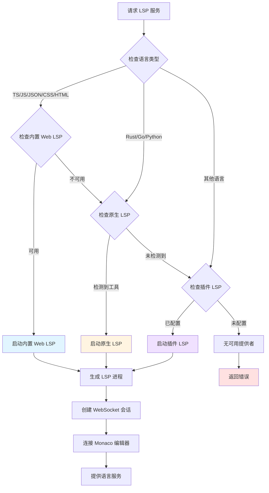
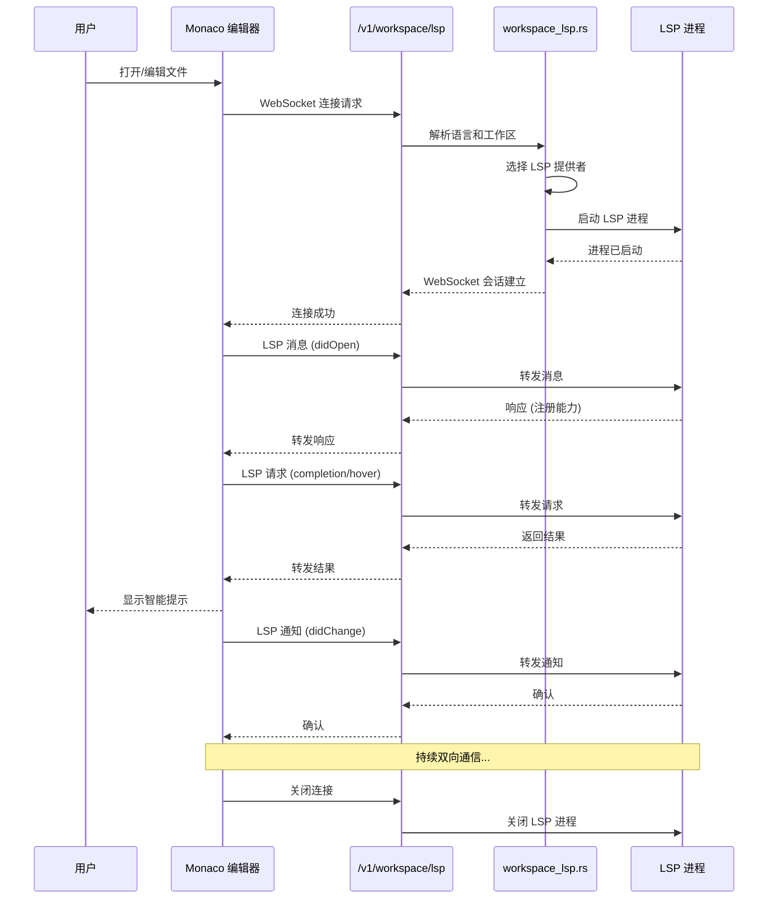
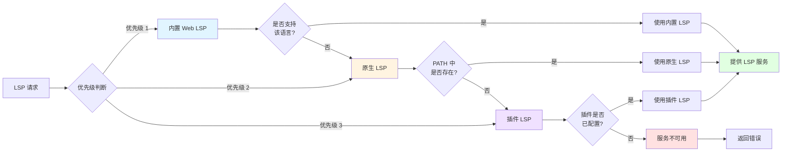

# 工作区管理与语言服务器协议 (LSP) 支持

## 文档元数据
- **文件名**: 13_workspace_and_lsp.md
- **版本**: 1.0.0
- **状态**: 已完成
- **最后更新**: 2025-06-12
- **维护者**: Slab 架构团队

---

## 1. 功能概述与用户故事

### 1.1 功能概述

Slab 的工作区管理与语言服务器协议 (LSP) 支持系统为用户提供了一个完整的本地开发环境，支持多种编程语言的智能编辑功能。该系统集成了内置 Web LSP、原生 LSP 以及第三方插件 LSP，通过统一的接口为 Monaco 编辑器提供语言服务。

### 1.2 用户故事

**US-1: 作为开发者，我希望在 Slab 中管理多个工作区**
- 用户可以创建和管理工作区根目录
- 系统自动验证工作区有效性
- 支持工作区级别的 LSP 配置

**US-2: 作为前端开发者，我希望获得 TypeScript/JavaScript 的智能提示**
- 系统自动为 TS/JS 文件启动内置 Web LSP
- 提供实时类型检查、代码补全和导航功能
- 无需额外安装语言服务器

**US-3: 作为 Rust 开发者，我希望使用 rust-analyzer 获得智能编辑功能**
- 系统自动检测系统安装的 rust-analyzer
- 通过原生 LSP 接口提供语言服务
- 支持高级 Rust 语言特性

**US-4: 作为插件开发者，我希望为自定义语言提供 LSP 支持**
- 可以通过 plugin.json 声明语言服务器贡献
- 支持 stdio 和 WebSocket 两种通信方式
- 与内置 LSP 无缝集成

**US-5: 作为用户，我希望编辑器能够流畅地连接和通信**
- Monaco 编辑器通过 WebSocket 连接后端 LSP 服务
- 支持多语言、多实例并发运行
- 自动处理 LSP 进程生命周期

---

## 2. 核心业务逻辑与流程

### 2.1 架构组件

```
┌─────────────────────────────────────────────────────────────────┐
│                         前端 (Frontend)                          │
├─────────────────────────────────────────────────────────────────┤
│  Monaco Editor + monaco-languageclient                          │
│  - 语法高亮                                                      │
│  - 代码补全                                                      │
│  - 类型提示                                                      │
│  - 代码导航                                                      │
└────────────────────┬────────────────────────────────────────────┘
                     │ WebSocket
                     ▼
┌─────────────────────────────────────────────────────────────────┐
│                    后端 API (Backend API)                        │
├─────────────────────────────────────────────────────────────────┤
│  /v1/workspace/lsp/{language}                                    │
│  - WebSocket 会话管理                                            │
│  - LSP 消息转发                                                  │
│  - 进程生命周期管理                                              │
└────────────────────┬────────────────────────────────────────────┘
                     │
                     ▼
┌─────────────────────────────────────────────────────────────────┐
│              slab-app-core (核心协调层)                          │
├─────────────────────────────────────────────────────────────────┤
│  workspace_lsp.rs - LSP 提供者解析与进程生成                     │
│  workspace.rs - 工作区管理                                       │
│  workspace_file_system.rs - 文件系统操作                         │
└────────────────────┬────────────────────────────────────────────┘
                     │
        ┌────────────┼────────────┐
        ▼            ▼            ▼
┌──────────────┐ ┌──────────────┐ ┌──────────────┐
│  内置 Web LSP │ │  原生 LSP    │ │  插件 LSP    │
├──────────────┤ ├──────────────┤ ├──────────────┤
│ TS/JS        │ │ rust-analyzer│ │ 第三方插件   │
│ JSON         │ │ gopls        │ │ 自定义 LSP   │
│ CSS/SCSS     │ │ pyright      │ │ stdio/ws     │
│ HTML         │ │ (PATH 工具)  │ │              │
└──────────────┘ └──────────────┘ └──────────────┘
```

### 2.2 LSP 提供者解析流程



### 2.3 工作区到 LSP 通信链路



### 2.4 LSP 提供者优先级



---

## 3. 功能点原子级拆分

| ID | 功能模块 | 功能点 | 描述 | 实现文件 | 优先级 |
|---|---|---|---|---|---|
| WS-001 | 工作区管理 | 工作区创建 | 创建新的工作区目录结构 | workspace.rs | P0 |
| WS-002 | 工作区管理 | 根目录验证 | 验证工作区根目录有效性 | workspace.rs | P0 |
| WS-003 | 工作区管理 | 工作区列表 | 获取所有可用工作区 | workspace.rs | P1 |
| WS-004 | 工作区管理 | 工作区切换 | 在不同工作区间切换 | workspace.rs | P1 |
| WS-005 | 文件系统 | 文件枚举 | 列举工作区文件 | workspace_file_system.rs | P0 |
| WS-006 | 文件系统 | 文件读取 | 读取工作区文件内容 | workspace_file_system.rs | P0 |
| WS-007 | 文件系统 | 文件监控 | 监控文件变化 | workspace_file_system.rs | P2 |
| WS-008 | 文件系统 | 权限检查 | 验证文件访问权限 | workspace_file_system.rs | P1 |
| LSP-001 | 内置 Web LSP | TS/JS 支持 | TypeScript/JavaScript 语言服务 | plugins/web-language-servers | P0 |
| LSP-002 | 内置 Web LSP | JSON 支持 | JSON 语言服务 | plugins/web-language-servers | P0 |
| LSP-003 | 内置 Web LSP | CSS 支持 | CSS/LESS/SCSS 语言服务 | plugins/web-language-servers | P0 |
| LSP-004 | 内置 Web LSP | HTML 支持 | HTML 语言服务 | plugins/web-language-servers | P0 |
| LSP-005 | 内置 Web LSP | Bun 构建 | 使用 Bun 打包语言服务器 | plugins/web-language-servers | P0 |
| LSP-006 | 内置 Web LSP | Vite 构建 | 使用 Vite 构建产物 | plugins/web-language-servers | P0 |
| LSP-007 | 内置 Web LSP | 资源输出 | 输出到 resources/libs/language-servers/web/ | plugins/web-language-servers | P0 |
| LSP-008 | 内置 Web LSP | 运行时启动 | slab-js-runtime lsp --entry <bundle> | slab-js-runtime | P0 |
| LSP-009 | 原生 LSP | Rust 支持 | rust-analyzer 集成 | workspace_lsp.rs | P0 |
| LSP-010 | 原生 LSP | Go 支持 | gopls 集成 | workspace_lsp.rs | P1 |
| LSP-011 | 原生 LSP | Python 支持 | pyright-langserver 集成 | workspace_lsp.rs | P1 |
| LSP-012 | 原生 LSP | PATH 解析 | 从系统 PATH 解析工具 | workspace_lsp.rs | P0 |
| LSP-013 | 原生 LSP | 进程生成 | 生成原生 LSP 进程 | workspace_lsp.rs | P0 |
| LSP-014 | 插件 LSP | 权限声明 | permissions.lsp 声明 | plugin.json | P1 |
| LSP-015 | 插件 LSP | 贡献声明 | contributes.languageServers | plugin.json | P1 |
| LSP-016 | 插件 LSP | stdio 传输 | 标准输入输出通信 | workspace_lsp.rs | P1 |
| LSP-017 | 插件 LSP | WebSocket 传输 | WebSocket 通信 | workspace_lsp.rs | P2 |
| LSP-018 | 插件 LSP | 配置解析 | 解析插件 LSP 配置 | workspace_lsp.rs | P1 |
| LSP-019 | 通信层 | WebSocket 会话 | 管理 /v1/workspace/lsp 连接 | workspace_lsp.rs | P0 |
| LSP-020 | 通信层 | 消息转发 | 转发 LSP 协议消息 | workspace_lsp.rs | P0 |
| LSP-021 | 通信层 | 进程管理 | 管理 LSP 进程生命周期 | workspace_lsp.rs | P0 |
| LSP-022 | 通信层 | 错误处理 | 处理通信错误 | workspace_lsp.rs | P1 |
| LSP-023 | 前端集成 | Monaco 连接 | monaco-languageclient 集成 | frontend | P0 |
| LSP-024 | 前端集成 | 语言检测 | 自动检测文件语言 | frontend | P0 |
| LSP-025 | 前端集成 | 重连机制 | 断线自动重连 | frontend | P2 |
| LSP-026 | 提供者解析 | 优先级判断 | 按优先级选择 LSP | workspace_lsp.rs | P0 |
| LSP-027 | 提供者解析 | 可用性检查 | 检查提供者是否可用 | workspace_lsp.rs | P0 |
| LSP-028 | 提供者解析 | 缓存机制 | 缓存提供者解析结果 | workspace_lsp.rs | P2 |

---

## 4. 非功能性需求与技术约束

### 4.1 性能要求

- **LSP 启动时间**: Web LSP 应在 2 秒内启动，原生 LSP 取决于工具本身
- **响应延迟**: LSP 请求 (如代码补全) 响应时间应在 100ms 内
- **并发支持**: 支持至少 10 个同时活跃的 LSP 会话
- **内存占用**: 每个 LSP 进程内存占用应控制在合理范围

### 4.2 兼容性约束

- **Monaco 版本**: 必须与 monaco-languageclient 版本兼容
- **LSP 版本**: 支持最新稳定 LSP 规范
- **平台差异**:
  - Windows: 原生 LSP 可执行文件需 .exe 扩展名
  - macOS/Linux: 需正确处理权限和 PATH
- **Node 版本**: Web LSP 构建依赖特定 Node 版本

### 4.3 安全约束

- **工作区隔离**: 不同工作区的 LSP 进程应隔离
- **文件访问**: LSP 只能访问其工作区内的文件
- **插件权限**: 插件 LSP 必须明确声明权限
- **进程沙箱**: LSP 进程应在受控环境中运行

### 4.4 可维护性要求

- **代码组织**:
  - 内置 Web LSP 作为构建产物，不作为用户插件
  - 原生 LSP 在 slab-app-core 中声明
  - 插件 LSP 通过插件系统扩展
- **日志记录**: 详细记录 LSP 启动、通信和错误
- **错误处理**: 优雅处理 LSP 进程崩溃和超时
- **测试覆盖**: 核心流程需要自动化测试

### 4.5 部署约束

- **内置 LSP**: 必须在构建时打包到 resources/libs/language-servers/web/
- **原生 LSP**: 不随安装包分发，依赖用户环境
- **插件 LSP**: 通过插件市场分发
- **桌面宿主**: 不得添加额外的 LSP 桥接层

### 4.6 技术债务与限制

- **当前限制**:
  - 内置 Web LSP 仅支持有限的语言集
  - 原生 LSP 依赖用户系统环境
  - 插件 LSP 的 WebSocket 传输支持有限
- **已知问题**:
  - 某些 LSP 功能可能不完整
  - 大型工作区可能影响性能
  - 跨工作区 LSP 共享尚未实现

---

## 5. 附录

### 5.1 相关文件清单

**工作区管理 (slab-app-core)**:
- `workspace.rs` - 工作区管理和根验证
- `workspace_file_system.rs` - 工作区文件系统操作
- `workspace_lsp.rs` - LSP 提供者解析和进程生成

**内置 Web LSP (plugins/web-language-servers)**:
- 构建配置 (Bun/Vite)
- TypeScript/JavaScript 服务器
- JSON 服务器
- CSS/LESS/SCSS 服务器
- HTML 服务器

**插件 LSP**:
- `plugin.json` - 权限和贡献声明
- LSP 插件实现

### 5.2 API 端点

- `POST /v1/workspace/lsp/{language}` - 启动 LSP WebSocket 会话
- `GET /v1/workspace/list` - 获取工作区列表
- `POST /v1/workspace/create` - 创建工作区
- `GET /v1/workspace/files` - 枚举工作区文件

### 5.3 配置项

- `workspace.lsp.providers` - LSP 提供者配置
- `workspace.roots` - 工作区根目录列表
- `lsp.native.path` - 原生 LSP 工具路径覆盖
