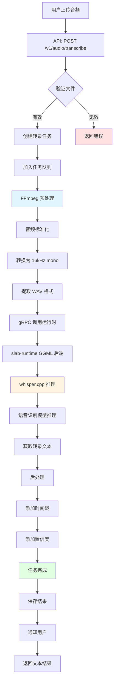
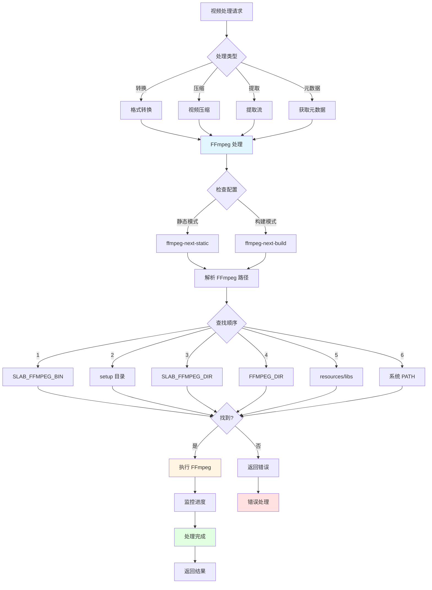
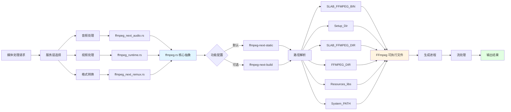
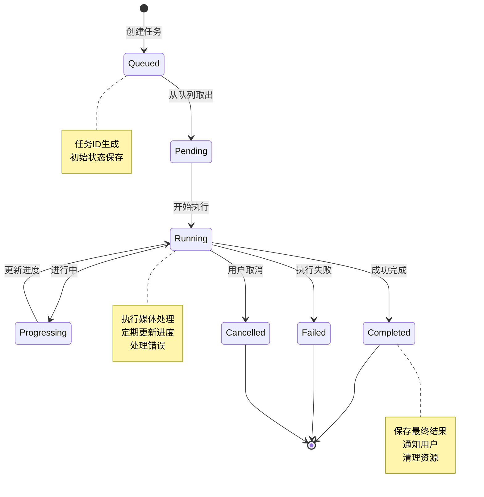

# 媒体处理流水线

## 文档元数据
- **文件名**: 14_media_processing.md
- **版本**: 1.0.0
- **状态**: 已完成
- **最后更新**: 2025-06-12
- **维护者**: Slab 架构团队

---

## 1. 功能概述与用户故事

### 1.1 功能概述

Slab 的媒体处理流水线提供了完整的音频转录、视频处理、字幕处理和媒体转换功能。该系统集成了 FFmpeg、Whisper 语音识别引擎以及任务队列系统，为用户提供高性能的本地媒体处理能力。

### 1.2 用户故事

**US-1: 作为内容创作者，我希望将录音自动转写为文字**
- 用户上传音频文件到 Slab
- 系统自动进行语音识别转录
- 返回准确的文本结果和时间戳

**US-2: 作为视频编辑者，我希望处理视频文件**
- 用户可以转换视频格式
- 系统提供视频压缩和优化
- 支持常见视频格式的处理

**US-3: 作为字幕制作人员，我希望编辑和翻译字幕**
- 用户可以导入和编辑字幕文件
- 系统支持多种字幕格式
- 提供字幕翻译功能

**US-4: 作为开发者，我希望通过 API 处理媒体**
- 系统提供 REST API 进行媒体处理
- 支持异步任务队列
- 提供任务状态查询

**US-5: 作为用户，我希望处理大型媒体文件不会阻塞界面**
- 长时间运行的任务在后台执行
- 用户可以继续使用其他功能
- 完成后得到通知

---

## 2. 核心业务逻辑与流程

### 2.1 系统架构

```
┌─────────────────────────────────────────────────────────────────┐
│                        前端 (Frontend)                          │
├─────────────────────────────────────────────────────────────────┤
│  媒体上传 / 任务监控 / 结果展示                                  │
└────────────────────┬────────────────────────────────────────────┘
                     │ HTTP API
                     ▼
┌─────────────────────────────────────────────────────────────────┐
│                    REST API 端点                                │
├─────────────────────────────────────────────────────────────────┤
│  /v1/audio/*      - 音频转录                                     │
│  /v1/video/*      - 视频处理                                     │
│  /v1/subtitles/*  - 字幕处理                                     │
│  /v1/ffmpeg/*     - 媒体转换                                     │
│  /v1/tasks/*      - 任务队列                                     │
└────────────────────┬────────────────────────────────────────────┘
                     │
                     ▼
┌─────────────────────────────────────────────────────────────────┐
│              slab-app-core (服务层)                             │
├─────────────────────────────────────────────────────────────────┤
│  domain/services/audio.rs      - 音频服务                       │
│  domain/services/video.rs      - 视频服务                       │
│  domain/services/subtitle.rs   - 字幕服务                       │
│  domain/services/task.rs       - 任务服务                       │
│  media_task.rs                 - 媒体任务协调                   │
│  ffmpeg.rs                     - FFmpeg 集成                    │
│  ffmpeg_next_audio.rs          - 音频处理                       │
│  ffmpeg_next_remux.rs          - 格式转换                       │
│  ffmpeg_runtime.rs             - 运行时集成                     │
└────────────────────┬────────────────────────────────────────────┘
                     │
        ┌────────────┼────────────┐
        ▼            ▼            ▼
┌──────────────┐ ┌──────────────┐ ┌──────────────┐
│  FFmpeg      │ │  Whisper     │ │  字幕库      │
├──────────────┤ ├──────────────┤ ├──────────────┤
│ 音频预处理   │ │ 语音识别     │ │ subtitle.rs  │
│ 视频转换     │ │ GGML 后端    │ │ 格式解析     │
│ 格式封装     │ │ slab-runtime │ │ 翻译支持     │
└──────────────┘ └──────────────┘ └──────────────┘
```

### 2.2 音频转录流水线



### 2.3 视频处理流程



### 2.4 FFmpeg 集成链路



### 2.5 任务生命周期



---

## 3. 功能点原子级拆分

| ID | 功能模块 | 功能点 | 描述 | 实现文件 | 优先级 |
|---|---|---|---|---|---|
| AUDIO-001 | 音频转录 | 文件上传 | 接收音频文件上传 | domain/services/audio.rs | P0 |
| AUDIO-002 | 音频转录 | 格式验证 | 验证音频格式有效性 | domain/services/audio.rs | P0 |
| AUDIO-003 | 音频转录 | 预处理 | FFmpeg 音频预处理 | ffmpeg_next_audio.rs | P0 |
| AUDIO-004 | 音频转录 | 标准化 | 转换为 16kHz mono WAV | ffmpeg_next_audio.rs | P0 |
| AUDIO-005 | 音频转录 | gRPC 调用 | 调用 slab-runtime | domain/services/audio.rs | P0 |
| AUDIO-006 | 音频转录 | Whisper 推理 | whisper.cpp 模型推理 | slab-runtime | P0 |
| AUDIO-007 | 音频转录 | 结果后处理 | 文本和时间戳处理 | domain/services/audio.rs | P0 |
| AUDIO-008 | 音频转录 | 置信度计算 | 计算识别置信度 | domain/services/audio.rs | P2 |
| AUDIO-009 | 音频转录 | 批量处理 | 支持批量文件转录 | domain/services/audio.rs | P1 |
| VIDEO-001 | 视频处理 | 格式检测 | 检测视频格式 | domain/services/video.rs | P0 |
| VIDEO-002 | 视频处理 | 元数据提取 | 提取视频元数据 | domain/services/video.rs | P1 |
| VIDEO-003 | 视频处理 | 格式转换 | 视频格式转换 | ffmpeg_next_remux.rs | P0 |
| VIDEO-004 | 视频处理 | 编码转换 | 视频编码转换 | ffmpeg_runtime.rs | P1 |
| VIDEO-005 | 视频处理 | 流提取 | 提取音频/视频流 | ffmpeg_runtime.rs | P1 |
| VIDEO-006 | 视频处理 | 进度监控 | 监控处理进度 | domain/services/video.rs | P0 |
| VIDEO-007 | 视频处理 | 缩略图生成 | 生成视频缩略图 | domain/services/video.rs | P2 |
| SUB-001 | 字幕处理 | 格式支持 | 支持多种字幕格式 | domain/services/subtitle.rs | P0 |
| SUB-002 | 字幕处理 | 字幕解析 | 解析字幕文件 | crates/slab-subtitle/ | P0 |
| SUB-003 | 字幕处理 | 字幕生成 | 生成字幕文件 | crates/slab-subtitle/ | P0 |
| SUB-004 | 字幕处理 | 时间轴调整 | 调整字幕时间轴 | crates/slab-subtitle/ | P1 |
| SUB-005 | 字幕处理 | 字幕翻译 | 翻译字幕内容 | video-subtitle-translator | P1 |
| SUB-006 | 字幕处理 | 格式转换 | 字幕格式互转 | crates/slab-subtitle/ | P1 |
| SUB-007 | 字幕处理 | 嵌入字幕 | 字幕嵌入视频 | domain/services/subtitle.rs | P2 |
| FFMPEG-001 | FFmpeg 集成 | 核心抽象 | FFmpeg 核心抽象层 | ffmpeg.rs | P0 |
| FFMPEG-002 | FFmpeg 集成 | 路径解析 | 解析 FFmpeg 路径 | ffmpeg.rs | P0 |
| FFMPEG-003 | FFmpeg 集成 | 静态模式 | ffmpeg-next-static | Cargo.toml features | P0 |
| FFMPEG-004 | FFmpeg 集成 | 构建模式 | ffmpeg-next-build | Cargo.toml features | P2 |
| FFMPEG-005 | FFmpeg 集成 | 环境变量 | SLAB_FFMPEG_BIN 支持 | ffmpeg.rs | P1 |
| FFMPEG-006 | FFmpeg 集成 | Setup 目录 | 从 setup 目录查找 | ffmpeg.rs | P1 |
| FFMPEG-007 | FFmpeg 集成 | 资源回退 | 回退到 resources/libs | ffmpeg.rs | P0 |
| FFMPEG-008 | FFmpeg 集成 | PATH 回退 | 回退到系统 PATH | ffmpeg.rs | P0 |
| FFMPEG-009 | FFmpeg 集成 | 进程生成 | 生成 FFmpeg 进程 | ffmpeg.rs | P0 |
| FFMPEG-010 | FFmpeg 集成 | 流处理 | 处理 FFmpeg 输出流 | ffmpeg.rs | P0 |
| TASK-001 | 任务队列 | 任务创建 | 创建媒体处理任务 | domain/services/task.rs | P0 |
| TASK-002 | 任务队列 | 队列管理 | 管理任务队列 | domain/services/task.rs | P0 |
| TASK-003 | 任务队列 | 任务调度 | 调度任务执行 | domain/services/task.rs | P0 |
| TASK-004 | 任务队列 | 状态跟踪 | 跟踪任务状态 | domain/services/task.rs | P0 |
| TASK-005 | 任务队列 | 进度更新 | 更新任务进度 | media_task.rs | P0 |
| TASK-006 | 任务队列 | 错误处理 | 处理任务错误 | media_task.rs | P1 |
| TASK-007 | 任务队列 | 任务取消 | 取消运行中的任务 | domain/services/task.rs | P1 |
| TASK-008 | 任务队列 | 结果通知 | 任务完成通知 | domain/services/task.rs | P0 |
| TASK-009 | 任务队列 | 清理机制 | 清理过期任务 | domain/services/task.rs | P2 |
| MEDIA-001 | 协调 | 媒体任务协调 | 协调媒体处理流程 | media_task.rs | P0 |
| MEDIA-002 | 协调 | 工作流编排 | 编排多步处理 | media_task.rs | P1 |
| MEDIA-003 | 协调 | 资源管理 | 管理处理资源 | media_task.rs | P1 |

---

## 4. 非功能性需求与技术约束

### 4.1 性能要求

- **转录速度**:
  - 实时转录: 1x 音频长度
  - 批量转录: 支持并发处理
- **视频处理**:
  - 转换速度取决于硬件和视频长度
  - 提供进度反馈
- **内存占用**:
  - Whisper 模型加载: ~1GB (取决于模型大小)
  - FFmpeg 处理: 流式处理，低内存占用
- **并发支持**:
  - 支持多个媒体任务并发执行
  - 任务队列限制并发数量

### 4.2 兼容性约束

- **音频格式**:
  - 输入: MP3, WAV, M4A, OGG, FLAC 等
  - 中间格式: 16kHz mono WAV (Whisper 要求)
- **视频格式**:
  - 输入: MP4, AVI, MOV, MKV 等
  - 输出: MP4, WebM 等
- **字幕格式**:
  - SRT, VTT, ASS 等
- **平台差异**:
  - Windows: 需要 FFmpeg 可执行文件
  - macOS: 可使用系统 FFmpeg
  - Linux: 需要预安装或打包

### 4.3 可靠性要求

- **错误恢复**:
  - 任务失败后可重试
  - 部分处理结果可保留
- **资源清理**:
  - 任务完成后清理临时文件
  - 进程崩溃时释放资源
- **状态持久化**:
  - 任务状态持久化存储
  - 应用重启后恢复任务

### 4.4 可维护性要求

- **代码组织**:
  - 媒体处理逻辑集中在 slab-app-core
  - 字幕处理独立为 slab-subtitle crate
  - FFmpeg 集成封装在专用模块
- **日志记录**:
  - 详细记录处理步骤
  - 记录 FFmpeg 命令和输出
- **测试覆盖**:
  - 单元测试核心处理逻辑
  - 集成测试完整流程

### 4.5 安全约束

- **文件验证**:
  - 验证上传文件类型
  - 限制文件大小
- **路径安全**:
  - 防止路径遍历攻击
  - 验证文件访问权限
- **资源限制**:
  - 限制并发任务数量
  - 防止资源耗尽

### 4.6 部署约束

- **FFmpeg 分发**:
  - 优先使用系统 FFmpeg
  - 回退到打包的 FFmpeg
  - 支持环境变量配置
- **Whisper 模型**:
  - 模型文件打包在运行时
  - 支持用户自定义模型
- **插件支持**:
  - 字幕翻译通过插件提供
  - 支持第三方媒体处理插件

---

## 5. 附录

### 5.1 相关文件清单

**核心服务 (slab-app-core)**:
- `domain/services/audio.rs` - 音频转录服务
- `domain/services/video.rs` - 视频处理服务
- `domain/services/subtitle.rs` - 字幕处理服务
- `domain/services/task.rs` - 任务队列服务
- `media_task.rs` - 媒体任务协调

**FFmpeg 集成**:
- `ffmpeg.rs` - FFmpeg 核心抽象
- `ffmpeg_next_audio.rs` - 音频处理
- `ffmpeg_next_remux.rs` - 格式转换
- `ffmpeg_runtime.rs` - 运行时集成

**字幕处理**:
- `crates/slab-subtitle/` - 字幕处理库

**插件**:
- `video-subtitle-translator` - 字幕翻译插件

### 5.2 API 端点

当前媒体入口以 OpenAPI 和 `bin/slab-server/src/api/v1/*/handler.rs` 为准：

- `GET|POST /v1/audio/transcriptions` - 列出或创建音频转录任务
- `GET /v1/audio/transcriptions/{id}` - 查询音频转录任务详情
- `GET|POST /v1/images/generations` - 列出或创建图像生成任务
- `GET /v1/images/generations/{id}` - 查询图像生成任务详情
- `GET /v1/images/generations/{id}/artifacts/{index}` - 获取图像 artifact
- `GET /v1/images/generations/{id}/reference` - 获取图像参考输入
- `GET|POST /v1/video/generations` - 列出或创建视频生成任务
- `GET /v1/video/generations/{id}` - 查询视频生成任务详情
- `GET /v1/video/generations/{id}/artifact` - 获取视频 artifact
- `GET /v1/video/generations/{id}/reference` - 获取视频参考输入
- `POST /v1/ffmpeg/convert` - 创建媒体转换任务
- `POST /v1/subtitles/render` - 渲染字幕
- `GET /v1/tasks/{id}` - 查询任务状态
- `GET /v1/tasks/{id}/result` - 获取任务结果
- `POST /v1/tasks/{id}/cancel` - 取消任务
- `POST /v1/tasks/{id}/restart` - 重启任务

### 5.3 配置项

- `ffmpeg.path` - FFmpeg 可执行文件路径
- `whisper.model` - Whisper 模型选择
- `whisper.language` - 默认识别语言
- `tasks.max_concurrent` - 最大并发任务数
- `tasks.timeout` - 任务超时时间

### 5.4 技术栈

- **FFmpeg**: ffmpeg-next Rust 绑定
- **Whisper**: whisper.cpp 通过 slab-runtime GGML 后端
- **任务队列**: 异步任务队列
- **API**: REST + WebSocket (进度通知)
