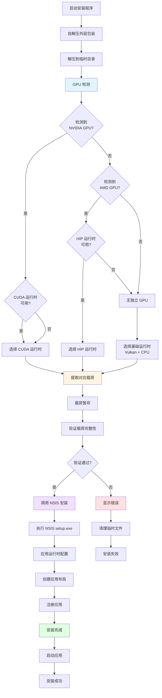
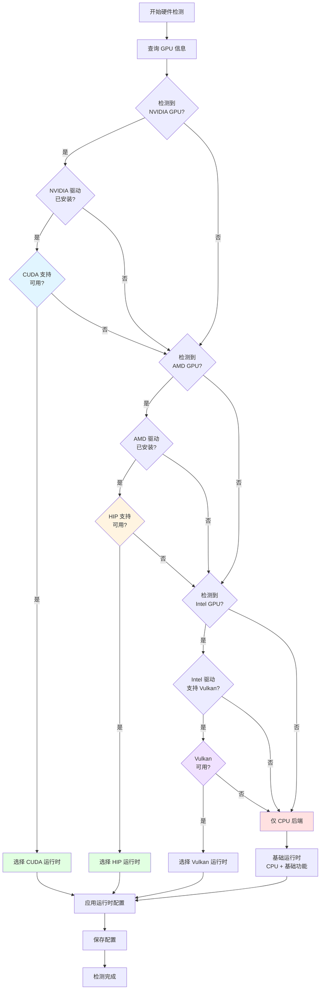
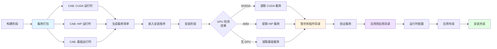

# 安装与分发

## 文档元数据
- **文件名**: 15_installation_and_distribution.md
- **版本**: 1.0.0
- **状态**: 已完成
- **最后更新**: 2025-06-12
- **维护者**: Slab 架构团队

---

## 1. 功能概述与用户故事

### 1.1 功能概述

Slab 的安装与分发系统提供了完整的应用打包和分发解决方案。该系统包括 Windows 完整安装程序、硬件检测、运行时载荷暂存以及跨平台支持。安装程序能够根据用户硬件自动选择最优的运行时配置，确保最佳性能。

### 1.2 用户故事

**US-1: 作为 Windows 用户，我希望获得一键安装体验**
- 用户下载安装程序
- 运行安装程序自动完成安装
- 系统自动检测硬件并配置运行时

**US-2: 作为 NVIDIA 显卡用户，我希望使用 CUDA 加速**
- 系统检测到 NVIDIA GPU
- 自动安装 CUDA 运行时
- 应用启动时使用 CUDA 加速

**US-3: 作为 AMD 显卡用户，我希望使用 HIP 加速**
- 系统检测到 AMD GPU
- 自动安装 HIP 运行时
- 应用启动时使用 HIP 加速

**US-4: 作为没有独立显卡的用户，我希望应用仍能正常运行**
- 系统检测到无独立 GPU
- 安装基础运行时 (Vulkan + CPU)
- 应用使用 CPU 后端运行

**US-5: 作为开发者，我希望构建和打包应用**
- 提供标准化的构建命令
- 自动化打包流程
- 生成不同平台的安装包

**US-6: 作为 macOS 用户，我希望在 Apple Silicon 上获得加速**
- 检测到 Apple Silicon
- 使用 ggml 本地加速
- 无需额外运行时

---

## 2. 核心业务逻辑与流程

### 2.1 系统架构

```
┌─────────────────────────────────────────────────────────────────┐
│                    Windows 完整安装程序                         │
├─────────────────────────────────────────────────────────────────┤
│  bin/slab-windows-full-installer/                              │
│  - 外层包装程序                                                 │
│  - 自解压安装程序                                               │
│  - 载荷暂存管理                                                 │
│  - GPU 检测引擎                                                 │
│  - NSIS 调用接口                                                │
└────────────────────┬────────────────────────────────────────────┘
                     │
                     ▼
┌─────────────────────────────────────────────────────────────────┐
│                    硬件检测层                                    │
├─────────────────────────────────────────────────────────────────┤
│  NVIDIA GPU 检测  → CUDA 运行时选择                             │
│  AMD GPU 检测    → HIP 运行时选择                               │
│  无独立 GPU      → 基础运行时 (Vulkan + CPU)                    │
│  Apple Silicon   → ggml 本地加速                                │
└────────────────────┬────────────────────────────────────────────┘
                     │
                     ▼
┌─────────────────────────────────────────────────────────────────┐
│                    运行时载荷暂存                                │
├─────────────────────────────────────────────────────────────────┤
│  CAB 载荷打包                                                    │
│  - CUDA 运行时载荷                                              │
│  - HIP 运行时载荷                                               │
│  - 基础运行时载荷                                               │
│  载荷清单 (manifest)                                            │
│  载荷应用逻辑                                                    │
└────────────────────┬────────────────────────────────────────────┘
                     │
                     ▼
┌─────────────────────────────────────────────────────────────────┐
│                    Tauri 应用打包                                │
├─────────────────────────────────────────────────────────────────┤
│  Tauri NSIS setup.exe                                            │
│  应用二进制文件                                                  │
│  资源文件                                                        │
│  应用布局                                                        │
└────────────────────┬────────────────────────────────────────────┘
                     │
                     ▼
┌─────────────────────────────────────────────────────────────────┐
│                    最终安装产物                                  │
├─────────────────────────────────────────────────────────────────┤
│  Windows: 完整安装程序 (setup.exe + 外层包装)                   │
│  macOS: .app 应用包                                             │
│  Linux: AppImage/DEB/RPM (未完全验证)                           │
└─────────────────────────────────────────────────────────────────┘
```

### 2.2 安装程序执行流程



### 2.3 GPU 检测决策树



### 2.4 载荷暂存过程



---

## 3. 功能点原子级拆分

| ID | 功能模块 | 功能点 | 描述 | 实现位置 | 优先级 |
|---|---|---|---|---|---|
| INST-001 | Windows 安装程序 | 外层包装 | 自解压包装程序 | bin/slab-windows-full-installer/ | P0 |
| INST-002 | Windows 安装程序 | 载荷解压 | 解压载荷到临时目录 | bin/slab-windows-full-installer/ | P0 |
| INST-003 | Windows 安装程序 | NSIS 调用 | 调用 NSIS setup.exe | bin/slab-windows-full-installer/ | P0 |
| INST-004 | Windows 安装程序 | 临时文件管理 | 管理临时文件清理 | bin/slab-windows-full-installer/ | P1 |
| INST-005 | Windows 安装程序 | CLI: pack | 打包安装程序 | bin/slab-windows-full-installer/ | P0 |
| INST-006 | Windows 安装程序 | CLI: stage-payloads | 暂存载荷 | bin/slab-windows-full-installer/ | P0 |
| INST-007 | Windows 安装程序 | CLI: run | 运行安装程序 | bin/slab-windows-full-installer/ | P0 |
| INST-008 | Windows 安装程序 | CLI: apply | 应用运行时 | bin/slab-windows-full-installer/ | P0 |
| INST-009 | Windows 安装程序 | CLI: detect-gpu | GPU 检测工具 | bin/slab-windows-full-installer/ | P0 |
| GPU-001 | 硬件检测 | NVIDIA 检测 | 检测 NVIDIA GPU | bin/slab-windows-full-installer/ | P0 |
| GPU-002 | 硬件检测 | AMD 检测 | 检测 AMD GPU | bin/slab-windows-full-installer/ | P0 |
| GPU-003 | 硬件检测 | Intel 检测 | 检测 Intel GPU | bin/slab-windows-full-installer/ | P1 |
| GPU-004 | 硬件检测 | CUDA 检测 | 检测 CUDA 支持 | bin/slab-windows-full-installer/ | P0 |
| GPU-005 | 硬件检测 | HIP 检测 | 检测 HIP 支持 | bin/slab-windows-full-installer/ | P0 |
| GPU-006 | 硬件检测 | Vulkan 检测 | 检测 Vulkan 支持 | bin/slab-windows-full-installer/ | P1 |
| GPU-007 | 硬件检测 | 驱动验证 | 验证驱动程序 | bin/slab-windows-full-installer/ | P0 |
| GPU-008 | 硬件检测 | 决策逻辑 | 运行时选择决策 | bin/slab-windows-full-installer/ | P0 |
| GPU-009 | 硬件检测 | Apple Silicon | 检测 Apple Silicon | Tauri 打包 | P0 |
| PAYLOAD-001 | 载荷暂存 | CAB 打包 | 打包载荷为 CAB | bin/slab-windows-full-installer/ | P0 |
| PAYLOAD-002 | 载荷暂存 | CUDA 载荷 | CUDA 运行时载荷 | bin/slab-windows-full-installer/ | P0 |
| PAYLOAD-003 | 载荷暂存 | HIP 载荷 | HIP 运行时载荷 | bin/slab-windows-full-installer/ | P0 |
| PAYLOAD-004 | 载荷暂存 | 基础载荷 | 基础运行时载荷 | bin/slab-windows-full-installer/ | P0 |
| PAYLOAD-005 | 载荷暂存 | 载荷清单 | 生成载荷 manifest | bin/slab-windows-full-installer/ | P0 |
| PAYLOAD-006 | 载荷暂存 | 载荷验证 | 验证载荷完整性 | bin/slab-windows-full-installer/ | P0 |
| PAYLOAD-007 | 载荷暂存 | 载荷提取 | 提取对应载荷 | bin/slab-windows-full-installer/ | P0 |
| PAYLOAD-008 | 载荷暂存 | 载荷应用 | 应用载荷到应用 | bin/slab-windows-full-installer/ | P0 |
| RUNTIME-001 | 运行时配置 | CUDA 配置 | 配置 CUDA 运行时 | bin/slab-windows-full-installer/ | P0 |
| RUNTIME-002 | 运行时配置 | HIP 配置 | 配置 HIP 运行时 | bin/slab-windows-full-installer/ | P0 |
| RUNTIME-003 | 运行时配置 | Vulkan 配置 | 配置 Vulkan 运行时 | bin/slab-windows-full-installer/ | P1 |
| RUNTIME-004 | 运行时配置 | CPU 配置 | 配置 CPU 后端 | bin/slab-windows-full-installer/ | P0 |
| RUNTIME-005 | 运行时配置 | ggml 配置 | 配置 ggml 加速 | Tauri 打包 | P0 |
| RUNTIME-006 | 运行时配置 | 环境变量 | 设置运行时环境变量 | bin/slab-windows-full-installer/ | P0 |
| RUNTIME-007 | 运行时配置 | 配置持久化 | 保存运行时配置 | bin/slab-windows-full-installer/ | P0 |
| BUILD-001 | 构建打包 | build:app | 构建桌面应用 | package.json | P0 |
| BUILD-002 | 构建打包 | build:sidecars | 构建桌面 sidecars | package.json | P0 |
| BUILD-003 | 构建打包 | build:windows-installer | 构建 Windows 安装程序 | package.json | P0 |
| BUILD-004 | 构建打包 | gen:plugin-packs | 打包插件 | package.json | P0 |
| BUILD-005 | 构建打包 | gen:schemas | 生成 schemas | package.json | P0 |
| BUILD-006 | 构建打包 | gen:api | 生成 API 类型 | package.json | P0 |
| BUILD-007 | 构建打包 | Tauri 构建 | Tauri 应用构建 | Tauri CLI | P0 |
| BUILD-008 | 构建打包 | NSIS 脚本 | NSIS 安装脚本 | Tauri 配置 | P0 |
| PLATFORM-001 | 平台支持 | Windows 完整 | Windows 完整支持 | 多处 | P0 |
| PLATFORM-002 | 平台支持 | macOS 支持 | macOS 支持 | Tauri 配置 | P0 |
| PLATFORM-003 | 平台支持 | Linux 支持 | Linux 基础支持 | Tauri 配置 | P2 |
| PLATFORM-004 | 平台支持 | Apple Silicon | Apple Silicon 加速 | Tauri 配置 | P0 |
| PLATFORM-005 | 平台支持 | x86_64 | x86_64 架构支持 | Tauri 配置 | P0 |

---

## 4. 非功能性需求与技术约束

### 4.1 性能要求

- **安装时间**:
  - 完整安装应在 5 分钟内完成
  - 载荷解压应在 1 分钟内完成
- **检测速度**:
  - GPU 检测应在 10 秒内完成
- **资源占用**:
  - 安装程序内存占用 < 500MB
  - 临时磁盘空间 < 2GB

### 4.2 兼容性约束

- **Windows 版本**:
  - Windows 10 1809+ (主要支持)
  - Windows 11 (完全支持)
- **Windows 架构**:
  - x86_64 (主要支持)
  - ARM64 (实验性)
- **macOS 版本**:
  - macOS 11+ (Big Sur 及以上)
- **macOS 架构**:
  - Apple Silicon (M1/M2/M3)
  - Intel x86_64
- **Linux 发行版**:
  - Ubuntu 20.04+
  - (其他发行版未完全验证)

### 4.3 可靠性要求

- **安装可靠性**:
  - 安装失败率 < 1%
  - 支持安装回滚
  - 失败日志详细记录
- **硬件检测**:
  - GPU 检测准确率 > 95%
  - 误判时应有回退方案
- **载荷完整性**:
  - 载荷必须通过验证
  - 损坏载荷应能重新下载

### 4.4 可维护性要求

- **代码组织**:
  - 安装程序代码独立于主应用
  - CLI 工具模块化设计
- **构建流程**:
  - 标准化的构建命令
  - 自动化打包流程
  - 可重复构建
- **日志记录**:
  - 详细记录安装过程
  - 记录硬件检测结果
  - 记录载荷应用过程

### 4.5 安全约束

- **代码签名**:
  - 安装程序必须代码签名
  - 载荷必须验证签名
- **权限管理**:
  - 安装需要管理员权限
  - 应用运行使用最小权限
- **数据保护**:
  - 不收集用户硬件信息
  - 本地处理所有数据

### 4.6 部署约束

- **分发渠道**:
  - 官方网站下载
  - 应用商店 (计划中)
- **更新机制**:
  - 支持应用内更新
  - 增量更新支持 (计划中)
- **载荷管理**:
  - 载荷可独立更新
  - 支持按需下载载荷 (计划中)

---

## 5. 附录

### 5.1 相关目录清单

**Windows 安装程序**:
- `bin/slab-windows-full-installer/` - 完整安装程序实现
- `bin/slab-windows-full-installer/src/` - 源代码
- `bin/slab-windows-full-installer/Cargo.toml` - Rust 项目配置

**Tauri 应用**:
- `bin/slab-app/src-tauri/` - Tauri 应用配置
- `bin/slab-app/src-tauri/tauri.conf.json` - Tauri 配置
- `bin/slab-app/src-tauri/tauri/*.nsi` - NSIS 安装脚本

**构建配置**:
- `package.json` - 构建命令定义
- `Cargo.toml` - Rust 构建配置

### 5.2 构建命令

```bash
# 构建桌面应用 (不含安装程序)
bun run build:app

# 构建桌面 sidecars
bun run build:sidecars

# 构建 Windows 完整安装程序
bun run build:windows-installer

# 打包插件
bun run gen:plugin-packs

# 生成 schemas
bun run gen:schemas

# 生成 API 类型
bun run gen:api
```

### 5.3 安装程序 CLI

```bash
# 打包安装程序
slab-windows-full-installer pack

# 暂存载荷
slab-windows-full-installer stage-payloads

# 运行安装程序
slab-windows-full-installer run

# 应用运行时
slab-windows-full-installer apply

# 检测 GPU
slab-windows-full-installer detect-gpu
```

### 5.4 运行时变体

| 变体 | 目标硬件 | 后端 | 文件大小 |
|---|---|---|---|
| CUDA | NVIDIA GPU | CUDA | ~500MB |
| HIP | AMD GPU | HIP | ~450MB |
| Base | 无独立 GPU | Vulkan + CPU | ~200MB |
| ggml | Apple Silicon | ggml | ~150MB |

### 5.5 平台支持状态

| 平台 | 支持状态 | 安装程序 | GPU 加速 |
|---|---|---|---|
| Windows x64 | 完全支持 | 完整安装程序 | CUDA/HIP/Vulkan |
| Windows ARM64 | 实验性 | 计划中 | CPU |
| macOS Intel | 完全支持 | .app | Metal (计划) |
| macOS Apple Silicon | 完全支持 | .app | ggml |
| Linux Ubuntu | 基础支持 | AppImage (计划) | Vulkan/CPU |
| Linux 其他 | 未验证 | - | - |

### 5.6 技术栈

- **安装程序**: Rust + NSIS
- **硬件检测**: Windows API + GPU 查询
- **载荷打包**: CAB 格式
- **应用打包**: Tauri v2
- **构建工具**: Bun + Cargo
- **代码签名**: Windows SignTool
