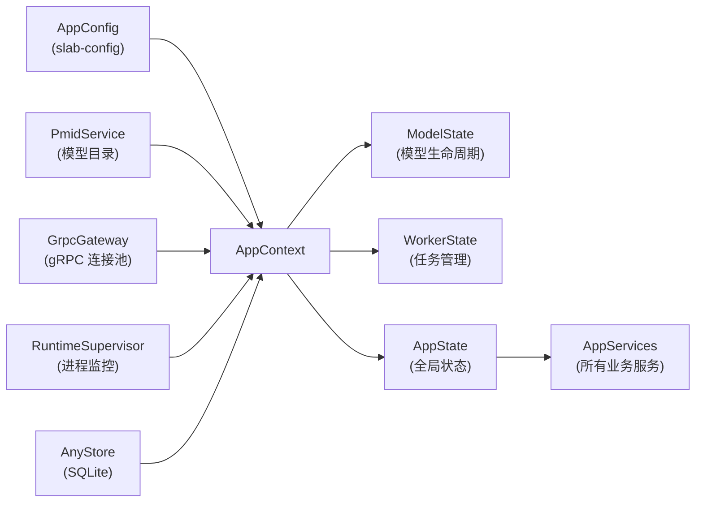
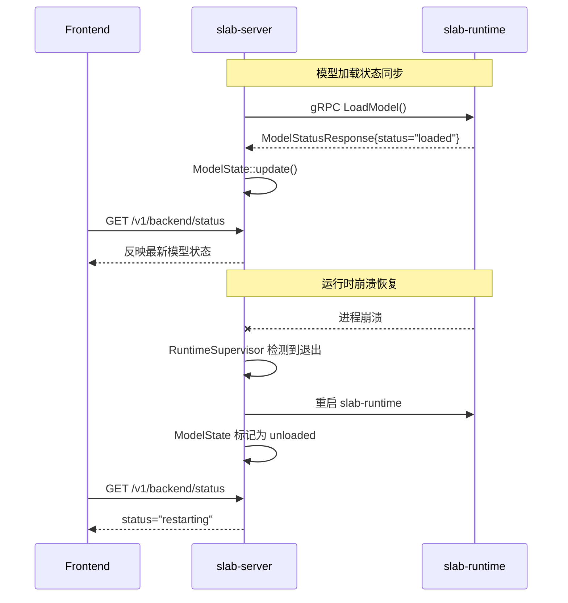
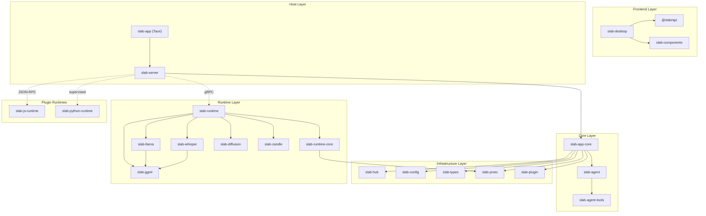

# Slab 跨模块 API 契约与数据一致性审计

> **文件名**: api_and_data_contract.md | **版本**: v1.0 | **状态**: Draft | **日期**: 2026-06-12

---

## 1. 文档目的

本文档对 Slab 全部功能模块的跨模块调用契约、全局共享状态、IPC 协议定义进行审计与对齐。确保：

- 模块 A 的输出与模块 B 的输入格式一致
- 全局共享上下文（Global Context）无歧义
- 识别潜在的竞态条件、死锁风险和逻辑断层

---

## 2. 进程间通信契约（IPC Contracts）

### 2.1 HTTP REST API 契约（Frontend ↔ slab-server）

**传输协议**: HTTP/1.1 over localhost
**数据格式**: JSON（请求/响应）、SSE（流式响应）
**认证**: 本地进程，无认证头（信任本地调用者）

| 路径前缀 | 请求方法 | 请求体 | 响应体 | 流式 | 消费方 |
|:---|:---|:---|:---|:---|:---|
| `POST /v1/chat/completions` | ChatCompletionRequest | ChatCompletionResponse / SSE chunks | ✅ SSE | slab-desktop |
| `POST /v1/audio/transcriptions` | FormData (audio file + params) | TranscriptionResponse | ❌ | slab-desktop |
| `POST /v1/images/generations` | ImageGenerationRequest | ImageGenerationResponse | ❌ | slab-desktop |
| `POST /v1/video/*` | VideoRequest | VideoResponse | 视场景 | slab-desktop |
| `GET /v1/models` | — | ModelListResponse | ❌ | slab-desktop |
| `POST /v1/models/download` | ModelDownloadRequest | SSE progress → DownloadResponse | ✅ SSE | slab-desktop |
| `GET /v1/tasks` | — | TaskListResponse | ❌ | slab-desktop |
| `GET /v1/sessions` | — | SessionListResponse | ❌ | slab-desktop |
| `PATCH /v1/settings` | SettingsUpdateRequest | SettingsResponse | ❌ | slab-desktop |
| `POST /v1/setup/*` | SetupRequest | SetupResponse | ❌ | slab-desktop |
| `GET /v1/system/info` | — | SystemInfoResponse | ❌ | slab-desktop |
| `GET /v1/backend/status` | — | BackendStatusResponse | ❌ | slab-desktop |
| `POST /v1/agent/*` | AgentRequest | AgentResponse | ✅ SSE | slab-desktop |
| `POST /v1/ffmpeg/convert` | FFmpegConvertRequest | FFmpegConvertResponse | ❌ | slab-desktop |
| `POST /v1/subtitles/*` | SubtitleRequest | SubtitleResponse | ❌ | slab-desktop |
| `GET /v1/ui-state/*` | — | UIStateResponse | ❌ | slab-desktop |

### 2.2 gRPC 契约（slab-server ↔ slab-runtime）

**传输协议**: gRPC over TCP / Unix IPC
**协议定义**: `crates/slab-proto/proto/slab/ipc/v1/`
**命名空间**: `slab.ipc.v1`

#### 2.2.1 gRPC 服务矩阵

| 服务名 | 所属后端 | RPC 方法 | 用途 |
|:---|:---|:---|:---|
| `GgmlLlamaService` | GGML LLaMA | `Chat`, `ChatStream`, `LoadModel`, `UnloadModel` | LLM 对话推理 |
| `GgmlWhisperService` | GGML Whisper | `Transcribe`, `LoadModel`, `UnloadModel` | 语音转录 |
| `GgmlDiffusionService` | GGML Diffusion | `GenerateImage`, `GenerateVideo`, `LoadModel`, `UnloadModel` | 图像/视频生成 |
| `OnnxService` | ONNX | `RunText`, `RunEmbedding`, `LoadTextModel`, `UnloadTextModel`, `LoadEmbeddingModel`, `UnloadEmbeddingModel` | ONNX 推理 |
| `CandleTransformersService` | Candle | `Chat`, `ChatStream`, `Transcribe`, `LoadLlamaModel`, `UnloadLlamaModel`, `LoadWhisperModel`, `UnloadWhisperModel` | Candle 多模型推理 |
| `CandleDiffusionService` | Candle | `GenerateImage`, `LoadModel`, `UnloadModel` | Candle 图像生成 |

#### 2.2.2 共享消息类型（common.proto）

```protobuf
// 通用承载类型
message StringList { repeated string values = 1; }
message BinaryPayload { bytes data = 1; optional string mime_type = 2; optional string file_name = 3; }
message RawImage { bytes data = 1; optional uint32 width = 2; optional uint32 height = 3; optional uint32 channels = 4; }
message RawTensor { optional string name = 1; repeated int64 shape = 2; optional string dtype = 3; bytes data = 4; }

// Token 使用统计
message Usage { optional uint32 prompt_tokens = 1; optional uint32 completion_tokens = 2; optional uint32 total_tokens = 3; optional uint32 prompt_cached_tokens = 4; optional bool estimated = 5; }

// 聊天元数据
message ChatStopMetadata { optional int32 token_id = 1; optional string token_text = 2; optional string token_kind = 3; }
message ChatMetadata { optional string reasoning_content = 1; ChatStopMetadata stop = 2; optional bytes extra_json = 3; }

// Whisper 转录结果
message WhisperSegment { optional uint64 start_ms = 1; optional uint64 end_ms = 2; optional string text = 3; }
message WhisperTranscription { optional string raw_text = 1; optional string language = 2; repeated WhisperSegment segments = 3; }

// 模型状态（所有 LoadModel/UnloadModel 的返回值）
message ModelStatusResponse { string backend = 1; string status = 2; optional uint32 context_length = 3; optional uint32 training_context_length = 4; }
```

#### 2.2.3 关键请求/响应契约

**Chat 请求（GGML LLaMA）**：

| 字段 | 类型 | 说明 |
|:---|:---|:---|
| prompt | string | 对话提示文本 |
| max_tokens | uint32 | 最大生成 token 数 |
| temperature | float | 采样温度 |
| top_p | float | Top-p 采样 |
| top_k | int32 | Top-k 采样 |
| min_p | float | Min-p 采样 |
| session_key | string | 会话标识（用于 KV Cache 复用） |
| stop_sequences | StringList | 停止序列 |
| gbnf | string | GBNF 语法约束 |

**Chat 响应（流式/非流式共用字段）**：

| 字段 | 类型 | 说明 |
|:---|:---|:---|
| text / delta | string | 完整文本（非流式）/ 增量文本（流式） |
| finish_reason | string | 终止原因（stop / length / ...） |
| usage | Usage | Token 使用统计 |
| metadata | ChatMetadata | 含 reasoning_content（思维链）和 stop 元数据 |

### 2.3 WebSocket 契约

#### 2.3.1 Plugin JSON-RPC（`/v1/plugins/rpc`）

**协议**: WebSocket + JSON-RPC 2.0
**方向**: Frontend ↔ slab-server

```json
// 请求（Frontend → Server）
{
  "jsonrpc": "2.0",
  "id": 1,
  "method": "plugin.call",
  "params": {
    "pluginId": "example-plugin",
    "function": "myFunction",
    "args": { "text": "hello" }
  }
}

// 响应（Server → Frontend）
{
  "jsonrpc": "2.0",
  "id": 1,
  "result": { "status": "ok" }
}
```

#### 2.3.2 Plugin Events（`/v1/plugins/events`）

**协议**: WebSocket（单向推送，Server → Frontend）
**用途**: 插件 UI 事件广播

```json
{
  "pluginId": "example-plugin",
  "topic": "example.finished",
  "data": { "modelCount": 5 }
}
```

Tauri Host 将其转发为 `plugin://{pluginId}/event` 信号。

#### 2.3.3 Workspace LSP（`/v1/workspace/lsp/{language}`）

**协议**: WebSocket + LSP JSON-RPC
**方向**: Frontend (Monaco) ↔ slab-server ↔ LSP Process

#### 2.3.4 Plugin Sidecar JSON-RPC（slab-server ↔ JS/Python Runtime）

**协议**: 行分隔 JSON-RPC 2.0 over stdio 或 Unix Domain Socket
**方法**: `plugin.call`

---

## 3. 全局共享状态 / 上下文（Global Context）

### 3.1 AppState（slab-app-core）

```rust
// 核心应用状态，贯穿 slab-server 所有请求
pub struct AppState {
    pub context: Arc<AppContext>,
    pub services: Arc<AppServices>,    // 所有 Domain Services
}

pub struct AppContext {
    pub config: Arc<AppConfig>,         // 应用配置
    pub pmid: Arc<PmidService>,         // PMID 模型目录
    pub model_state: Arc<ModelState>,   // 模型加载状态
    pub worker_state: Arc<WorkerState>, // Worker 任务状态
}
```

**初始化依赖链**：



### 3.2 全局共享数据清单

| 数据 | 类型 | 所有者 | 消费方 | 生命周期 |
|:---|:---|:---|:---|:---|
| 当前活跃模型 ID | PM-ID | PmidService | ChatService, AudioService, ImageService, HubService | 应用会话 |
| 模型加载状态 | ModelStatusResponse | ModelState | BackendService, ChatService, UI | 模型生命周期 |
| 用户设置文档 | SettingsDocument | slab-config (via AppConfig) | SettingsService, 所有 Services | 持久化 |
| 运行时连接状态 | RuntimeSupervisorStatus | RuntimeSupervisor | GrpcGateway, ModelState, WorkerState | 进程级 |
| gRPC 连接 | GrpcGateway | AppContext infra | RuntimeInferenceGateway | 应用会话 |
| 后台任务队列 | OperationManager | WorkerState | TaskService, MediaTask | 请求级 |
| 插件注册表 | PluginRegistry | PluginService | Plugin RPC handler | 应用会话 |
| 数据库连接 | AnyStore (SQLite) | AppContext infra | 所有需要持久化的 Services | 应用会话 |

### 3.3 跨进程状态同步



---

## 4. 跨模块调用契约详解

### 4.1 Chat 完整调用链

```
Frontend → HTTP POST /v1/chat/completions
  → slab-server (axum handler)
    → slab-app-core ChatService::chat()
      → ModelState::get_loaded_backend()
      → GrpcGateway::chat_stream()
        → gRPC GgmlLlamaService::ChatStream()
          → slab-runtime GGML LLaMA backend
            → slab-llama (safe wrapper)
              → slab-llama-sys (FFI llama.cpp)
    ← SSE stream chunks
  ← SSE response
← Frontend receives streamed tokens
```

**契约要点**：
- HTTP 请求使用 `schemas::chat::ChatCompletionRequest` DTO
- gRPC 请求转换为 `GgmlLlamaChatRequest` protobuf
- `session_key` 在 HTTP 和 gRPC 层保持一致，用于 KV Cache
- `Usage` 统计在 gRPC 响应中返回，HTTP 层透传
- 错误映射：gRPC Status → AppCoreError → HTTP Error Response

### 4.2 Audio 转录调用链

```
Frontend → HTTP POST /v1/audio/transcriptions (multipart)
  → slab-server
    → slab-app-core AudioService::transcribe()
      → FFmpeg 预处理（格式转换/重采样）
      → GrpcGateway::transcribe()
        → gRPC GgmlWhisperService::Transcribe()
          → slab-runtime GGML Whisper backend
            → slab-whisper (safe wrapper)
              → slab-whisper-sys (FFI whisper.cpp)
    ← GgmlWhisperTranscribeResponse
  ← HTTP JSON response
← Frontend shows transcription
```

**契约要点**：
- FFmpeg 预处理在 app-core 完成，保证传入 gRPC 的音频格式兼容
- Whisper 的 VAD 和 Decode 参数通过 gRPC 直接透传
- `WhisperSegment` 包含时间戳（ms 精度），用于字幕生成场景

### 4.3 Image 生成调用链

```
Frontend → HTTP POST /v1/images/generations
  → slab-server
    → slab-app-core ImageService::generate()
      → decode_base64_init_image() (验证尺寸 ≤2048px, ≤20MB)
      → GrpcGateway::generate_image()
        → gRPC GgmlDiffusionService::GenerateImage()
          → slab-runtime GGML Diffusion backend
            → slab-diffusion / slab-ggml
    ← RawImage bytes
    → 编码为 base64
  ← HTTP JSON response
← Frontend renders images
```

**契约要点**：
- init_image 验证在 app-core schemas 层完成（MAX_INIT_IMAGE_BYTES=20MB, MAX_INIT_IMAGE_DIM=2048px）
- gRPC 传输原始 RGB bytes（RawImage），HTTP 响应编码为 base64
- 支持 GGML Diffusion 和 Candle Diffusion 两种后端

### 4.4 Plugin 调用链

```
Frontend → WebSocket /v1/plugins/rpc (JSON-RPC)
  → slab-server
    → slab-app-core PluginService::call()
      → 权限验证 (permissions)
      → 路由到对应 Runtime:
        ├── JS → slab-js-runtime (JSON-RPC over stdio/UDS)
        │     → Plugin ESM export function
        │       → Slab.api.request() → 回调 slab-server
        │       → Slab.ui.emit() → 回调 slab-server → SSE broadcast
        ├── Python → slab-python-runtime (supervised sidecar)
        │     → Plugin Python function
        │       → slab.api.request() → 回调 slab-server
        │       → slab.ui.emit() → 回调 slab-server → SSE broadcast
        └── WASM → crates/slab-plugin (Extism)
              → Plugin WASM function
    ← JSON-RPC response
  ← WebSocket response
← Frontend updates UI
```

**契约要点**：
- `plugin.call` 是所有运行时的统一入口方法
- `pluginId` 从 WebView label 推导，不接受 payload 中的字段（安全约束）
- `Slab.api.request` 回调会重新走 `permissions.slabApi` 授权
- `Slab.ui.emit` 走 `/v1/plugins/events` WebSocket 广播给 Tauri Host

---

## 5. 数据转换边界（Serialization Boundaries）

### 5.1 HTTP JSON ↔ gRPC Protobuf 转换

| 转换点 | 方向 | 关键映射 |
|:---|:---|:---|
| ChatCompletionRequest → GgmlLlamaChatRequest | JSON → Proto | `messages` → `prompt`（拼接模板）, `max_tokens`/`temperature`/`top_p` 直接映射 |
| GgmlLlamaChatStreamChunk → SSE chunk | Proto → JSON | `delta` → `choices[0].delta.content`, `usage` → `usage` |
| ImageGenerationRequest → GgmlDiffusionGenerateImageRequest | JSON → Proto | `init_image` base64 → `RawImage` bytes, `size` → `width`+`height` |
| RawImage → ImageGenerationResponse | Proto → JSON | `RawImage.data` bytes → base64 encoded string |
| GgmlWhisperTranscribeResponse → TranscriptionResponse | Proto → JSON | `WhisperTranscription` 直接映射，`segments` 透传 |

### 5.2 Plugin Manifest（JSON）→ Runtime 类型

| 字段 | JSON 类型 | Rust 类型 | 用途 |
|:---|:---|:---|:---|
| `manifestVersion` | number | u32 | 版本标识 |
| `id` | string | String | 全局唯一标识 |
| `runtime.js.entry` | string | Option\<PathBuf\> | JS 入口路径 |
| `runtime.python.entry` | string | Option\<PathBuf\> | Python 入口路径 |
| `runtime.wasm.entry` | string | Option\<PathBuf\> | WASM 入口路径 |
| `runtime.ui.entry` | string | Option\<PathBuf\> | UI HTML 入口 |
| `permissions.network.mode` | string | enum | "blocked" / "allowlist" |
| `permissions.network.allowHosts` | string[] | Vec\<String\> | 允许的主机列表 |
| `permissions.slabApi` | string[] | Vec\<String\> | 允许的 API 权限 |
| `permissions.files.read/write` | string[] | Vec\<String\> | 文件访问标签 |
| `contributes.routes` | array | Vec\<Route\> | 路由贡献点 |
| `contributes.sidebar` | array | Vec\<SidebarItem\> | 侧边栏贡献点 |
| `contributes.agentCapabilities` | array | Vec\<AgentCapability\> | Agent 能力声明 |
| `contributes.languageServers` | array | Vec\<LanguageServer\> | LSP 贡献 |

### 5.3 设置文档（slab-config）↔ 多模块消费

```
SettingsDocument (slab-config)
  ├── 应用配置 → AppConfig → slab-server / slab-app-core
  ├── 模型偏好 → PmidService → ModelService
  ├── 运行时设置 → RuntimeSupervisor → slab-runtime launch args
  ├── 后端选择 → BackendService → gRPC backend routing
  └── UI 偏好 → UI State API → Frontend
```

---

## 6. 潜在冲突与边界遗漏审查

### 6.1 竞态条件（Race Conditions）

| 编号 | 场景 | 风险 | 当前缓解措施 |
|:---|:---|:---|:---|
| RC-1 | 并发 Chat 请求对同一模型的 KV Cache 竞争 | `session_key` 相同时可能产生上下文混淆 | session_key 由前端生成，通常为唯一 ID |
| RC-2 | 模型加载/卸载与推理请求并发 | 推理进行中卸载模型可能导致 gRPC 错误 | ModelState 管理加载状态，需要验证是否有锁 |
| RC-3 | 插件同时通过多个运行时注册相同功能 | 功能冲突或优先级不明 | 建议明确插件 ID 命名空间约束 |
| RC-4 | 多个下载任务对同一模型文件写入 | 文件损坏 | 需确认是否有下载去重机制 |
| RC-5 | Runtime 进程崩溃时在途 gRPC 请求 | 请求丢失，前端无响应 | GrpcGateway 应有超时和重试机制 |

### 6.2 死锁风险

| 编号 | 场景 | 风险 | 建议 |
|:---|:---|:---|:---|
| DL-1 | Plugin host callback 循环：插件回调 → slab-server → 再次调用同一插件 | 循环依赖 | 需要在 PluginService 层限制回调深度 |
| DL-2 | 模型自动卸载（auto_unload）与用户主动卸载竞争 | ModelState 锁竞争 | auto_unload 应检查模型是否正在使用 |

### 6.3 数据一致性风险

| 编号 | 场景 | 风险 | 建议 |
|:---|:---|:---|:---|
| DC-1 | slab-runtime 崩溃后 ModelState 与实际不同步 | ModelState 显示 loaded 但实际已卸载 | RuntimeSupervisor 重启后应重置所有 ModelState |
| DC-2 | 设置文件被外部修改 | slab-config 缓存与磁盘不一致 | 考虑文件监听或定期重读机制 |
| DC-3 | SQLite WAL 模式下的并发读写 | 写入冲突 | 确认 SQLx 使用 WAL 模式并正确处理 busy timeout |
| DC-4 | Legacy plugin manifest 转换为 v1 格式 | 转换后的权限可能不完整 | 需要明确 legacy → v1 权限映射的默认值 |

### 6.4 边界条件（Boundary Conditions）

| 编号 | 条件 | 影响 | 当前处理 |
|:---|:---|:---|:---|
| BC-1 | init_image 超过 20MB 或 2048px | 图像生成拒绝 | ✅ schemas 层验证 |
| BC-2 | 模型文件不存在或损坏 | 加载失败 | ✅ gRPC 返回错误 |
| BC-3 | FFmpeg 二进制不可用 | 媒体转换失败 | ✅ 多路径回退解析 |
| BC-4 | 插件权限不足 | 操作被拒绝 | ✅ permissions 声明 + 运行时检查 |
| BC-5 | WebSocket 断连（LSP/Plugin） | 功能中断 | 需确认是否有自动重连 |
| BC-6 | GPU 内存不足 | 推理失败 | 需确认是否有 graceful fallback |
| BC-7 | macOS/Linux 上缺失特定后端 | 功能受限 | ✅ GGML 支持 Apple Silicon |

---

## 7. 模块间依赖关系矩阵



### 依赖规则（Hard Constraints from AGENTS.md）

| 规则 | 约束 |
|:---|:---|
| `slab-app-core` 必须保持 HTTP-free | 所有 HTTP 逻辑留在 `slab-server` |
| `slab-runtime` 是唯一的运行时组合根 | 后端注册只在 `slab-runtime` |
| `slab-runtime-core` 仅限调度/后端协议 | 不含业务逻辑 |
| `slab-agent` 保持纯净 | 内置工具在 `slab-agent-tools`，API 适配器在 host/app-core |
| `slab-proto` 和 `slab-types` 用于跨 crate 边界的契约 | 不依赖具体实现 |
| Plugin WebView 命令必须从 WebView label 推导 caller plugin ID | 不信任 payload 中的 plugin ID |
| SQLx 迁移文件 append-only | 不修改已有迁移 |
| `slab-config` 独立于 HTTP/SQLx/Tauri/app-core | Host crates 适配其错误 |

---

## 8. 接口版本兼容性

### 8.1 Protobuf（gRPC 契约）

- 所有字段使用 `optional` 标记，保证向后兼容
- 新增字段只能追加 field number，不允许删除或重编号
- `deprecated` 字段通过注释标记（如 `reasoning_content` 在新版本由 `metadata.reasoning_content` 替代）

### 8.2 HTTP API（OpenAPI）

- 所有端点位于 `/v1/*` 命名空间
- 使用 `bun run gen:api` 从 OpenAPI schema 生成 TypeScript 类型
- 前端通过 `openapi-fetch` 消费类型安全的 API client

### 8.3 Plugin Manifest

- `manifestVersion: 1` 为当前版本
- Legacy manifests 无 `manifestVersion` 字段，自动规范化为 v1 格式
- 新增 `contributes` 字段不影响已有插件

---

## 9. 审计结论与建议

### 9.1 架构健康度评估

| 维度 | 评分 | 说明 |
|:---|:---|:---|
| 模块边界清晰度 | ⭐⭐⭐⭐⭐ | 各 crate 职责明确，依赖方向严格 |
| IPC 契约一致性 | ⭐⭐⭐⭐⭐ | Protobuf + OpenAPI 双契约，类型安全 |
| 错误隔离 | ⭐⭐⭐⭐ | Runtime 崩溃不影响 Server，但需要更细粒度的 ModelState 恢复 |
| 插件安全 | ⭐⭐⭐⭐⭐ | 权限声明 + 运行时检查 + 回调重授权 |
| 数据一致性 | ⭐⭐⭐⭐ | SQLite WAL + 配置文件管理，跨进程状态需要关注 |

### 9.2 建议改进项

1. **ModelState 崩溃恢复**（RC-1, DC-1）：Runtime 重启后应自动扫描并重置所有 ModelState 为 `unloaded`，避免状态不同步
2. **Plugin 回调深度限制**（DL-1）：在 PluginService 层增加递归调用深度计数器，防止循环回调
3. **WebSocket 自动重连**（BC-5）：Frontend 的 LSP 和 Plugin WebSocket 应实现指数退避重连
4. **GPU OOM 处理**（BC-6）：Runtime Worker 应捕获 GPU 内存不足错误，返回特定错误码，app-core 层可尝试降级后端
5. **下载去重**（RC-4）：模型下载应检查是否有进行中的同模型下载，避免重复写入
