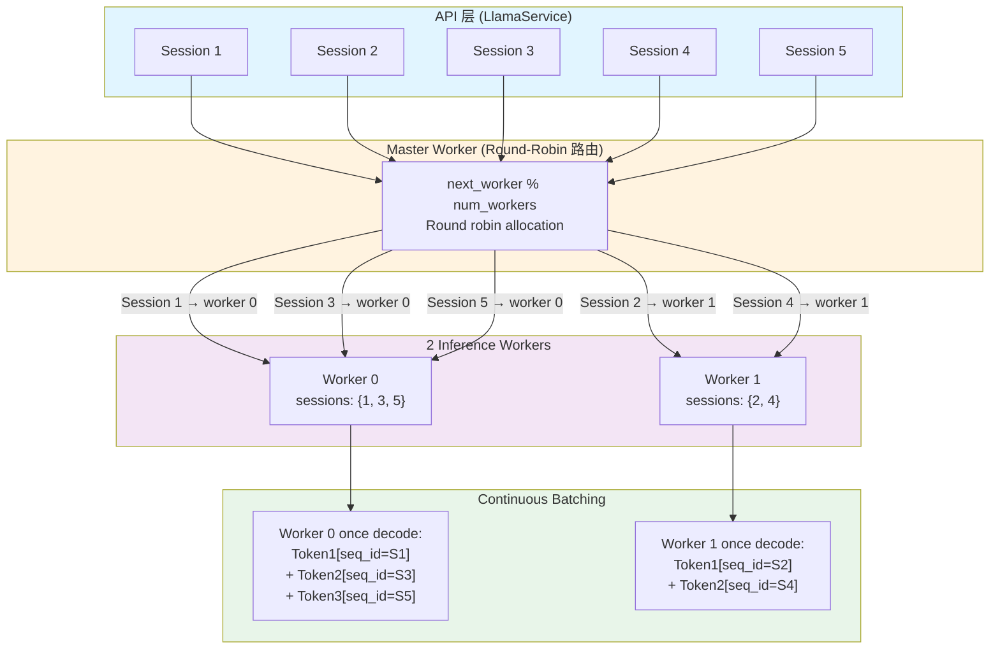

# LlamaService Architecture

## Overview

`LlamaService` is a singleton inference service that manages model loading and session-based token generation for the llama inference engine. It delegates all inference work to an internal `LlamaInferenceEngine` that coordinates multiple worker threads using **continuous batching**.



## Public API Surface

### Single Exposed Type
- **`LlamaService`** – Singleton service for model lifecycle and session management.

### Type Aliases and Error Types
- **`SessionId`** – Opaque session handle (u64).
- **`StreamChunk`** – Generated tokens or error messages.
- **`StreamHandle`** – Async stream receiver.
- **`GGMLLlamaEngineError`** – Error enum with variants for init, load, tokenize, and worker failures.

## Architecture

### Layers

```
┌─────────────────────────────────────┐
│  API Callers (tests, handlers)      │
└─────────┬───────────────────────────┘
          │
┌─────────v───────────────────────────┐
│  LlamaService (singleton)            │
│  - load_model_with_workers(...)      │
│  - create_session()                  │
│  - append_input()                    │
│  - generate_stream()                 │
│  - end_session()                     │
│  - cancel_generate()                 │
└─────────┬───────────────────────────┘
          │
┌─────────v───────────────────────────┐
│  LlamaInferenceEngine (internal)     │
│  - Master Worker (route + pin)       │
│  - Worker Pool (num_workers)         │
│  - Session↔Worker mapping            │
└──────────────────────────────────────┘
```

### Session Distribution with Continuous Batching

When creating sessions, they are distributed round-robin across available workers. **Multiple sessions per worker are supported** and handled efficiently via continuous batching:

```
API Layer (5 Sessions)
├─ Session 1
├─ Session 2
├─ Session 3
├─ Session 4
└─ Session 5
        │
        ├─────────────────────────────────┐
        │                                 │
   Master Worker                    
   (Round-Robin Router)             
        │                                 │
        │ next_worker % num_workers       │
        │                                 │
        ├─────────────┬───────────────────┤
        │             │                   │
   Worker 0       Worker 1
   Sessions: 1,3,5  Sessions: 2,4
        │                 │
    Continuous       Continuous
    Batching (1,3,5) Batching (2,4)
        │                 │
    decode()          decode()
```

#### Key Points:

| Aspect | Details |
|--------|---------|
| **Session Count** | No limit; can exceed worker count |
| **Session Pinning** | Once assigned to a worker, always stays with it |
| **Batch Contents** | One batch = tokens from multiple sessions, differentiated by `seq_id` |
| **Sequence Isolation** | Each session has independent `seq_id`, `n_past`, and `sampler` |
| **Single Decode** | Worker processes all assigned sessions in one GPU/CPU call |
| **Performance Benefit** | Batching improves hardware utilization significantly |

## Internal Implementation

### Components

#### `service.rs`
- Singleton lifecycle (`init`, `current`, `reload`).
- Model loading via `load_model_with_workers(path, params, num_workers)`.
- Public session API that delegates to engine:
  - `create_session()` → `AppendInput` phase
  - `generate_stream()` → returns `StreamHandle` for async token stream
  - `end_session()`, `cancel_generate()` → cleanup

#### `engine.rs`
- **`MasterWorkerState`** – Consumes global command queue, routes to workers, maintains `session_id → worker_id` mapping.
- Spawns tokio master task + N OS worker threads.
- Enforces session pinning (round-robin assignment).

#### `worker.rs`
- **`InferenceWorkerState`** – Per-worker inference loop.
- Manages `HashMap<SessionId, SessionState>` with independent KV caches.
- Implements continuous batching in `run_inference_step()`:
  1. **Batch Building** – Collect prefill tokens and generation tokens from all active sessions.
  2. **Decode** – Single `llama_decode()` call for combined batch.
  3. **Position Update** – Advance `n_past` per session.
  4. **Sampling** – Sample next token per session, emit to streams.
- Recycles freed `seq_id` values to keep ID space bounded.

#### `errors.rs`
- Error variants: `ModelNotLoaded`, `SessionNotFound`, `TokenizeFailed`, `WorkerShutdown`, etc.
- Removed obsolete paths: `DecodeFailed`, `TokenToPieceFailed`.

## Session Lifecycle

```
1. create_session()
   └─> Master assigns session to worker (round-robin)
   └─> Worker allocates seq_id + sampler

2. append_input(session_id, text)
   └─> Master routes to assigned worker
   └─> Worker tokenizes text, stores in pending_tokens

3. generate_stream(session_id, max_new_tokens)
   └─> Worker builds batch with pending_tokens
   └─> run_inference_step() prefills + generates
   └─> Tokens streamed to caller

4. end_session(session_id)
   └─> Worker frees session
   └─> seq_id returned to free-list for reuse
   └─> Master removes session_id from routing map
```

## Error Handling

All errors flow through `GGMLLlamaEngineError`:
- **Init/Load** – Model file not found, initialization failure.
- **Session** – Session not found, worker shutdown during op.
- **Tokenize** – Tokenizer failure.
- **Worker** – Batch build, decode, or sampling failure.

## Testing

All integration tests in `test.rs` use **only the public LlamaService API**:
- Lifecycle tests (`test_llama_current_and_reload`)
- Inference tests (`test_service_basic_generation`)
- Multi-turn dialogue (`test_service_kv_reuse_multiturn`)
- Cancellation (`test_service_cancel_and_resume`)
- Sequence ID pooling (`test_service_seq_id_reuse`)

Run tests:
```bash
cargo test -p slab-core --lib llama
```

